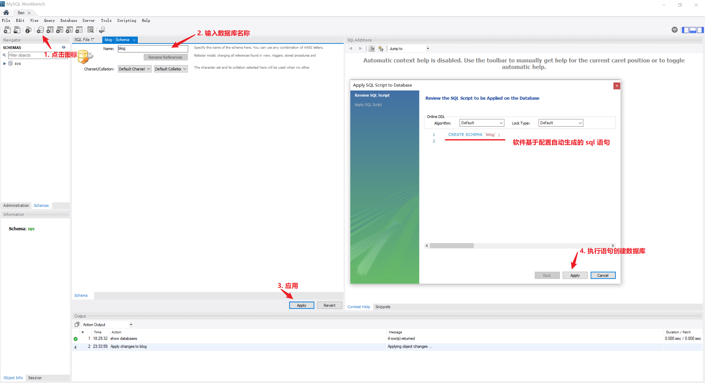
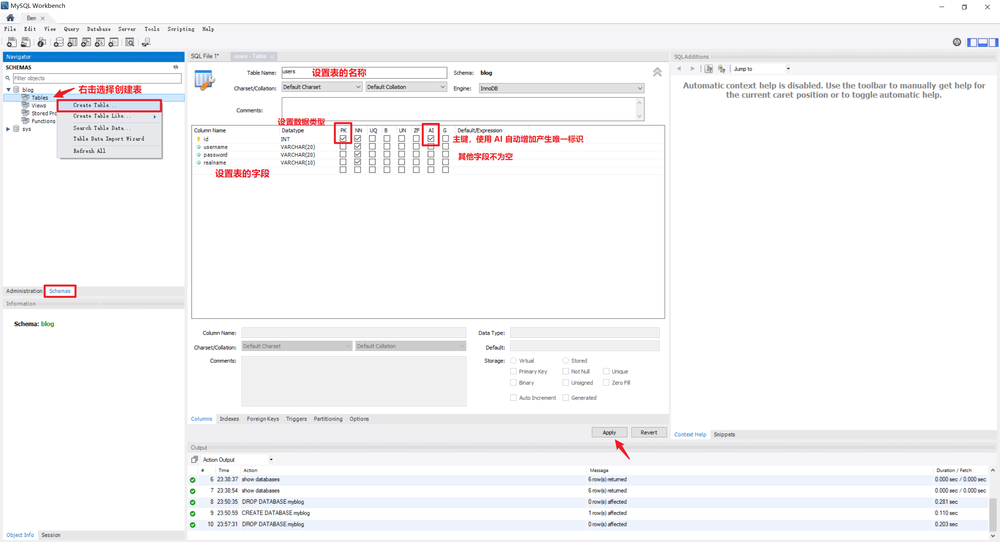
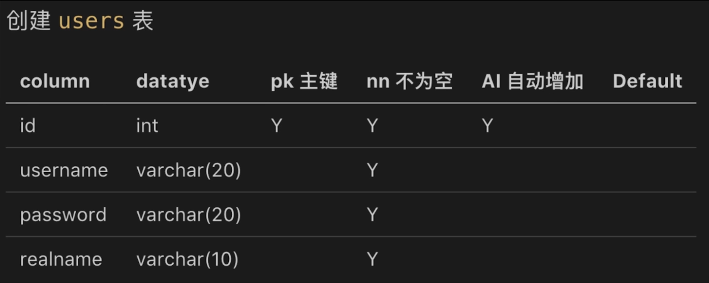
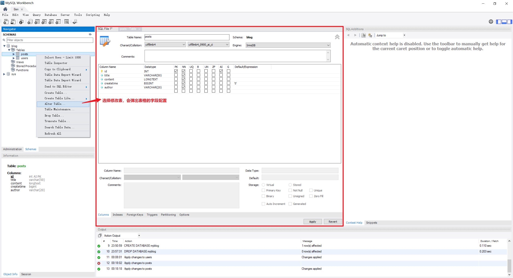
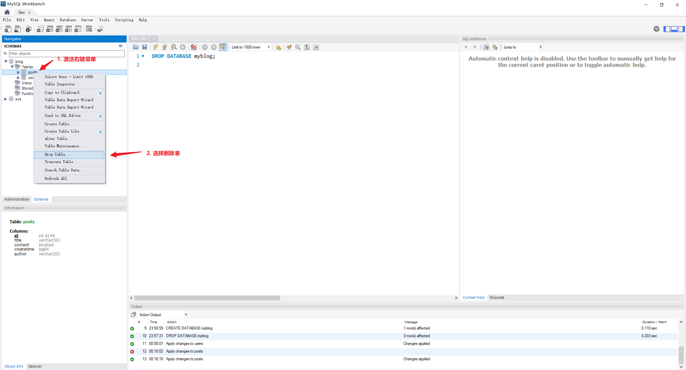
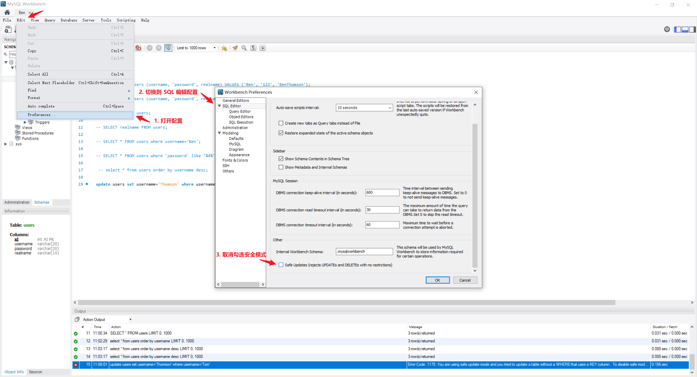

# MySQL 基础操作

参考：[MySQL cheatsheet](https://devhints.io/mysql)

可以通过 MySQL Command Line Client 在命令行界面操作数据库，也可以使用 MySQL Workbench 使用 GUI 可视化界面操作数据库。


## 注释
`-- comments` 添加注释


## 操作数据库

* `SHOW DATABASES;` 查询所有数据库

* `CREATE SCHEMA databaseName;` 或 `CREATE DATABASE databasename;` 创建数据库

  以下图示使用 MySQL Workbench 创建数据库



:bulb: 可以设置数据编码方式 `CREATE DATABASE databaseName CHARACTER SET utf-8;` 或使用 `ALTER DATABASE databaseName CHARACTER SET utf-8` 切换数据编码方式

* `USE databaseName` 切换数据库

  :warning: 在操作数据之前都需要**先指定连接到哪个数据库**

* `DROP DATABASE databaseName` 删除数据库

## 操作表格
* `SHOW TABLES;` 查看数据库所有表格

* `CREATE TABLE table (field1 type1, field2 type2, PRIMARY KEY (field1));` 创建表格，**需要指定每个字段的数据类型**

  以下图示使用 MySQL Workbench 创建表格





* 修改表
    * `ALTER TABLE tableName MODIFY field1 type1` 修改原有的字段数据类型
    * `ALTER TABLE tableName CHANGE old_name_field1 new_name_field1 type1` 修改原有的字段名称
    * `ALTER TABLE tableName ADD new_name_field1 type1` 添加新字段
    * `ALTER TABLE tableName DROP field1` 删除已有字段

  以下图示使用 MySQL Workbench 修改表格



* `DROP TABLE tableName` 删除表

  以下图示使用 MySQL Workbench 删除表格

  

## 操作数据
先使用语句 `USE databaseName;` 切换到需要操作的数据库

### 新增
* `INSERT INTO table1 (field1, field2) VALUES (value1, value2);` 向表格添加数据。:bulb: 对于关键字，如 `password` 应使用反单引号包括 `fieldName`

### 查询
* `SELECT * FROM table;` 查询表格数据，返回所有表格的数据，包含每一行和每一个字段的数据
* `SELECT field1, field2, ... FROM table;` 查询表格数据，且只返回指定的字段
* `SELECT * FROM talbe WHERE condition` 基于条件查询表格数据
    
    * 在 `condition` 中最常使用等于 `=` 或不等于 `<>` 构建条件 `SELECT * FROM table WHERE field='value';`；如果需要模糊匹配，可以使用  `LIKE` 并结合正则表达式 `SELECT * FROM table WHERE field LIKE '%keyword%';`
    
      :bulb: `%` 适配任意数量的字符，可以产生一组特定的匹配模式
    
    * 在 `condition` 中可以使用 `AND` 构建多个条件并列成立的复杂条件
    
    * 在 `condition` 中可以使用 `OR` 构建多个条件之一成立的复杂条件
    
    * 在 `condition` 中使用 `IS Null` 或 `IS NOT NULL` 来分别查询字段值**是否为空** `SELECT * FROM table WHERE field IS NOT NULL;`
* `SELECT field FROM table ORDER BY field1, field2;` 查询结果按照字段排序。默认升序，如果需要降序可以添加关键字 `DESC`

### 更新
* `UPDATE table SET field=new_value WHERE condition;` 更新指定记录（行数据）的指定字段的值

### 删除
* `DELETE FROM table WHERE condition;` 删除指定记录（行数据）

:bulb: 一般不使用 `DELETE FROM` 语句，因为相应的数据会完全地从数据库去除。而是为每个记录（行数据）添加一个表示状态 `state` 的字段，通过 `UPDATE` 语句来切换记录的状态，一般以 `0` 或 `1` 表示记录是否为**可访问**的状态，通过这种形式实现「**软删除**」，然后在查询时设置基于 `state` 条件 `SELECT * FROM  table WHERE state<>'0';`，这种删除方式可以方便地实现数据恢复。

## 其他
:bulb: 在更新或删除数据时可能会遇到以下错误

```bash
Error Code: 1175. You are using safe update mode and you tried to update a table without a WHERE that uses a KEY column.  To disable safe mode, toggle the option in Preferences -> SQL Editor and reconnect.
```

可以在 sql 脚本中执行 `SET SQL_SAFE_UPDATES = 0` 或根据错误信息提示修改 MySQL 配置，将安全模式关闭。

