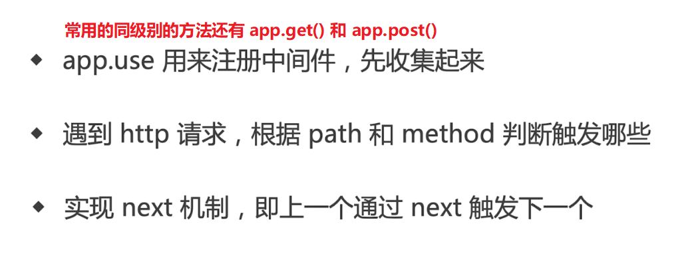

---
tags:
  - nodejs
  - express
---
# Express 中间件

参考：
* [编写中间件以用于 Express 应用程序](http://expressjs.com/zh-cn/guide/writing-middleware.html)
* [使用中间件](http://expressjs.com/zh-cn/guide/using-middleware.html)

Express 是一个包含大量路由和中间件的 Web 框架，其自身只具有最低程度的功能。

中间件函数是一个能够访问请求对象 `req`、响应对象 `res` 以及应用程序的请求/响应循环中的下一个中间件函数 `next()` 的函数。**要装入/使用中间件函数，请调用 `app.use()` 并指定中间件函数（其中 `app` 是 express 实例）**。

可以将中间件函数看作是**路由守卫**，请求到达路由处理程序（终止了请求/响应循环）之前需要依次经过之前设置的中间件函数，中间件函数可以执行以下任务：

- 执行任何代码。
- 对请求和响应对象进行更改。
- [结束](http://expressjs.com/en/guide/routing.html#response-methods)请求/响应循环。
- 调用堆栈中的下一个中间件函数。

:bulb: Express 应用程序基本上是一系列中间件函数调用。因为您拥有请求对象、响应对象、堆栈中的下一个中间件函数以及整个 Node.js API 的访问权，所以中间件函数的可能性是无穷的。

:warning: 如果当前中间件函数[没有结束请求/响应循环](http://expressjs.com/en/guide/routing.html#response-methods)，那么它必须调用 `next()`，以将控制权传递给下一个中间件函数，否则请求将保持**挂起**状态。:bulb: `next()` 函数不是 Node.js 或 Express API 的一部分，而是传递给中间件函数的第三自变量，可以命名为任何名称，但是按约定下一个中间件函数通常由名为 `next` 的变量来表示。



Express 应用程序可以使用以下类型的中间件：

- [应用层中间件](http://expressjs.com/zh-cn/guide/using-middleware.html#middleware.application)
- [路由器层中间件](http://expressjs.com/zh-cn/guide/using-middleware.html#middleware.router)
- [错误处理中间件](http://expressjs.com/zh-cn/guide/using-middleware.html#middleware.error-handling)
- [内置中间件](http://expressjs.com/zh-cn/guide/using-middleware.html#middleware.built-in)
- [第三方中间件](http://expressjs.com/zh-cn/guide/using-middleware.html#middleware.third-party)

:bulb: 使用可选安装路径来装入应用层和路由器层中间件，还可以**将一系列中间件函数一起装入**，这样会在安装点创建中间件系统的子堆栈。

```js
/**
 * 模拟登陆检查，并显示请求的时间戳记
 */
var express = require('express');
var app = express();

// 定义中间件函数
var requestTime = function (req, res, next) {
  req.requestTime = Date.now();
  next();
};

// 装入中间件函数
app.use(requestTime);

app.get('/', function (req, res) {
  var responseText = 'Hello World!';
  responseText += 'Requested at: ' + req.requestTime + '';
  res.send(responseText);
});

app.listen(3000);
```

:warning: 中间件装入**顺序很重要，首先装入的中间件函数也首先被执行**。如果示例在根路径的路由**之后**装入 `requestTime`，那么请求**永远都不会到达**该函数，因为根路径的**路由处理程序终止了请求/响应循环**。

## 应用层中间件
使用 `app.use()` 和 `app.METHOD()` 函数将应用层中间件绑定到[应用程序对象](http://expressjs.com/zh-cn/4x/api.html#app)的实例，其中 `METHOD` 是中间件函数所处理的请求 HTTP 方法的小写形式（如 `get`、`put` 或 `post`）。

* 没有安装路径的中间件函数，使用 `app.use()` 装入，应用程序每次收到请求时执行该函数。

```js
var express = require('express');
var app = express();

app.use(function (req, res, next) {
  console.log('Time:', Date.now());
  next();
});
```

* 安装在指定路径中的中间件函数，在该路径中为任何类型的 HTTP 请求执行此函数，:bulb: 可以装入一系列中间件函数。

```js
app.use('/user/:id', function (req, res, next) {
  console.log('Request Type:', req.method);
  next();
});

// 装入一系列中间件函数
app.use('/user/:id', function(req, res, next) {
  console.log('Request URL:', req.originalUrl);
  next();
}, function (req, res, next) {
  console.log('Request Type:', req.method);
  next();
});
```

* 安装在路由处理程序中的中间件函数，:bulb: 可以装入一系列中间件函数。

```js
app.get('/user/:id', function (req, res, next) {
  console.log('ID:', req.params.id);
  next();
}, function (req, res, next) {
  res.send('User Info');
});
```

## 404 路由设置
由于请求**从上到下**依次匹配路由处理程序，而且会经过途中装入的中间件函数，如果请求的 URL 都未被预设的路由处理程序 `path` 匹配到，可以**在最后添加一个中间件来「捕获」这一类的请求**，并且返回状态 `status` 为 `404` 以结束请求/响应循环。

```js
app.use(function(req, res, next) {
    res.status(404).send('抱歉，您的页面找不到');
});
```

## 捕获服务器错误
如果服务器程序存在错误会向客户端抛出难以理解的错误信息，可以使用中间件函数「捕获」这些错误，并返回状态  `status` 为 `500` 以及一些让客户可理解的提示语。

```js
app.use(function(err, req, res, next) {
    res.status(500).send('程序有些问题，请稍后尝试');
})
```