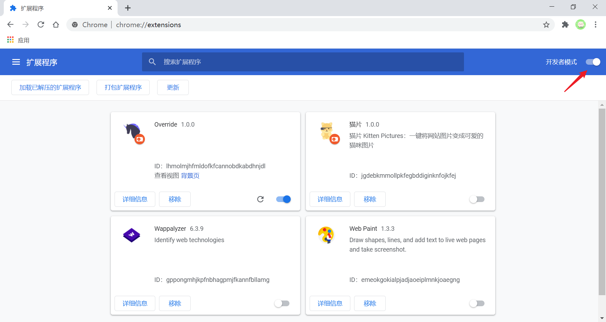

# 安装

最常见的一种方式是访问 [chrome 网上应用店](https://chrome.google.com/webstore/category/extensions) 找到需要安装的扩展程序，然后点击「添加至 Chrome」即可安装打包好的程序。

对于开发调试，需要安装加载未打包的扩展程序：

1. 打开 Chrome 浏览器，切换到插件管理页面（可以直接在 Chrome 浏览器的地址栏输入 `chrome://extensions`）

   

2. **激活**页面右上角的「开发者模式」

   

3. 点击「加载已解压的扩展程序」，并选择你的扩展程序的项目文件夹进行加载

