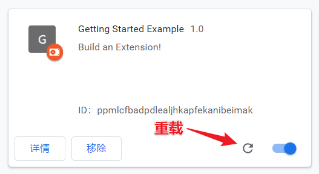
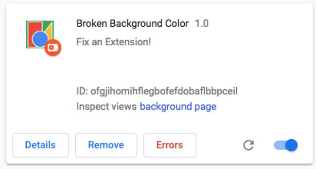
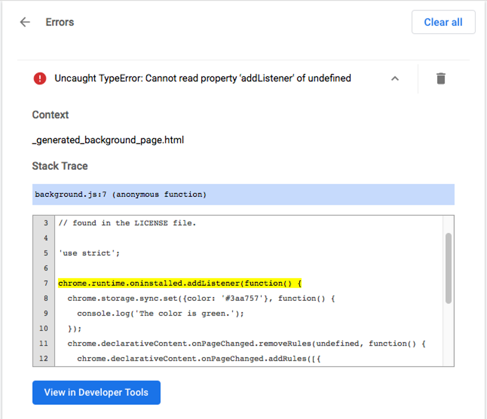
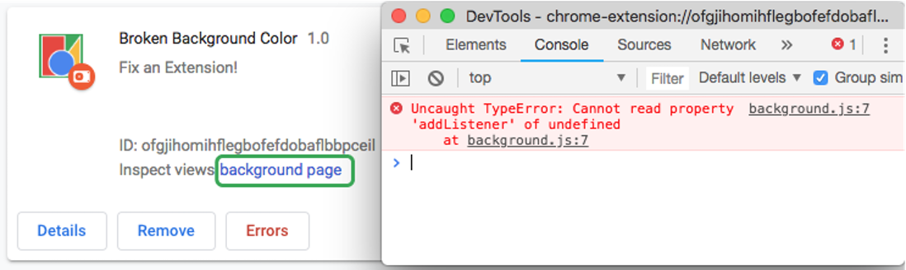
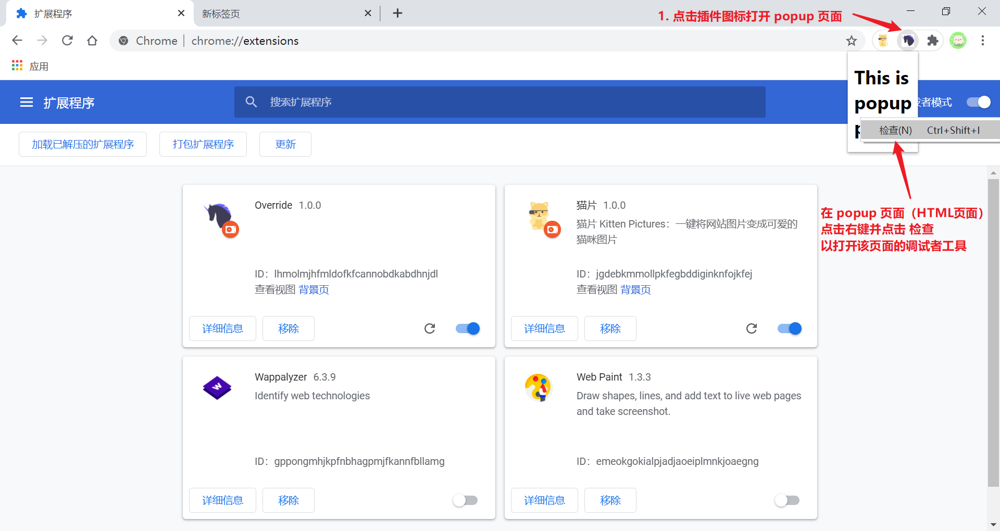
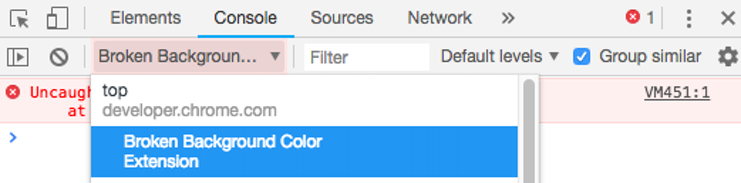

# 开发调试

扩展程序开发调试主要是使用 [Chrome DevTools 开发者工具](https://developers.google.com/web/tools/chrome-devtools/)，但与普通的网页有些不同。由于扩展程序是由多个部分组成的，而且它们一般都是运行在独立的环境中。

:bulb: 每次修改完代码需要重载更新插件，并刷新当前页面。

## 错误日志

如果一个扩展程序运行中遇到错误，其错误日志可以在 `chrome://extensions` 扩展程序管理页面中找到，找到相应的扩展程序卡片点击「**错误**」按钮即可查看

根据错误提示修改代码逻辑，然后点击页面右上角的「**清除所有**」错误记录，再重载扩展程序，尝试运行。

## 后台脚本

后台脚本 background script 是运行在 Service workers 中，它没有页面，如果希望打开它的开发者工具，可以在 `chrome://extensions` 扩展程序管理页面找到相应的扩展程序卡片，点击里面的「**背景页**」链接，就可以打开后台脚本的开发者工具

## 弹出页面

在用户点击 Action（浏览器工具栏的扩展程序图标按钮）时，如果扩展程序会弹出一个页面，里面也会运行一些代码逻辑，这个页面也是可以打开其开发者工具进行调试的。

:bulb: popup 页面会在打开开发者工具**之前**完成所有的网络请求，所以为了监听网络请求的情况，可以在打开了开发者工具时，在 Network 栏目下刷新，让 popup 页面重新发起网络请求。

## 内容脚本

内容脚本 content script 是植入到页面运行的代码，可以打开相应网页的开发者工具进行调试。

:bulb: 如果只想在控制台中查看与扩展程序相关的输出，可以点击下拉框选择相应的来源。

:bulb: 只有在内容脚本运行时触发的错误，或使用 `console.warning` 和 `console.error` 手动触发的错误会记录在开发者工具的控制台中。

## 覆写页面

覆写页面会以一个标签页的形式展示，和普通的网页一样，可以使用开发者工具进行调试。

:bulb: 对于 Full page options 整页的设置页面也是一样可以使用开发者工具进行调试。

