# 必备概念

扩展程序由多个部分组成，以下列出了[开发相关的必备概念](https://developer.chrome.com/docs/extensions/mv3/devguide/)。


## 通用技术

### Service Workers

在 Manifest V2 版本中，后台页面 background pages 是扩展程序中的一个独立页面，一般设置事件监听，以响应用户的操作，但是它会长期驻留后台影响性能。在 Manifest V3 版本中，后台脚本迁移到 Service Workers 中运行以提供性能，其中有两个特点：

* Service Workers 在执行事件处理函数后终止，并在新的事件触发下重新运行
* 它是一种 [JavaScript Worker](https://www.html5rocks.com/en/tutorials/workers/basics/)，**无法直接访问 DOM**。 

:bulb: [Service Worker](https://developers.google.com/web/fundamentals/primers/service-workers/) 是浏览器**完全独立于网页运行**的脚本。除了以上的特点，还要注意以下的相关事项：

- 它是一种可编程网络代理，让您能够控制页面所发送网络请求的处理方式。
- 它广泛地利用了 promise 进行异步操作。

如果需要使用 service workers 时需要在配置清单 `manifest.json` 的选项 `background.service_worker` 中声明注册，属性值指定需要执行的一个 JavaScript 文档的路径（它必须在项目的根目录下）。

```json
{
  // ...
  "background": {
    "service_worker": "background.js"
  },
}
```

后台脚本在 Service Workers 中运行基于监听事件-响应模型来执行操作，因此逻辑代码的编写也应该遵循该模型以优化性能：

* 在事件循环的第一轮中完成事件监听的注册，即将事件监听程序写在后台脚本最顶层的作用域中，而不应该内嵌在其他的逻辑代码中（因为 Service Workers 执行完代码会终止而不会长期驻留，当有事件需要分派时它才再次运行，如果未能在第一次事件轮询中注册监听器，这就无法响应事件）。

  ```js
  // background.js
  chrome.storage.local.get(["badgeText"], ({ badgeText }) => {
    chrome.action.setBadgeText({ text: badgeText });
  });
  
  // Listener is registered on startup
  chrome.action.onClicked.addListener(handleActionClick);
  
  function handleActionClick() {
      // ...
  }
  ```

* 由于 Service Workers 生命周期是**短期的**，如果需要持久化的数据（例如需要将用户输入的内容作为变量），可以使用 Chrome 为扩展程序提供的 [Storage API](https://developer.chrome.com/docs/extensions/reference/storage/)

  ```js
  // background.js
  chrome.runtime.onMessage.addListener(({ type, name }) => {
    if (type === "set-name") {
      chrome.storage.local.set({ name });
    }
  });
  
  chrome.action.onClicked.addListener((tab) => {
    chrome.storage.local.get(["name"], ({ name }) => {
      chrome.tabs.sendMessage(tab.id, { name });
    });
  });
  ```

* 在 Manifest V2 版本中使用 `setTimeout` 或 `setInterval` 实现延迟或定期操作，在 Manifest V3 版本的 Service Workers 中并**不**可行，因为 Service Worker 并不会长期驻留后台，当它终止时调度程序会注销计时器。我们应该使用 [Alarms API](https://developer.chrome.com/docs/extensions/reference/alarms/) 来替代，它用以安排代码定期运行或在未来的指定时间运行。它也需要在后台脚本最顶层的作用域中注册。

  ```js
  // background.js
  chrome.alarms.create({ delayInMinutes: 3 }); // set an alarm, which will dispatch onAlarm event after 3 mins
  
  // listen the onAlarm event and react to it
  chrome.alarms.onAlarm.addListener(() => {
    chrome.action.setIcon({
      path: getRandomIconPath(),
    });
  });
  ```

Service Worker 实际上是一个 [web worker](https://developer.mozilla.org/en-US/docs/Web/API/Worker)，在浏览器中可以独立于网页运行，一般网页的执行上下文中都有[全局变量 `window`](https://developer.mozilla.org/en-US/docs/Web/API/Window)，可以通过它访问一些浏览器提供的 API，例如 IndexedDB、cookie、localStorage 等，但在 Service Worker 中没有该对象，因此有诸多限制，例如在该环境中无法访问 DOM，无法发起 XMLHttpRequest（但支持 fetch 功能），以下是应对限制的一些解决方法：

* 由于 Service Workers 无法访问 [DOMParser API](https://developer.mozilla.org/en-US/docs/Web/API/DOMParser) 以解析 HTML，我们可以通过 `chrome.windows.create()` 和 `crhome.tabs.create()` API 创建一个标签页，以提供一个具有 window 对象的环境，或借助一些库（如 [jsdom](https://github.com/jsdom/jsdom) 或 [undom](https://github.com/developit/undom)）弥补这个缺失。

* 在 Service Workers 中无法播放或捕获多媒体资源，可以通过 `chrome.windows.create()` 和 `crhome.tabs.create()` API 创建一个标签页，以提供一个具有 window 对象的环境，然后可以通过[消息传递 message passing](https://developer.chrome.com/docs/extensions/mv3/messaging/) 在 service worker 中控制页面的多媒体播放。

* 虽然在 Service Worker 中无法访问 DOM，但可以通过 [`OffscreenCanvas` API](https://html.spec.whatwg.org/multipage/canvas.html#the-offscreencanvas-interface) 创建一个 canvas。关于 OffscreenCanvas 相关信息可以参考[这里](https://developers.google.com/web/updates/2018/08/offscreen-canvas)。

  ```js
  // background.js
  // for MV3 service workers
  function buildCanvas(width, height) {
    const canvas = new OffscreenCanvas(width, height);
    return canvas;
  }
  ```


### Message Passing

参考：

* [Message passing](https://developer.chrome.com/docs/extensions/mv3/messaging/#external)
* 关于 Message Passing [官方示例](https://github.com/GoogleChrome/chrome-extensions-samples/tree/main/mv2-archive/api/messaging)

注入到页面的脚本 content scripts 是在网页运行的，它「脱离」了扩展程序，但可以使用信息传递 message passing 进行沟通（在 web page 的页面脚本 content script 和扩展程序之间），Chrome 除了提供简单的 API 进行一次性的请求-响应通讯，也提供复杂的 API 进行长连接通讯，还可以基于 ID 进行跨扩展程序的通讯。

:bulb: 任何合法的 JSON 格式的数据都可以传递。

:bulb: 甚至可以[与本机系统进行通讯](https://developer.chrome.com/docs/apps/nativeMessaging/)。

:warning: 信息传递过程中需要考虑安全问题：

* 内容脚本 content scripts 更容易遭受恶意网页攻击，应该限制通过 content script 传递过来的信息，可以触发的操作范围

* 当扩展程序与外部资源进行通讯时，应该采取必要的行为避免发生跨站脚本攻击

  ```js
  chrome.tabs.sendMessage(tab.id, {greeting: "hello"}, function(response) {
    // WARNING! Might be injecting a malicious script!
    document.getElementById("resp").innerHTML = response.farewell;
  });
  
  chrome.tabs.sendMessage(tab.id, {greeting: "hello"}, function(response) {
    // innerText does not let the attacker inject HTML elements.
    document.getElementById("resp").innerText = response.farewell;
  });
  
  chrome.tabs.sendMessage(tab.id, {greeting: "hello"}, function(response) {
    // JSON.parse does not evaluate the attacker's scripts.
    var resp = JSON.parse(response.farewell);
  });
  ```

#### 一次性请求

使用[方法 `chrome.runtime.sendMessage()`](https://developer.chrome.com/docs/extensions/reference/runtime/#method-sendMessage) 或[方法 `chome.tabs.sendMessage()`](https://developer.chrome.com/docs/extensions/reference/tabs/#method-sendMessage) 进行**单次请求**，这两个方法可以设置回调函数，默认接收返回的响应数据作为参数。

```js
// 在页面脚本 content script 发送信息
chrome.runtime.sendMessage({greeting: "hello"}, function(response) {
  console.log(response.farewell);
});

// 在扩展程序发送信息
// 需要先使用 query 获取 tabId，以指定该请求发送给哪个特定的 tab 标签页面
chrome.tabs.query({active: true, currentWindow: true}, function(tabs) {
  // 发送到当前激活的标签页面
  chrome.tabs.sendMessage(tabs[0].id, {greeting: "hello"}, function(response) {
    console.log(response.farewell);
  });
});
```

在接收端，植入页面的代码 content script 和扩展程序的后台代码 background script 都一样，需要使用[方法 `chrome.runtime.onMessage.addListener()`](https://developer.chrome.com/docs/extensions/reference/runtime/#event-onMessage) **监听相应的事件以捕获请求**。事件处理函数接收三个参数，第一参数是接收到的信息；第二个参数是一个对象，它包含这次 message 的发送方的相关信息；第三个参数是一个方法，发送响应内容。

```js
chrome.runtime.onMessage.addListener(function(message, sender, sendResponse) {
  console.log(sender.tab ?
    "from a content script:" + sender.tab.url :
    "from the extension");
  if (message.greeting === "hello")
    sendResponse({farewell: "goodbye"});
  }
);
```

:bulb: 以上事件处理函数中，发送响应是同步执行的，即接收到 message 触发事件处理函数后，执行到 `sendResponse` 函数时就会立即发送响应；如果希望异步发送响应（例如需要整合其他异步请求的数据），可以在 `onMessage` 事件处理函数的最后，显性返回 `return true`，告知扩展程序响应会异步执行，这样信息通道 message channel 还会保持打开，直到 `sendResponse` 被调用。

:bulb: 如果在不同页面设置了多个 `onMessage` 事件监听器，**为了保证只有一次响应，对于每次 message 请求扩展程序整体都只会最多执行一次 `sendResponse()` 方法**，其他事件处理函数中的响应函数都会被忽略。

#### 长连接

可以使用[方法 `chrome.runtime.connect()`](https://developer.chrome.com/docs/extensions/reference/runtime/#method-connect) 或[方法 `chrome.tabs.connect()`](https://developer.chrome.com/docs/extensions/reference/tabs/#method-connect) 为内容脚本 content script 和扩展程序之间**建立一个长连接**（可以为信息通道 channel 设置名称，以区别多个通道）。

使用以上方法创建通道后，会返回一个 [`runtime.Port` 端口对象](https://developer.chrome.com/docs/extensions/reference/runtime/#type-Port)，其中包括了关于信息通道的相关方法和属性，然后就可以通过该通道发送 `portObj.postMessage()` 和接收 `portObj.onMessage.addListener()` 信息。

```js
// 在页面脚本 content script 建立长连接的信息通道
var port = chrome.runtime.connect({name: "knockknock"});
// 通过该端口发送信息
port.postMessage({joke: "Knock knock"});
// 设置事件监听器，通过该端口接收信息，将接收到的信息作为入参
port.onMessage.addListener(function(msg) {
  if (msg.question === "Who's there?")
    port.postMessage({answer: "Madame"});
  else if (msg.question === "Madame who?")
    port.postMessage({answer: "Madame... Bovary"});
});
```

类似地，如果在扩展程序中建立长连接发送消息时，使用方法 `chrome.tabs.connect()`，需要指定请求是发送给哪个特定的 tab 标签页。

信息通道是双向的，因此除了发起端创建端口，还需要在接收端使用[方法 `chrome.runtime.onConnect()`](https://developer.chrome.com/docs/extensions/reference/runtime#event-onConnect) **响应通道连接请求**（在内容脚本 content script 和扩展程序中一样）。当通道发起端口调用 connect 方法时，接收端的监听器就会调用回调函数，它将相应的 `runtime.Port` 端口对象作为入参，然后可以使用该端口在通道中发送和接收消息，这样通道两端的接口就可以**相互接收和发送信息**了。

```js
chrome.runtime.onConnect.addListener(function(port) {
  console.assert(port.name === "knockknock");
  port.onMessage.addListener(function(msg) {
    if (msg.joke === "Knock knock")
      port.postMessage({question: "Who's there?"});
    else if (msg.answer === "Madame")
      port.postMessage({question: "Madame who?"});
    else if (msg.answer === "Madame... Bovary")
      port.postMessage({question: "I don't get it."});
  });
});
```

#### 端口生命周期

信息通道连接是长期的，但也可能因为以下原因断开：

* 在接收端没有设置监听器 `chrome.runtime.onConnect()` 无法成功建立通道

* 使用 `chrome.tabs.connect()` 创建通道时，期望连接的端口所在的页面不存在

* All frames that received the port (via [runtime.onConnect](https://developer.chrome.com/docs/extensions/reference/runtime#event-onConnect)) have unloaded.

* 端口对象调用了方法 `chrome.runtime.Port.disconnect()` 结束连接

  :bulb: 如果发起端口调用 connect 后，建立多个接收端口（创建多个信息通道），在其中一个接收端口调用 disconnect 时，则 **`onDisconnect` 事件**只会在发起端口触发，其他端口并不会触发。

可以使用方法 `port.onDisconnect()` 监听该端口的断连事件（其中 `port` 是端口对象），事件处理函数的入参是该端口对象。

#### 跨扩展程序的通讯

除了在扩展程序内进行信息传递，还可以使用类似的 messaging API 在不同扩展程序间进行通讯。

发送请求信息时，必须提供扩展程序的 ID，以便其他扩展程序判断是否作出响应。使用方法 `chrome.runtime.sendMessage(id, message)` 发送一次性的请求；使用方法 `chrome.runtime.connect(id)` 发起通道连接请求，并返回端口对象。

```js
// The ID of the extension we want to talk to.
var laserExtensionId = "abcdefghijklmnoabcdefhijklmnoabc";

// Make a simple request:
chrome.runtime.sendMessage(laserExtensionId, {getTargetData: true},
  function(response) {
    if (targetInRange(response.targetData))
      chrome.runtime.sendMessage(laserExtensionId, {activateLasers: true});
  }
);

// Start a long-running conversation:
var port = chrome.runtime.connect(laserExtensionId);
port.postMessage(...);
```

对于一次性的请求，使用方法 `chrome.runtime.onMessageExternal()` 进行监听并作出响应；对于长连接，使用方法 `chrome.runtime.onConnectExternal()` 响应连接，并使用端口对象接收和发送信息。

```js
// For simple requests:
chrome.runtime.onMessageExternal.addListener(
  function(request, sender, sendResponse) {
    if (sender.id === blocklistedExtension)
      return;  // don't allow this extension access
    else if (request.getTargetData)
      sendResponse({targetData: targetData});
    else if (request.activateLasers) {
      var success = activateLasers();
      sendResponse({activateLasers: success});
    }
  });

// For long-lived connections:
chrome.runtime.onConnectExternal.addListener(function(port) {
  port.onMessage.addListener(function(msg) {
    // See other examples for sample onMessage handlers.
  });
});
```

####  网页通讯

类似于跨扩展程序间通讯，一般的网页可以发送信息给扩展程序。而扩展程序需要在配置清单 `manifest.json` 的选项 `externally_connectable.matches` 中声明注册，希望与哪些外部网页进行连接（可以使用正则表达式，以支持一系列符合一定规则的网页，但**至少包含二级域**）

```json
{
  // ...
  "externally_connectable": {
    "matches": ["https://*.example.com/*"]
  }
}
```

在网页使用方法 `chrome.runtime.sendMessage()` 或方法 `chrome.runtime.connect()` 发送信息（通过 ID 来指定与哪一个扩展程序进行通讯）

```js
// The ID of the extension we want to talk to.
var editorExtensionId = "abcdefghijklmnoabcdefhijklmnoabc";

// Make a simple request:
chrome.runtime.sendMessage(editorExtensionId, {openUrlInEditor: url},
  function(response) {
    if (!response.success) handleError(url);
});
```

在扩展程序使用方法 `chrome.runtime.onMessageExternal()` 或方法 `chrome.runtime.onConnectExternal()` 

```js
chrome.runtime.onMessageExternal.addListener(
  function(request, sender, sendResponse) {
    if (sender.url === blocklistedWebsite)
      return;  // don't allow this web page access
    if (request.openUrlInEditor) openUrl(request.openUrlInEditor);
});
```

:bulb: 当扩展程序与一般的网页通讯时，长连接只能通过网页端发起。


### Options Pages

设置页面允许用户定制扩展程序，以更符合自己的使用习惯。

如果要为扩展程序添加设置页面，需要先在配置清单 `manifest.json` 的中进行声明注册，有两种类型的设置页面：

* Full page options 整页的设置页面，需要打开一个标签页。

  在配置清单的选项 `options_page` 中声明注册作为设置页面的 HTML 文档的路径

  ```json
  {
    // ...
    "options_page": "options.html",
  }
  ```

  然后用户可以在浏览器工具栏的扩展程序图标右键点击选择「**选项**」打开设置页面

  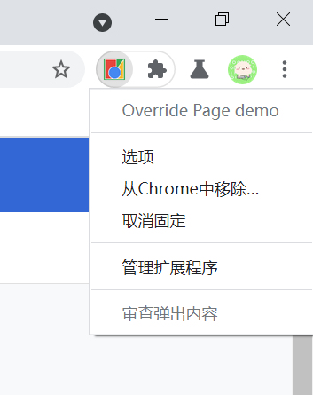

  或者在扩展程序的「**详情**」页面中选择「**扩展程序选项**」打开设置页面

  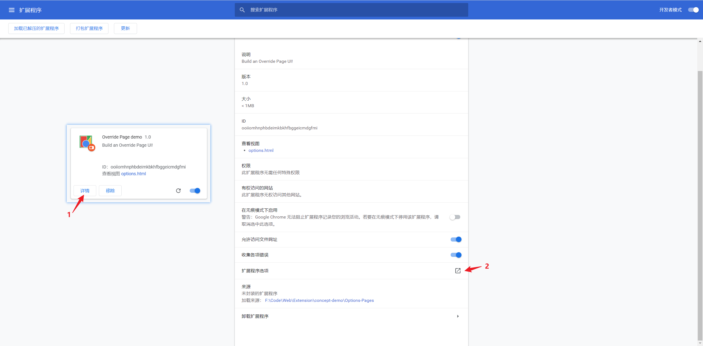

* Embedded Options 内嵌的设置页面，以模态框的形式展示设置页面。

  :bulb: 模态框的大小会根据页面内容自动调整，但有时候可能并不奏效，此时可以为设置页面先提供一个**最小的尺寸**，以保证布局正常显示。

  在配置清单的选项 `options_ui.page` 中指向相应的 HTML 文档路径，并设置属性 `option_ui.open_in_tab` 为 `false`，表示采用内嵌设置页（如果设置为 `true` 就会打开新的标签页来展示设置页面）。

  ```json
  {
    // ...
    "options_ui": {
      "page": "options.html",
      "open_in_tab": false
    },
  }
  ```

  然后用户就可以在在浏览器工具栏的扩展程序图标右键点击选择「**选项**」，会跳转到相应扩展程序的详情页，同时打开模态框展示设置页面；或者在扩展程序的「**详情**」页面中选择「**扩展程序选项**」，打开模态框展示设置页面。

  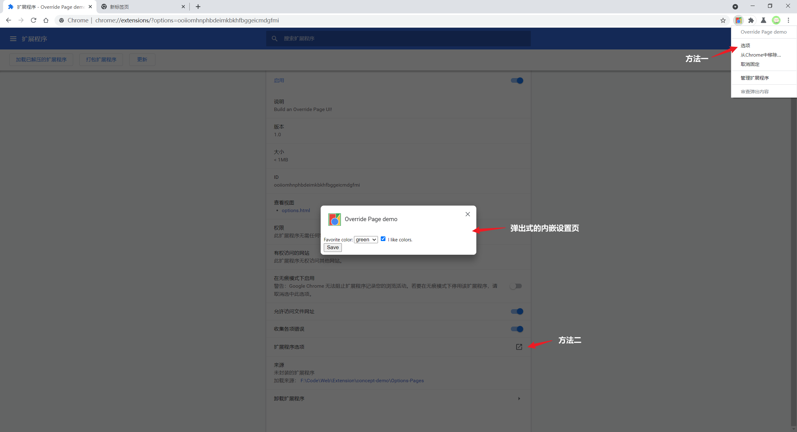

:bulb: 在扩展程序的页面中可以通过方法 `chrome.runtime.openOptionsPage()` 打开设置页面

```html
<button id="go-to-options">Go to options</button>
```

```js
document.querySelector('#go-to-options').addEventListener('click', function() {
  // 先判断浏览器是否支持该方法
  if (chrome.runtime.openOptionsPage) {
    chrome.runtime.openOptionsPage();
  } else {
    // 如果不支持就手动基于页面路径打开设置页面
    window.open(chrome.runtime.getURL('options.html'));
  }
});
```

虽然两种方式都可以供用户设置参数，但是有一些不同：

* 对于内嵌型的设置页面，不支持部分 Tabs 相关的 API

  * 无法使用 [方法 `chrome.tabs.query()`](https://developer.chrome.com/docs/extensions/reference/tabs#method-query) 通过设置页面的 URL 找到对应的 tab
  * 打开设置页面时，[事件 `chrome.tabs.onCreated.addListener()`](https://developer.chrome.com/docs/extensions/reference/tabs/#event-onCreated) 无法被监听到
  * 当设置页面重载时，[事件 `chrome.tabs.onUpdated.addListener()`](https://developer.chrome.com/docs/extensions/reference/tabs/#event-onUpdated) 无法被监听到

* 无法使用[方法 `chrome.tabs.connect()`](https://developer.chrome.com/docs/extensions/reference/tabs/#method-connect) 和[方法 `chrome.tabs.sendMessage()`](https://developer.chrome.com/docs/extensions/reference/tabs/#method-sendMessage) 发送信息，但[方法 `chrome.runtime.connect()`](https://developer.chrome.com/docs/extensions/runtime#method-connect) 和[方法 `chrome.runtime.sendMessage()`](https://developer.chrome.com/docs/extensions/runtime#method-sendMessage) 并不受限制。

  :bulb: 如果设置页面使用[方法 `chrome.runtime.connect()`](https://developer.chrome.com/docs/extensions/runtime#method-connect) 和[方法 `chrome.runtime.sendMessage()`](https://developer.chrome.com/docs/extensions/runtime#method-sendMessage) 传递信息，接收者并不能读取发送者 sender 的 tab 信息，只能读取到发送者的 url 信息（设置页面文档的路径）

:bulb: 为了可以让用户的设置数据持久化及跨设备同步，可以使用 Chrome 提供的 [`storage.sync` API](https://developer.chrome.com/docs/extensions/reference/storage#property-sync)，记得先在配置清单 `manifest.json` 中声明注册 `strage` 权限


### Permissions

参考：

* [`chrome.permissions` API](https://developer.chrome.com/docs/extensions/reference/permissions/)
* [Declare permissions](https://developer.chrome.com/docs/extensions/mv3/declare_permissions/)
* [Declare permissions and warn users](https://developer.chrome.com/docs/extensions/mv3/permission_warnings/)

限制扩展程序的权限，不仅可以降低扩展程序被恶意程序利用的可能性；还可以让用户有主动选择权，决定应该给扩展程序授予哪些权限可选。

扩展程序为了可以使用部分 Chrome APIs 和访问外部网页，需要在配置清单 `manifest.json` 中以**显式声明**所需的权限，有三种选项以声明不同的权限：

* `permissions` 用于设置必要权限许可 required permissions，所有可以使用的 permissions 字段可以在[这里](https://developer.chrome.com/docs/extensions/mv3/declare_permissions/)查看，以数组的形式包含多个字段。为了实现扩展程序的基本功能，在安装时询问用户
* `optional_permissions` 用于设置可选权限许可 optional permissions，也是以以数组的形式包含多个字段。为了实现某些可选的功能（一般是访问特定的数据或资源），在扩展程序运行时才询问用户，以获取权限许可。
* `host_permissions` 专门用于设置扩展程序可以去访问哪些主机的权限，包含一系列[用于匹配 url 的正则表达式](https://developer.chrome.com/docs/extensions/mv3/match_patterns/)

然后浏览器会在扩展程序安装时或在运行时，询问用户是否允许它获取相应的权限、访问特定的资源，让用户可以有主动权去保护自己的数据，具体哪些权限会通知用户或是询问让用户主动选择，可以查看[这里](https://developer.chrome.com/docs/extensions/mv3/permission_warnings/)。

```json
{
  // ...
  "permissions": [
    "tabs",
    "bookmarks",
    "unlimitedStorage"
  ],
  "optional_permissions": [
    "unlimitedStorage"
  ],
  "host_permissions": [
    "http://www.blogger.com/",
    "http://*.google.com/"
  ],
}
```

:bulb: 在配置清单 `manifest.json` 里所有可以声明的 permissions 字段可以在[这里](https://developer.chrome.com/docs/extensions/mv3/declare_permissions/)查看，但是部分字段并**不**能在可选权限 `optional_permissions` 选项中声明：

* `debugger`
* `declarativeNetRequest`
* `devtools`
* `experimental`
* `geolocation`
* `mdns`
* `proxy`
* `tts`
* `ttsEngine`
* `wallpaper`

除了可以在配置清单中设置可选权限许可，还可以在扩展程序的逻辑代码中，基于用户主动交互（例如在按钮的点击事件的处理函数中）中使用方法 `chrome.permissions.request()` 动态申请。如果申请的权限会触发警告提示，则会弹出一个权限提示框询问用户许可，并等待结果返回再执行后续的代码

```js
document.querySelector('#my-button').addEventListener('click', (event) => {
  // Permissions must be requested from inside a user gesture, like a button's
  // click handler.
  chrome.permissions.request({
    permissions: ['tabs'],
    origins: ['https://www.google.com/']
  }, (granted) => {
    // The callback argument will be true if the user granted the permissions.
    if (granted) {
      doSomething();
    } else {
      doSomethingElse();
    }
  });
});
```

如果不再需要某项权限时，可以使用方法 `chrome.permissions.remove()` 删除该权限，如果之后再使用方法 `chrome.permissions.request()` 动态添加相应的权限，则不必再告知用户

```js
chrome.permissions.remove({
  permissions: ['tabs'],
  origins: ['https://www.google.com/']
}, (removed) => {
  if (removed) {
    // The permissions have been removed.
  } else {
    // The permissions have not been removed (e.g., you tried to remove
    // required permissions).
  }
});
```

:bulb: 可以使用方法 `chrome.permissions.contains()` 查看扩展程序当前是否拥有某项权限，使用方法 `chrome.permissions.getAll()` 获取扩展程序当前具有的所有权限

```js
chrome.permissions.contains({
  permissions: ['tabs'],
  origins: ['https://www.google.com/']
}, (result) => {
  if (result) {
    // The extension has the permissions.
  } else {
    // The extension doesn't have the permissions.
  }
});
```

:bulb: 有一些权限获取时，会**弹出警告提示**，你可以在这里查看[相关的权限](https://developer.chrome.com/docs/extensions/mv3/permission_warnings/#permissions_with_warnings)。

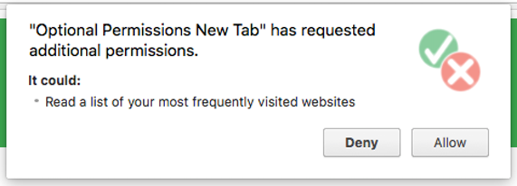

为了避免在安装扩展程序时，**由于弹出的过多的警告而降低了安装量，应该在配置清单 `manifest.json` 的选项 `permissions` 中只声明核心功能所必需的权限，而尽量包含需要弹出警告的权限，而应该将这些权限在选项 `optional_permissions` 中声明**，然后使用交互控件，如按钮或 checkbox，让用户主动激活可选功能，此时才弹出权限警告框，让用户主动选择是否授权，这样的交互体验会更佳。

:bulb: 如果更新扩展程序时，新增了 permissions 会导致扩展程序临时无法激活，需要用户再起允许授权才可以，如果将这些新增的 permissions 放在选项 `optional_permissions` 则可以避免这个不好的体验。

:bulb: 声明 `activeTab` 权限可以**临时获取许可访问当前激活的标签页**，并在当前页面使用 [tabs 相关的 API](https://developer.chrome.com/docs/extensions/reference/tabs/)（当导航到其他 url 或关闭当前页面后，该路径的可访问性就失效），一般用以替代 `<all_urls>` 权限，达到访问任意 url 的当前页面，而且不会在安装扩展程序时弹出警告。

:bulb: 对于在「开发者模式」下「加载已解压的扩展程序」，并**不**会展示权限警告提示。如果希望查看警告提示的效果，可以相对开发的扩展程序进行**打包**，具体步骤请参考[官方指南](https://developer.chrome.com/docs/extensions/mv3/permission_warnings/)。


### Storage

扩展程序可以在浏览器中存储和检索数据。

Chrome 浏览器为拓展出现提供数据存储 API `chrome.storeage` ，该 API 提供类似 [localStorage ](https://developer.mozilla.org/en-US/docs/Web/API/Window/localStorage) 的功能，但也有一些不同：

* 使用 `chrome.storage.sync` 相关方法，就可以利用 Chrome 的**同步**功能，实现同一账户下的扩展程序数据在多个设备之间同步。:bulb: 如果已登录账户的 Chrome 离线时，希望同步存储的数据会先进行本地存储，等待浏览器上线后再进行同步。如果用户在 Chrome 设置中取消了数据同步功能，那么 `chrome.storage.sync` 相关方法的作用和 `chrome.storage.local` 一样
* 批量的读取和写入数据操作是**异步执行**的，因此与 localStorage 引起的阻塞和串行相比操作更快
* 存储的**数据类型可以是对象**，而 localStorage 只允许存储字符串
* Enterprise policies configured by the administrator for the extension can be read (using `storage.managed` with a [schema](https://developer.chrome.com/docs/extensions/mv2/manifest/storage/)). The `storage.managed` storage is read-only.

:bulb: 有三种不同的存储域 StorageArea

* `sync` 同步存储的数据
* `local` 本地存储的数据
* `managed` 管理员设置的数据，只读

如果要使用该 API 需要先在配置清单 `manifest.json` 的选项 `permissions` 中声明注册权限

```json
{
  // ...
  "permissions": [
    "storage"
  ],
}
```

存储扩展程序的数据时，以键值对的形式（数据格式是对象），可以使用方法 `chrome.storage.local.set({key: value}, callback())` 存储在本地，或使用方法 `chrome.storage.sync.set({key: value}, callback())` 进行同步存储，相应地分别使用方法 `chrome.storage.local.get()` 或 `chrome.storage.sync.get()` 获取对应 key 的数据

```js
// sync
chrome.storage.sync.set({key: value}, function() {
  console.log('Value is set to ' + value);
});

chrome.storage.sync.get(['key'], function(result) {
  console.log('Value currently is ' + result.key);
});
```

```js
// local
chrome.storage.local.set({key: value}, function() {
  console.log('Value is set to ' + value);
});

chrome.storage.local.get(['key'], function(result) {
  console.log('Value currently is ' + result.key);
});
```

:bulb: 获取 get 数据时，不仅可以传入 key 字符串，也可以传入 keys 数组，以返回对应的一系列数据。如果获取 get 数据时，传入的 key 为 `null` 则会返回**所有**存储的数据。

:bulb: 如果想删除某个 key 的数据，可以使用方法 `chrome.storage.remove(key, callback())`。如果要清空所有存储的数据，可以使用方法 `chrome.storage.clear(callback())`

:warning: 与用户相关机密数据请不要进行存储，因为使用该 API 所存储的数据**并不会**加密。

该 API **允许存储的数据并不大**，对于 [sync 同步存储](https://developer.chrome.com/docs/extensions/reference/storage/#property-sync)的数据，允许总大小为 100KB，最多存储 512 个数据项，每项大小为 8KB；对于 [local 本地存储](https://developer.chrome.com/docs/extensions/reference/storage/#property-local)的数据，允许总大小为 5MB（类似于 localstorage 的存储限制），因此它们一般用作存储、同步扩展程序的设置。

当扩展程序存储的数据发生改变时，会触发 `onChange` 事件，可以对其进行监听以作出响应

```js
// background.js
chrome.storage.onChanged.addListener(function (changes, namespace) {
  for (let [key, { oldValue, newValue }] of Object.entries(changes)) {
    console.log(
      `Storage key "${key}" in namespace "${namespace}" changed.`,
      `Old value was "${oldValue}", new value is "${newValue}".`
    );
  }
});
```


### Accessibility

可及性，又称为 a11y，是指一系列的设计指南，以便残障人士更易于使用扩展程序，例如快捷键命令可以让视觉障碍人士更方便地使用扩展程序，字幕和翻译功能对视觉障碍人士和外语者有帮助。

开发者可以遵循以下建议，以提高扩展程序的可及性 accessible：

* 使用正确的[语义化 HTML 元素](https://developer.mozilla.org/zh-CN/docs/Learn/Accessibility/HTML)搭建 UI 控件，以便保障可及性。这些控件保证了可以通过键盘（Tab 键）访问操作，且它们的语义性让屏幕阅读器更容易理解。

  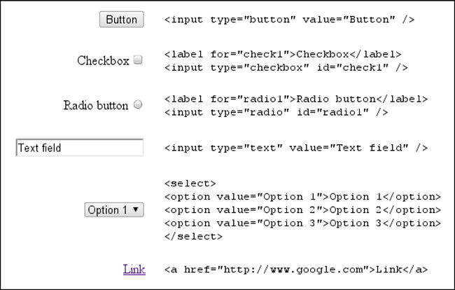

* 如果需要使用非语义化的 HTML 元素或 JavaScript 构建 UI 控件时，可以通过 [WAI-ARIA](https://www.w3.org/WAI/standards-guidelines/aria/)，Web Accessibility Initiative - Accessible Rich Internet Applications，一个由 W3C 制定的规范，它通过给 DOM 元素添加一些规定的属性，让我们的开发的网页应用更具语义化。

  :bulb: WAI-ARIA 属性**不会**对 web 页面有任何影响，只是让浏览器暴露更多的信息给无障碍 API，例如屏幕阅读器。

  该规范中三个主要的特性：

  * 声明元素的角色和功能，例如 `role="navigation"` 表示该元素的作用是导航
  * 为元素定义额外的属性，例如 `aria-require=true` 告知用户该表单是必添的
  * 设定元素的状态，例如 `aria-disable="true"` 表示该表单禁止输入

  :bulb: 状态和属性的差异之处就是：属性在应用的生命周期中不会改变，**而状态可以**，用编程的方法改变。

  ```html
  <div role="toolbar" tabindex="0" aria-activedescendant="button1">
    
    
    
  </div>
  ```

  以上示例中，[属性 `tabindex="0"`](https://developer.mozilla.org/zh-CN/docs/Web/HTML/Global_attributes/tabindex) 让该元素可以聚焦，并且可以通过键盘来导航，其聚焦顺序由 DOM 结构决定；属性 `aria-activedescendant` 指定该元素聚焦时，其子代哪一个元素先进行聚焦。

* 元素可聚焦让用户仅通过键盘也能操作扩展程序页面，应该保证按钮、菜单栏等元素可以聚焦。默认情况下，只有锚标签、按钮、表单控件可以通过键盘聚焦，但是我们可以通过为元素添加属性 `tabIndex="0"` 让任意元素可以聚焦；也可以通过添加属性 `tabIndex="-1"` 让该元素无法通过键盘聚焦（但仍可以通过 JavaScript 编程聚焦 `elem.focus()`）。

* 与通过 Tab 键聚焦元素相比，快捷键可以让用户更方便地操作扩展程序页面的元素，可以参考[官方示例](https://developer.chrome.com/docs/extensions/mv3/a11y/#shortcuts)如何用快捷键进行导航。如果在扩展程序的页面内提供了快捷键，应该在[设置页面 options page](https://developer.chrome.com/docs/extensions/mv3/options/) 中告知用户。

* 以下设置可以完善内容的可访问性

  * 文本：选择合适的字体和字号大小以确保文本内容的可读性，而且应该考虑视觉障碍者的使用体验，他们可能需要设置更大的字体，避免将自定义的快捷键与页面缩放的快捷键相冲突。为了确保版型的稳定，应该测试缩放至 200%，查看页面是否还显示正常。应该避免将文字嵌入到图片中，这样不仅无法调整字体，还无法让屏幕阅读器识别；如果必须将文字嵌入图片中，应该在图片的可替代文字（属性 `alt`）中包含这些文字内容，相关指南可以参考[这里](https://webaim.org/techniques/alttext/)。
  
  * 颜色：背景和内容的颜色应该有足够的**对比度**，可以使用 [Colour Contrast Check](https://snook.ca/technical/colour_contrast/colour.html) 工具检查。对于颜色丰富的图表，可以使用色弱模拟器  [Coblis](http://www.color-blindness.com/coblis-color-blindness-simulator/) 来查看它在不同程度的色弱症人士眼里的效果，调整图表的配色，以使扩展程序对于这些用户更友好。可以考虑为提供不同的色彩主题，或允许自定义配色方案，以便用户有更好的体验。
  
  * 声音：如果扩展程序需要声音和视频传达信息，应该提供字幕和翻译功能，关于多媒体字幕的相关指南参考[这里](https://dcmp.org/learn/213)。
  
  * 图片：为图片提供可替代文字，即属性 `alt`（文字内容应该用于阐明图像的目的，而不是描述图片的细节），而对于占位图和纯装饰作用的图片，应该将该属性值留空 `""`，或使用 CSS 来实现（而不是用 DOM）
  
    ```html
    
    ```
  
* 更多相关资源：

  * [Accessibility Technical Documentation](https://www.chromium.org/developers/design-documents/accessibility)
  * [A11ycasts with Rob Dodson](https://youtube.com/playlist?list=PLNYkxOF6rcICWx0C9LVWWVqvHlYJyqw7g)


### Internationalization

参考：

* [`chrome.i18n` API](https://developer.chrome.com/docs/extensions/reference/i18n/)
* 关于 Internationalization 官方示例：
  * [i18n](https://github.com/GoogleChrome/chrome-extensions-samples/tree/main/mv2-archive/api/i18n)（MV2 版本）
  * [news](https://github.com/GoogleChrome/chrome-extensions-samples/tree/main/mv2-archive/extensions/news)（MV2 版本）
  * [Examples](https://developer.chrome.com/docs/extensions/reference/i18n/#examples)

国际化 I18N 是指在开发扩展程序时，可以让用户按需切换语言。

:bulb: 关于软件[多语言版本的开发](https://zhuanlan.zhihu.com/p/112277526)：

* 国际化 Internationalization，L18N：软件国际化是在软件设计和文档开发过程中，使得功能和代码设计能处理多种语言和文化传统，使创建不同语言版本时，不需要重新设计源程序代码的软件工程方法。
* 本地化 localization ，L10N：能够使网站、Web 应用或任何其他形式的内容适用于特定语言的范围和文化圈。

为了让扩展程序更方便地实现国际化，需要遵循以下建议：

* 将所有用户可见的内容（文本）放在一个 `messages.json` 文档中，并将该文档放在  `_locales/_localeCode_` 相应的目录下（其中 `_localeCode_` 是一个语言编码，例如英语就应该使用 `en` 表示）。

  :bulb: 如果项目中有 `_locales` 目录，需要在配置清单 `manifest.json` 的选项 `default_locale` 中声明默认语言，可以在这里查看具体的[语言代码](https://developer.chrome.com/docs/webstore/i18n/#choosing-locales-to-support)。

  在 [`messages.json` 文档](https://developer.chrome.com/docs/extensions/mv2/i18n-messages/)中，它以键值对的形式来定义内容，每一个键都包含一个需要国际化的项（大小写敏感），值是一个对象，其中常用的属性如下：

  * 属性 `message` 是需要显示的内容
  * （可选）属性 `description` 是对该项的描述，便于告知翻译者该项的意义。

  ```json
  // messages.json
  {
    "search_string": {
      "message": "hello%20world",
      "description": "The string we search for. Put %20 between words that go together."
    },
    //  ...
  }
  ```

  :bulb: 键名不能以 `@@` 开头，这一类的键名是[保留预定义的项](https://developer.chrome.com/docs/extensions/reference/i18n/#overview-predefined)，常用的预定义 message 项如下：

  |   Message 键名   |                             解释                             |
  | :--------------: | :----------------------------------------------------------: |
  | `@@extension_id` | 扩展程序的 ID，对于非国际化的扩展程序该 message 项也可用，:bulb: 但不能用于 `manifest.json` 中 |
  |  `@@ui_locale`   |                        当前使用的语言                        |
  |   `@@bidi_dir`   | 当前的文字方向，`ltr` 表示从左往右书写的文字，`rtl` 表示从右往左书写的文字 |

  例如在 CSS 中使用扩展程序中的静态图片作为背景

  ```css
  body {
    background-image:url('chrome-extension://__MSG_@@extension_id__/background.png');
  }
  ```
  
* 然后就可以在项目的其他文档中，通过 message 项来使用相应的数据：

    * 在 `manifest.json` 或 CSS 文档中，通过 `__MEG_messagename__` 来使用 message 相应的项 `messagename`
    * 在扩展程序页面或 JavaScript 脚本中，通过方法 `chrome.i18n.getMessage("messagename")` 获取相应的项 `messagename`

    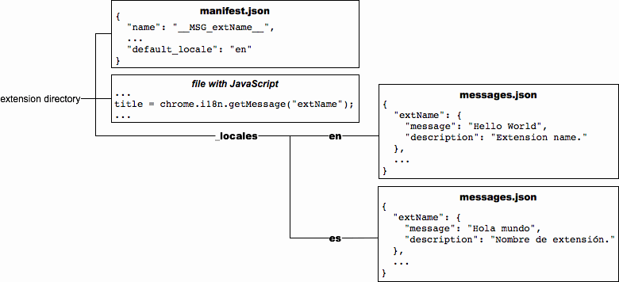

    :bulb: 每次新增一种语言，就需要新增一个 message 文件到 `_locales/_localeCode_` 目录里。每一种语言中，**不必**包含与默认语言中定义的全部 message 项。

    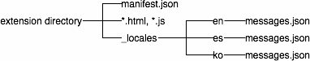

    *以上示例是支持英语、西班牙语、韩语的扩展程序项目文件结构*

    :bulb: 浏览器会基于用户的语言设置和扩展程序的 `default_locale` 设置来[自动选择](https://developer.chrome.com/docs/extensions/reference/i18n/#searching-for-messages)采用哪一个 `messages.json` 文档


### Identity

扩展程序可以基于 [OAuth 2.0](https://oauth.net/2/) 获取授权，访问 Chrome 用户信息，具体参考 [`chrome.identity` API](https://developer.chrome.com/docs/extensions/reference/identity/)。

:bulb: 关于该授权机制的介绍可以参考[这里](https://www.ruanyifeng.com/blog/2019/04/oauth_design.html)。


### Management

管理已安装和正在运行的扩展程序，具体参考 [`chrome.management` API](https://developer.chrome.com/docs/extensions/reference/management/)。


## 用户交互

### Action

参考：

* [`chrome.action` API](https://developer.chrome.com/docs/extensions/reference/action/)
* 关于 Action 的[官方示例](https://github.com/GoogleChrome/chrome-extensions-samples/tree/main/api/action)

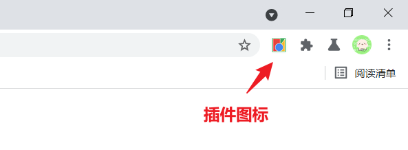

该交互控件是指在浏览器工具栏的扩展程序**图标**，供用户点击，可以执行预定的操作。它也可以作为唤起其他交互控件的入口，例如通过适当的配置，在悬停时可以显示**提示框 tooltip**，在点击时可以弹出**弹出框 popup**。

:bulb: 安装扩展程序后，Action 图标默认「隐藏」在浏览器工具栏的扩展程序（拼图）图标下，可以将它 pin 到工具栏上。

:bulb: 在 MV2 版本中有 [API `chrome.browserAction`](https://developer.chrome.com/docs/extensions/reference/browserAction/)（浏览器级别的按钮，对所有页面都可以响应）和 [API `chrome.pageAction`](https://developer.chrome.com/docs/extensions/reference/pageAction/)（针对特定匹配条件的页面才会响应）；而在 **MV3 版本**中新增了 [`chorme.action` API](https://developer.chrome.com/docs/extensions/reference/action/)，它的功能有点像是 MV2 的 Browser Action，可以在大部分的页面响应用户点击，如果希望实现类似于 Page Action 的功能**只在特定的页面响应点击**，可以参考[官方示例](https://developer.chrome.com/docs/extensions/reference/action/#emulating-pageactions-with-declarativecontent)，先使用 `chrome.action.disable()` 将 Action 图标设置为默认不响应点击，再使用方法 `new chrome.declarativeContent.PageStateMatcher()` 设置当 Page URL 匹配时才让 Action 图标响应点击。

* 如果要使用该控件，需要先在配置清单 `manifest.json` 的选项 `action` 中进行声明注册，例如指定图标文件的相对路径，如果使用了 popup 要指定弹出框的 HTML 文件。

  ```json
  {
    // ...
    "action": {
      // 图标文件
      "default_icon": {              // optional
        "16": "images/icon16.png",   // optional
        "24": "images/icon24.png",   // optional
        "32": "images/icon32.png"    // optional
      },
      // 提示框
      "default_title": "Click Me",   // optional, shown in tooltip
      // 弹出框
      "default_popup": "popup.html"  // optional
    },
  }
  ```

  :bulb: 即使扩展程序的配置清单中没有设置 `action` 选项，它也可以显示在浏览器工具栏上，会使用一个默认图标，一般以背景色为灰底且包含扩展程序的首字母的图标指代。

* 图标

  icon 图标的默认高和宽都是 16 DIPs（device-independent pixels），推荐预设多个尺寸的图标，浏览器会使用恰当的文件。图标文件的格式需要是 [Blink 渲染引擎](https://en.wikipedia.org/wiki/Blink_(browser_engine))所支持的，例如 PNG、JPEG、BMP、ICO 等，==而 SVG 是**不**支持的==。如果是解压的扩展程序，则只支持 PNG 格式。

  | 图标尺寸 |               用途               |
  | :------: | :------------------------------: |
  |  16x16   | 作为扩展程序的相关页面的 favicon |
  |  32x32   |   一般 Windows 系统使用该尺寸    |
  |  48x48   |     在扩展程序管理页面中显示     |
  | 128x128  |    在 Chrome  网上应用店显示     |
  
  除了在配置清单 `manifest.json` 的选项 `action.default_icon` 中提供固定的文件，还有通过编程的方式，使用方法 `chrome.action.setIcon()` 设置图标，可以根据条件设置不同的图片路径，也可以使用 canvas 创建图片。:warning: 该方法是用于设置静态图片，而不应该用于设置动图。

  ```js
  const canvas = new OffscreenCanvas(16, 16);
  const context = canvas.getContext('2d');
  context.clearRect(0, 0, 16, 16);
  context.fillStyle = '#00FF00';  // Green
  context.fillRect(0, 0, 16, 16);
  const imageData = context.getImageData(0, 0, 16, 16);
  chrome.action.setIcon({imageData: imageData}, () => { /* ... */ });
  ```

* 提示框

  tooltip 是在用户悬停在图标时显示的提示框，可以设置一段简短的文字，用以提示该扩展程序的名称。

  除了在配置清单 `manifest.json` 的选项 `action.default_title` 中设置文字，还可以使用方法 `chrome.action.setTitle()` 进行设置。

  ```js
  chrome.action.setTitle({title: 'this is tooltip content'})
  ```

  

  :bulb: 当图标按钮被聚焦时，它可以被**屏幕阅读软件**识别，可以增强扩展程序的可及性。

* 弹出框

  popup 是在用户点击 Action 图标时显示的弹出框，它实际上是一个[大小](https://developer.chrome.com/docs/extensions/reference/action/#popup)受到[限制](https://stackoverflow.com/questions/8983165/how-can-i-expand-the-popup-window-of-my-chrome-extension)（高和宽的最小值是 25px，高的最大值是 600px，宽的最大值是 800px）的 HTML 页面，默认大小是基于内容的。

  除了在配置清单 `manifest.json` 的选项 `action.default_popup` 中设置 popup 页面，还可以**使用方法 `chrome.action.setPopup()` 动态更新弹出框所指向的 HTML 文件的路径**。

  ```js
  chrome.storage.local.get('signed_in', (data) => {
    if (data.signed_in) {
      chrome.action.setPopup({popup: 'popup.html'});
    } else {
      chrome.action.setPopup({popup: 'popup_sign_in.html'});
    }
  });
  ```

  :bulb: 它和普通的 HTML 文档一样，可以引入样式文件和脚本文件，但**不**支持使用行内脚本 inline JavaScript

* 标记

  badge 是一个添加到图标上的文字，并允许设置背景色，一般用以显示扩展程序的状态，例如更新了新版本可以显示 `new`，如果扩展程序带统计功能则可以形式数值等。

  :bulb: 由于 badge 需要添加到图标上，所以在设置 badge 前，扩展程序需要先在配置清单 `manifest.json` 的选项 `action` 中设置图标

  :warning: 由于标记的空间有限，所以一般**只能显示 4 个或以下的字符**

  通过方法 `chrome.action.setBadgeText()` 设置标记文字；通过`chrome.action.setBadgeBackgroundColor()` 设置标记的背景色

  ```js
  // 设置 badge 文字内容
  chrome.action.setBadgeText({text: 'NEW'});
  
  // 通过多种方式设置 badge 背景颜色
  chrome.action.setBadgeBackgroundColor(
    {color: [0, 255, 0, 0]},  // Green
    () => { /* ... */ },
  );
  
  chrome.action.setBadgeBackgroundColor(
    {color: '#00FF00',  // Also green
    () => { /* ... */ },
  );
  
  chrome.action.setBadgeBackgroundColor(
    {color: 'green'},  // Also, also green
    () => { /* ... */ },
  );
  ```

* **action 在每一个标签页都可以有不同的状态**，例如可以针对不同的标签页，设置不同 badge 内容

  ```js
  function getTabId() { /* ... */}
  function getTabBadge() { /* ... */}
  
  chrome.action.setBadgeText(
    {
      text: getTabBadge(tabId),
      tabId: getTabId(),
    },
    () => { ... }
  );
  ```

  :bulb: 如果方法 `setBadgeText` 第一个参数的选项 `tabId` 省略了，则该标记会作为全局设置，而提供了 `tabId` 则针对特定的标签页，优先级更高，会覆盖全局设置的标记文字。

* 默认所有标签页下，action 图标都是**可以响应点击的 clickable**，可以通过方法 `chrome.action.enable()` 或 `chrome.action.disable()` 来手动控制 action 的响应状态，这会影响 popup 的显示或 `chrome.action.onClicked` 所监听的相应事件的分发。 

  

### Context Menu

参考：

* [`chrome.contextMenus` API](https://developer.chrome.com/docs/extensions/reference/contextMenus/)
* 关于 Context Menu [官方示例](https://github.com/GoogleChrome/chrome-extensions-samples/tree/main/apps/samples/context-menu)

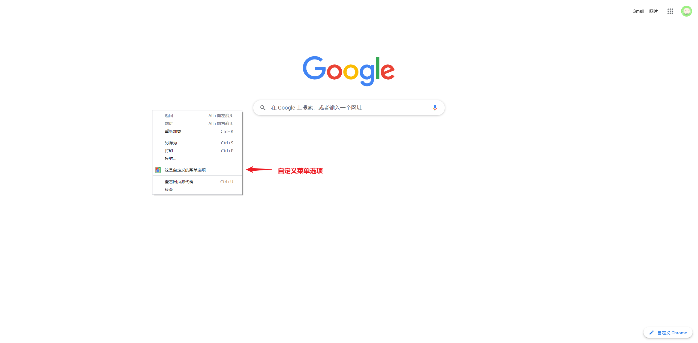

该交互控件是指浏览器的**右键菜单**，可以通过扩展程序往其中添加选项，除了可以针对整个页面，还可以针对特定的 DOM 元素，或 action 图标，添加右键菜单项。

* 如果要使用该控件，需要先在配置清单 `manifest.json` 的选项 `permissions` 中进行声明注册。为了便于将菜单选项与扩展程序相匹配，需要在配置清单的选项 `icons` 中指定图标文件，最好提供多种尺寸的图片文件。

  ```json
  {
    // ...
    "permissions": [
      "contextMenus"
    ],
    "icons": {
      "16": "icon-bitty.png",
      "48": "icon-small.png",
      "128": "icon-large.png"
    },
  }
  ```

* 使用方法 `chrome.contextMenus.create({}, callback())` 为扩展程序创建专属的菜单项，它可以接收两个入参，第一个参数是配置对象，第二个参数是回调函数。返回值该菜单选项的唯一 ID 值。

  配置对象有多个选项，常用如下：

  * `id` 为当前菜单选项分配一个唯一 ID
  * `title`（**必须**，除非该菜单选项的类型是分割线 `type: "separator"`）菜单选项的内容
  * `type` 菜单选项的类型，默认值是 `normal`，就是正常的菜单选项，还可以是 `checkbox`、`radio`、`separator`

  * `contexts` 数组，限制菜单选项出现在[对页面的哪个元素](https://developer.chrome.com/docs/extensions/reference/contextMenus/#type-ContextType)进行右键点击时，默认值是 `['page']`，即在整个网页任何地方右键点击时，该菜单选项都显示在菜单中
  * `parentId` 当前菜单选项的父级菜单的 ID
  * `onclick` 监听菜单选项的点击事件和事件处理函数，当菜单选项被点击时执行该事件处理函数，会有两个入参 `info`（该菜单选项的信息）和 `tab`（当前标签页的信息）传入

  （可选）回到函数是在用户右键点击，该菜单选项被创建时所执行的

  该方法应该在**后台脚本**中设置，并在安装扩展程序完成时的钩子函数 `chroe.runtime.onInstalled.addListener()` 中调用，以便安装完成时，右键菜单选项即可用

  ```js
  // background.js
  chrome.runtime.onInstalled.addListener(function() {
    chrome.contextMenus.create({
      id: key,
      title: 'context menu demo',
      type: 'normal',
      contexts: ['selection'],
    });
  });
  ```

* 使用方法 `chrome.contextMenus.update(menuItemId, {}, callback())` 更新给定菜单选项，第一个参数是菜单选项的唯一 ID 值，第二个参数是配置对象（和方法 `chrome.contextMenus.create()` 的配置对象可使用的选项一样），第三个（可选）参数是回调函数，在更新完菜单选项后执行。

:bulb: 浏览器的右键菜单是全局的，可以出现在任何页面中，甚至是 `file://` 或 `chrome://URLs` 的页面，如果希望控制菜单选项出现在指定的页面，你可以在创建 `create()` 或更新 `update()` 菜单选项时，通过配置对象的选项 `documentUrlPatterns` 来限制只能在[特定的 URL](https://developer.chrome.com/docs/extensions/mv3/match_patterns/) 页面或 `<iframe>` 中，右键点击才显示相应的菜单项。

* 使用方法 `chrome.contextMenus.remove(menuItemId, callback())` 动态删除已创建的菜单选项。（可选）回调函数在删除指定的菜单选项后执行。如果想删除所有该扩展程序创建的菜单选项，可以使用方法 `chrome.contextMenus.removeAll(callback())` 其（可选）回调函数会在删除菜单选项后执行。

* 可以创建多个菜单选项，但是如果选项多于一个，浏览器会自动将它们收纳到一个**次级菜单**中

* 使用方法 `chrome.contextMenus.onClicked(callback())` 监听该扩展程序菜单选项的点击事件，并执行相应的事件处理函数，该函数接收两个入参 `info` 被点击的菜单选项的相关信息，`tab` 标签页相关信息。


### Omnibox

参考：

* [`chrome.omnibox` API](https://developer.chrome.com/docs/extensions/reference/omnibox/)
* 关于 Omnibox 的[官方示例](https://github.com/GoogleChrome/chrome-extensions-samples/tree/main/api/omnibox/new-tab-search)

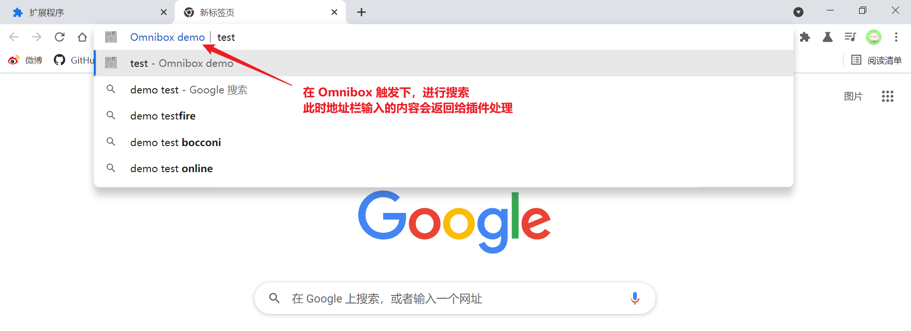

该交互控件是指地址栏上的**搜索关键词**，当用户在地址栏输入相应的关键词，就会触发 Omnibox（唤起相应的扩展程序），接下来用户在地址栏中输入内容是直接与该扩展程序进行交互。一般会在扩展程序中预先设置一系列的搜索建议，当用户输入的内容模糊匹配成功时，就会在一个 dropdown 中显示相应的搜索建议。

* 如果要使用该控件，需要先在配置清单 `manifest.json` 的选项 `omnibox` 中进行声明注册。当 Omnibox 被触发时，扩展程序图标（以灰阶的形式展示）和名称会显示在地址栏的左侧，为了便于识别，需要在配置清单的选项 `icons` 中指定图标文件，最好提供多种尺寸的图片文件（默认使用高和宽为 16px 的图标）。

  该控件的交互逻辑在**后台脚本**的 service worker 中设置（需要在配置清单 `manifest.json` 的选项 `background.service_worker` 中声明注册），基于事件监听-响应的原理。

  ```json
  {
    // ...
    "background": {
      "service_worker": "background.js"
    },
    "omnibox": { "keyword" : "demo" },
    "icons": {
      "16": "icon-bitty.png",
      "48": "icon-small.png",
      "128": "icon-large.png"
    },
  }
  ```

  以上示例将扩展程序的 Omnibox 触发关键词设定为 `demo`，当用户在地址栏输入 demo 时，会在下拉框显示一个扩展程序名称的选项，可以点击该选项，或按 Tab 键，或键入空格 Space，即可触发 Omnibox。

  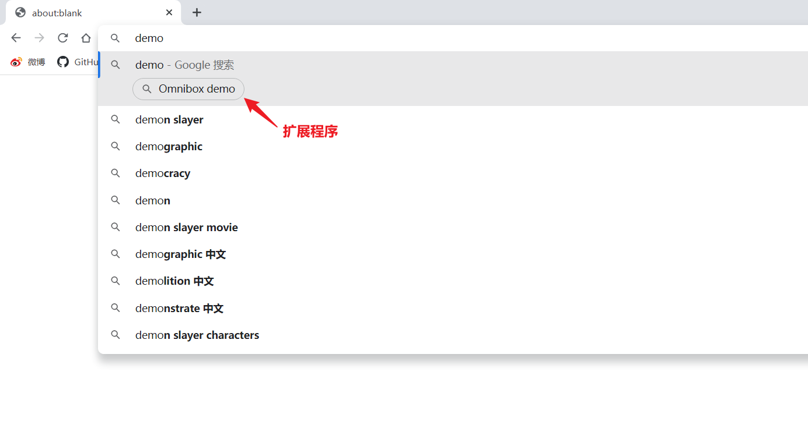

* 常用于监听事件的 API 如下：

  * `onInputChanged` 进入 Omnibox 模式后，当用户在地址栏中输入内容时会触发。

    ```js
    chrome.omnibox.onInputChanged.addListener((text, suggest) => {
      if(!text) return;
      suggest([
          {
              content: text,
              description: `search for ${text}`
          }
      ])
    });
    ```

    事件处理函数中接收两个入参，第一个参数 `text` 是用户输入的内容（字符串），第二个参数 `suggest` 是一个方法，它接收一个数组，包含一系列的建议结果 SuggestResult，该方法会将这些建议选项传递回浏览器，显示在地址栏的下拉框中。

    :bulb: 建议结果 SuggestResult 是一个对象，以供用户选择，包括以下属性：

    * `content` 实际上会输入到地址栏的内容，当用户选中该建议选项时，会传递给扩展程序的内容
    * `deletable` 该建议选项是否可以让用户删除
    * `description` 描述内容，显示在地址栏的下拉框中，可以包含 XML 风格的样式修饰。但是不能包含 5 种 [XML 转义字符](https://stackoverflow.com/questions/1091945/what-characters-do-i-need-to-escape-in-xml-documents/1091953#1091953)。

    :bulb: 可以使用方法 `chrome.omnibox.setDefaultSuggestion(suggestion)` 设置默认的建议选项，该方法接收的入参是一个不完整 suggestionResult 对象，**没有 `content` 属性**，其作用类似于输入框中的 placeholder。当触发了 Omnibox 时，在用户还没输入内容时，该默认建议就会出现在地址栏的下拉框中第一条的位置。

    ==:warning: 根据一个 [Bug 报告](https://bugs.chromium.org/p/chromium/issues/detail?id=1186804)，由于 Omnibox 的搜索建议内容支持 XML，所以需要调用 DomParser，但是后台脚本在 MV3 版本迁移改用了 service worker，该运行环境并没有 DomParser，所以会导致报错，且无法正常显示搜索建议选项。==
  
  * `onInputEntered` 在用户选择执行一个建议选项后，触发回调函数。
  
    ```js
    chrome.omnibox.onInputEntered.addListener((text, disposition) => {
      if(!text) return;
      console.log('inputEntered: ' + text);
      // Encode user input for special characters , / ? : @ & = + $ #
      var newURL = 'https://www.google.com/search?q=' + encodeURIComponent(text);
      chrome.tabs.create({ url: newURL });
      console.log(disposition)
    });
    ```

    事件处理函数接收两个参数，第一个参数 `text` 是输入到地址栏的内容，第二个参数 `disposition` 是进行搜寻时窗口的设置，有三种可能的结果：

    * `currentTab` 在当前标签页进行搜寻

    * `newForegroundTab` 新建一个标签页进行搜寻，同时切换到该标签页
  
    * `newBackgroundTab` 新建一个标签页进行搜寻，但不进行标签页的切换
  
    以上示例调用了 `chrome.tabs.create()` 方法，在当前标签页进行搜索，所以终端打印的值是 `currentTab`


### Override Pages

参考：

* [Overriding Chrome pages](https://developer.chrome.com/docs/extensions/mv3/override/)
* 关于 Override Pages 的官方示例
  * [historyOverride](https://github.com/GoogleChrome/chrome-extensions-samples/tree/main/mv2-archive/api/history/historyOverride)（MV2 版本）
  * [blank_ntp](https://github.com/GoogleChrome/chrome-extensions-samples/tree/main/mv2-archive/api/override/blank_ntp)（MV2 版本）
  * [override_igoogle](https://github.com/GoogleChrome/chrome-extensions-samples/tree/main/mv2-archive/api/override/override_igoogle)（MV2 版本）

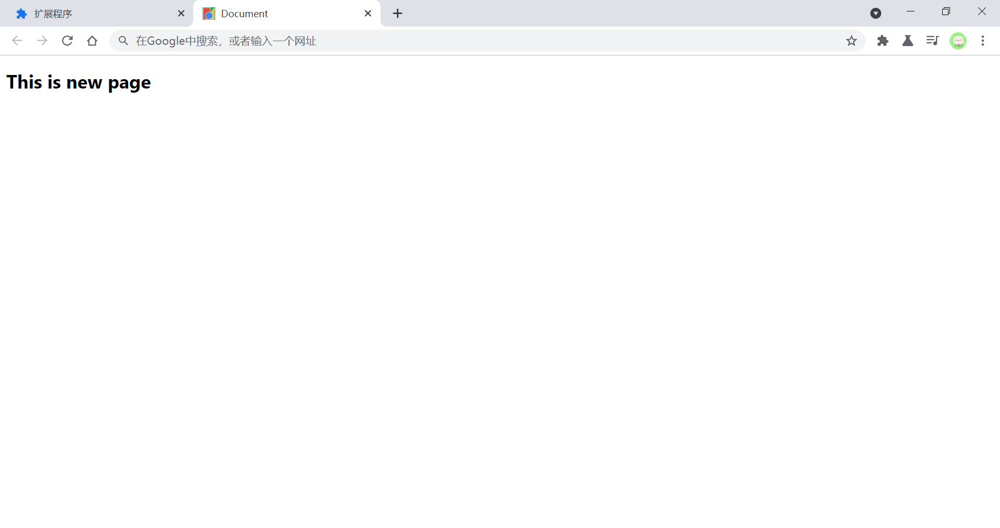

该交互控件是通过**覆写页面**实现的，扩展程序可以覆写三个 Chrome 的特殊页面：

* Bookmark Manager：书签管理页面 `chrome://bookmarks`
* History：历史记录页面 `chrome://history`
* New Tab：新建标签页 `chrome://newtab`

:bulb: 每一个扩展程序**只能覆写以上三个特殊 Chrome 页面之**，而每一种特殊 Chrome 页面，只能选择被一个扩展程序进行覆写。此外隐身模式下，新建标签页不能被覆写。

* 如果要使用该控件，需要先在配置清单 `manifest.json` 的选项 `chrome_url_overrides` 中进行声明注册，将需要覆写的页面作为属性，`bookmarks`、`history`、`newtab` 三者之一，属性值就是用以替换的 HTML 页面文档的相对路径。

  ```json
  {
    // ...
    "chrome_url_overrides" : {
      "newTab": "newPage.html"
    },
    ...
  }
  ```

* 为了提供更好的用户体验，用以替换的页面应该遵循以下指引：

  * 页面文件大小应该较小，便于快速加载显示，避免使用同步访问网络或数据库资源，导致渲染阻塞。
  * 包含明确的信息，告知用户当前浏览的是 Chrome 的特殊页面。
  * 不要在新建标签页使用输入框聚焦功能，因为新建页面时，标签页的地址栏会首先获取焦点。

:bulb: 用以替换的页面可以引入样式文件或脚本文件，但**不**支持行内脚本 inline JavaScript


### Commands

参考：

* [`chrome.commands` API](https://developer.chrome.com/docs/extensions/reference/commands/)

* 关于 Commands 的[官方示例](https://developer.chrome.com/docs/extensions/reference/commands/#examples)

该交互控件是指使用**快捷键**操作扩展程序，可以通过快捷键激活 action 或执行特定的命令。

:bulb: 所有扩展程序的快捷键都在 `chrome://extensions/shortcuts` 中显示，**用户可以在其中修改快捷键的组合值，或快捷键的局部与全局适用性**。

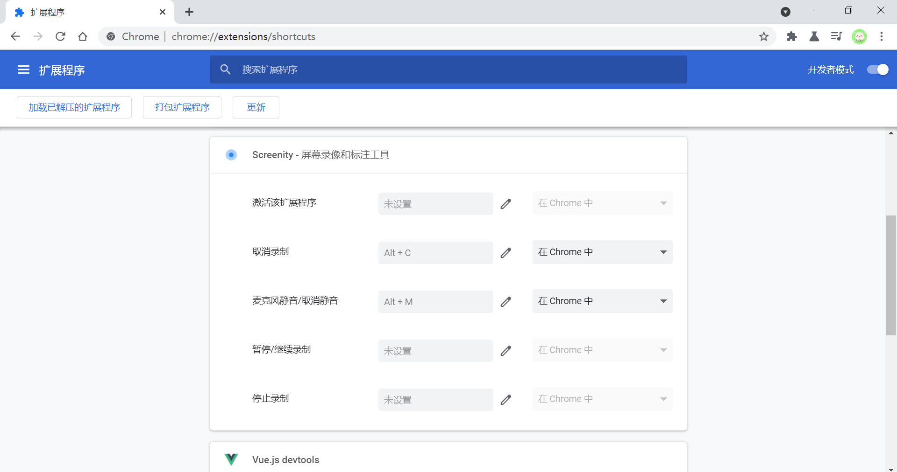

* 如果要使用该控件，需要先将这些快捷键在配置清单 `manifest.json` 的选项 `commands` 中进行声明注册，该选项的值是一个对象，属性名是一个描述命令的名称，属性值是关于快捷键定义的对象，一般有两个选项：

  * `suggested_key`（可选）声明默认的快捷键，其值可以是一个表示（跨平台适用的）快捷键的字符串，或是一个对象，可以**针对不同的系统平台**设定不同的快捷键，其中系统平台支持 `default`、`chromeos`、`linus`、`mac`、`windows`。如果该选项**省略**，则该命令没有相应的触发快捷键，**等待用户来设定后再生效**。
  * `description` 一段告知用户该快捷键功能作用的字符串，它会显示在扩展程序的快捷键管理界面中 `chrome://extensions/shortcuts`，对于标准快捷键 standard commands 它是必须的，对于 action commands 是可选的。

  ```json
  {
    // ...
    "commands": {
      "run-foo": {
        "suggested_key": {
          "default": "Ctrl+Shift+Y",
          "mac": "Command+Shift+Y"
        },
        "description": "Run \"foo\" on the current page."
      },
      "_execute_action": {
        "suggested_key": {
          "windows": "Ctrl+Shift+Y",
          "mac": "Command+Shift+Y",
          "chromeos": "Ctrl+Shift+U",
          "linux": "Ctrl+Shift+J"
        }
      },
    },
  }
  ```

  :bulb: 其中 `_execute_action` 是保留属性，用以定义**激活 action 的快捷键**（对于 MV2 版本，则有 `_execute_browser_action` 和 `_execute_page_action` 保留属性，分别设定激活 browser action 和 page action 的快捷键），对于激活 action 的快捷键*无法**触*发 `command.onCommand` 事件。

  然后在**后台脚本**中使用 `chrome.commands.onCommand.addListener()` API 监听快捷键命令触发事件

  ```json
  {
    "name": "Tab Flipper",
    // ...
    "commands": {
      "flip-tabs-forward": {
        "suggested_key": {
          "default": "Ctrl+Shift+Right",
          "mac": "Command+Shift+Right"
        },
        "description": "Flip tabs forward"
      },
      "flip-tabs-backwards": {
        "suggested_key": {
          "default": "Ctrl+Shift+Left",
          "mac": "Command+Shift+Left"
        },
        "description": "Flip tabs backwards"
      }
    }
    // ...
  }
  ```

  ```js
  chrome.commands.onCommand.addListener(command => {
    // 如果用户触发了扩展程序注册的快捷键，则传入的参数 command 是命令的名称
    // command will be "flip-tabs-forward" or "flip-tabs-backwards"
  
    chrome.tabs.query({currentWindow: true}, tabs => {
      // Sort tabs according to their index in the window.
      tabs.sort((a, b) => a.index - b.index);
      const activeIndex = tabs.findIndex((tab) => tab.active);
      const lastTab = tabs.length - 1;
      let newIndex = -1;
      if (command === 'flip-tabs-forward') {
        newIndex = activeIndex === 0 ? lastTab : activeIndex - 1;
      } else {  // 'flip-tabs-backwards'
        newIndex = activeIndex === lastTab ? 0 : activeIndex + 1;
      }
      chrome.tabs.update(tabs[newIndex].id, {active: true, highlighted: true});
    });
  });
  ```

  :bulb: 当新安装的扩展程序的快捷键默认值，与已安装的其他扩展程序的快捷键冲突时，对于后来安装的扩展程序，浏览器就不会再注册这些快捷键，避免覆盖之前已存在的快捷键。为了避免让用户觉得快捷键「无故失灵」的现象，我们应该采用以下更健壮的方法，在安装扩展程序时 `chrome.runtime.onInstalled.addListener` 先进行检查快捷键冲突，并告知用户

  ```js
  // background.js
  
  // Only use this function during the initial install phase. After
  // installation the user may have intentionally unassigned commands.
  chrome.runtime.onInstalled.addListener((reason) => {
    if (reason === chrome.runtime.OnInstalledReason.INSTALL) {
      checkCommandShortcuts();
    }
  });
  
  function checkCommandShortcuts() {
    // 获取当前插件已注册的快捷键
    chrome.commands.getAll((commands) => {
      let missingShortcuts = [];
  
      for (let {name, shortcut} of commands) {
        // 如果冲突无法注册快捷键默认值，则 shortcut 值为空字符串
        if (shortcut === '') {
          missingShortcuts.push(name);
        }
      }
      
      // 如果该扩展程序与其他扩展程序真的存在快捷键冲突
      if (missingShortcuts.length > 0) {
        // Update the extension UI to inform the user that one or more
        // commands are currently unassigned.
      }
    });
  }
  ```

* 快捷键**必须包含 `Ctrl` 或 `Alt` 两者之一**，对**大小写敏感**，支持使用以下按键组合为快捷键：

  * 字母键 `A-Z` 
  * 数字键 `0~9`
  * 标准的功能键
    * 通用键 `Comma`, `Period`, `Home`, `End`, `PageUp`, `PageDown`, `Space`, `Insert`, `Delete`
    * 方向键 `Up`, `Down`, `Left`, `Right`
  * 修饰键 `Ctrl`, `Alt`, `Shift`, `MacCtrl` (macOS only), `Command` (macOS only), `Search` (Chrome OS only)

  :bulb: 不支持 `Tab` 键，媒体键**不**能与修饰键组合。

* 为了响应快捷键，需要在**后台脚本**中使用 `chrome.commands.onCommand.addListener` API 进行监听

  ```js
  chrome.commands.onCommand.addListener((command) => {
    console.log(`Command: ${command}`);
  });
  ```

  :bulb: 和标准的快捷键 standard commands 不同，对于激活 action 的快捷键，**无法**通过以上方法进行监听。可以在弹出框 popup 的脚本文件中，监听 [`DOMContentLoaded` 事件](https://developer.mozilla.org/en-US/docs/Web/API/Window/DOMContentLoaded_event)来替代。

* 默认情况下，注册的快捷键是 Chrome 浏览器的局部快捷键（当浏览器是当前系统的激活应用时，按下快捷键，扩展程序才响应），也可以在快捷键定义对象中，通过选项 `global: true` 设定为全局快捷键。**建议注册全局快捷键限制在 `Ctrl+Shift+[0..9]` 范围中**，以避免覆盖掉其他系统级别的快捷键。

  ```json
  {
    // ...
    "commands": {
      "toggle-feature-foo": {
        "suggested_key": {
          "default": "Ctrl+Shift+5"
        },
        "description": "Toggle feature foo",
        "global": true
      }
    },
  }
  ```

  :bulb: 但是 Chrome OS 不支持扩展程序设定全局快捷键


## 定制浏览器体验

扩展程序可以使用很多相关的 API 以定制浏览器体验：

* [Bookmarks](https://developer.chrome.com/docs/extensions/reference/bookmarks/) 书签管理
* [Browsing Data](https://developer.chrome.com/docs/extensions/reference/browsingData/) 用户浏览数据
* [Downloads](https://developer.chrome.com/docs/extensions/reference/downloads/) 下载项管理
* [Font Settings](https://developer.chrome.com/docs/extensions/reference/fontSettings/) 字体设置
* [History](https://developer.chrome.com/docs/extensions/reference/history/) 浏览历史记录
* [Privacy](https://developer.chrome.com/docs/extensions/reference/privacy/) 隐私权限设置
* [Proxy](https://developer.chrome.com/docs/extensions/reference/proxy/) 代理设置
* [Sessions](https://developer.chrome.com/docs/extensions/reference/sessions/) 从浏览会话中查询和恢复标签页或窗口
* [Tabs](https://developer.chrome.com/docs/extensions/reference/tabs/) 创建、修改、重排标签页
* [Top Sites](https://developer.chrome.com/docs/extensions/reference/topSites/) 访问用户最常浏览的网页
* [Themes](https://developer.chrome.com/docs/extensions/mv3/themes/) 改变浏览器外观与主题
* [Windows](https://developer.chrome.com/docs/extensions/reference/windows/) 创建、修改、重排浏览器窗口

### Bookmarks

参考：

* [`Chrome.bookmarks` API](https://developer.chrome.com/docs/extensions/reference/bookmarks/)
* 关于 Bookmarks 的[官方示例](https://github.com/GoogleChrome/chrome-extensions-samples/tree/main/api/action)
  * [bookmarks basic](https://github.com/GoogleChrome/chrome-extensions-samples/tree/main/mv2-archive/api/bookmarks/basic)（MV2 版本）
  * [bookmarks](https://github.com/GoogleChrome/chrome-extensions-samples/tree/main/examples/bookmarks)

可以使用扩展程序定制浏览器的书签管理行为。除了可以使用[覆写页面  Override Page](https://developer.chrome.com/docs/extensions/mv3/override/) 的方式**定制书签管理页面**，还可以使用 `Chrome.bookmarks` 一些列 API 操作书签。

如果要使用 `Chrome.bookmarks` API，需要先在配置清单 `manifest.json` 的选项 `permissions` 中进行权限声明注册

```json
{
  // ...
  "permissions": ["bookmarks"]
}
```

书签数据是以**树形**结构组织的，每一个[节点对象 `bookmarks.BookmarkTreeNode`](https://developer.chrome.com/docs/extensions/reference/bookmarks/#type-BookmarkTreeNode) 是一个书签或一个文件夹（也称为组），它具有多种[属性](https://developer.chrome.com/docs/extensions/reference/bookmarks/#type-BookmarkTreeNode)，以下列出常用的几个：

* `children` 子节点列表
* `id` （必须）唯一标识符
* `index` 在父级文件夹中的索引（从 `0` 开始）
* `parentId` 父级文件夹的唯一标识符（**根节点**省略该属性）
* `title` （必须）节点所展示的名称
* `url` 书签的链接，文件夹可以省略该属性

:warning: 根节点是一个文件夹，不能删除，且只能有一个。 而且不能重命名特殊的节点（文件夹）:file_folder: 书签栏 `Bookmarks Bar` 和 :file_folder: 其他书签 `Other Bookmarks`

使用方法 `chrome.bookmarks.create()` 创建一个书签节点，接收两个入参，第一个是节点的属性，第二个（可选）参数是回调函数

```js
// 创建一个文件夹，名为 Extension bookmarks
chrome.bookmarks.create(
  {'parentId': bookmarkBar.id, 'title': 'Extension bookmarks'},
  function(newFolder) {
    console.log("added folder: " + newFolder.title);
  },
);

// 创建一个书签，名为 Extensions doc，链接为 https://developer.chrome.com/docs/extensions
chrome.bookmarks.create({
  'parentId': extensionsFolderId,
  'title': 'Extensions doc',
  'url': 'https://developer.chrome.com/docs/extensions',
});
```

### Browsing Data

参考：

* [`chrome.browsingData` API](https://developer.chrome.com/docs/extensions/reference/browsingData/)
* 关于 Browsing Data 的[官方示例](https://github.com/GoogleChrome/chrome-extensions-samples/tree/main/mv2-archive/api/browsingData/basic)（MV2 版本）

扩展程序可以删除特定时间段的用户浏览数据。

如果要使用 `Chrome.bookmarks` API，需要先在配置清单 `manifest.json` 的选项 `permissions` 中进行权限声明注册

```json
{
  // ...
  "permissions": ["browsingData"]
}
```

使用方法 `chrome.browsingData.remove()` 删除用户浏览数据。

```js
// 删除一周以来的数据
const millisecondsPerWeek = 1000 * 60 * 60 * 24 * 7;
const oneWeekAgo = (new Date()).getTime() - millisecondsPerWeek;

// 删除所有用户操作数据
chrome.browsingData.removeCookies({
  "since": oneWeekAgo
}, callback;

const callback = function () {
  // Do something clever here once data has been removed.
};
```

:bulb: 删除用户数据可能需要较长的时间（基于用户产生了多少操作历史数据），因此推荐设置回调函数（它在清除完成后执行），以告知用户最新的状态。

:warning: 方法 `chrome.browsingData.remove()` 可能在清除完 cookie 后自动设置它们，以便让账户的数据同步功能正常运作，这样才可以让服务器中已同步的相应数据也覆盖清除掉；而使用[方法 `chrome.browsingData.removeCookies`](https://developer.chrome.com/docs/extensions/reference/browsingData/#method-removeCookies) 清除 cookie 时，会停止同步功能。

:bulb: 可以传递一个 JSON 形式的对象，指定需要删除哪几种浏览器数据，也可以调用[对应的方法](https://developer.chrome.com/docs/extensions/reference/browsingData/#methods)来删除相应类型的用户数据。

```js
// 删除指定的用户操作数据
chrome.browsingData.remove({
  "since": oneWeekAgo
}, {
  "appcache": true,
  "cache": true,
  "cacheStorage": true,
  "cookies": true,
  "downloads": true,
  "fileSystems": true,
  "formData": true,
  "history": true,
  "indexedDB": true,
  "localStorage": true,
  "passwords": true,
  "serviceWorkers": true,
  "webSQL": true
}, callback);
```

:bulb: 还可以删除在指定网页（或不包含指定网页）下的用户数据（适用于cookies、cache、storage (CacheStorage, FileSystems, IndexedDB, LocalStorage, ServiceWorkers, and WebSQL) 类型的数据），可以在方法 `chrome.browsingData.remove()` 的第一个参数中设置选项 `origins` 或 `excludeOrigins`

```js
chrome.browsingData.remove({
  "origins": ["https://www.example.com"]
}, {
  "cacheStorage": true,
  "cookies": true,
  "fileSystems": true,
  "indexedDB": true,
  "localStorage": true,
  "serviceWorkers": true,
  "webSQL": true
}, callback);
```

由于 cookies 是基于域名的，所以删除特定网页的 cookies 时会删除该域名下的所有 cookies，例如删除 `https://www.example.com` 会删除 `.example.com` 域名下所有的 cookie。

### Downloads

参考：

* [`chrome.downloads` API](https://developer.chrome.com/docs/extensions/reference/downloads/)
* 关于 Downloads 的[官方示例](https://github.com/GoogleChrome/chrome-extensions-samples/tree/main/mv2-archive/api/downloads)（MV2 版本）

扩展程序可以对浏览器中的下载功能进行操作，通过 `chrome.downloads` API 可以启动、监控、操作和搜索下载项。

如果要使用 `Chrome.downloads` API，需要先在配置清单 `manifest.json` 的选项 `permissions` 中进行权限声明注册

```json
{
  // ...
  "permissions": ["downloads"]
}
```

### History

参考：

* [`chrome.history` API](https://developer.chrome.com/docs/extensions/reference/history/)
* 关于 History 的[官方示例](https://github.com/GoogleChrome/chrome-extensions-samples/tree/main/mv2-archive/api/history)（MV2 版本）

扩展程序可以操作浏览器的历史记录。除了可以使用[覆写页面  Override Page](https://developer.chrome.com/docs/extensions/mv3/override/) 的方式**定制历史记录页面**，还可以使用 `Chrome.history` 一些列 API 操作历史记录。

如果要使用 `Chrome.history` API，需要先在配置清单 `manifest.json` 的选项 `permissions` 中进行权限声明注册

```json
{
  // ...
  "permissions": ["history"]
}
```

:bulb: 浏览的历史记录是通过[不同类型的页面跳转 transition type](https://developer.chrome.com/docs/extensions/reference/history/#transition-types) 所产生的，例如用户从一个网页中点击一个链接跳转到另一个网页，这时候产生的历史记录的类型是 `link`。

### Tabs

参考：

* [`chrome.tabs` API](https://developer.chrome.com/docs/extensions/reference/tabs/)
* 关于 Tabs 的[官方示例](https://github.com/GoogleChrome/chrome-extensions-samples/tree/main/mv2-archive/api/downloads)（MV2 版本）

扩展程序可以创建、修改、重排标签页。

虽然使用 `Chrome.tabs` 部分的 API 可以不进行权限声明，但是仍**推荐**在配置清单 `manifest.json` 的选项 `permissions` 中进行权限声明注册，因为需要访问标签的属性 `url`、`pendingUrl`、`title`、`favIconUrl` 时是需要权限许可的。

```json
{
  // ...
  "permissions": ["tabs"]
}
```

以下是一些常见的应用场景：

* 使用方法 `chrome.tabs.create()` 在新的标签页打开一个网页

  ```js
  // background.js
  // 可以在安装成功后，打开扩展程序的介绍页面
  chrome.runtime.onInstalled.addListener((reason) => {
    if (reason === chrome.runtime.OnInstalledReason.INSTALL) {
      chrome.tabs.create({
        url: 'onboarding.html'
      });
    }
  });
  ```

  :warning: 内容脚本 content scripts **不**能使用方法 `chrome.tabs.create()`

* 使用方法 `chrome.tabs.query({ active: true, currentWindow: true })` 获取符合条件的标签页

  ```js
  // background.js
  async function getCurrentTab() {
    let queryOptions = { active: true, currentWindow: true };
    // 查询返回的是符合条件的标签页对象列表，当前页面只有一个，可以直接用解构来获取
    let [tab] = await chrome.tabs.query(queryOptions);
    return tab;
  }
  ```

  :warning: 内容脚本 content scripts **不**能使用方法 `chrome.tabs.query()`

* 使用方法 `chrome.tabs.update()` 更新标签页面的状态

  ```js
  // background.js
  function toggleMuteState(tabId) {
    chrome.tabs.get(tabId, async (tab) => {
      // 获取标签页的静音状态，并进行切换
      let muted = !tab.mutedInfo.muted;
      // 更新标签页的静音状态
      await chrome.tabs.update(tabId, { muted });
      console.log(`Tab ${tab.id} is ${ muted ? 'muted' : 'unmuted' }`);
    });
  }
  ```

  :warning: 内容脚本 content scripts **不**能使用方法 `chrome.tabs.get()` 和 `chrome.tabs.update()`

* 使用方法 `chrome.tabs.move()` 重排标签页

  ```js
  // background.js
  // 监听标签页激活事件（点击浏览器最顶部一栏进行标签页切换时触发）
  chrome.tabs.onActivated.addListener(activeInfo => move(activeInfo));
  
  // 将激活的标签页移到第一的位置
  async function move(activeInfo) {
    try {
      await chrome.tabs.move(activeInfo.tabId, {index: 0});
      console.log('Success.');
    } catch (error) {
      // 如果用户在拖拽标签页时
      if (error == 'Error: Tabs cannot be edited right now (user may be dragging a tab).') {
        setTimeout(() => move(activeInfo), 50);
      }
    }
  }
  ```

### Windows

参考：

* [`chrome.windows` API](https://developer.chrome.com/docs/extensions/reference/windows/)
* 关于 Windows 的官方示例
  * [merge_windows](https://github.com/GoogleChrome/chrome-extensions-samples/tree/main/mv2-archive/api/windows/merge_windows)（MV2 版本）
  * [inspector](https://github.com/GoogleChrome/chrome-extensions-samples/tree/main/mv2-archive/api/tabs/inspector)（MV2 版本）

扩展程序可以创建、修改、重排浏览器窗口。

由于使用 `Chrome.windows` API 时，会获取标签页的相关信息 ，所以需要先在配置清单 `manifest.json` 的选项 `permissions` 中进行 `tabs` 的权限声明。

```json
{
  // ...
  "permissions": ["tabs"],
}
```

:bulb: 当前窗口是指目前扩展程序执行代码所在的窗口，而不一定是浏览器的置顶窗口或当前聚焦窗口，例如扩展程序在一个窗口中打开了一个 HTML 文档，在文档中调用了 `chrome.tabs.query()` 方法，则**当前窗口**是指该 HTML 文档所在的窗口。有些情况下对于后台脚本没有相应的当前窗口。


## 定制网页体验

扩展程序可以使用很多相关的 API 以定制网页的体验：

* [Active Tab](https://developer.chrome.com/docs/extensions/mv3/manifest/activeTab/) 可以直接访问当前的激活标签页，而不需要先为特定的域名设置权限 `host_permission`（或使用 `<all_urls>` 为所有域名设置权限）
* [Content Settings](https://developer.chrome.com/docs/extensions/reference/contentSettings/) 设置网页可以运行的功能，例如 cookies、JavaScript、plugins、camera 等许可设置 :bulb:[官方示例](https://github.com/GoogleChrome/chrome-extensions-samples/tree/c2437ba5364f92e8f0276f9213fdbe7ff0f4fb64/mv2-archive/api/contentSettings)（MV2 版本）
* [Content Scripts](https://developer.chrome.com/docs/extensions/mv3/content_scripts/) 内容脚本，植入到网页中运行的脚本
* [Cookies](https://developer.chrome.com/docs/extensions/reference/cookies/) 获取或修改相应域名下的 cookie :bulb: [官方示例](https://github.com/GoogleChrome/chrome-extensions-samples/tree/main/mv2-archive/api/cookies)（MV2 版本） 
* [Cross-Origin XHR](https://developer.chrome.com/docs/extensions/mv3/xhr/) 向远程服务器发送和接收数据
* [Desktop Capture](https://developer.chrome.com/docs/extensions/reference/desktopCapture/) 捕获屏幕、单个窗口或标签页的内容
* [Page Capture](https://developer.chrome.com/docs/extensions/reference/pageCapture/) 将标签页的源信息保存为 MHTML
* [Tab Capture](https://developer.chrome.com/docs/extensions/reference/tabCapture/) 与标签页的媒体流进行交互
* [Web Navigation](https://developer.chrome.com/docs/extensions/reference/webNavigation/) 实时更新导航请求的状态 :bulb: [官方示例](https://github.com/GoogleChrome/chrome-extensions-samples/tree/main/mv2-archive/api/webNavigation)（MV2 版本） 
* [Declarative Net Request](https://developer.chrome.com/docs/extensions/reference/declarativeNetRequest/) 声明规则让 Chrome 实时拦截、阻止或修改网络请求 :bulb: [官方示例](https://developer.chrome.com/docs/extensions/reference/declarativeNetRequest/#example)

### Active Tab

参考：

* [The activeTab permission](https://developer.chrome.com/docs/extensions/mv3/manifest/activeTab/)
* 关于 Windows 的[官方示例](https://github.com/GoogleChrome/chrome-extensions-samples/tree/main/examples/page-redder)

在配置清单 `manifest.json` 的选项 `permissions` 中声明 `activeTab` 权限，可以**临时获取许可，以访问当前激活的标签页**，并在当前页面使用 [tabs 相关的 API](https://developer.chrome.com/docs/extensions/reference/tabs/)。

```json
{
  // ...
  "permissions": ["activeTab"]
}
```

由于扩展程序的很多使用场景都只需临时访问当前激活的标签页，而不是针对特定的网页，所以与基于 URL 规则获取的永久访问权限相比，该类型的权限更常用。该权限基于用户的主动请求临时获取的（例如通过点击 Action 控件），而且仅限制在当前激活页面，相对而言更安全。

支持多种用户交互方式激活 `activeTab` 权限，以与当前标签页进行交互：

* 通过 [Action](#Action)

  ```js
  // 点击浏览器工具栏上的扩展程序图标
  chrome.action.onClicked.addListener((tab) => {
    // 获取当前激活的标签页对象
    // 并植入内容脚本
    chrome.scripting.executeScript({
      target: { tabId: tab.id },
      function: reddenPage
    });
  });
  
  // 将网页背景色变为绿色
  function reddenPage() {
    document.body.style.backgroundColor = 'green';
  }
  ```

* 通过 [Context Menu](https://developer.chrome.com/docs/extensions/reference/contextMenus/)

* 通过 [Commands](#Commands)

* 通过 [Omnibox](#Omnibox)

:bulb: 当前标签页获取权限后，当后续的导航在同源 origin 中进行则权限还生效，例如当前页面的 URL 从 `https://example.com` 切换到 `https://example.com/foo`；如果导航到其他源 origin，或关闭当前页面后，权限就需要重新获取。

:bulb: 该权限一般用以替代在配置清单 `manifest.json` 的选项 `host_permissions` 中声明的 `<all_urls>` 权限，达到访问（任意 url）当前页面的效果，而且**不会在安装扩展程序时弹出警告**。

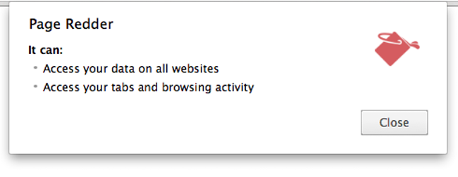

*without activeTab*

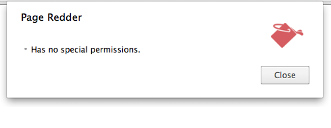

*with activeTab*

### Content Scripts

参考：

* [Content scripts](https://developer.chrome.com/docs/extensions/mv3/content_scripts/)
* 关于 Windows 的[官方示例](https://github.com/GoogleChrome/chrome-extensions-samples/tree/main/examples/page-redder)

#### 可使用的 API

内容脚本 content script 是运行在页面中的 JavaScript 代码，它除了可以访问页面的 DOM 对象，还可以以通过信息传递 message passing 的方式与扩展程序进行通讯，可以将它看作是页面与扩展程序之间的桥梁角色。

除了借助扩展程序（通过 message passing 的方式）间接调用 Chrome 提供的 API，它还可以**直接访问**部分 API：

- [`chrome.i18n` API](https://developer.chrome.com/docs/extensions/reference/i18n/)
- [`chrome.storage` API](https://developer.chrome.com/docs/extensions/reference/storage/)
- runtime API
  - [`chrome.runtime.connect()`](https://developer.chrome.com/docs/extensions/reference/runtime#method-connect) 发起（与指定的扩展程序间）建立长连接的信息通道的请求；而如果是从扩展程序发起长连接请求，则使用[方法 `chrome.tabs.connect()`](https://developer.chrome.com/docs/extensions/reference/tabs/#method-connect)。
  - [`chrome.runtime.getManifest()`](https://developer.chrome.com/docs/extensions/reference/runtime#method-getManifest) 返回一个扩展程序的配置清单对象
  - [`chrome.runtime.getURL(relatviePath)`](https://developer.chrome.com/docs/extensions/reference/runtime#method-getURL) 将相对于扩展程序的路径转换为绝对路径（基于扩展程序的安装信息）
  - [`id`](https://developer.chrome.com/docs/extensions/reference/runtime#property-id) 扩展程序的唯一标识符
  - [`chrome.runtime.onConnect`](https://developer.chrome.com/docs/extensions/reference/runtime#event-onConnect) 监听并响应扩展程序发起长连接的请求
  - [`chrome.runtime.onMessage`](https://developer.chrome.com/docs/extensions/reference/runtime#event-onMessage) 监听单次请求信息
  - [`chrome.runtime.sendMessage`](https://developer.chrome.com/docs/extensions/reference/runtime#method-sendMessage) 传递单次请求信息

例如可以将扩展程序的静态资源展示在网页上

```js
// Code for displaying <extensionDir>/images/myimage.png

// 访问扩展程序的静态资源（图片）
var imgURL = chrome.runtime.getURL("images/myimage.png");
// 将图片展示在运行着内容脚本的页面上
document.getElementById("someImage").src = imgURL;
```

#### 独立运行环境

内容脚本 content script 在一个独立的环境中执行（私有作用域），因此页面和扩展程序都**无法**访问内容脚本 content script 的变量，可以避免与页面或扩展程序的脚本发生冲突。

如果页面原来就有一个按钮点击的事件监听器

```html
<html>
  <button id="mybutton">click me</button>
  <script>
    const greeting = "hello, ";
    const button = document.getElementById("mybutton");
    button.person_name = "Bob";
    button.addEventListener("click", () =>
      alert(greeting + button.person_name + ".")
    , false);
  </script>
</html>
```

在内容脚本植入到页面后，设置另一个按钮点击的事件监听器

```js
const greeting = "hola, ";
const button = document.getElementById("mybutton");
button.person_name = "Roberto";
button.addEventListener("click", () =>
  alert(greeting + button.person_name + ".")
, false);
```

两个脚本互不冲突，所以最后点击一次按钮后，会有两次 alert 弹出。

:warning: 虽然内容脚本 content scripts 运行在独立环境，但是它可以与网页交互的特点，很可能会被恶意程序利用，因此在内容脚本 content scripts 中请求访问外部服务器的数据时，需要[谨慎](https://developer.chrome.com/docs/extensions/mv3/content_scripts/#security)，避免 [XSS 攻击](https://en.wikipedia.org/wiki/Cross-site_scripting)或[中间人攻击](https://en.wikipedia.org/wiki/Man-in-the-middle_attack)。

#### 植入脚本

内容脚本 content script 可以通过声明的方式**静态植入**，或通过编程的方式**动态植入**：

* 静态植入

  在配置清单 `manifest.json` 的选项 `cjontent_scripts` 中声明的 JavaScript 脚本文件和 CSS 样式文件，会植入到[匹配](https://developer.chrome.com/docs/extensions/mv3/match_patterns/)的网页。

  * （必须）属性 `match` 是包含一系列匹配规则的数组，用以筛选匹配那些网页需要静态植入内容脚本
  * 属性 `exclude_match` 排除匹配的网页
  * 属性 `css` 和是包含一系列样式文件（路径）的数组，样式文件会在页面的 DOM 构建完成**之前**，按照数组元素的顺序依次植入
  * 属性 `js` 是包含一系列脚本文件（路径）的数组，脚本按照数组元素的顺序依次植入
  * 属性 `match_about_blank` 是一个布尔值，默认值为 `false`，以控制内容脚本 content script 是否植入到 `about:blank` 空页面中（当空页面与 `match` 条件之一匹配时）
  * 属性 `run_at` 设置脚本植入的时间点，默认值是 `document_idle`，让浏览器决定在 `document_end`（DOM 树构建完成时）和 `window.onload` 事件触发之间择时植入；还可以设置为 `document_start` 或 `document_end`
  * 属性 `all_frames` 是一个布尔值，用以控制植入的脚本是否在标签页中所有的 frame 中运行，默认值是 `false`，即脚本只是植入到主框架中

  ```json
  {
   // ...
   "content_scripts": [
     {
       "matches": ["https://*.nytimes.com/*"],
       "css": ["my-styles.css"],
       "js": ["content-script.js"]
     }
   ],
  }
  ```

  :bulb: 还有一种设置网页匹配规则的方式是属性 `include_globs` 和 `exclude_globs`，它们的[规则](https://developer.chrome.com/docs/extensions/mv3/content_scripts/#matchAndGlob)更加灵活

* 动态植入

  在后台脚本中就可以使用[方法 `chrome.scripting.executeScript()`](https://developer.chrome.com/docs/extensions/reference/scripting/) 为页面动态植入代码，需要在配置清单 `manifest.json` 中先声明权限

  ```json
  {
    // ...
    "permissions": ["scripting"],
  }
  ```

  为了可以在运行时以编程的方式动态地在页面植入脚本，需要在配置清单 `manifest.json` 的选项 `host_permissions` 中获取访问相应页面的权限；或者在选项 `permissions` 中声明 `activeTab` 权限，这样就可以为当前激活页面植入脚本。

  ```json
  {
    // ...
    "permissions": [
      "scripting",
      "activeTab"
    ],
    "background": {
      "service_worker": "background.js"
    }
  }
  ```

  ```js
  // content-script.js
  // 需要植入的代码
  document.body.style.backgroundColor = 'orange';
  ```

  ```js
  // background.js
  chrome.action.onClicked.addListener((tab) => {
    // 在指定的标签页中植入指定的脚本或样式文件
    chrome.scripting.executeScript({
      target: { tabId: tab.id },
      files: ['content-script.js']
    });
  });
  ```

  [方法 `chrome.scription.executeScript()`](https://developer.chrome.com/docs/extensions/reference/scripting/) 可以接收两个参数，第一个参数是执行脚本的配置对象，第二个参数是回调函数。

  * 执行脚本的配置对象有多个属性：
    * （必须）属性 `target` 设置植入目标对象（标签页）
    * 属性 `files` 是一个包含脚本文件（路径）或样式文件（路径）的数组（:bulb: 当前最多只支持一个文件）。如果植入的是 JavaScript 脚本，还支持指定**需要执行的函数**

        ```js
        function getTitle() {
          return document.title;
        }
        
        const tabId = getTabId();
        
        chrome.scripting.executeScript(
          {
            target: {tabId: tabId},
            func: getTitle,
          },
          () => { ... }
        );
        ```

        :warning: 如果植入的是函数，它并**不会**携带在定义处的上下文，因此函数中类似 `this` 和指向函数外部作用域的变量会失效而报错。

        ```js
        const color = getUserColor();
        
        function changeBackgroundColor() {
          document.body.style.backgroundColor = color;
        }
        
        const tabId = getTabId();
        
        chrome.scripting.executeScript(
          {
            target: {tabId: tabId},
              func: changeBackgroundColor,
            },
          () => { ... }
        );
        
        // result in a ReferenceError
        // because `color` is undefined when the function executes
        ```

        如果希望使用函数作用域外部的变量，可以通过选项 `args` 预先声明，它会**作为参数**传入到函数中

        ```js
        const color = getUserColor();
        
        function changeBackgroundColor(backgroundColor) {
          document.body.style.backgroundColor = backgroundColor;
        }
        
        const tabId = getTabId();
        
        chrome.scripting.executeScript(
          {
            target: {tabId: tabId},
            func: changeBackgroundColor,
            args: [color],
          },
          () => { ... }
        );
        ```

      * 属性 `allFrames` 是控制注入的脚本运行在标签页里的所有 frame，默认值是 `false`，只运行在主框架中

        :bulb: 如果希望注入的脚本运行在指定的 frame 中，可以在[设置  `frameIds` 属性](https://developer.chrome.com/docs/extensions/reference/webNavigation/) `target: { tabId: tabId, FrameIds: frameIds }`

  * 第二个参数是回调函数，它接收包含脚本执行完成后返回值的**数组**作为入参（有多个返回值是因为植入脚本可以在标签页的所有 frame 中都运行），其中主框架的返回值是数组的第一个元素，而其他 frame 的返回值是乱序的

    ```js
    function getTitle() {
      return document.title;
    }
    const tabId = getTabId();
    chrome.scripting.executeScript(
      {
        target: {tabId: tabId, allFrames: true},
        func: getTitle,
      },
      (injectionResults) => {
        for (const frameResult of injectionResults)
          console.log('Frame Title: ' + frameResult.result);
      }
    );
    ```
  
    
  
  :bulb: 使用[方法 `chrome.scriptiong.insertCSS()`](https://developer.chrome.com/docs/extensions/reference/scripting/#method-insertCSS) 植入样式文件，除了支持以文件数组的方式，还支持**字符串的形式**，对于简单的样式这个方式更方便。该方法是植入样式到页面的，所以没有返回值作为回调函数的入参。
  
  ```js
  const css = 'body { background-color: red; }';
  const tabId = getTabId();
  chrome.scripting.insertCSS(
    {
      target: {tabId: tabId},
      css: css,
    },
    () => { ... }
  );
  ```
  
#### 监听网页消息

 可以借助内容脚本 content scripts，实现普通的网页向扩展程序传递信息，使用[方法 `window.postMesage()`](https://developer.mozilla.org/zh-CN/docs/Web/API/Window/postMessage) 向自身传递信息，然后在内容脚本 content scripts 中**监听消息事件 `message`** 以捕获当前页面发送给自己的信息，然后在事件处理函数中，内容脚本 content scripts 就可以基于拦截的信息，执行相应的操作，例如与扩展程序进行交互。

```js
// content scripts
const port = chrome.runtime.connect();

window.addEventListener("message", (event) => {
  // We only accept messages from ourselves
  if (event.source != window) {
    return;
  }

  if (event.data.type && (event.data.type == "FROM_PAGE")) {
    console.log("Content script received: " + event.data.text);
    port.postMessage(event.data.text);
  }
}, false);
```

```html
<!-- web page -->
<button>send message</button>

<script>
document.getElementById("theButton").addEventListener("click", () => {
  window.postMessage({ type: "FROM_PAGE", text: "Hello from the webpage!" }, "*");
}, false);
</script>
```

### Cross-Origin XHR

如果希望在扩展程序访问外部服务器，由于在 MV3 版本中，后台脚本 background script 运行在 Service Workers 中，没有[全局变量 `window`](https://developer.mozilla.org/en-US/docs/Web/API/Window) 对象，因此无法使用 XMLHttpRequest ，但可以使用方法 `fetch()` 发起网络请求。

由于内容脚本 content script 以植入网页的方式运行，因此它受到[同源策略](https://en.wikipedia.org/wiki/Same_origin_policy)的限制。而扩展程序的后台脚本 background scripts 就不受此限制，只需要在 `host_permissions` 中声明后就可以访问相应的远程服务器；如果是通过 `fetch()` 的方式获取扩展程序内部的静态资源，则不需要声明权限。

:warning: 在扩展程序中使用从外部服务器的返回的数据时，需要谨慎处理，应该[更安全的逻辑代码 和 API](https://developer.chrome.com/docs/extensions/mv3/xhr/#xss)。

例如对于以下不安全的处理方法

```js
var xhr = new XMLHttpRequest();
xhr.open("GET", "https://api.example.com/data.json", true);
xhr.onreadystatechange = function() {
  if (xhr.readyState == 4) {
    // WARNING! Might be evaluating an evil script!
    var resp = eval("(" + xhr.responseText + ")");
    ...
  }
}
xhr.send();
```

```js
var xhr = new XMLHttpRequest();
xhr.open("GET", "https://api.example.com/data.json", true);
xhr.onreadystatechange = function() {
  if (xhr.readyState == 4) {
    // WARNING! Might be injecting a malicious script!
    document.getElementById("resp").innerHTML = xhr.responseText;
    ...
  }
}
xhr.send();
```

应该改用更安全的方式

```js
var xhr = new XMLHttpRequest();
xhr.open("GET", "https://api.example.com/data.json", true);
xhr.onreadystatechange = function() {
  if (xhr.readyState == 4) {
    // JSON.parse does not evaluate the attacker's scripts.
    var resp = JSON.parse(xhr.responseText);
  }
}
xhr.send();
```

```js
var xhr = new XMLHttpRequest();
xhr.open("GET", "https://api.example.com/data.json", true);
xhr.onreadystatechange = function() {
  if (xhr.readyState == 4) {
    // textContent does not let the attacker inject HTML elements.
    document.getElementById("resp").textContent = xhr.responseText;
  }
}
xhr.send();
```

:warning: 由于内容脚本 content scripts 受到同源政策的限制，可以通过信息传递 message passing 借助扩展程序来 fetch 相应的服务器获取数据。但是这种处理方式会让恶意网页有可乘之机，它们可以伪造信息请求，而让扩展程序访问指定的服务器。

```js
// content-script.js
chrome.runtime.sendMessage(
  {
    contentScriptQuery: 'fetchUrl',
    url: 'https://another-site.com/price-query?itemId=' +
              encodeURIComponent(request.itemId)},
  response => parsePrice(response.text())
);
```

```js
// background.js
chrome.runtime.onMessage.addListener(
  function(request, sender, sendResponse) {
    if (request.contentScriptQuery == 'fetchUrl') {
      // WARNING: SECURITY PROBLEM - a malicious web page may abuse
      // the message handler to get access to arbitrary cross-origin
      // resources.
      fetch(request.url)
        .then(response => response.text())
        .then(text => sendResponse(text))
        .catch(error => ...)
    return true;  // Will respond asynchronously.
  }
});
```

该采用更安全的方式，不要通过信息传递 message passing 的方式直接传递完整的 URL，而是**传递部分 query 参数**，这样就可以在扩展程序中预设（限制）可以访问的域名

```js
// content-script.js
chrome.runtime.sendMessage(
  {
    contentScriptQuery: 'queryPrice',
    itemId: 12345
  },
  price => {...}
);
```

```js
// backgound.js
chrome.runtime.onMessage.addListener(
  function(request, sender, sendResponse) {
    if (request.contentScriptQuery == 'queryPrice') {
      var url = 'https://another-site.com/price-query?itemId=' +
            encodeURIComponent(request.itemId);
      fetch(url)
        .then(response => response.text())
        .then(text => parsePrice(text))
        .then(price => sendResponse(price))
        .catch(error => ...)
    return true;  // Will respond asynchronously.
  }
});
```


## 定制开发调试工具

可以使用 `chrome.debugger` API 或 Chrome 内置的开发者工具 DevTools 进行开发调试（但两者不可混用，但用户唤起开发者工具时，）。

可以将 debugger 附加到一个或多个标签页中，以检测网络交互、调试 JavaScript、改变 DOM 和 CSS 等，具体使用方法可以查看[官方文档](https://developer.chrome.com/docs/extensions/reference/debugger/)和[示例](https://github.com/GoogleChrome/chrome-extensions-samples/tree/main/mv2-archive/api/debugger)（MV2 版本）。

扩展程序也可以为 Chrome 的开发者工具 DevTools 增添功能，例如添加新的 UI 面板和侧边栏，与被检查的页面交互，获取有关网络请求的信息等。这一类的扩展程序除了一般常用的构成部分以外，还需要使用另一套 DevTools 特有的 API，还有一个 [DevTools 页面](https://developer.chrome.com/docs/extensions/mv3/devtools/#devtools-page)：

- [`chrome.devtools.inspectedWindow` API](https://developer.chrome.com/docs/extensions/mv3/devtools.inspectedWindow)
- [`chrome.devtools.network` API](https://developer.chrome.com/docs/extensions/mv3/devtools.network)
- [`chrome.devtools.panels` API](https://developer.chrome.com/docs/extensions/mv3/devtools.panels)

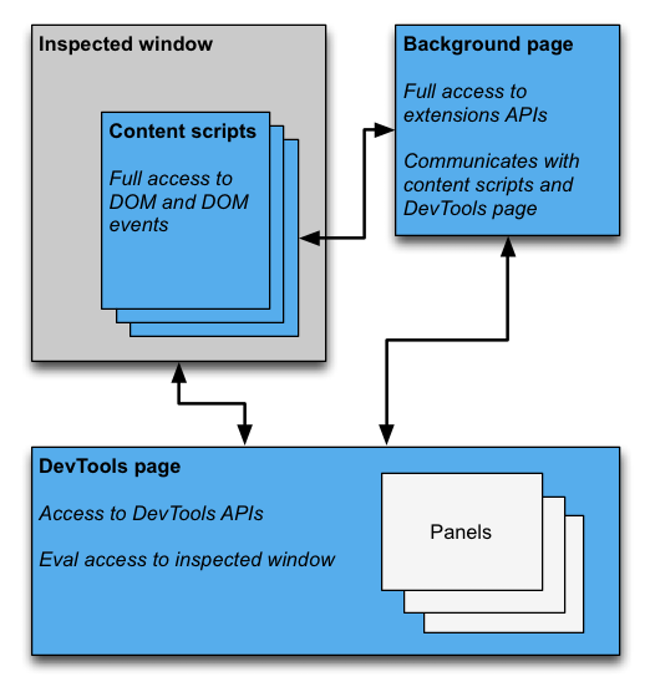

*在 MV3 版本中，background page 已取消，后台脚本 background scripts 运行在 service workers 中*

关于增添开发者工具 DevTools 功能的扩展程序的开发可以参考[官方文档](https://developer.chrome.com/docs/extensions/mv3/devtools/)和[示例](https://github.com/GoogleChrome/chrome-extensions-samples/tree/main/mv2-archive/api/devtools)（MV2 版本），以及一些[实例](https://developer.chrome.com/docs/extensions/mv3/devtools/#devtools-extension-examples)。


## 扩展程序发布

扩展程序主要是通过 [Chrome 网上应用店](https://chrome.google.com/webstore/category/extensions)进行分发。

开发者通过 [Developer Dashboard](https://chrome.google.com/webstore/developer/dashboard) 平台，将扩展程序项目打包 `.zip` 文件进行上传；然后该平台会对扩展程序进行安全审核以[保护用户](https://blog.chromium.org/2015/05/continuing-to-protect-chrome-users-from.html)，审核成功后扩展程序会转换成后缀为 `.crx` 的特殊 ZIP 压缩包，再分发给用户。

:bulb: 关于扩展程序的更新，Chrome 浏览器会定期检查已安装扩展程序的版本，如果发现新版本就会进行更新，无需用户干预。扩展程序的版本在配置清单 `manifest.json` 的选项 `version` 中设置

```json
{
  ...
  "version": "1.5",
  ...
}
```

通过提升数值来表示新版本

```json
{
  ...
  "version": "1.5",
  ...
}
```

然后将新的扩展程序项目打包为 `.zip` 文件，在 [Developer Dashboard](https://chrome.google.com/webstore/developer/dashboard) 平台中找到相应扩展程序的旧版本，选择 `Edit` 上传压缩包，再点击 `Publish` 进行发布。

:bulb: 其他扩展程序的分发方式可以参考[官方文档](https://developer.chrome.com/docs/extensions/mv3/external_extensions/)。

