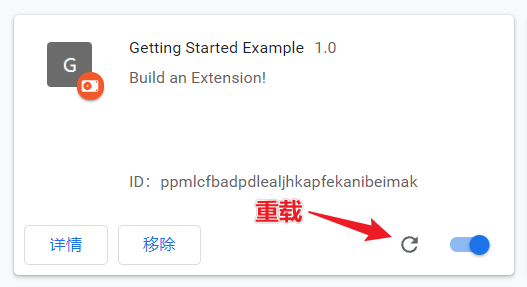

# 简介

浏览器扩展程序 extensions 是一个小型的程序，它可以使用[浏览器提供的 API](https://developer.chrome.com/docs/extensions/reference/) 和 web 技术以增强浏览器功能，例如页面内容增强、信息聚合等。

对于使用者，在 [chrome 网上应用店](https://chrome.google.com/webstore/category/extensions)可以找到各种丰富的扩展程序。


此外 Chrome 还支持[加载已解压的扩展程序](./安装插件.md)，方便我们开发调试。

如果需要在 chrome 网上应用店分发自己开发的扩展程序，要先[注册为 Chrome 网上应用店开发者](https://chrome.google.com/webstore/devconsole/register)（支付一次性 5 美元的注册费），再根据[官方教程](https://developer.chrome.com/docs/webstore/publish/)将程序进行打包发布。

:bulb: 通过官方渠道分发的扩展程序应该遵循 [Chrome 网上应用店政策](https://developer.chrome.com/docs/webstore/program_policies/)，主要的关注点如下：

* [单一目的](https://developer.chrome.com/docs/extensions/mv3/single_purpose/)原则：扩展程序可以包含很多组件和功能，但应该只为了服务于一个目的，这是为了保持 Chrome 用户体验的良好质量。
* 用户界面需要简介且意图明确：交互界面可以是一个简单的图标，或是一个模态框。

:bulb: 主题 theme 是一种特殊的扩展程序，用以改变浏览器的外观，和一般的扩展程序一样打包分发，但是它们不包含 JavaScript 或 HTML 代码。同样可以在 [Chrome 网上应用店](https://chrome.google.com/webstore/category/themes)找到丰富的主题。如果你要开发主题可以参考官方[样例](https://developer.chrome.com/docs/extensions/mv3/themes/)。


## 架构概览

扩展程序是一个包含着 HTML、JavaScript、CSS 文档，以及图片等各种其他静态资源的压缩包，它使用 web 主流技术进行开发，可以串接浏览器所提供的 API，以实现增强浏览器功能的目的。

扩展程序依其功能的不同，项目的结构和所包含的文件类型也不同，但是它们一般都由以下部分构成：

* Manifest：每一个扩展程序都必须有一个配置清单 `manifest.json` 文档，在其中清楚地列明该扩展程序的相关信息和所需使用的权限。
* Background Script：后台脚本，它主要包含一堆的事件监听和处理函数。事件监听-响应的交互模型，可以让脚本在后台静默休眠，当相应的事件被触发时再执行相应的回调函数，以此让扩展程序有更佳的性能。
* UI Elements：扩展程序提供多种用户交互控件，例如 [browser action](https://developer.chrome.com/docs/extensions/reference/browserAction/)、[page action](https://developer.chrome.com/docs/extensions/reference/pageAction/)、[context menus](https://developer.chrome.com/docs/extensions/reference/contextMenus/)、[快捷键](https://developer.chrome.com/docs/extensions/reference/commands/)，也允许通过页面展示内容，例如 [popup](https://developer.chrome.com/docs/extensions/mv3/user_interface/#popup)，或通过[浏览器提供的 API `tab.create`](https://developer.chrome.com/docs/extensions/reference/tabs/#method-create) 或通用方法 `window.open()` 打开一个指定的页面。
* Content Script：内容脚本，它可以植入页面，一般用于读取页面内容，或向页面插入内容。
* Options Page：设置页面，每一个扩展程序允许有一个配置页面，以供用户定制扩展程序的参数。

以上有的组成部分可以通过**[交换信息](https://developer.chrome.com/docs/extensions/mv3/messaging/)**的方式来互相沟通


浏览器除了提供通用的 web API 接口，还为扩展程序提供特有的 API，这些 Chrome API 大部分都是**异步**的，需要通过异步编程（promise 或 async/await）来使用它们。

扩展程序也可以使用 [Chrome API 的 `storage`](https://developer.chrome.com/docs/extensions/reference/storage/) 或 HTML5 提供的 [web storage API](https://html.spec.whatwg.org/multipage/webstorage.html) 存储数据，当然也可以访问外部服务器存读数据。

:bulb: 扩展程序在**隐身模式**下一般不能运行，除非满足隐身模式的约束（不跟踪用户行为数据）。


## 扩展程序生态愿景

为了改善和提升 Chrome 扩展程序平台这个充满活力的生态系统，Chrome 团队在这一篇文章里阐述了祂们的长期愿景，以便开发者理解并拥抱扩展程序平台的未来方向。

扩展程序以前是基于 "webby" 模型，可以让 web 开发者快速上手；然后转为 permissions 模型，可以让用户在安装时，以更细颗粒度控制扩展程序可访问的权限和资源，而且每一个扩展程序运行在一个隔离隔离的沙盒环境中，更加安全。但是随着越来越多的应用发布，有部分扩展程序会利用这个平台来非法获得对用户数据和元数据。


因此我们的愿景是不断改进扩展程序的安全性、性能和隐私，同时保持扩展程序的可拓展性、灵活性，并让 web 开发者有更加友善的 webby 开发环境。


* 隐私：未来会更常使用**临时的、基于内容的权限许可**，限制扩展程序对用户数据的被动访问，其中 [activeTab 许可](https://developer.chrome.com/docs/extensions/mv3/manifest/activeTab/)（一个临时授权，许可扩展程序访问当前页面）就是是重要的一步。此外在扩展程序运行时，以通知的方式告知用户它正在请求访问哪些数据，这是十分重要的，因为这种方式可以让用户知道程序获取哪些数据，并有主动权去保护自己的数据。
* 安全：以更严格的协议限制扩展程序获取外部资源。
* 性能：确保扩展程序在不同的设备中可以运行良好
* Webbiness：除了提供一些扩展程序专属的技术（如浏览器为扩展程序提供的特殊的 API），还会不断跟进主流的 web 技术，对它们提供兼容支持，让 web 开发者可以快速上手，例如在 Manifest V3 版本的 Chrome 扩展程序中，支持 service works 和 promises。
* 能力：让扩展程序可以实现更强、更丰富的功能

目前最新的扩展程序配置版本是 **Manifest V3**。


## 扩展程序样例

该示例创建一个简单的扩展程序，让用户可以修改当前页面的背景色。

* 创建一个空目录作为项目文件夹，也可以从官网下载完整项目源码的[压缩包](https://storage.googleapis.com/chrome-gcs-uploader.appspot.com/file/WlD8wC6g8khYWPJUsQceQkhXSlv1/SVxMBoc5P3f6YV3O7Xbu.zip)

* 在项目的根目录下，创建一个 **`manifest.json` 文档**，它是扩展程序的**配置清单**，最基本的配置如下：

  ```json
  {
    "name": "Getting Started Example",
    "description": "Build an Extension!",
    "version": "1.0",
    "manifest_version": 3
  }
  ```

  * 选项 `name` 是扩展程序的名称
  * 选项 `description` 是扩展程序的描述
  * 选项 `version` 是扩展程序的版本
  * 选项 `manifest_version` 是清单文件的版本，当前最新的版本号是 `3`

* 然后在开启了「开发者模式」下，通过[「加载已解压的扩展程序」](./安装插件.md)的方式安装该扩展程序

* 后台脚本 background scripts 是扩展程序的一个重要组成部分，它包含一堆事件监听和处理函数，基于事件监听-响应的模型可以让扩展程序具备响应性，且有很好的性能。相应的脚本 `background.js` 需要先在 `manifes.json` 中进行声明注册

  ```json{6-8}
  {
    "name": "Getting Started Example",
    "description": "Build an Extension!",
    "version": "1.0",
    "manifest_version": 3,
    "background": {
      "service_worker": "background.js"
    }
  }
  ```

  :bulb: 在开发过程中，修改源码后，需要点击**重载按钮**，以让新增代码生效

  
  
* 我们需要在扩展程序安装后马上设置一个变量，以存储背景颜色。因此需要在后台脚本 `background.js` 监听 `onInstalled` 事件，其回调函数调用浏览器提供的[存储 API](https://developer.chrome.com/docs/extensions/reference/storage/) 保存一个默认背景色。

  ```js
  // background.js
  let color = '#3aa757'; // 默认背景色是绿色
  
  chrome.runtime.onInstalled.addListener(() => {
    chrome.storage.sync.set({ color });
    // 输出带颜色的文字
    console.log('Default background color set to %cgreen', `color: ${color}`); 
  });
  ```

  由于使用了存储 API，需要在配置清单中的**选项 `permissions`** 中声明注册以获得许可

  ```json{9}
  {
    "name": "Getting Started Example",
    "description": "Build an Extension!",
    "version": "1.0",
    "manifest_version": 3,
    "background": {
      "service_worker": "background.js"
    },
    "permissions": ["storage"]
  }
  ```

* 点击 **service worker** 可以打开**后台脚本的调试界面**（一个开发者调试工具）

  
  
  重新加载扩展程序后，可以在开发者工具的终端看到成功输出了预期的内容
  
  
  
* 扩展程序提供多种用户交互界面，其中之一是**弹出框 popup**，它会在用户点击浏览器右上角的扩展程序图标是弹出，并在失去焦点时消失。弹出框本质上是一个[大小受到限制](https://stackoverflow.com/questions/8983165/how-can-i-expand-the-popup-window-of-my-chrome-extension)（高和宽的最小值是 25px，高的最大值是 600px，宽的最大值是 800px）的 HTML 页面。

  在项目中创建一个 `popup.html` 文档。就像 web 开发一样，`popup.html` 可以引用样式文件对网页外观进行设置，在项目中创建一个样式文档 `button.css`

  ```html
  <!DOCTYPE html>
  <html>
    <head>
      <link rel="stylesheet" href="button.css">
    </head>
    <body>
      <button id="changeColor"></button>
    </body>
  </html>
  ```

  ```css
  button {
    height: 30px;
    width: 30px;
    outline: none;
    margin: 10px;
    border: none;
    border-radius: 2px;
  }
  
  button.current {
    box-shadow: 0 0 0 2px white,
                0 0 0 4px black;
  }
  ```

  同样也需要在配置清单 `manifest.json` 中声明注册弹出框，该 UI 设置属于选项 `action`（一个交互控件）之一

  ```json{10-12}
  {
    "name": "Getting Started Example",
    "description": "Build an Extension!",
    "version": "1.0",
    "manifest_version": 3,
    "background": {
      "service_worker": "background.js"
    },
    "permissions": ["storage"],
    "action": {
      "default_popup": "popup.html"
    }
  }
  ```

  可以为扩展程序设置在浏览器工具栏（右侧）中显示的图标，相关图片文件可以在[这里](https://storage.googleapis.com/chrome-gcs-uploader.appspot.com/file/WlD8wC6g8khYWPJUsQceQkhXSlv1/wy3lvPQdeJn4iqHmI0Rp.zip)下载，解压后将文件夹 :file_folder: `images` 放到项目的根目录下。同样需要在配置清单 `manifest.json` 指定所使用的图片的路径，扩展程序的图标设置属于选项 `action`（一个交互控件）之一，图片最好提供多个尺寸版本。

  ```json{12-17}
  {
    "name": "Getting Started Example",
    "description": "Build an Extension!",
    "version": "1.0",
    "manifest_version": 3,
    "background": {
      "service_worker": "background.js"
    },
    "permissions": ["storage"],
    "action": {
      "default_popup": "popup.html",
      "default_icon": {
        "16": "/images/get_started16.png",
        "32": "/images/get_started32.png",
        "48": "/images/get_started48.png",
        "128": "/images/get_started128.png"
      }
    }
  }
  ```

  此外该图标也可以在浏览器的扩展程序管理界面中显示，以及出现在许可获取的弹出框和 favicon 中，因此可以在配置清单 `manifest.json` 的选项 `icons` 中进行设置。

  ```json{19-23}
  {
    "name": "Getting Started Example",
    "description": "Build an Extension!",
    "version": "1.0",
    "manifest_version": 3,
    "background": {
      "service_worker": "background.js"
    },
    "permissions": ["storage"],
    "action": {
      "default_popup": "popup.html",
      "default_icon": {
        "16": "/images/get_started16.png",
        "32": "/images/get_started32.png",
        "48": "/images/get_started48.png",
        "128": "/images/get_started128.png"
      }
    },
    "icons": {
      "16": "/images/get_started16.png",
      "32": "/images/get_started32.png",
      "48": "/images/get_started48.png",
      "128": "/images/get_started128.png"
    }
  }
  ```

  :bulb: 刚安装的扩展程序的图标默认不会显示在浏览器工具栏（右侧）上，可以点击扩展程序的图钉按钮将它们显示出来。

  

  然后我们可以点击该图标，就会显示一个弹出框。

  

* 可以在 `popup.html` 里引入 JavaScript 实现交互，在项目中创建一个 `popup.js` 文档。该脚本会读取之前存储的颜色值，并将它设置为按钮的背景色；还对按钮的点击事件进行监听，当用户点击按钮时，以在**当前页面[植入脚本](https://developer.chrome.com/docs/extensions/reference/scripting/#method-executeScript)**的方式，将页面的背景色设置为与按钮颜色相同。

  ```js
  // Initialize button with user's preferred color
  let changeColor = document.getElementById("changeColor");
  
  chrome.storage.sync.get("color", ({ color }) => {
    changeColor.style.backgroundColor = color;
  });
  
  // When the button is clicked, inject setPageBackgroundColor into current page
  changeColor.addEventListener("click", async () => {
    let [tab] = await chrome.tabs.query({ active: true, currentWindow: true });
  
    chrome.scripting.executeScript({
      target: { tabId: tab.id },
      function: setPageBackgroundColor,
    });
  });
  
  // The body of this function will be executed as a content script inside the
  // current page
  function setPageBackgroundColor() {
    chrome.storage.sync.get("color", ({ color }) => {
      document.body.style.backgroundColor = color;
    });
  }
  ```

  记得在 `popup.html` 文档中引入 `popup.js` 脚本

  ```html{8}
  <!DOCTYPE html>
  <html>
    <head>
      <link rel="stylesheet" href="button.css">
    </head>
    <body>
      <button id="changeColor"></button>
      <script src="popup.js"></script>
    </body>
  </html>
  ```

  由于需要访问当前的页面，并且使用程序性植入脚本，需要在配置清单 `manifest.json` 的**选项 `permissions`** 中声明注册以获得许可。

  ```json{9}
  {
    "name": "Getting Started Example",
    "description": "Build an Extension!",
    "version": "1.0",
    "manifest_version": 3,
    "background": {
      "service_worker": "background.js"
    },
    "permissions": ["storage", "activeTab", "scripting" ],
    "action": {
      "default_popup": "popup.html",
      "default_icon": {
        "16": "/images/get_started16.png",
        "32": "/images/get_started32.png",
        "48": "/images/get_started48.png",
        "128": "/images/get_started128.png"
      }
    },
    "icons": {
      "16": "/images/get_started16.png",
      "32": "/images/get_started32.png",
      "48": "/images/get_started48.png",
      "128": "/images/get_started128.png"
    }
  }
  ```

  然后记得重载扩展程序再查看效果

* 接着我们可以增加一个页面，让用户可以在其中设置自己喜欢的颜色。在项目中添加 `options.html` 文档和 `options.js`。

  ```html
  <!DOCTYPE html>
  <html>
    <head>
      <link rel="stylesheet" href="button.css">
    </head>
    <body>
      <div id="buttonDiv">
      </div>
      <div>
        <p>Choose a different background color!</p>
      </div>
    </body>
    <script src="options.js"></script>
  </html>
  ```

  ```js
  let page = document.getElementById("buttonDiv");
  let selectedClassName = "current";
  const presetButtonColors = ["#3aa757", "#e8453c", "#f9bb2d", "#4688f1"];
  
  // Reacts to a button click by marking the selected button and saving
  // the selection
  function handleButtonClick(event) {
    // Remove styling from the previously selected color
    let current = event.target.parentElement.querySelector(
      `.${selectedClassName}`
    );
    if (current && current !== event.target) {
      current.classList.remove(selectedClassName);
    }
  
    // Mark the button as selected
    let color = event.target.dataset.color;
    event.target.classList.add(selectedClassName);
    chrome.storage.sync.set({ color });
  }
  
  // Add a button to the page for each supplied color
  function constructOptions(buttonColors) {
    chrome.storage.sync.get("color", (data) => {
      let currentColor = data.color;
      // For each color we were provided…
      for (let buttonColor of buttonColors) {
        // …create a button with that color…
        let button = document.createElement("button");
        button.dataset.color = buttonColor;
        button.style.backgroundColor = buttonColor;
  
        // …mark the currently selected color…
        if (buttonColor === currentColor) {
          button.classList.add(selectedClassName);
        }
  
        // …and register a listener for when that button is clicked
        button.addEventListener("click", handleButtonClick);
        page.appendChild(button);
      }
    });
  }
  
  // Initialize the page by constructing the color options
  constructOptions(presetButtonColors);
  ```

  该页面可以认为是插件的配置页面，因此在配置清单 `manifest.json` 的选项 `options_page` 中进行声明注册

  ```json{9}
  {
    "name": "Getting Started Example",
    "description": "Build an Extension!",
    "version": "1.0",
    "manifest_version": 3,
    "background": {
      "service_worker": "background.js"
    },
    "options_page": "options.html",
    "permissions": ["storage", "activeTab", "scripting" ],
    "action": {
      "default_popup": "popup.html",
      "default_icon": {
        "16": "/images/get_started16.png",
        "32": "/images/get_started32.png",
        "48": "/images/get_started48.png",
        "128": "/images/get_started128.png"
      }
    },
    "icons": {
      "16": "/images/get_started16.png",
      "32": "/images/get_started32.png",
      "48": "/images/get_started48.png",
      "128": "/images/get_started128.png"
    }
  }
  ```

  重载扩展程序后，在浏览器工具栏的扩展程序的图标上点击**右键**，并在弹出菜单中选择**「选项」**，进入扩展程序的设置页面。也可在 `chrome://extensions` 页面中，点击该扩展程序选项卡中的**「详情」**进入详情页面，在其中点击**「扩展程序选项」**，最后也可以进入相应的页面。

  

  

  
