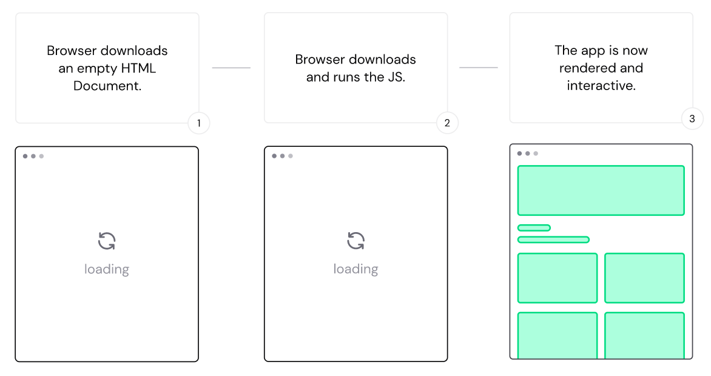
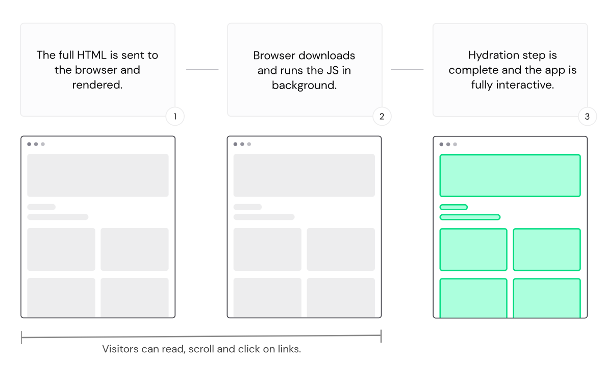

# 简介
Nuxt 是一个全栈开发框架，可以用它同时进行服务端和前端的开发，主要整合以下技术构成其核心模块，提供一个更佳的开发环境：

* [Vue.js](https://v3.vuejs.org/) 作为 JavaScript 框架，以实现响应式和组件化

* [webpack](https://webpack.js.org/) 或 [Vite](https://vitejs.dev/) 作为打包工具

* [esbuild](https://esbuild.github.io/) 作为转译器

* [h3](https://github.com/unjs/h3) 作为本地开发的服务器和实现服务器渲染，以及实现服务器端的路由导航

* [vue-router](https://router.vuejs.org/) 实现客户端的路由导航

## Vue 开发环境
Nuxt 基于 Vue 作为前端框架，如果平时使用 Vue 的 SFC（即 `*.vue` 文件）进行开发，可以无缝过渡，无需配置下在 Nuxt 中使用 SFC 进行开发。

:bulb: Nuxt 3 是基于 Vue 3，支持 Composition API 组合式API，原生支持 TypeScript

此外 Nuxt 还对开发体验细节进行了优化，例如：

  * 在项目中不需要创建 :page_facing_up: `main.js` 文件（以创建 Vue 实例），因为 Nuxt 会在「后台」自动创建
  * 在 :file_folder: `components/` 目录下创建的 Vue 组件，在其他地方使用时，无需手动导入就可以直接使用，Nuxt 会在打包项目自动导入所用的组件
  * Nuxt 会基于 :file_folder: `pages/` 目录下的文件自动创建相应的页面路由
  * 在 `<script setup>` 标签内使用[响应式 API](https://vuejs.org/api/reactivity-core.html)，例如 `ref()` 不需要导入，Nuxt 会在编译时自动导入这些 API
  * ...

## 渲染模式
网站需要在浏览器上显示出来，所以需要将 Vue 的组件（代码）解析为 HTML、CSS 和 JavaScript，该过程称为渲染 rendering。Nuxt 2 支持在客户端渲染 client-side only 和客户端-服务器两者结合的渲染 universal（由于代码可以在服务器和客户端允许，所以称为「通用」渲染模式）。

* 客户端渲染模式 client-side only rendering：浏览器下载 HTML 模板和 JS 脚本并执行，在 HTML 模板中渲染出完整的网页应用。一般适用于进行处理较多的用户交互操作和不太需要 SEO 优化的网站。由于 Nuxt 是基于 Vue 的，而 Vue 就是使用这种模式来构建 SPA 网站的，所以这种模式在 Nuxt 项目中也可做到开箱即用。

  

* 通用渲染模式 universal rendering：当浏览器向服务器发出请求时，服务器会发生一个网站的 HTML 文档（可以是预先生成并缓存在服务器中，会接到客户端请求后再生成），这和传统的服务器端渲染 server-side（使用 PHP 或 Ruby 的传统服务器）类似，但是由于保留了客户端渲染，所以（在服务器生成）静态网页也可以处理用户的交互（将静态网页变成可交互的过程称为 Hydration），同时可以有较好的 SEO 优化，一般适用于展现内容为主的网站，如博客、商务网站。Nuxt 默认采用这种模式。

  

可以在 Nuxt 的配置文件中进行渲染模式的配置和切换。

```ts
// 📄 nuxt.config.ts
import { defineNuxtConfig } from 'nuxt'

export default defineNuxtConfig({
  // My Nuxt config
  ssr: true // 默认开启服务器渲染，即采用「客户端-服务器渲染模式」 universal rendering
  // 如果设置为 false 则只允许在客户端渲染
})
```

除此之外 Nuxt 3 还提供了一种更先进的渲染模式——混合渲染 hybrid，可以控制每一个路由（页面）的缓存规则，以设定服务器应该如何响应客户端发出的每一条 URL 请求；由于通用渲染一般采用 Node.js 环境，Nuxt 3 还提供一种渲染模式——边缘渲染 edge-side，可以利用 CDN 的 workers 进行渲染，以减低网络的延迟。

* 混合渲染模式 hybrid rendering：可以为不同的路由（页面）设置不同的渲染和缓存规则，有的页面可能更适合在服务器渲染，有的页面可能更适合在客户端渲染。例如对于有权限约束的内容为主的网站，对于普通的页面可以先在服务器统一只执行一次渲染生成就行了，而对于会员专属的页面应该采用客户端渲染（类似一个动态的网页应用，这些页面应该按需生成）。更多信息可以查看社区的[讨论](https://github.com/nuxt/framework/discussions/560)。

* 边缘渲染 edge-side rendering：Nuxt 3 采用一个全新的服务端渲染引擎 [Nitro](https://v3.nuxtjs.org/guide/concepts/server-engine) 它支持多种环境，包括浏览器、Node.js、Deno、Workers 等，所以可以允许在 CDN worker 中渲染 Nuxt 应用，让用户访问网站时所感受到网络延迟更低。

## 自动导入
除了前面 Vue 开发环境所提到的可以自动导入 Vue 的 API、组件等，Nuxt 的一些内置的 API、组件等也会自动导入，让开发体验更流畅。

:bulb: 具体 Nuxt 哪些[组合式 Composable API](https://v3.nuxtjs.org/api/composables/use-async-data)、[常用函数 Utils](https://v3.nuxtjs.org/api/utils/$fetch)、[内置组件 Components](https://v3.nuxtjs.org/api/components/nuxt-page) 自动导入可以参考官方文档。

Nuxt 还对开发者在 :file_folder: [`components` 文件夹](https://v3.nuxtjs.org/guide/directory-structure/components/)创建的 Vue 组件和 :file_folder: [`composables` 文件夹](https://v3.nuxtjs.org/guide/directory-structure/composables/)中自定义的 Vue 组合式函数，也支持自动导入

:warning: 目前在 Nuxt 项目的 :file_folder: `server` 文件夹中，并不支持自动导入，在该文件夹中的文档的依赖需要显式手动导入。

:bulb: Nuxt 为自动导入的这些函数和组件等，提供了一个别名 `#import`，可以从它里面显式地导入所需的内容

  ```vue
  <script setup>
    import { ref, computed } from '#imports'

    const count = ref(1)
    const double = computed(() => count.value * 2)
  </script>
  ```

