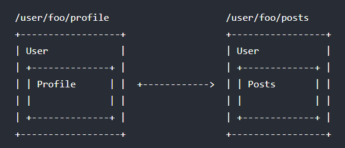

# Vue Router

[Vue Router](https://router.vuejs.org/zh/) 是 Vue.js 官方的路由管理器（插件），**它将组件 components 映射到路由 routes**，然后告诉 Vue Router 在哪里渲染它们，:clapper: ​这样就可以在单页面应用中实现类似切换 url 而更新页面的效果。

<iframe style="width: 100%; aspect-ratio: 16/9;" src="https://www.youtube.com/embed/Zl4Y2INPuLY?start=952&end=1461&modestbranding=1&rel=0" allowfullscreen loading="lazy"></iframe>


## 安装引入

可以通过 CDN 引入 Vue Router 插件

```html
<script src="https://unpkg.com/vue-router/dist/vue-router.js"></script>
```

也可以通过 npm 安装，然后通过 `Vue.use()` 的方式安装插件

```bash
npm i vue-router
```

```js
import VueRouter from 'vue-router'

Vue.use(VueRouter)
```


## 初始化

通过 `new VueRouter({})` 创建 router 实例，并配置组件和路由的映射关系

```js
// 如果使用模块化机制编程，导入 Vue Router 后要调用 Vue.use(VueRouter) 显式声明使用该插件

// 路由配置
// 路由和组件的映射规则，一般每个路由 path 对应一个组件 component
const routes = [
  {
    // 路由网址（url）
    path: '/foo',
    // 对应的组件（视图）
    component: Foo
  },
  { path: '/bar', component: Bar },
  {
    // 动态路由
    path: '/user/:id',
    component: User
  },
  {
    path: '/404',
    component: Error
  },
  {
    // 重定向
    // 可以不设置 component 选项，而是设置 redirect 选项
    // 当路径与该路由匹配时，url 会重定向到指定的路径
    path: '*',
    redirect: '/404'
  }
]

// 创建 router 实例
const router = new VueRouter({
  // 传入路由配置
  routes
})

// 创建和挂载根实例
// 通过选项 router 注入路由，让整个应用都有路由功能
const app = new Vue({
  router
}).$mount('#app')
```

:bulb: 在应用中 :clapper: 常用到两个概念：

* `router` 是指路由器，它有 Vue Router 插件提供的多种控制路由的方法，在任何组件内都可以通过 `this.$router` 访问路由器
* `route` 是指一个包含当前路由信息的对象，可以通过 `this.$route` 访问当前路由

<iframe style="width: 100%; aspect-ratio: 16/9;" src="https://www.youtube.com/embed/Zl4Y2INPuLY?start=1563&end=1639&modestbranding=1&rel=0" allowfullscreen loading="lazy"></iframe>

<iframe style="width: 100%; aspect-ratio: 16/9;" src="https://www.youtube.com/embed/Zl4Y2INPuLY?start=2840&end=2984&modestbranding=1&rel=0" allowfullscreen loading="lazy"></iframe>

最后别忘了在 Vue 实例（组件）的模板中使用 `<router-view>` 组件，这样才可以**将当前路由匹配的组件渲染在到页面上**

```html
<router-view></router-view>
```

### 路由元信息

:clapper: 在定义路由规则时，可以设置选项 `meta` 元信息，传递一个对象，以键值对的形式**存储关于该路由的相关信息**，然后就可以通过 `$route.meta` 进行访问调用。相当于为路由增添一些除了路径以为的其他的信息。

<iframe style="width: 100%; aspect-ratio: 16/9;" src="https://www.youtube.com/embed/zOfuenLC788?start=5107&end=5375&modestbranding=1&rel=0" allowfullscreen loading="lazy"></iframe>

### 命名路由

可以在配置路由时，通过选项 `name` 给某个路由设置名称，这样对于路径较长的路由，在设置路由导航时更方便调用。

```js
const router = new VueRouter({
  // 路由规则
  routes: [
    {
      path: '/',
      component: Index
      name: 'index'
    },
  ]
})
```

:clapper: 要使用一个命名路由，可以给 `<router-link>` 的属性 `to`（以**绑定的方式**传递）传一个**对象**，其中包含 `name` 选项（需要非重复，特异值），以指定链接的路径

```html
<router-link to="/">
<!-- 等价的另一种方式 -->
<router-link :to="{name: 'index'}">
```

:bulb: 当组件 `<router-link>` 为属性 `to` 绑定一个对象时，可以设置多种属性来构成更复杂的 url 路径：

* 属性 `params` 设置动态路径的参数
* 属性 `query` 设置路径的查询参数

```js
const router = new VueRouter({
  // 路由规则
  routes: [
    {
      // 动态路由
      path: '/user/:userId',
      component: User,
      name: 'user'
    },
  ]
})
```

```html
<!-- 把路由导航到 /user/123 路径 -->
<router-link :to="{name: 'user', params: { userId: 123 }}">User</router-link>
```

:warning: 当绑定对象中使用选项 `path`（绝对路径）指定链接的路径，则会忽略 `params` 属性

同样地，如果使用编程式导航，可以给相应的方法传递一样的对象

```js
router.push({ name: 'user', params: { userId: 123 } })
```

<iframe style="width: 100%; aspect-ratio: 16/9;" src="https://www.youtube.com/embed/zdqxvgkIb8M?start=428&end=950&modestbranding=1&rel=0" allowfullscreen loading="lazy"></iframe>

### 别名

可以在配置路由时，通过选项 `alias` 为路由设置**别名**，该功能可以让你==自由地将 **UI 结构**映射到任意的 URL，而不是受限于配置的嵌套路由结构==。

```js
{
  path: '/a',
  component: A,
    children: [
      {
        path: 'a1',
        component: 'A1',
        alias: '/b'
      }
    ]
}
```

以上示例的路由设置，在访问 `/b` 就相当于访问 `/a/a1`，页面的视图渲染相同的组件，即实现**多个网址指向同一个页面**

### 命名视图

:clapper: 可以在页面模板中**同时设置多个 `<router-view>`**（平行关系，而不是通过嵌套路由和嵌套的 `<router-view>` 实现），不过得为每个视图设置名称 `<router-view name="viewName>`（没有设置名字则默认为 `default`），这样就可以在一个路由下「平行」渲染出多个组件。

这时应该在路由的配置中，相应地**对于同一个路由要设置多个组件**（如果组件数量少于平行的 `<router-view>` 数量，则相应的多余的视图组件将不会渲染），注意此时选项 `components`（**不**是 `component`）变成一个对象，设置多个组件，每一个属性都是一个组件，键为视图 `<router-view>` 的的命名 `name`，值为组件名

```js
{
  path: '/pathName',
  components: {
    default: Index,
    viewName1: Component1,
    viewName2: Component2
  }
}
```

:bulb: 命名视图和嵌套路由都可以在一个页面设置多个视图 `<router-view>` 组件，但作用不同

* **命名视图**同一个页面设置多个 `<router-view>`，它们渲染出来的**节点/组件可以是「平行」关系**，实现不同路由复用同一个布局模板
* **嵌套路由**在父组件中设置一个 `<router-view>`（用以渲染嵌套路由对应的子组件），渲染出来的**节点/组件是父子嵌套关系**，一般用于局部的布局的更改

<iframe style="width: 100%; aspect-ratio: 16/9;" src="https://www.youtube.com/embed/zdqxvgkIb8M?start=990&end=2484&modestbranding=1&rel=0" allowfullscreen loading="lazy"></iframe>

:bulb: 其实命名视图可以看作是 :clapper: 更一般路由-组件映射规则，如果页面只需要一个 `<router-view>` 也可以在设置路由时使用 `components` 选项，只是里面只设置 `default: componentName` 一个组件。

<iframe style="width: 100%; aspect-ratio: 16/9;" src="https://www.youtube.com/embed/zOfuenLC788?start=455&end=489&modestbranding=1&rel=0" allowfullscreen loading="lazy"></iframe>

:bulb: 这里的:clapper: [视频教程](https://youtu.be/MeHWWi_J4lo)就是使用命名视图模仿 twitter 实现图片 LightBox 功能

### 路由懒加载

结合 Vue 的异步组件和 Webpack 的代码分割功能，可以轻松实现路由所对应的组件的懒加载，即当路由被访问的时候才加载对应组件。

首先将异步组件定义为返回一个 Promise 的工厂函数（返回的 Promise 应该 resolve 组件本身）

```js
const Foo = () =>
  Promise.resolve({
    /* 定义组件的对象 */
  })
```

然后在 Webpack 2 中，使用动态 `import` 语法来定义代码分块点

```js
import('./Foo.vue') // 返回 Promise
```

将两者结合，这定义一个能够被 Webpack 自动代码分割的异步组件：

```js
const router = new VueRouter({
  routes: [
    {
      path: '/foo',
      component: () => import('./Foo.vue')
    }
  ]
})
```

:bulb: 也可以将组件**按组分块**：通过 Webpack 把某个路由下的所有组件都打包在同个异步块 async chunk 中。

:clapper: 在导入模板时添加特殊的注释语法 `/* webpackChunkName: "children" */` 提供 chunk name，Webpack 就会将具有相同块名的异步模块 async module 合并到相同的异步块 async chunk 中，实现按需加载

```js
const Children1 = () => import(/* webpackChunkName: "children" */ './Children1.vue')
const Children2 = () => import(/* webpackChunkName: "children" */ './Children2.vue')
```

<iframe style="width: 100%; aspect-ratio: 16/9;" src="https://www.youtube.com/embed/zOfuenLC788?start=6394&end=6630&modestbranding=1&rel=0" allowfullscreen loading="lazy"></iframe>


## 路由导航

有两种方式切换 url 路径

* 使用组件 `<router-link>` 组件进行导航，该组件会在页面上渲染为 `<a>` 标签。
* 使用 Vue Router 提供的方法通过 JS 手动切换 url 路径，称为**编程式导航**。

### router-link

* :clapper: 使用 `<router-link>` 组件来导航，它类似于 `<a>` 标签实现 url 切换，通过属性 `to` 指定路径

  :bulb: 通过属性 `tag` 指定该组件渲染为哪一种标签，默认渲染为 `<a>` 标签

  :bulb: 路由激活时（该组件的属性 `to` 与当前 url 路径匹配上），:clapper: 该组件的根元素会添加上类名 `.router-link-active`；而路由准确匹配上的元素则会再加上类名 `.router-link-exact-active`，可以使用这两个 `class` 类属性设置样式

  ```html
  <router-link to="/">Index</router-link>
  ```

  <iframe style="width: 100%; aspect-ratio: 16/9;" src="https://www.youtube.com/embed/Zl4Y2INPuLY?start=2380&end=2821&modestbranding=1&rel=0" allowfullscreen loading="lazy"></iframe>

  <iframe style="width: 100%; aspect-ratio: 16/9;" src="https://www.youtube.com/embed/Zl4Y2INPuLY?start=2992&end=3350&modestbranding=1&rel=0" allowfullscreen loading="lazy"></iframe>

### 编程式导航

* 使用 Vue Router 提供的方法通过 JS 手动切换 url 路径，称为**编程式导航**。

  :clapper: 借助实例 router 的方法（在 Vue 实例内部，你可以通过 `$router` 访问路由实例）来实现页面 URL 切换，这些方法是效仿浏览器提供的 API `window.history`：

  * `router.push(location, onComplete?, onAbort?)` 导航到指定的 `location`，并向 history 栈添加一个新的记录
  * `router.replace(location, onComplete?, onAbort?)` 导航到指定的 `location`，它**不**会向 history 添加新记录，而是替换掉当前的 history 记录
  * `router.go(n)` 在 history 记录中向前或者后退 `n` 步，类似 `window.history.go(n)`，如果输入的数值过大或过小，而 history 记录不够用，跳转就会**失败**

  :bulb: 前面两个方法的第二个参数 `onComplete` 是在导航成功完成后执行的回调函数；第三个参数 `onAbort `是在导航终止 (导航到相同的路由、或在当前导航完成之前导航到另一个不同的路由) 的时候执行的回调函数。**如果省略第二个和第三个参数，则 `router.push` 或 `router.replace` 方法将返回一个 Promise 以便于针对这次导航动作进行进一步的后续操作**。

  :bulb: 如果路由导航的目的地和当前路由映射的组件是相同，如动态路由切换时，只有参数发生了改变，==为了优化效率**页面的组件会复用**，即在组件生命周期钩子函数中执行的操作并不会再次执行，需要使用 `beforeRouteUpdate` 钩子函数进行路由守卫，监听路由的变化然后在相应的回调函数中**手动触发**原来所需的操作，比如基于路由的参数的改变，抓取新的用户信息。==

  <iframe style="width: 100%; aspect-ratio: 16/9;" src="https://www.youtube.com/embed/9-8GOqMddkg?start=3115&end=4957&modestbranding=1&rel=0" allowfullscreen loading="lazy"></iframe>

### 导航守卫

:clapper: 导航守卫是在指用户访问特定的路径时，基于条件执行跳转或取消的操作，从而在前端对特定页面和数据进行「保护」。有多种机会植入导航守卫，可以设置全局的、单个路由独享的、或者组件级的路由守卫。

完整的路由导航解析流程：

1. 导航被触发
2. 在失活的组件里调用 **`beforeRouteLeave` 守卫**（组件内的守卫）
3. 调用全局的 **`beforeEach` 守卫**（全局前置守卫）
4. 在重用的组件里调用 **`beforeRouteUpdate` 守卫**（组件内的守卫，路由更新，但组件复用）
5. 在路由配置里调用 **`beforeEnter` 守卫**（路由独享的守卫）
6. 解析异步路由组件
7. 在被激活的组件里调用 **`beforeRouteEnter` 守卫**（组件内的守卫）
8. 调用全局的 **`beforeResolve` 守卫**（全局解析守卫）
9. 导航被确认
10. 调用全局的 **`afterEach` 钩子**（全局后置守卫）
11. 触发 DOM 更新
12. 调用 `beforeRouteEnter` 守卫中传给 **`next` 的回调函数**，创建好的组件实例会作为回调函数的参数传入

<iframe style="width: 100%; aspect-ratio: 16/9;" src="https://www.youtube.com/embed/zOfuenLC788?start=3158&end=3556&modestbranding=1&rel=0" allowfullscreen loading="lazy"></iframe>

:clapper: 一般**路由守卫回调函数**会接收三个参数：

* `to` 即将要进入的目标（路由对象 route）

* `from` 当前导航正要离开的路由对象 route

* `next` 一个函数，**每个路由守卫都应该调用该方法，才可以 `resolve` Promise 以「放行」，否则页面将会「卡住」，无法顺利跳转或展示数据**。

  该执行效果依赖调用 `next()` 方法时传递参数：

  * `next()` 不传递参数时，会进行管道中的下一个钩子

  * `next(false)` 中断当前的导航

  * `next('/otherPath')` 或者 `next({ path: '/otherPath' })` 当前的导航被中断，然后进行一个新的导航。跳转到一个不同的地址

    :bulb: 传递对象可以定制跳转的方式，如 `next({ replace: true, name: 'home' })` 以取代历史记录的方式，跳转导航到首页。

  * `next(error)` 传入 next 的参数是一个 Error 实例，则导航会被终止。

:warning: 确保 `next` 函数在任何给定的导航守卫中都**被严格调用一次**。

<iframe style="width: 100%; aspect-ratio: 16/9;" src="https://www.youtube.com/embed/zOfuenLC788?start=3561&end=4042&modestbranding=1&rel=0" allowfullscreen loading="lazy"></iframe>

:bulb: 路由的参数 `params` 或查询 `query` 的改变并**不**会触发进入/离开类型的导航守卫。可以通过 `watch` 观察 `$route` 路由对象来应对这些变化，或使用 [`beforeRouteUpdate` 组件内守卫](#组件内守卫)来响应这些变化。

:clapper: 以下是常用的路由守卫钩子函数，根据实际情况选择合适的钩子函数进行路由守卫：

#### 全局路由守卫

全局路由守卫 `beforeEach` 在进入任何路由前都会调用。可以使用路由实例的方法 `beforeEach()` 定义一个全局路由守卫，当一个导航触发时，全局前置守卫**按照创建顺序依此调用**。

```js
router.beforeEach((to, from, next) => {
  ...
})
```

#### 路由独享守卫

路由独享的守卫  `beforeEnter` 只有在进入特定路径前调用。可以在路由配置时，针对特定的路由定义独享的守卫。

```js
{
  path: '/foo',
  component: Foo,
  beforeEnter: (to, from, next) => {
    ...
  }
}
```

#### 组件内守卫

可以在**路由组件内**直接定义以下路由导航守卫，它们与路由的特定组件相关：

* `beforeRouteEnter(to, from, next) {...}` 在渲染该组件的对应路由被 confirm **前**调用

  :warning: 守卫的钩子函数内**不**能访问 `this` 因为该守卫在导航确认前被调用，因为**即将登场的新组件还没被创建**。不过可以通过传一个回调给其中的 `next` 函数来访问组件实例

  ```js
  beforeRouteEnter (to, from, next) {
    // 在导航被确认的时候执行 next 的回调，并且把组件实例作为回调方法的参数
    next(vm => {
      // 通过 `vm` 访问组件实例
    })
  }
  ```

* `beforeRouteUpdate(to, from, next) {...}` 在当前路由改变但是该**组件被复用时**调用，可以在路由的参数 `params` 或查询 `query` 的改变时做出响应

* `beforeRouteLeave(to, from, next) {...}` 导航离开该组件的对应路由时调用。离开守卫通常用来禁止用户在还未保存修改前突然离开，这时一般通过 `next(false)` 来取消路由的导航。

:warning: `beforeRouteEnter` 是支持给 `next` 传递回调的唯一守卫，对于 `beforeRouteUpdate` 和 `beforeRouteLeave` 来说，`this` 已经可用了，所以**不支持**传递回调，因为没有必要了。

#### 全局后置钩子

全局后置钩子 `afterEach` 在导航被确认时调用，这个钩子**不**会接受 `next` 函数，也**不会改变导航本身**。可以使用路由实例的方法 `afterEach()` 定义一个全局后置守卫

```js
router.afterEach((to, from) => {
  // ...
})
```

<iframe style="width: 100%; aspect-ratio: 16/9;" src="https://www.youtube.com/embed/zOfuenLC788?start=3561&end=5100&modestbranding=1&rel=0" allowfullscreen loading="lazy"></iframe>

### 数据获取

:clapper: 在访问网页需要从服务器获取数据，一般有两种时机可以选择：

* 在导航完成之后获取数据：先完成导航，然后在接下来的**组件生命周期钩子函数中**获取数据。在数据获取期间显示 Loading 之类的指示。这个时机一般是获取页面数据。
* 导航完成之前获取：导航完成前，**在路由进入的守卫钩子函数中**获取数据，在数据获取成功后执行导航。在获取数据时会停止跳转，**用户会停留在当前的界面，有种「卡住」的感觉**，因此建议在数据获取期间，显示一些进度条或者别的指示。这个时机一般是基于验证、会员内容的数据获取。

:warning: 使用组件的生命周期的 hook 或路由守卫时应该考虑 Vue 对于**组件的复用**，如果使用组件的生命周期钩子函数获取数据时，应该添加 `watch` 侦听路由 `$route` 的变换，手动触发重新获取数据；如果使用路由守卫的钩子函数，则可以在组件内守卫的 `beforeRouteUpdate` 钩子函数中获取数据，这样即使组件复用也可以顺利更新数据。

<iframe style="width: 100%; aspect-ratio: 16/9;" src="https://www.youtube.com/embed/zOfuenLC788?start=5619&end=6324&modestbranding=1&rel=0" allowfullscreen loading="lazy"></iframe>

### 页面滚动

可以在设置路由时，通过选项 `scrollBehavior` 设置切换页面时如何滚动，该选项是一个方法，返回一个包含页面该如何滚动相关信息的对象

```js
const router = new VueRouter({
  routes: [...],
  scrollBehavior (to, from, savedPosition) {
    return { x: number, y: number } // 期望滚动到页面指定的位置
  }
})
```

返回滚动位置的对象信息可以有多种格式：

* 滚动到指定的坐标轴 `return { x: number, y: number }`，一般对于所有路由导航，:clapper: 简单地让页面滚动到顶部 `return { x: 0, y: 0 }`

  <iframe style="width: 100%; aspect-ratio: 16/9;" src="https://www.youtube.com/embed/zOfuenLC788?start=6324&end=6390&modestbranding=1&rel=0" allowfullscreen loading="lazy"></iframe>

* 滚动到指定锚点 `return { selector: to.hash }`

* 滚动到原来位置 `return savedPosition`  该值当且仅当通过浏览器的 **前进/后退** 按钮触发（popstate 导航）时才可用


:bulb: 该方法支持返回一个 Promise 来表示预期的位置，实现**异步滚动**，这样滚动行为和页面过渡可以更好地配合，实现更优雅的动效。

```js
// ...
scrollBehavior (to, from, savedPosition) {
  return new Promise((resolve, reject) => {
    setTimeout(() => {
      resolve({ x: 0, y: 0 })
    }, 500) // 延迟 500ms 后才进行页面滚动
  })
}
```

:bulb: 还可以在返回的对象中添加 `behavior` 选项，并将值设置为 `smooth`，就可以启用原生平滑滚动：

```js
// ...
scrollBehavior (to, from, savedPosition) {
  if (to.hash) {
    return {
      selector: to.hash,
      behavior: 'smooth',
    }
  }
}
```

### 过渡效果

可以用 `<transition>` 组件给所有路由组件 `<router-view>` 添加过渡效果，这样在路由切换时，组件就可以有相应的进入/离开的动效。

```html
<transition>
  <router-view></router-view>
</transition>
```

:bulb: 如果使用了命名视图，即页面上有多个「平行」的 `<router-view>` 而且想让每个路由组件有各自的过渡效果，可以为组件 `<transition>` 设置不同的 `name` 属性，具体参考[动效](./动效.md)这一节。

:bulb: 如果动画效果不生效，一般是由于 Vue 对**组件进行复用**，:clapper: 可以将 `$route` 相关信息，如 `$route.path` 或 `$route.fullPath` 作为 `<router-view>` 组件的 `key` 属性值

<iframe style="width: 100%; aspect-ratio: 16/9;" src="https://www.youtube.com/embed/zOfuenLC788?start=5376&end=5618&modestbranding=1&rel=0" allowfullscreen loading="lazy"></iframe>


## 动态路由

动态路由是指把某种模式（正则表达式）匹配到的所有路由，全都映射到同个组件。

:clapper: 动态路径的参数**以冒号 `:` 开头**，匹配到的参数值会被添加到 `this.$route.params` 对象中

```js
const router = new VueRouter({
  routes: [
    {
      path: '/user/:id',
      component: User
    },
    {
      path: '/404',
      component: Error
    },
    {
      path: '*',
      redirect: '/404'
    }
  ]
})
```

<iframe style="width: 100%; aspect-ratio: 16/9;" src="https://www.youtube.com/embed/Zl4Y2INPuLY?start=3419&end=3565&modestbranding=1&rel=0" allowfullscreen loading="lazy"></iframe>

:bulb: 有时候一个 url 可以匹配多个路由，==此时**匹配的优先级就按照路由的定义顺序**：即在路由配置中，先定义的路由优先级更高；**匹配顺序由上到下，直到有符合的规则为止**。== :clapper: 所以**使用通配符配符 `*` 匹配任意路径一般放在最后**。

<iframe style="width: 100%; aspect-ratio: 16/9;" src="https://www.youtube.com/embed/Zl4Y2INPuLY?start=3572&end=4056&modestbranding=1&rel=0" allowfullscreen loading="lazy"></iframe>

:bulb: 一般路由配置中会在最后使用通配符 `*` 作为了 `path` 以任意路径，这样当用户输入任意无对应组件映射的路径时，它就会「兜底」捕获，而且会使用选项 `redirect` 将路径转载到 `/404` 让浏览器跳转到 404 页面。

当使用一个通配符时 `$route.params` 内会自动添加一个名为 `pathMatch` 参数。

```js
const router = new VueRouter({
  routes: [
    // ...
    {
      path: '/404',
      component: Error
    },
    {
      path: '*',
      redirect: '/404'
    }
  ]
});
```

:warning: 当使用动态路由匹配同一个组件时，:clapper: 如果只有动态路径参数改变，并**不**会触发组件重新渲染，而是**复用原来的组件**，因此组件的生命周期钩子不会再被调用。如果希望路由匹配的参数改变时，同时触发组件更新，可以设置一个侦听器 `watch` 监测 `$route` 对象的变化，或使用 Vue Router 提供的 `beforeRouteUpdate` 钩子函数进行路由守卫，然后在相应的回调函数中手动触发原来需要在生命周期钩子函数中执行的操作。

<iframe style="width: 100%; aspect-ratio: 16/9;" src="https://www.youtube.com/embed/Zl4Y2INPuLY?start=4897&end=6237&modestbranding=1&rel=0" allowfullscreen loading="lazy"></iframe>

:bulb: 其实 `path` 选项除了使用动态路由（通过参数）匹配多路径，:clapper: 也可以混入[正则表达式](https://github.com/pillarjs/path-to-regexp/tree/v1.7.0)，例如正则表达式中的量词 `?`、`*` 等，实现更复杂的路径匹配，可以查看这些[例子](https://github.com/vuejs/vue-router/blob/73459565c4c64bfe9b41341875a84c87bc8b931c/examples/route-matching/app.js#L12-L25)。

<iframe style="width: 100%; aspect-ratio: 16/9;" src="https://www.youtube.com/embed/Zl4Y2INPuLY?start=4147&end=4832&modestbranding=1&rel=0" allowfullscreen loading="lazy"></iframe>


## 嵌套路由

当网页中一个界面有**多层嵌套的组件**组合而成，可以==使用嵌套路由，:clapper: 将这些嵌套的组件与 URL 中相应的**某段路径相映射**，这样就可以实现更改 URL 某段参数时相应地改变页面的某些组件==，支持多层深度嵌套的路由。



<iframe style="width: 100%; aspect-ratio: 16/9;" src="https://www.youtube.com/embed/9-8GOqMddkg?start=588&end=779&modestbranding=1&rel=0" allowfullscreen loading="lazy"></iframe>

即在父组件中可以嵌套有自己的 `<router-view>`，而在配置路由时，要在该组件对应的路由（父路由）中使用**选项 `children`** 设置内嵌的路由-子组件映射规则。

```js
// 父组件
const User = {
  template: `<div class="page">
    <p>User</p>
      // 基于路由将嵌套的子组件渲染在此
      <router-view></router-view>
    </div>`
};

// 子组件 Profile
const Profile = {
  template: `<div class="page">Profile</div>`
};

// 子组件 Posts
const Posts = {
  template: `<div class="page">Posts</div>`
}

const router = new VueRouter({
  // 路由规则
  routes: [
  // ...
    {
      path: '/user/:id',
      component: User,
      // 嵌套路由
      children: [
        {
          // UserProfile will be rendered inside User's <router-view>
          // when /user/:id/profile is matched
          path: 'profile',
          component: UserProfile
        },
        {
          // UserPosts will be rendered inside User's <router-view>
          // when /user/:id/posts is matched
          path: 'posts',
          component: UserPosts
        }
      ]
    },
  ]
})
```

:warning: 一般路由 `path` 会以 `/` 开头，:clapper: **但嵌套路径不会使用**，因为 `/` 会被当作根路径（绝对路径），这让你充分的使用嵌套组件而无须设置嵌套的路径，迁移更方便。

<iframe style="width: 100%; aspect-ratio: 16/9;" src="https://www.youtube.com/embed/9-8GOqMddkg?start=1647&end=1721&modestbranding=1&rel=0" allowfullscreen loading="lazy"></iframe>

:bulb: 如果希望嵌套路由可以支持访问上一级的路由渲染出页面，可以在使用**选项 `children`** 设置内嵌的路由-子组件映射规则时，添加一个 `path` 为空字串 `""` 的规则

```js
const router = new VueRouter({
  routes: [
    {
      path: '/user/:id',
      component: User,
      children: [
        // UserHome will be rendered inside User's <router-view>
        // when /user/:id is matched
        { path: '', component: UserHome }

        // ...other sub routes
      ]
    }
  ]
})
```


## 路由组件传参

以 props 方式将路由信息传递给组件，:clapper: **将组件与路由解耦合**，让组件可以更通用。

如果希望组件更通用，但是又需要使用路由相关的数据时，可以将路由信息作为 props 传递给组件（为了组件更通用，不应该直接在组件的模板中使用 `$route` 读取当前路由信息），记得在组件中要设置相应的 props 接受传进来的数据。

有三种方法将路由信息（或其他数据）作为 props 传递给组件：

* 布尔模式

  在设置路由时，如果将选项 `props` 设置为 `true`，则 **`$route.params` 动态路由的参数部分**，将会被设置为组件 props 属性

  :warning: 简单地通过布尔值开启 props，并不能传递 `$route.query` 的值

  :bulb: 对于包含多个组件的路由（对应多个命名视图），必须分别为每个命名视图设置属性 props 的布尔值

  ```js
  const User = {
    // 组件设置 props 接受路由传递进来的数据
    props: ['id'],
    template: '<div>User {{ id }}</div>'
  }

  const router = new VueRouter({
    routes: [
      {
        path: '/user/:id',
        component: User,
        props: true
      },
      // 对于包含命名视图的路由，你必须分别为每个命名视图添加 `props` 选项
      {
        path: '/user/:id',
        components: { default: User, sidebar: Sidebar },
        props: { default: true, sidebar: false }
      }
    ]
  })
  ```


* 对象模式

  在设置路由时，如果将选项 `props` 设置为一个对象，它会被作为**静态值**按原样设置为组件属性。

  ```js
  const router = new VueRouter({
    routes: [
      // 为路由组件之一 User 设置 props
      {
        path: '/user/:id',
        components: { default: User, sidebar: Sidebar },
        props: {
    	    default: {
            id: '123',
            name: 'Ben'
          }
        }
      }
    ]
  })
  ```

* 函数模式

  在设置路由时，如果将选项 `props` 设置为一个函数，则传递给组件的数据就是函数的返回值。该函数可以接收 `route` 作为参数，这样就可以**获取路由相关的动态数据**

  ```js
  const router = new VueRouter({
    routes: [
      {
        path: '/search',
        component: SearchUser,
        props: route => ({ query: route.query.q })
      }
    ]
  })
  ```

<iframe style="width: 100%; aspect-ratio: 16/9;" src="https://www.youtube.com/embed/zOfuenLC788?start=673&end=2007&modestbranding=1&rel=0" allowfullscreen loading="lazy"></iframe>

## History 模式

:clapper: Vue Router 默认使用 `hash` 模式实现路由跳转，如果要使用 `history` 模式，需要在路由配置中将选项 `mode` 设置为 `history`，而且还需要**后台配置支持**。要在服务端增加一个覆盖所有情况的候选资源，当请求的 URL 匹配不到任何静态资源，则应该**返回同一个 `index.html` 页面**，这个页面就是 app 依赖的页面，即将**所有页面相关的 router 返回 `index.html`，然后再由前端根据路由在该页面上渲染相应的组件**。

具体的户端配置例子可以参考[官方文档](https://router.vuejs.org/guide/essentials/history-mode.html#example-server-configurations)。

<iframe style="width: 100%; aspect-ratio: 16/9;" src="https://www.youtube.com/embed/zOfuenLC788?start=2264&end=2929&modestbranding=1&rel=0" allowfullscreen loading="lazy"></iframe>


## 导航故障

导航故障/导航失败 navigation failures，表示一次失败的导航，用户仍**留在同一页面上**：

- 用户已经位于他们正在尝试导航到的页面
- 导航守卫调用 `next(false)` 中断了这次导航
- 导航守卫抛出了一个错误，或者调用了 `next(new Error())`

导航故障时会抛出一个 `Error` 实例，附带了一些额外的属性。

:bulb: 当使用 `<router-link>` 组件触发路由导航时，这些失败都**不**会打印出错误；:clapper: 如果使用 `router.push` 或者 `router.replace` 方法进行编程式导航，可能会在控制台看到一条 `"Uncaught (in promise) Error"` 这样的错误，后面跟着一条更具体的消息。在 [v3.2.0](https://github.com/vuejs/vue-router/releases/tag/v3.2.0) 中，可以通过它们的两个可选的回调函数：`onComplete` 和 `onAbort` 来暴露导航故障。

<iframe style="width: 100%; aspect-ratio: 16/9;" src="https://www.youtube.com/embed/zOfuenLC788?start=6633&end=7125&modestbranding=1&rel=0" allowfullscreen loading="lazy"></iframe>

:clapper: 要检查一个错误是否来自于路由器，可以使用 `isNavigationFailure` 函数；以及 `NavigationFailureType` 可以帮助开发者来区分不同类型的*导航故障*：

```js
import VueRouter from 'vue-router'
const { isNavigationFailure, NavigationFailureType } = VueRouter

// 正在尝试访问 admin 页面
router.push('/admin').catch(failure => {
  // 捕获错误，并判断是否属于导航故障，而且是 redirected 类型
  if (isNavigationFailure(failure, NavigationFailureType.redirected)) {
    // 向用户显示一个小通知
    alert('Login in order to access the admin panel')
    // 本次导航的目标位置和当前位置
    console.log(failure.to.path); // '/admin'
    console.log(failure.from.path); // '/
  }
})
```

:bulb: `NavigationFailureType` 有四种不同的类型：

- `redirected`：在导航守卫中调用了 `next(newLocation)` 重定向到了其他地方。
- `aborted`：在导航守卫中调用了 `next(false)` 中断了本次导航。
- `cancelled`：在当前导航还没有完成之前又有了一个新的导航。比如，在等待导航守卫的过程中又调用了 `router.push`。
- `duplicated`：导航被阻止，因为我们已经在目标位置了。

:bulb: 所有的导航故障都会有 `to` 和 `from` 属性，分别用来表达这次失败的导航的**目标位置**和**当前位置**

<iframe style="width: 100%; aspect-ratio: 16/9;" src="https://www.youtube.com/embed/zOfuenLC788?start=7317&end=8080&modestbranding=1&rel=0" allowfullscreen loading="lazy"></iframe>
