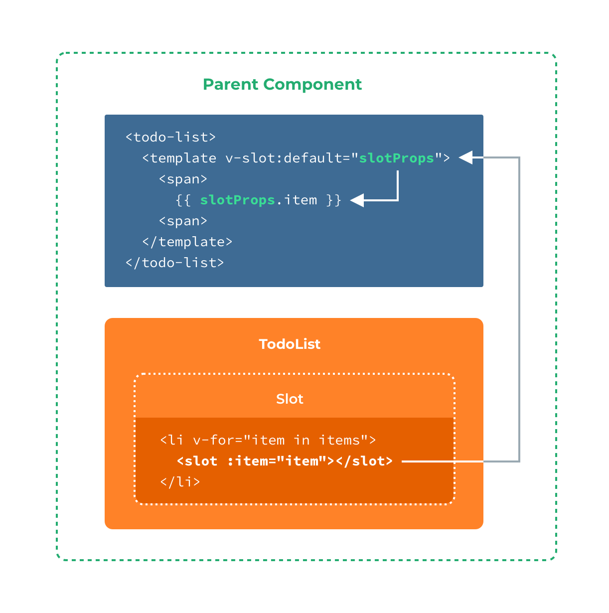
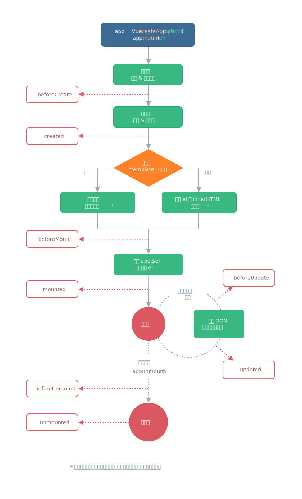

# Vue 3 组件


Vue 的组件本质上是一个具有预定义选项的实例，我们使用小型的、独立和通常可复用的组件，通过层层拼装，最终形成了一个完整的页面。

。组件必须先注册以便 Vue 应用能够识别，有两种组件的注册类型：

* 全局注册
* 局部注册


## 全局组件

（在根组件中）使用==方法 `app.component('component-Name', {})` 来注册全局组件==，全局注册的组件可以在应用中的**任何组件的模板中使用**。

其中第一个参数时组件名，推荐遵循 [W3C 规范](https://html.spec.whatwg.org/multipage/custom-elements.html#valid-custom-element-name)中的自定义组件名（避免与当前以及未来的 HTML 元素发生冲突）：字母**全小写**且**必须包含一个连字符**。第二个参数是组件的配置选项。

```js
const app = Vue.createApp();
app.component('my-component', {
    template: `<h1>Hello World!</h1>`
});
const vm = app.mount('#app')
```

:warning: 全局组件虽然可以方便地在各种组件中使用（包括其各自的内部），但是这可能造成构建项目时体积增大，用户下载 JavaScript 的无谓增加。

:bulb: 需要在 `app.mount('#app')` 应用**挂载到 DOM 之前**进行全局组件的注册


## 局部组件

在一个（父）组件中组件的 `components` 选项中注册的组件。

这些子组件**通过一个普通的 JavaScript 对象**来定义，其接收的参数和全局组件一样，但是它们**只能在该父组件中使用**，称为局部组件。

对于 `components` 对象中的每个 property 来说，其 **property 名就是自定义元素的名字**，其 property 值就是这个组件的选项对象。

```vue
const ComponentA = {
  /* ... */
}
const ComponentB = {
  /* ... */
}
const ComponentC = {
  /* ... */
}
```

```vue
// 然后在父组件的 `components` 选项中定义你想要使用的组件
const app = Vue.createApp({
  components: {
    'component-a': ComponentA,
    'component-b': ComponentB
  }
})
```


## 动态组件

内置的标签 `<component :is="componentName />"` 用以动态显式不同的组件，通过控制绑定在**属性 `is`** 上的参数值，即可显示相应的同名组件。

属性 `is` 可以是：

- 已注册组件的名字
- 一个组件的[选项对象](https://codepen.io/team/Vue/pen/oNXapXM)

:bulb: 有时候为了在切换时，保存动态组件的状态，例如组件中的输入框的值，可以用**标签 `<keep-alive></keep-alive>` 包裹动态组件**。

:bulb: 属性 `is` 还可以用于解决 HTML 元素嵌套的规则限制，将它应用到原生的 HTML 标签上，它的值就是组件名，这样原生标签实际渲染出来的内容就是组件。

因为对于 `<ul>`、`<ol>`、`<table>` 和 `<select>` 这些元素，其内部允许放置的直接子元素是有严格限制的，如果嵌入其他元素会被视为无效的内容，而提升到外部造成最终渲染问题。但如果我们需要在这些元素中使用组件作为直接子元素，则可以在「合法」的子元素上使用属性 `is`，指定渲染的实际内容，这时属性 `is` 用在原生的 HTML 元素上，如 `<tr>` 其值==需要使用 `vue:` 作为前缀，以表示解析的实际上是一个 Vue 组件==

```html
<table>
  <tr is="vue:blog-post-row"></tr>
</table>
```

但以上限制只是在 HTML 中直接使用 Vue 模板时才会遇到，如果是在一下前进使用模板就没有这种限制：

* 字符串，例如 `template: '...'`
* 单文件组件 `.vue`
* `<script type="text/x-template">`


## 异步组件

现在的大型网页往往需要异步获取不同的数据，Vue 有一个 `defineAsyncComponent` 方法定义异步组件，以优化应用的加载和用户体验。

异步组件在加载页面时并不立即渲染，而是要等带一些业务逻辑完成后，才会执行组件内的逻辑和渲染到页面上。

```js
// 全局组件
app.component('async-example', Vue.defineAsyncComponent(() => {
  return new Promise((resolve, reject) => {
    resolve({
      template: '<div>I am async!</div>'
    })
  })
}))

// 局部组件
import { createApp, defineAsyncComponent } from 'vue'

createApp({
  // ...
  components: {
    AsyncComponent: defineAsyncComponent(() => {
      return new Promise((resolve, reject) => {
        resolve({
          template: '<div>I am async!</div>'
        })
      })
    })
  }
})
```

异步组件的注册和一般的同步组件类似，如果是注册全局组件，也是使用 `app.component()`进行注册，不过**第二个参数使用 `Vue.defineAsyncComponent()` 方法告诉 Vue 应用该组件是异步组件**。

`defineAsyncComponent()` 方法的参数是一个匿名函数，而且函数是**返回一个 Promise**。在 Promise 内应该 **`resovlve({})` 一个对象，其中包含了构建组件相关配置参数**。只有当 Promise `resolve` 或 `reject` 才执行异步组件的处理。


## 组件间传值

### props

通过 Prop 向子组件传递数据。Prop 是在组件上注册的一些**自定义 attribute**。当一个值传递给一个 prop attribute 的时候，它就变成了那个组件实例的一个 property。

需要注意以下几点：

* 如果在父组件中传入的数据是非字符串的，需要**通过绑定 `v-bind:propName` 的方式来传递**（即使传递纯数字这一类的静态值）；否则**直接传递数据都会转换为字符串**。
* prop 应该遵循**单向数据流**，即**不应该在子组件中修改 prop 值**（因为这些数据是在父层的）

可以以**字符串数组**形式列出，也可以以**对象**形式列出（可指定 prop 接收的数据类型、默认值、是否必须、验证条件等）。


```js
// ...
props: {
  // 基础的类型检查 (`null` 和 `undefined` 会通过任何类型验证)
  propA: Number,
  // 有多个配置项可设
  propB: {
    type: String,
    required: true,
    default: 'abc',
    validator: func()   // 自定义验证函数，返回 true/false
  }
  // 带有默认值的对象
  propC: {
    type: Object,
    // 对象或数组默认值必须从一个工厂函数获取
    default() {
      return { message: 'hello' }
    }
  },
  // 具有默认值的函数
  propD: {
    type: Function,
    // 与对象或数组默认值不同，这不是一个工厂函数，而是一个函数，用作默认值
    default() {
      return defaultFunction() {...}
    }
  }
}
```

其中选项 `type` 可以对 prop 进行类型检查，支持原生类型和**自定义构造函数**（Vue 会通过 `instanceof` 进行检测）：

- String

- Number

- Boolean

- Array

- Object

- Date

- Function

- Symbol

- 自定义构造函数

  ```js
  // 自定义构造函数
  function Person(firstName, lastName) {
    this.firstName = firstName
    this.lastName = lastName
  }

  app.component('blog-post', {
    props: {
      author: Person // 验证 author 的值是否是通过 new Person 创建的
    }
  })
  ```

:warning: **这些 prop 的验证会在一个组件实例创建之前进行**，所以组件实例的 property 例如 `data`、`computed` 等，在 prop 验证的选项 `default` 或 `validator` 函数中是不可用的。

:bulb: 如果希望一个对象的所有属性都分别作为 prop 传入，可以使用**不带参数的 `v-bind` **，实现类似对象解构的效果

```js
post: {
  id: 1,
  title: 'My Journey with Vue'
}
```

调用组件

```html
<blog-post v-bind="post"></blog-post>
```

等价

```html
<blog-post v-bind:id="post.id" v-bind:title="post.title"></blog-post>
```

:bulb: 除了传递基础数据类型，还可以传递**函数**作为 prop，将在**父级定义的功能传递给子组件使用**。

```js
// 注册一个全局组件
app.component('date-component',{
  props:['getDate'],
  methods:{
    clickHandler(){
      this.getDate()  // 获取当前时间
    }
  },
  template:`<div @click="clickHandler">打印当前时间</div>`
})
```

```js
const app = Vue.createApp({
  data() {
    return {
      getDate: () => {
        const today = new Date();
        console.log(today.toLocaleDateString())
      }
    }
  },
  template: `
    <h2>Date</h2>
    <date-component :getDate="getDate" />
  `
})
```

### provide 和 inject

除了通过 props 从父组件向子组件传值，还可以用 `provide` 和 `inject` 实现从祖先组件向其子孙后代组件传值，这种方法**不论组件层次嵌套有多深**。


父组件有一个 `provide` 选项来提供数据，子组件有一个 `inject` 选项来开始使用这个数据。

```js
// 父组件
app.component('todo-list', {
  provide: {
    user: 'John Doe'
  },
})

// 子组件
app.component('todo-list-statistics', {
  inject: ['user'],
  created() {
    console.log(`Injected property: ${this.user}`) // 注入 property: John Doe
  }
})
```

:warning: 要访问父组件**实例 property**，我们需要将 `provide` 转换为**返回对象的函数**

```js{9}
// 父组件
app.component('todo-list', {
  data() {
    return {
      todos: ['Feed a cat', 'Buy tickets']
    }
  },
  provide() {
    return {
      todoLength: this.todos.length // 访问 todos property
    }
  },
  template: `
    ...
  `
})
```

:bulb: 默认情况下，`provide/inject` 绑定并**不**具有响应式，可以**通过组合式 API `computed` 来实现数据的响应式**。也可以在 `setup` 中可以[使用`ref` property 或 `reactive` 对象包装变量](https://v3.vuejs.org/guide/composition-api-provide-inject.html#reactivity)，再传递给 `provide` 来实现响应式。

```vue
app.component('todo-list', {
  // ...
  provide() {
    return {
      todoLength: Vue.computed(() => this.todos.length) // 通过 computed 进行包装实现响应式
    }
  }
})

app.component('todo-list-statistics', {
  inject: ['todoLength'],
  created() {
    console.log(`Injected property: ${this.todoLength.value}`) // Injected property: 5
  }
})
```

### emit

当组件需要修改父层控管的数据（这些数据通过 props 传递进来）时，基于**单向数据流原则**不能在组件内进行修改，而是需要通过 `$emit('eventName', value)`  **向外抛出自定义的事件**，通知父层进行数据修改，其中 `value` 一般是向外传递的需要变动的数据。

然后在父层通过 `v-on:eventName` 或简写 `@eventName` 来监听这个子组件抛出的自定义事件。

如果子组件伴随着事件，同时抛出数据（第二个参数 `value`），那么在父级的内联事件处理器中可以通过 `$event` 访问到被抛出的这个值。

```html
<blog-post ... @enlarge-text="postFontSize += $event"></blog-post>
```

如果父级的事件处理函数是一个方法，抛出的数据会作为第一个参数传入这个方法

```html
<blog-post ... @enlarge-text="onEnlargeText"></blog-post>
```

```js
methods: {
  onEnlargeText(enlargeAmount) {
    this.postFontSize += enlargeAmount
  }
}
```

:bulb: **自定义事件名推荐使用 kebab-case 方式**（小写单词之间用连字符 `-` 连接，因为与组件和 prop 名称不同，Vue 不会对事件名进行任何大小写转换），以便于 HTML 正确识别

==Vue 3 目前为组件提供一个 `emits` 选项==，和选项 `props` 作用类似，**用来定义子组件可以向其父组件触发的事件**。

该选项可以接受字符串作为元素的数组，也可以接收一个对象。在对象中可以为事件[设置**验证器**](https://v3.cn.vuejs.org/api/options-data.html#emits)，和 `props` 定义里的验证器类似。

==在对象语法中，每个 property 的值可以为 **`null` 或验证函数**，该函数将**接收调用 `$emit` 时传递的数据**。验证函数应**返回布尔值**，以表示事件参数是否有效。==

```js
const app = createApp({})

// 数组语法
app.component('todo-item', {
  emits: ['check'],
  created() {
    this.$emit('check')
  }
})

// 对象语法
app.component('reply-form', {
  emits: {
    // 没有验证函数
    click: null,

    // 带有验证函数
    submit: payload => {
      if (payload.email && payload.password) {
        return true
      } else {
        console.warn(`Invalid submit event payload!`)
        return false
      }
    }
  }
})
```

强烈建议使用选项 `emits` 记录每个组件可以触发的事件，因为 ==Vue 3 移除了 `.native` 修饰符，对于**未**在子组件中的选项 `emits` 定义的事件，Vue 现在将把它们**作为原生事件监听器**==（这一点和 Vue 2 不同，Vue 2 对于在使用组件时才添加的事件监听，都认为是监听自定义事件，即只有通过 `$emit` 触发的事件），添加到子组件的根元素中（除非在子组件的选项中设置了 `inheritAttrs: false`）。

```html
<!-- 监听从组件触发的自定义事件 close 和原生事件 click -->
<my-component
  v-on:close="handleComponentEvent"
  v-on:click="handleNativeClickEvent"
/>

<script>
// component
app.component('MyComponent', {
  emits: ['close']
})
</script>
```

### 在组件上使用 v-model

在使用[自定义的**输入型组件**](https://v3.vuejs.org/guide/component-basics.html#using-v-model-on-components)时，Vue 为它们进行优化，也支持使用 `v-model` 实现双向绑定。

```html
<custom-input v-model="searchText"></custom-input>

<!-- 等价于以下代码 -->
<custom-input
  :model-value="searchText"
  @update:model-value="searchText = $event"
></custom-input>
```

在外部（引用该组件时，在组件的标签上）通过指令 `v-model` 双向绑定需要同步的变量，它的数据默认作为一个==名为 `modelValue` 的 prop== 传递到组件内（**因此记得在组件内部，需要在 `props` 选项里声明 `modelValue` 作为 prop**），作为子组件内部表单元素的 `value` 属性的值。

只需要在这些组件的内部进行相应的处理：

* 在组件内使用指令 `v-bind` 将**表单元素的 `value` 属性绑定到以上声明的 prop 变量 `modelValue`** 上，即  `v-bind:value="modelValue"`（这样就可以将外部传进来的值作为表单的值，实现与外部数据的「同步」）
* 在组件内使用指令 `v-on` 监听表单元素  `input` 输入事件，并通过**抛出 `update:modelValue` 事件** `$emit('update:modelValue', $event.target.value)`  向外传递相应的数据，然后外部就会接收抛出的事件，并对指令 `v-model` 绑定的变量基于抛出的数据进行改变**（即数据的修改的操作还是在父层完成）**

```js
// conpoment
app.component('custom-input', {
  props: ['modelValue'],
  emits: ['update:modelValue'],
  template: `
    <input
      :value="modelValue"
      @input="$emit('update:modelValue', $event.target.value)"
    >
  `
})
```

```html
<custom-input v-model="searchText"></custom-input>
```

:warning: Vue 2 提供了 `.sync` 修饰符，通过 `v-bind:propName.sync="variable"` 和 `$emit('update:propName', newValue)` 实现类似双向绑定的功能；但==在 Vue 3 中 `.sync` 修饰符已被移除==，而现在 Vue 3 使用类似的语法（组件也是抛出以 `update:` 为前缀的事件）实现的。

默认传递的 prop 变量是 `modelValue` 默认监听抛出的事件是 `update:modelValue`，这种方法更通用，对于 `type="text"` 或 `type=checkbox` 其语义都不会混淆。如果需要修改 `modelValue` 这个默认值，在 Vue 2 中可以通过[选项 `model`](https://vuejs.org/v2/guide/components-custom-events.html#Customizing-Component-v-model) 进行配置，但==在 Vue 3 中 `model` 选项已移除==，作为替代可以在父级中**为 `v-model` 添加参数**，这个 argument 就是 prop 变量名和需要监听的事件名（加上 `update:` 前缀）

```html
<!-- 使用组件 -->
<my-component v-model:title="bookTitle"></my-component>

<!-- 是以下的简写 -->
<my-component :title="bookTitle" @update:title="bookTitle = $event" />
```

```js
// 组件
app.component('my-component', {
  props: {
    title: String
  },
  emits: ['update:title'],
  template: `
    <input
      type="text"
      :value="title"
      @input="$emit('update:title', $event.target.value)">
  `
})
```

在 Vue 3 中利用特定的 prop（通过调用组件时使用指令 `v-model` 的参数设置）和抛出相应事件，==可以在单个组件上创建**多个 `v-model`**，从而实现多个 prop 的双向绑定==

```html
<!-- 使用组件，实现 first-name 和 last-name 的双向绑定 -->
<user-name
  v-model:first-name="firstName"
  v-model:last-name="lastName"
></user-name>
```

```js
app.component('user-name', {
  props: {
    firstName: String,
    lastName: String
  },
  emits: ['update:firstName', 'update:lastName'],
  template: `
    <input
      type="text"
      :value="firstName"
      @input="$emit('update:firstName', $event.target.value)">

    <input
      type="text"
      :value="lastName"
      @input="$emit('update:lastName', $event.target.value)">
  `
})
```

在输入型组件上使用指令 `v-model` 时，不仅支持 Vue 内置的修饰符 `.trim`、`.number`、`.lazy`，==Vue 3 还支持添加**自定义的修饰符**，添加到组件 `v-model` 的修饰符将通过 **`modelModifiers` prop** 提供给组件。==

:bulb: 修饰符应该在指令的参数后，而且修饰符支持多个链式使用

```html
<!-- 使用自定义修饰符，实现字符串首字母大写 -->
<my-component v-model.capitalize="myText"></my-component>
```

```js
// 组件
app.component('my-component', {
  props: {
    modelValue: String,
    // modelModifiers prop 这里我们提供了初始值
    modelModifiers: {
      default: () => ({})
    }
  },
  emits: ['update:modelValue'],
  methods: {
    // 表单 input 事件的处理函数
    emitValue(e) {
      let value = e.target.value
      // 如果 v-model 有修饰符 capitalize 就对表单输入值实现首字母大写
      if (this.modelModifiers.capitalize) {
        value = value.charAt(0).toUpperCase() + value.slice(1)
      }
      // 抛出事件
      this.$emit('update:modelValue', value)
    }
  },
  template: `
    <input type="text"
      :value="modelValue"
      @input="emitValue">`,
  created() {
    // 当组件的 created 生命周期钩子触发时，会根据调用组件的情况对 modelModifiers prop 进行设置
    // 由于这个例子中 v-model 的修饰符为 capitalize，因此 modelModifiers 对象会包含 capitalize 属性
    console.log(this.modelModifiers) // { capitalize: true }
  }
})
```

==**如果 `v-model` 设置了参数**，则添加到组件 `v-model` 的自定义的修饰符将通过 **`arg` + `Modifiers`  形式的 prop** 提供给组件。==

```html
<my-component v-model:description.capitalize="myText"></my-component>
```

```js
app.component('my-component', {
  props: ['description', 'descriptionModifiers'],
  emits: ['update:description'],
  template: `
    <input type="text"
      :value="description"
      @input="$emit('update:description', $event.target.value)">
  `,
  created() {
    console.log(this.descriptionModifiers) // { capitalize: true }
  }
})
```


## 非 prop 属性

非 prop 的 attribute 是指未在组件的 `props` 或 ==`emits` 选项==中显式声明的，但在引用组件时传递给子组件的 attribute，这些 attribute会默认被添加到这个组件的**根元素**上，即在组件的模板中作为容器的第一层的 `<tag>` 上。


:bulb: 如果希望 attribute 添加到组件的非根节点上，可以设定组件的**选项 `inheritAttrs: false`**，然后将特殊的变量 `$attrs`（这是一个包含所有非 prop 的 attribute 的对象）绑定 `v-bind="$attrs"` 到指定的节点上，==在 Vue 3 中**包括 `class` 、 `style`、`v-on`** 也指定到该元素上==。也可指定某个 attribute 绑定 `:attributeName="$attrs.propertyName"`

```js
app.component('date-picker', {
  inheritAttrs: false,
  template: `
    <div class="date-picker">
      <input type="datetime-local" v-bind="$attrs" />
    </div>
  `
})
```

:bulb: ==非 prop attribute 在 Vue 3 中**包括 `class` 、 `style`、`v-on`**，将添加的事件监听也纳入其中，因此在 Vue 3 中移除了 `$listeners` 对象==

```html
<date-picker @change="submitChange"></date-picker>
```

```js
app.component('date-picker', {
  created() {
    console.log(this.$attrs) // { onChange: () => {}  }
  }
})
```

:warning: 由于 ==Vue 3 支持组件存在多个根节点==，因此与 Vue 2 只允许单个根节点组件不同，**具有多个根节点的组件不具有自动 attribute 回退行为**，因此如果未显式绑定 `$attrs`，将发出运行时警告。

```js
// 这将发出警告
app.component('custom-layout', {
  template: `
    <header>...</header>
    <main>...</main>
    <footer>...</footer>
  `
})

// 没有警告，$attrs被传递到<main>元素
app.component('custom-layout', {
  template: `
    <header>...</header>
    <main v-bind="$attrs">...</main>
    <footer>...</footer>
  `
})
```


## 插槽

插槽 slot 是 Vue 实现的一套**内容分发**的 API，一般用于组件作为布局 layout 使用。

在子组件的模板中使用 `<slot>` 元素作为占位符

```vue
<!-- todo-button 组件模板 -->
<button class="btn-primary">
  <slot></slot>
</button>
```

然后在调用组件时，可以传递内容到插槽指定的位置

```vue
<todo-button>
  Add todo
</todo-button>
```

:hammer: 当组件渲染的时候，将会用给定的内容替换插槽，实现内容的分化。

```vue
<!-- 渲染 HTML -->
<button class="btn-primary">
  Add todo
</button>
```

:bulb: 可以在子组件模板的插槽标签内预置一些**默认内容**，它只会在没有提供内容的时候被渲染。

###  具名插槽

如果要将多个内容分发到子组件不同节点，可以在子组件模板中设置多个**具名操作**，即为子组件的标签 `<slot>` 添加属性 `name`。

```vue
<div class="container">
  <header>
    <slot name="header"></slot>
  </header>
  <main>
    <slot></slot>
  </main>
  <footer>
    <slot name="footer"></slot>
  </footer>
</div>
```

然后在父组件中使用 `<template>` 元素，并以 `v-slot` 指令和相应的**参数**指定内容分化到子组件的哪一个插槽。

:bulb: 其中参数 `default` 是默认插槽，如果分化内容不指定插槽名称时，都放到子组件的默认插槽中

```vue
<base-layout>
  <template v-slot:header>
    <h1>Here might be a page title</h1>
  </template>

  <template v-slot:default>
    <p>A paragraph for the main content.</p>
    <p>And another one.</p>
  </template>

  <template v-slot:footer>
    <p>Here's some contact info</p>
  </template>
</base-layout>
```

:bulb: 设置具名插槽的指令 `v-slot:slotName` 有**缩写 `#slotName`**

```vue
<base-layout>
  <template #header>
    <h1>Here might be a page title</h1>
  </template>

  <template #default>
    <p>A paragraph for the main content.</p>
    <p>And another one.</p>
  </template>

  <template #footer>
    <p>Here's some contact info</p>
  </template>
</base-layout>
```

:warning: 然而，和其它指令如 `v-bind:param` 缩写 `:param`、`v-on:eventName` 缩写 `@eventName` 一样，**该缩写只在其有参数的时候才可用**，这意味着以下语法是无效的：

```vue
<!-- This will trigger a warning -->

<todo-list #="{ item }">
  <i class="fas fa-check"></i>
  <span class="green">{{ item }}</span>
</todo-list>

<!-- The right way -->
<todo-list #default="{ item }">
  <i class="fas fa-check"></i>
  <span class="green">{{ item }}</span>
</todo-list>
```

### 作用域插槽

在父级组件中分化的内容，只能使用其作用域中的数据，而不能访问子组件的数据。

如果要让分化的内容能够访问子组件中才有的数据，需要在子组件模板设置插槽时，将数据绑定到插槽标签 `<slot>` 的相应属性上，这些 attribute 称为**插槽 props**

```vue
// 子组件 todo-list 的模板
<ul>
  <li v-for="( item, index ) in items">
    <slot :item="item"></slot>
  </li>
</ul>
```

然后在父组件中，可以用**指令 `v-slot` 的值**来接收子组件「抛出」的数据，该值是**包含所有插槽 prop 的一个对象**，以下例子中将该对象命名为 `slotProps` 你可以使用其他名称

```vue
<todo-list>
  <template v-slot:default="slotProps">
    <span class="green">{{ slotProps.item }}</span>
  </template>
</todo-list>
```



:bulb: 如果组件只有一个插槽，即只有默认插槽时，在调用组件时可以**把 `v-slot` 直接用在组件标签上**，即把组件的标签当作插槽的模板 `<template>` 来使用，即以上例子父组件的**简写形式**：

```vue
// 简写形式
<todo-list v-slot:default="slotProps">
  <span class="green">{{ slotProps.item }}</span>
</todo-list>

// 甚至省略 default 参数
<todo-list v-slot="slotProps">
  <span class="green">{{ slotProps.item }}</span>
</todo-list>
```

:warning: 以上简写只能将内容分化到一个插槽，**只要出现多个插槽，请始终为所有的插槽使用完整的基于 `<template>` 的语法**。

:bulb: 如果父组件在分化内容时只使用了插槽 prop 对象中某几个属性时，可以使用**解构**来简化代码

```vue
<todo-list v-slot="{ item }">
  <i class="fas fa-check"></i>
  <span class="green">{{ item }}</span>
</todo-list>

<!-- 解构也可以实现插槽 prop 属性的重命名，以下将 item 重命名为 todo -->
<todo-list v-slot="{ item: todo }">
  <i class="fas fa-check"></i>
  <span class="green">{{ todo }}</span>
</todo-list>

<!-- 定义备用内容，用于插槽 prop 是 undefined 的情形 -->
<todo-list v-slot="{ item = 'Placeholder' }">
  <i class="fas fa-check"></i>
  <span class="green">{{ item }}</span>
</todo-list>
```


## 混入

混入 mixin 是指将组件选项中可复用的部分「抽取」出来成为一个对象（可以包含 `computed`、`method`、`watch` 等），以供其他组件复用。然后在组件（包括根组件）的选项 `mixins` 中使用该对象即可复用；或通过 `app.mixin({})` 进行全局混入。

```js
// 定义一个混入对象
var myMixin = {
  created: function () {
    this.hello()
  },
  methods: {
    hello: function () {
      console.log('hello from mixin!')
    }
  }
}

// 定义一个使用混入对象的组件
var Component = Vue.extend({
  mixins: [myMixin]
})

var component = new Component() // => "hello from mixin!"
```

当组件和混入对象含**有同名选项**时，这些选项将以恰当的方式进行「[合并](https://v3.vuejs.org/guide/mixins.html#option-merging)」

:bulb: 但是由于 Mixin 很容易引起 property 名冲突，而且不能向 mixin 传递任何参数而降低了它们的灵活性。为了解决这些问题，让代码复用更高效，在 Vue 3 新增了一种通过逻辑关注点组织代码的新方法——[组合式 API](./组合式API)。


## 模板引用

如果想引用组件在挂载到页面后的 DOM 节点，可以为组件的模板添加 `ref` 属性，然后就可以通过变量 `$refs` 来访问相应的元素。

例如在组件挂载时，以编程的方式 focus 到这个 input 上

```js
const app = Vue.createApp({})

app.component('base-input', {
  template: `
    <input ref="input" />
  `,
  methods: {
    focusInput() {
      this.$refs.input.focus()
    }
  },
  mounted() {
    this.focusInput()
  }
})
```

:warning: 变量 `$refs` 只会在组件渲染完成之后生效，这仅作为一个用于直接操作子元素的「逃生舱」，应该尽量避免在模板或计算属性中通过 `$refs` 直接操作 DOM 节点，而应该通过数据驱动 DOM 变更。

:bulb: 在 Vue 2 中在 `v-for` 里使用的 `ref` attribute 则变量 `$refs` 会是相应的数组。==而在 Vue 3 中在这种情况下**不**再会为 `$ref` 自动创建数组，如果要在 `v-for` 的单个绑定获取多个 ref（列表），可以**将 `ref` 绑定到一个函数上，默认传递 DOM 作为参数**==：

```html
<div v-for="item in list" :ref="setItemRef"></div>
```

```js
export default {
  data() {
    return {
      itemRefs: []
    }
  },
  methods: {
    setItemRef(el) {
      if (el) {
        this.itemRefs.push(el)
      }
    }
  },
  beforeUpdate() {
    this.itemRefs = []
  },
  updated() {
    console.log(this.itemRefs)
  }
}
```

对于以上实例 `itemRefs` 不必是数组，也可以是一个对象，然后通过可迭代对象的 key 设置 ref；如果需要，`itemRef` 也可以是响应式的且可以被监听


## 生命周期函数

每个组件在被创建时都要经过一系列的初始化过程：设置数据监听、编译模板、将实例挂载到 DOM 并在数据变化时更新 DOM 等。Vue 在这个过程中也会运行一些叫做**生命周期钩子**的函数，这给了用户在不同阶段添加自己的代码的机会。



* `beforeCreate()` 在实例生成之前
* `created()` 在实例生成之后，可以访问响应性数据
* `beforeMount()` 在模板渲染后，但还没挂载到 DOM 之前，可以访问 `app.$el`（其中 `app` 是 Vue 实例）虚拟 DOM
* `mounted()` 实例挂载到 DOM 之后
* `beforeUpdate()` 响应式数据发生变换，虚拟 DOM 执行重新渲染和更新前
* `updated()` 响应式数据发生变换，虚拟 DOM 执行重新渲染和更新后
* ==`beforeUnmount()` 销毁 Vue 实例时，销毁之前执行==
* ==`unmounted()` 销毁 Vue 实例时，销毁之后执行==

:bulb: ==可以通过调用函数 `app.unmount()` 销毁实例==（其中 `app` 是 Vue 实例），相关的生命周期函数是 `beforeUnmount()` 和 `unmounted()`

:warning: 生命周期钩子的 `this` 上下文指向调用它的当前活动实例，一般是组件实例 `vm`，因此注意**不**要在回调上（对于选项 property 而言也是）使用箭头函数，因为箭头函数并没有 `this`，`this` 会作为变量一直向上级词法作用域查找，可能会导致错误。

