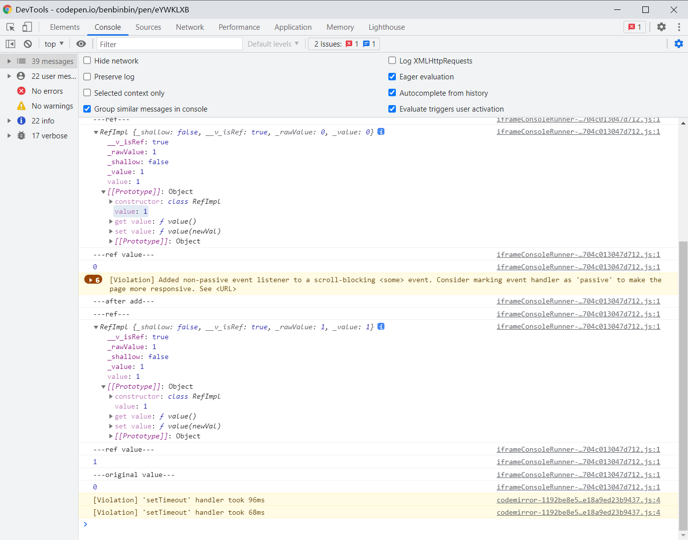
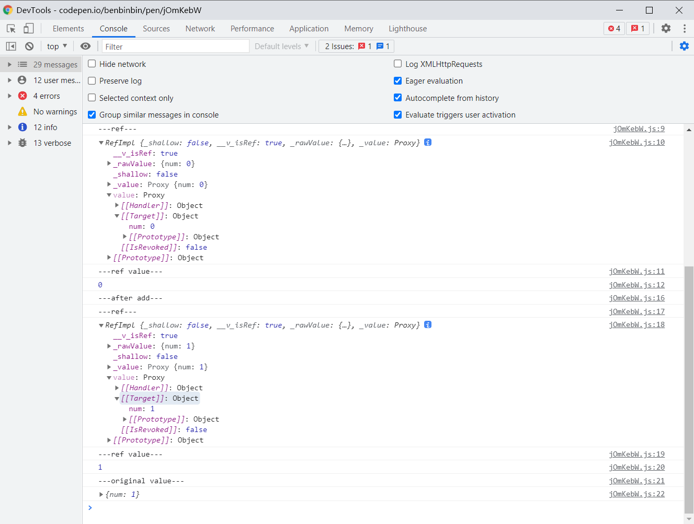
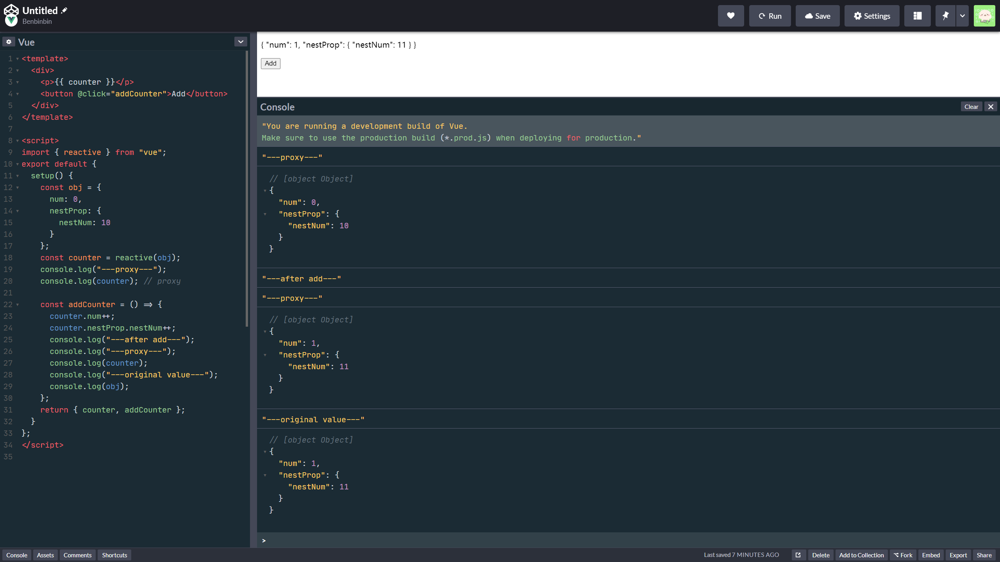
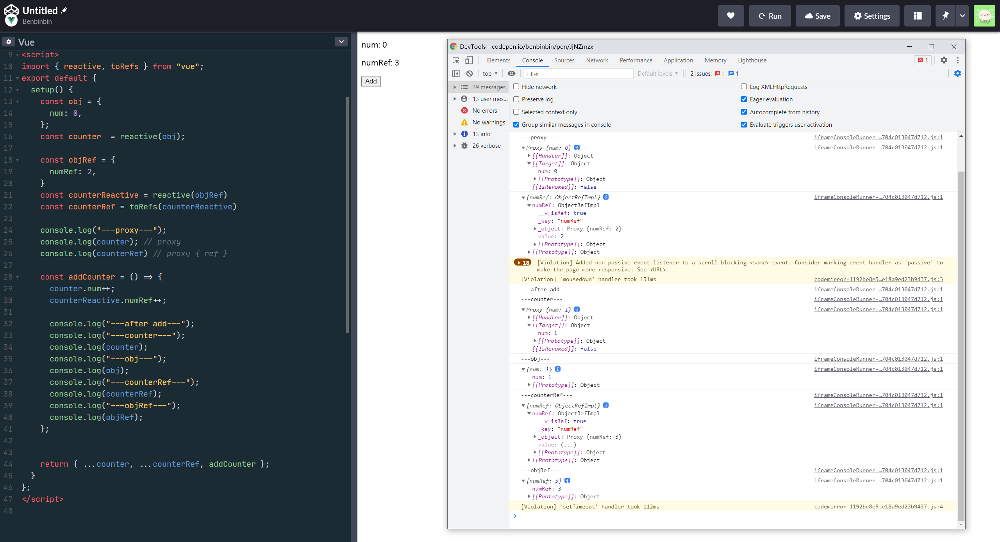

# 组合式 API

Vue 通过组件可以实现代码重用，但是由于组件基于各种选项，如 `data`、`computed`、`methods`、`watch` 等，使得同一个功能的逻辑分离四散，这种碎片化使得理解和维护复杂组件变得困难，因为在处理单个逻辑关注点时，不得不在相关代码的选项块之间不断「跳转」。

以下分别使用了组件选项构建的组件，其中逻辑关注点按颜色进行区分。


因此 ==Vue 3 提供了**组合式 API**，即各种组件选项的相应替代方法，它们在选项 `setup` 中使用，可以让单个功能的逻辑代码集合到一起==，便于管理维护，还可以实现更精细的代码共享和重用。


## setup

Vue 3 新增了一个组件选项 `setup`，它是一个函数，在其中可以调用组合式 API，其返回的所有内容都暴露给组件的其余部分（其他选项，如 `computed`、`methods`、生命周期钩子等等，一般返回的内容供模板使用：

* 一些响应式变量，相当于 `data` 选项的作用
* 一些函数，相当于 `methods` 选项的作用

:bulb: 但不推荐在同一个组件中混合使用选项 API 和组合式 API。

`setup` 函数是在组件创建**之前**（在 `data`、`computed` 或 `methods` 选项被解析之前，比 `beforeCreate` 更早）执行，一旦 `props` 被解析，就将作为组合式 API 的入口。因此在 `setup()`  应该**避免**使用 `this`（因为它找不到组件实例）和访问 `data`、`computed`、`methods` 选项。

`setup(props, context)` 接收两个参数：

* `props` 一个对象，包含从父级传递进来的**响应式数据**，因此当传入的 prop 更新时，它将被更新。

  所有在子组件中声明了的 prop，不管父组件是否向其传递了，都将出现在 `props` 对象中。其中未被传入的可选的 prop 的值会是 `undefined` 

  :bulb: `props` 对象中的 property 可以在模板中直接访问

  :warning:因为 `props` 对象是响应式的，所以**不**应该使用 ES6 解构语法去读取其中的属性，因为这可能会导致变量的响应性丢失（如果解构后，变量「接到」的值是基础数据类型，那么变量就会丢失响应性）。

  ==如果真的需要解构 `props`，可先**使用函数 `toRefs(props)`** 将 `props` 对象的每个属性（即每个 prop）包裹为一个 ref 对象，这样 `props` 对象解构后分配给每个变量都指向源对象的属性，依然保持了数据的响应性。==如果一个 prop 是可选的，例如 `title` 是可选的 prop，则调用组件时，可能传入的 `props` 中没有 `title`，在这种情况下，`toRefs` 处理 `props` 对象时，将不会为 `title` 创建一个 ref 对象，此时需要使用 `toRef(props, title)` 来替代，专门为该属性手动显式创建一个 ref 对象作为属性值。

* `context` 一个对象，不是响应式的，可以通过解构来访问暴露组件的三个 property `attrs`、`slots`、`emit`

  * `attrs` 是一个包含了组件所有非 props 的属性的对象
  * `slots` 是一个包含包含组件通过插槽分发的内容的对象
  * `emit` 是一个方法，可以调用该方法手动触发一个自定义事件

  :bulb: 由于`attrs` 和 `slots` 是**非**响应式的。如果打算根据 `attrs` 或 `slots` 更改应用副作用（响应它们的变化执行相应的操作），那么应该在 `onUpdated` 生命周期钩子中执行此操作。
  
  :warning: `attrs` 和 `slots` 是有状态的对象，它们是会随**组件本身**的更新而更新，因此应该**避免**对它们本身进行**解构**，并始终以 `attrs.x` 或 `slots.x` 的方式引用它们的属性

```js
export default {
  props: {
    user: {
      type: String,
      required: true
    }
  },
  setup(props) {
    console.log(props) // { user: '' }

    return {} // 这里返回的任何内容都可以用于组件的其余部分
  }
}
```


## 响应性

在选项式 API `data` 中定义的属性都可以成为响应式数据，而在组合式 API 中 Vu3 提供了多个函数对数据进行处理，使得存储该数据的变量具有响应性。

:bulb: 更多关于响应式 API 使用技巧可以参考这个[视频](https://www.bilibili.com/video/BV1x54y1V7H6)和这一篇[文章](https://chupai.github.io/posts/2104/compositionapi)。

### 添加响应式

Vue 3 提供 `ref()` 和 `reactive()` 两个函数来手动为数据添加响应性。

🎉 虽然 `ref` 函数也可接收对象数据类型的值，但是由于对象已经是通过引用传递的，因此无需再使用 `ref` 函数为其包裹一层 ref 对象。所以对于**基础数据类型**的值推荐使用 `ref` 函数获取响应性变量；而对于**对象原来就是引用数据类型**的值推荐使用 `reactive` 函数获取响应性变量。

#### ref

**`ref` 函数**可以接收任何类型的数据，然后它会返回一个对象，称为 ref 对象。

该对象只有一个属性 `value`，它将接收到的参数作为该属性的初始值，即将传入的值「包裹」在一个对象中，为该值创建了一个**响应式引用**（存储 ref 对象的变量具有**响应式**，即更改其值后，模板也会相应更新）。由于通过封装，因此在读取或更改数据，需要访问变量的属性 `value`。

:bulb: ==在 `setup` 选项最后 `return` 返回的对象中 Vue 会判断变量是否为 ref 对象，如果是就会自动[浅**解包 unwrap**](https://v3.cn.vuejs.org/guide/reactivity-fundamentals.html#ref-%E8%A7%A3%E5%8C%85)，因此在模板或其他选项中**不**需要通过属性 `value` 读取变量的值，直接使用变量即可（但是如果要访问 ref 对象中嵌套的值时，仍需要在模板中添加 `.value`，例如 `nested.count.value`）==

```vue
<template> 
  <div>
    <p>{{ counter }}</p>
    <button @click="addCounter">Add</button>
  </div>
</template>

<script>
import { ref } from "vue";
export default {
  setup() {
    const num = 0;
    const counter = ref(num);
    console.log("---ref---");
    console.log(counter); // { value: 0 }
    console.log("---ref value---");
    console.log(counter.value); // 0

    const addCounter = () => {
      counter.value++;
      console.log("---after add---");
      console.log("---ref---");
      console.log(counter);
      console.log("---ref value---");
      console.log(counter.value);
      console.log("---original value---");
      console.log(num);
    };
    return { counter, addCounter };
  }
  methods: {
    resetCouter() {
        this.counter = 0; 
    }
  }
};
</script>
```

:hammer: 以上[示例](https://codepen.io/benbinbin/pen/eYWKLXB)点击按钮后，控制台输出



:bulb: 因为在 JS 中 `Number` 或 `String` 等**基本类型是通过拷贝值（而非引用的方式）直接传递的**，而对象和数组则是通过引用传递的，因此函数 `ref()` 将传入的值封装在一个对象中，这样就可以让不同数据类型的行为统一，任何类型的数据都被「包裹」在 ref 对象中，再在整个应用中通过引用方式安全地传递，不必担心在某个地方失去它的响应性。相应地，对响应式变量需要**谨慎地使用解构**，因为拆分后的传递就可能不是引用式传递，可能会破坏数据的响应性。


:bulb: 当入参是基础数据类型，那么该原始值是被**拷贝**到 ref 对象中的，因此之后对响应式变量的值进行更改时，**原始值并不受影响**；==如果**入参是对象**，则先通过 `reactive` 方法使该对象具有高度的响应式（深层嵌套的属性也具有响应性），返回一个 proxy，然后再将该 proxy「包裹」在 ref 对象中，作为对象唯一属性 `value` 的值==，由于 `reactive` 方法是在原对象上加一层代理，内部依然指向原对象，所以之后对响应式变量的值进行更改时，**原对象也会受影响**。

```vue
<template>
  <div>
    <p>{{ counter }}</p>
    <button @click="addCounter">Add</button>
  </div>
</template>

<script>
import { ref } from "vue";
export default {
  setup() {
    const obj = {
      num: 0
    };
    const counter = ref(obj);
    console.log("---ref---");
    console.log(counter); // { value: proxy }
    console.log("---ref value---");
    console.log(counter.value.num); // 0

    const addCounter = () => {
      counter.value.num++;
      console.log("---after add---");
      console.log("---ref---");
      console.log(counter);
      console.log("---ref value---");
      console.log(counter.value.num);
      console.log("---original value---");
      console.log(obj);
    };
    return { counter, addCounter };
  }
};
</script>
```

:hammer: 以上[示例](https://codepen.io/benbinbin/pen/jOmKebW)点击按钮后，控制台输出



#### reactive

`reactive` 函数**接收一个对象**，返回一个 proxy，相当于在原对象上加一层代理返回对象的**响应式**副本（存储 proxy 对象的变量具有**响应式**，即更改其值后，模板也会相应更新；由于 proxy 内部指向原对象，因此修改变量的值后，原对象也会变），而且响应式转换是**支持深层嵌套的属性**。

:bulb: `reactive` 返回对象的**响应式**副本，相当于在原对象上加一层代理实现响应性，因此操作该对象时和普通对象一样，访问和修改对象的属性时，**无需**像 ref 对象通过 `value` 属性「中转」。

:bulb: 由于 `reactive` 方法是在原对象上加一层代理，内部依然指向原对象，所以之后对响应式变量的值进行更改时，**原对象也会受影响**。

```vue
<template>
  <div>
    <p>{{ counter }}</p>
    <button @click="addCounter">Add</button>
  </div>
</template>

<script>
import { reactive } from "vue";
export default {
  setup() {
    const obj = {
      num: 0,
      nestProp: {
        nestNum: 10
      }
    };
    const counter = reactive(obj);
    console.log("---proxy---");
    console.log(counter); // proxy

    const addCounter = () => {
      counter.num++;
      counter.nestProp.nestNum++;
      console.log("---after add---");
      console.log("---proxy---");
      console.log(counter);
      console.log("---original value---");
      console.log(obj);
    };
    return { counter, addCounter };
  }
};
</script>
```

:hammer: 以上[示例](https://codepen.io/benbinbin/pen/bGWKmKe)点击按钮后，控制台输出



:bulb: 如果接受一个 ref 对象，`reactive` 会自动解包内部值，使其行为类似于普通 property，这样访问 proxy 对象的属性时就无需通过 `value` 属性了。也可以通过赋值的方式传递 ref 对象。

Ref 解包仅发生在被响应式 `Object` 嵌套的时候。当从 `Array` 或原生集合类型如 `Map` 访问 ref 对象时，不会进行解包

```js
const count = ref(0)
const state = reactive({
  count
})

console.log(state.count) // 0

state.count = 1
console.log(count.value) // 1

const otherCount = ref(2)

state.count = otherCount
console.log(state.count) // 2
console.log(count.value) // 1

const books = reactive([ref('Vue 3 Guide')])
// 这里需要 .value
console.log(books[0].value)

const map = reactive(new Map([['count', ref(0)]]))
// 这里需要 .value
console.log(map.get('count').value)
```

:warning: **不**应该对 `reactive` 函数返回的 proxy 对象进行**解构**，因为这可能会导致变量的响应性丢失。==例如真的需要解构 `props`，可先**使用函数 `toRefs(props)`** 将 `props` 对象的每个属性（即每个 prop）包裹为一个 ref 对象，这样 `props` 对象解构后分配给每个变量都指向源对象的属性，依赖保持了数据的响应性。==

如果解构后，变量「接到」的值是基础数据类型，那么变量就会丢失响应性，由于代理实现的响应性针对的是原对象，这样改变对象的属性值后，页面模板相应的数据也无法更新。而如果使用 `toRefs` 方法，将每个属性都包裹为一个 ref 对象，那么解构后各属性值依然可以保证是通过引用方式传递给各个变量的，这样就可以**维持响应性**，对象的属性值修改后，页面模板的相应数据也响应式地更新。

:hammer: 以上[示例](https://codepen.io/benbinbin/pen/JjNZmzx)点击按钮后，控制台输出，其中 `num` 是 proxy 直接解构得到的变量，`numRef` 是 proxy 经过 `toRefs()` 处理后解构得到的变量。



### 维持响应性

#### toRefs

**函数 `toRefs(obj)`** 将为传入的对象的每个属性值包裹一个 ref 对象，这样对象解构后属性值（通过引用方式）分配给的每个变量，这些变量依然都指向源对象的属性，依然保持了数据的响应性。 

:warning: 一般传入 `reactive` 函数返回的 proxy 对象，以便在 `setup` 选项最后以解构的形式抛出对象的属性，方便在模板中调用。==如果[传入 `toRefs` 函数的是普通的对象](https://codepen.io/benbinbin/pen/rNmKQvb)，即数据原来就**不具有响应性**，那么最后解构得到的变量也不会是响应式的（更改变量的值后，页面模板的数据不会相应地更新）。==

#### toRef

**函数 `toRef(obj, propertyName)`** 将给定对象上指定的属性值包裹一个 ref 对象，然后单独「抽出」该属性值（赋值给变量，该变量指向源对象的属性），进行传递时仍可保持数据的响应性。可以将它理解为 `toRefs` 函数的「单数」版本。

:bulb: 与 `toRefs` 函数不同，`toRef` 即使源对象的指定的 property 不存在，也会返回一个可用的 ref。==这使得它在使用可选 prop 时特别有用，而可选 prop 并不会被 `toRefs` 处理。==


## 计算属性和侦听器

### computed

使用从 Vue 导入的 `computed` 函数，可以在 Vue 的 `computed` 组件外部创建计算属性。

它接受一个 getter 函数，并且 getter 返回的值是一个不可变的**响应式 ref 对象**，因此在访问计算属性的值，需要通过**属性 `value`**。

如果在模板中需要使用这个计算属性，记得将它放在 `setup` 最后 return 的对象里。

:bulb: 其中依赖的响应式变量可以通过 `ref` 或 `reactive` 创建。

```js
import { ref, computed } from 'vue'

const counter = ref(0)
const twiceTheCounter = computed(() => counter.value * 2)

counter.value++
console.log(counter.value) // 1
console.log(twiceTheCounter.value) // 2
```

:bulb: 虽然不常见，但可以为 computed 设置一个 setter 函数，这样就可以创建一个可写的 ref 对象，setter 函数的作用一般是用传递进来的值，**反过来改变 computed 依赖的响应式数据。**

```js
const count = ref(1)
const plusOne = computed({
  get: () => count.value + 1,
  set: val => {
    count.value = val - 1
  }
})

plusOne.value = 1
console.log(count.value) // 0
```

### watch

使用从 Vue 导入的 `watch` 函数，其功能就像选项 API `watch` 和实例方法 `vm.$watch` 一样，监听响应式变量，在数据变动时执行相应的操作。

`watch` 函数接受 3 个参数：

- 需要侦听的响应式引用或 getter 函数（返回响应式数据）
- 一个回调函数（在其中执行[副作用](https://v3.vuejs.org/guide/reactivity.html#how-vue-knows-what-code-is-running)）
- 可选的配置选项
  - `deep` 为了侦听对象或数组内部嵌套值的变化
  - `immediate` 立即以表达式的当前值触发回调
  - `flush` `flush` 选项可以更好地控制回调的时间。它可以设置为 `'pre'`（默认值，在渲染前被调用）、`'post'`（将回调推迟到渲染之后的）或 `'sync'`（同步进行）。

```js
import { ref, reactive，watch } from 'vue'

const counter = ref(0)
// 侦听一个 ref
watch(counter, (newValue, oldValue) => {
  console.log('The new counter value is: ' + counter.value)
})

// 侦听一个 getter
const state = reactive({ count: 0 })
watch(
  () => state.count,
  (count, prevCount) => {
    /* ... */
  }
)

// 侦听多个源
watch([fooRef, barRef], ([foo, bar], [prevFoo, prevBar]) => {
  /* ... */
})

// 数组部分的操作可以侦听
const numbers = reactive([1, 2, 3, 4])

watch(
  () => [...numbers],
  (numbers, prevNumbers) => {
    console.log(numbers, prevNumbers)
  }
)

numbers.push(5) // logs: [1,2,3,4,5] [1,2,3,4]

// 深度监听
const state = reactive({ 
  id: 1,
  attributes: { 
    name: '',
  }
})

watch(
  () => state,
  (state, prevState) => {
    console.log(
      'deep',
      state.attributes.name,
      prevState.attributes.name
    )
  },
  { deep: true } // 配置选项 deep 进行深度监听
)

state.attributes.name = 'Alex' // 日志: "deep" "Alex" "Alex"
```

:bulb: 然而，侦听一个响应式对象或数组时，将始终返回该对象的当前值和上一个状态值的引用。为了完全侦听深度嵌套的对象和数组，可能需要对值进行深拷贝。这可以通过诸如 [lodash.cloneDeep](https://lodash.com/docs/4.17.15#cloneDeep) 这样的实用工具来实现。

```js
import _ from 'lodash'

const state = reactive({
  id: 1,
  attributes: {
    name: '',
  }
})

watch(
  () => _.cloneDeep(state),
  (state, prevState) => {
    console.log(
      state.attributes.name,
      prevState.attributes.name
    )
  }
)

state.attributes.name = 'Alex' // 日志: "Alex" ""
```

可以通过**显式调用返回值**以手动停止侦听，默认是在组件卸载时自动停止侦听

```js
const counter = ref(0)

// watch a ref
const unwatchwatch(counter, (newValue, oldValue) => {
  console.log('The new counter value is: ' + counter.value)
})

// later, teardown the watcher
unwatch()
```

:bulb: 与 `watchEffect `比较，`watch `允许我们：

- **惰性**地执行副作用，即默认情况下只有在侦听源发生更改时才执行回调，而 `watchEffect` 必须先执行一次回调以「搜集」依赖。
- 更具体地说明应触发侦听器重新运行的状态，**显式地声明**需要侦听的响应式引用
- 访问被侦听状态的**先前值和当前值**


### watchEffect

为了根据响应式状态变更时执行相应的操作，可以使用 `watchEffect` 方法。它接受传入一个称为副作用的函数，然后就可以在其依赖变更时，自动重新运行该函数。

与侦听器 `watch` 不同，由于侦听器 `watchEffect` 直接传入的是一个函数（[副作用](https://v3.vuejs.org/guide/reactivity.html#how-vue-knows-what-code-is-running)，一个函数包裹），**没有**显式地指定要侦听的响应式变量，因此它会先**立即执行**一次传入的函数，以收集和跟踪**响应式追踪其依赖**，相对而言用 `watchEffect` 创建侦听器更简便。

```js
const count = ref(0)

watchEffect(() => console.log(count.value))
// -> logs 0

setTimeout(() => {
  count.value++
  // -> logs 1
}, 100)
```

可以通过**显式调用返回值**以手动停止侦听，默认是在组件卸载时自动停止侦听

```js
const stop = watchEffect(() => {
  /* ... */
})

// later
stop()
```

当一个副作用函数进入队列时，默认情况下会在所有的组件 `update` **前**执行，如果需要在组件更新**后**重新运行侦听器副作用，可以在创建侦听器时，传递带有 `flush` 选项并设置为 `post`（默认为 `'pre'`）

```js
// 在组件更新后触发，这样你就可以访问更新的 DOM。
// 注意：这也将推迟副作用的初始运行，直到组件的首次渲染完成。
watchEffect(
  () => {
    /* ... */
  },
  {
    flush: 'post'
  }
)
```

:bulb: 更多用法可以参考[官方文档](https://v3.cn.vuejs.org/guide/reactivity-computed-watchers.html#watcheffect)和[这篇文章](https://juejin.cn/post/6904967987883671560)。


## provide 和 inject

使用从 `vue` 导入的 `provide` 和 `inject` 方法，在 `setup` 选项中实现从祖先组件向其子孙后代组件传值，这种方法**不论组件层次嵌套有多深**。

`provide` 函数接收两个参数，第一个参数是字符串，定义要 provide 的 property 的名称；第二个参数是相应的值。

```js
import { provide } from 'vue'

export default {
  setup() {
    provide('location', 'North Pole')
    provide('geolocation', {
      longitude: 90,
      latitude: 135
    })
  }
}
```

`inject` 函数接收两个参数，第一个参数是字符串，定义要 inject 的 property 的名称；第二个（可选）参数是设定默认值

```js
import { inject } from 'vue'

export default {
  setup() {
    const userLocation = inject('location', 'The Universe')
    const userGeoLocation = inject('geolocation')
  }
}
```

:bulb: 为了增加 provide 值和 inject 值之间的**响应性**，可以在 provide 值时先使用 `ref` 或 `reactive` 函数进行处理。这样当祖父级数据改变时，接收数据的后代组件也会相应更新。

当使用响应式 provide / inject 值时，建议尽可能将**对响应式 property 的修改限制在定义 provide 的组件内**。

```js
import { provide, reactive, ref } from 'vue'
import MyMarker from './MyMarker.vue'

export default {
  setup() {
    const location = ref('North Pole')
    const geolocation = reactive({
      longitude: 90,
      latitude: 135
    })

    provide('location', location)
    provide('geolocation', geolocation)
      
    return {
      location
    }
  },
  methods: {
    updateLocation() {
      this.location = 'South Pole'
    }
  }
}
```

如果要确保通过 provide 传递的数据，**不**会被 inject 接受数据的组件更改，建议在 provide 数据时，创建一个只读的 proxy 对象，使用 `readonly` 方法对 proxy 对象进行「保护」。==如果真的需要在注入数据的组件内部更新 inject 的数据，建议通过同时 **provide 一个方法**来负责改变响应式 property，这样可以将数据设定，以及数据的修改的逻辑代码都依然集中放在祖父组件中，便于后续跟踪和维护。==

```js
import { provide, reactive, readonly, ref } from 'vue'

export default {
  setup() {
    const location = reactive({location: 'North Pole'})
    const geolocation = reactive({
      longitude: 100,
      latitude: 150
    })

    const resetLocation = () => {
      geolocation.longitude = 90;
      geolocation.latitude = 135
    }

    provide('location', readonly(location))
    provide('geolocation', geolocation)
    provide('resetGeoLocation', resetLocation)
  }
}
```


## 生命周期钩子

在 `setup` 选项中注册生命周期钩子的方法，与选项式 API 的名称相同，一般是添加**前缀 `on`**，以下是**生命周期的选项式 API 和组合式 API 之间的映射**关系：

|    选项式 API     |                   Hook inside `setup`                    |
| :---------------: | :------------------------------------------------------: |
|  `beforeCreate`   | Not needed* `setup()` 运行时间就是在 `beforeCreate` 更前 |
|     `created`     |             Not needed* 使用 `setup()` 代替              |
|   `beforeMount`   |                     `onBeforeMount`                      |
|     `mounted`     |                       `onMounted`                        |
|  `beforeUpdate`   |                     `onBeforeUpdate`                     |
|     `updated`     |                       `onUpdated`                        |
|  `beforeUnmount`  |                    `onBeforeUnmount`                     |
|    `unmounted`    |                      `onUnmounted`                       |
|  `errorCaptured`  |                    `onErrorCaptured`                     |
|  `renderTracked`  |                    `onRenderTracked`                     |
| `renderTriggered` |                   `onRenderTriggered`                    |
|    `activated`    |                      `onActivated`                       |
|   `deactivated`   |                     `onDeactivated`                      |

这些函数接受一个回调，**当钩子被组件调用时，该回调将被执行**。

```js
import { onMounted } from 'vue'

// ...
// 在我们的组件中
setup() {
  onMounted(() => {
      console.log('mounted') // 在 `mounted` 时执行
  })
}
```


## 模板引用

函数 `ref` 除了可以[为数据建立响应式引用](#ref)，还可以为模板建立引用，两者概念其实是统一的。

为了获得对模板内元素或组件实例的引用，需要进行以下步骤：

* 先在 `setup()` 声明一个初始值为 `null` 的 ref 对象，并将相应的响应式变量返回
* 然后在模板所需引用的节点上设置 `ref` 属性，其值与以上「抛出」的响应式变量名一致
* 然后就可以**在 `onMounted` 钩子的回调函数中**，即组件挂载后，通过这个响应式变量访问到相应的 DOM 节点

```html
<template> 
  <div ref="root">This is a root element</div>
</template>

<script>
  import { ref, onMounted } from 'vue'

  export default {
    setup() {
      const root = ref(null)

      onMounted(() => {
        // DOM 元素将在初始渲染后分配给 ref
        console.log(root.value) // <div>This is a root element</div>
      })

      return {
        root
      }
    }
  }
</script>
```

:bulb: ==对于 `v-for` 创建的列表节点，如果希望通过在 `v-for` 的单次绑定获取多个 ref（列表），可以**将 `ref` 绑定到一个函数上，默认传递 DOM 作为参数**==，为了保持模板引用的同步性（也是响应式引用），需要在 `onBeforeUpdate` 钩子的回调函数中重置响应式变量。

```vue
<template>
  <!-- 将 ref 绑定到一个函数上，该函数将列表的每个节点 el 添加到 divs 列表中 -->
  <div v-for="(item, i) in list" :ref="el => { if (el) divs[i] = el }">
    {{ item }}
  </div>
</template>

<script>
  import { ref, reactive, onBeforeUpdate } from 'vue'

  export default {
    setup() {
      const list = reactive([1, 2, 3])
      const divs = ref([])

      // 确保在每次更新之前重置ref
      onBeforeUpdate(() => {
        divs.value = []
      })

      return {
        list,
        divs
      }
    }
  }
</script>
```

也可以使用 `watch` 或 `watchEffect` 方法来侦听模板引用，但是为了与 DOM 保持同步并引用正确的元素，侦听器应该用 [`flush: 'post'` 选项](https://v3.cn.vuejs.org/api/instance-methods.html#watch)来定义

```vue
<template>
  <div ref="root">This is a root element</div>
</template>

<script>
  import { ref, watchEffect } from 'vue'

  export default {
    setup() {
      const root = ref(null)

      watchEffect(() => {
        console.log(root.value) // => <div>This is a root element</div>
      }, 
      {
        flush: 'post'
      })

      return {
        root
      }
    }
  }
</script>
```


## 模块化

如果将组件的所有功能都写在 `setup` 选项中，代码量会很大而变得难以维护，可以基于功能将逻辑代码抽离到各个组合式函数中，一般这些函数名以 `use` 作为前缀。

将代码划分为独立的各个功能模块，一般是以 `use` 为前缀（与其中的函数同名）的 JavaScript 文件，再在组件中引入使用。

```js
// src/composables/useCounter.js
import { ref, onMounted } from 'vue'

export default function useUserRepositories(user) {
    onMounted(() => {
        console.log('mounted')
    })
    const num = 0;
    const counter = ref(num);

    const addCounter = () => {
      counter.value++;
    };
    
    return { counter, addCounter };
  }
}
```

```vue
<template> 
  <div>
    <p>{{ counter }}</p>
    <button @click="addCounter">Add</button>
  </div>
</template>

<script>
// src/components/UserRepositories.vue
import useCounter from '@/composables/useCounter'
import { ref } from "vue";
    
export default {
  setup(props) {
    const num = 0;
    const { counter, addCounter } =  useCounter;
    
    return { counter, addCounter };
  }
};
</script>
```

