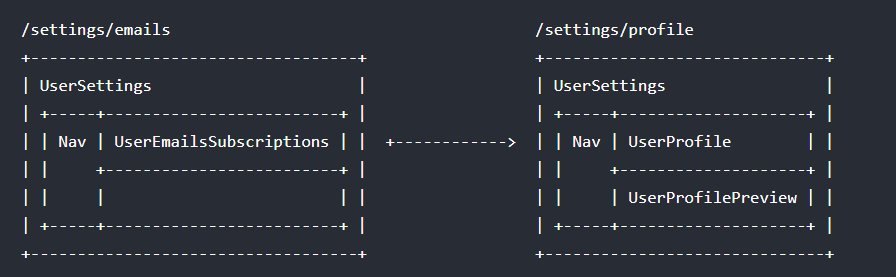
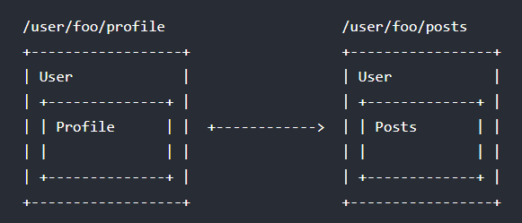

# Vue Router Next

通过 Vue.js 已经用组件组成了我们的应用，当加入 Vue Router 时，我们需要做的就是**将（视图）组件映射到路由（URL）上**，让 Vue Router 知道在哪里渲染它们，在单页面应用实现类似多页面切换的效果。

:bulb: Vue Router Next 是 Vue Router v4.x 版本，适配了 Vue 3，大部分 API 都得以保留，但仍有部分一些不可兼容的改变，从 Vue Router v3 [迁移指南](https://next.router.vuejs.org/zh/guide/migration/index.html)可以参考官方文档。本文介绍 Vue Router Next 的基础使用方法，主要针对==与 Vue Router v3 的不同点==。


## 安装引入

可以通过 CDN 引入最新版本的 Vue Router，该模块暴露 `VueRouter` 对象，通过==调用其方法 `createRouter` 创建路由实例==

```html
<script src="https://unpkg.com/vue-router@4"></script>
```

:bulb: 也可以指定版本

```html
<script src="https://unpkg.com/vue-router@4.0.11/dist/vue-router.global.js"></script>
```

也可以通过 npm 安装，使用方法 `createRouter` 创建路由后，通过 `app.use(router)` 的方式安装插件（其中 `app` 是 Vue 应用实例，`router` 是路由实例），这样整个应用都支持路由（在其他子组件不需要再导入）

```bash
npm install vue-router@4
```

```js
import { createApp } from 'vue';
import { createRouter } from 'vue-router';

const app = Vue.createApp({})
// 路由配置
const routes = [...]
const router = VueRouter.createRouter({
  // 使用 hash 模式
  history: VueRouter.createWebHashHistory(),
  routes, // 路由配置
})
// 整个应用支持路由
app.use(router)
```


## 初始化

==通过方法 `createRouter()` 创建路由实例==，并配置组件和路由的映射关系

```js
import { createApp } from 'vue';
import VueRouter from 'vue-router';

// 路由配置
// 路由和组件的映射规则，一般每个路由 path 对应一个组件 component
const routes = [
  {
    // 路由网址（url）
    path: '/',
    // 对应的组件（视图）
    component: Home
  },
  { path: '/about', component: About },
]


// 创建 router 实例，
const router = VueRouter.createRouter({
  // 使用 hash 模式
  history: VueRouter.createWebHashHistory(),
  // 传入路由配置
  routes,
})

// 创建和挂载根实例
// 通过选项 router 注入路由，让整个应用都可以使用路由功能
createApp({}).use(router).mount('#app');
```

通过调用 `app.use(router)` 注入路由后，在应用中常用到两个概念（其中 `this` 表示组件实例）：

* `router` 是指路由器，它由 Vue Router 插件提供的多种控制路由的方法，在任何组件内都可以通过 `this.$router` 访问路由器
* `route` 是指一个包含当前路由信息的对象，可以通过 `this.$route` 访问当前路由

💡 如果==在选项 `setup` 函数则分别通过函数 `useRouter()` 访问路由实例，通过函数 `useRoute()` 访问当前路由==

最后别忘了在 Vue 实例（组件）的模板中使用 Vue Router 的**内置组件 `<router-view>`**，这样才可以将当前路由匹配的组件渲染在到页面上。

可以使用 Vue Router 的**内置组件 `<router-link>`** 为在页面中添加一个导航的 UI 组件，它默认渲染为一个 `<a>` 标签

```html
<div id="app">
  <div>
    <!--使用 router-link 组件进行导航 -->
    <!--通过传递 `to` 来指定链接 -->
    <!--`<router-link>` 将呈现一个带有正确 `href` 属性的 `<a>` 标签-->
    <router-link to="/">Go to Home</router-link>
    <router-link to="/about">Go to About</router-link>
  </div>

  <!-- 路由匹配到的组件将渲染在这里 -->
  <router-view></router-view>
</div>
```

## 历史模式

传递给方法 `VueRouter.createRouter({})` 的参数是一个对象，在 Vue Route Next 中抛弃了属性 `mode` ，需要显式使用==属性`history` 来设置项目使用何种历史模式==

### Hash 模式

==通过 `createWebHashHistory()` 创建==

```js
import { createRouter, createWebHashHistory } from 'vue-router'

const router = createRouter({
  history: createWebHashHistory(),
  routes: [
    //...
  ],
})
```

在该模式下项目内部**传递的实际 URL 之前使用了一个哈希字符 `#`**，由于这部分 URL 从未被发送到服务器，所以它不需要在服务器层面上进行任何特殊处理，不会引起页面重载。不过**它在 SEO 中确实有不好的影响**。

### HTML5 模式

==通过 `createWebHistory()` 创建==，需要[后端服务器配合](https://next.router.vuejs.org/guide/essentials/history-mode.html#example-server-configurations)

```js
import { createRouter, createWebHistory } from 'vue-router'

const router = createRouter({
  history: createWebHistory(),
  routes: [
    //...
  ],
})
```

当使用这种历史模式时，URL 会看起来和「正常」的路径一样，不过需要同时在服务器上添加一个回退路由，让 URL 不匹配任何静态资源时，它也提供与你的应用程序中的 `index.html` 相同的页面。关于 Vue Router 采用 HTML5 模式时，服务器的配置示例可以参考[官方文档](https://next.router.vuejs.org/guide/essentials/history-mode.html#example-server-configurations)。

## 路由配置

传递给方法 `VueRouter.createRouter({})` 的参数是一个对象，其中属性 `routes` 是一个数组，每一个元素表示一个路由，包含相应的配置信息

```js
const router = createRouter({
  history: createWebHistory(),
  routes: [
    {
      path: '/user/:username',
      component: User
    }
  ],
})
```

最基本的一个路由是由路径 `path` 和相应的视图组件 `component` 构成

### 路由元信息

在定义路由规则时，可以设置选项 `meta` 元信息，传递一个对象，以键值对的形式**存储关于该路由的相关信息**，相当于为路由增添一些除了路径以为的附加信息，这些额外的信息可以用在路由守卫上，例如在导航守卫中基于 `meta` 的信息判断访问的路径是否需要登录验证等。

```js
// 路由配置
const routes = [
  {
    path: '/posts',
    component: PostsLayout,
    children: [
      {
        path: 'new',
        component: PostsNew,
        // 只有经过身份验证的用户才能创建帖子
        meta: { requiresAuth: true }
      },
      {
        path: ':id',
        component: PostsDetail
        // 任何人都可以阅读文章
        meta: { requiresAuth: false }
      }
    ]
  }
]
```

对于以上示例，如果希望基于路由的 `meta` 信息判断是否需要进行授权验证，可以使用组件内守卫

:bulb: 一个路由可以匹配到多个路由（所有匹配到的路由记录会暴露为 `$route.matched` 数组，一般需要通过遍历数组各元素，来检查特性的属性），Vue Router 为我们提供了一个 **`$route.meta` 对象**，它是一个**非递归合并所有 `meta` 字段的对象**（从父字段到子字段），可以更方便地访问路由的元信息。

```js
router.beforeEach((to, from) => {
  // 基于路由的 `meta` 信息，判断当前导航是否需要进行授权验证
  // 默认是需要通过遍历 to.matched 数组，检查每条路由记录中的 meta 对象
  // to.matched.some(record => record.meta.requiresAuth)
  // 现在可以直接通过所有元信息合并后得到的 to.meta 对象进行检查
  if (to.meta.requiresAuth && !auth.isLoggedIn()) {
    // 如果此路由需要授权，请检查是否已登录
    // 如果没有，则重定向到登录页面
    return {
      path: '/login',
      // 保存我们所在的位置，以便以后再来
      query: { redirect: to.fullPath },
    }
  }
})
```

:bulb: 如果使用 TypeScript 编写代码，可以通过**扩展 `RouteMeta` 接口来输入 meta 字段**

```ts
// typings.d.ts or router.ts
import 'vue-router'

declare module 'vue-router' {
  interface RouteMeta {
    // 是可选的
    isAdmin?: boolean
    // 每个路由都必须声明
    requiresAuth: boolean
  }
}
```

### 页面滚动

在创建路由实例时，可以通过**选项 `scrollBehavior` 设置切换页面时如何滚动**。

该选项是一个方法，前两个参数接收 `to` 和 `from` 路由对象，第三个参数 `savedPosition` 它是记录当前页面位置；返回一个 [`ScrollToOptions`](https://developer.mozilla.org/en-US/docs/Web/API/ScrollToOptions) 位置对象（告诉浏览器该如何滚动页面）或 `savedPosition`（告诉浏览器将页面滚动到之前的位置）

```js
const router = new VueRouter({
  routes: [...],
  scrollBehavior (to, from, savedPosition) {
    if (savedPosition) {
      // 如果通过上一页/下一页按钮进行导航
      // 则页面会通过 savedPosition 保留之前的位置
      return savedPosition
    } else {
      // 如果没有位置记录，默认就是滚动到页面顶部
      return{ left: 0, top: 0 }
    }
  }
})
```

返回滚动位置的对象信息可以有多种格式：

* ==滚动到指定的坐标轴 `return { left: number, top: number }`==，一般对于所有路由导航，简单地让页面滚动到顶部 `return { left: 0, top: 0 }`

* ==在返回对象中通过属性 `el` 指定一个元素（通过 CSS 选择器或直接传递一个 DOM）==，这样滚动的位移就是相对于该元素的

   ```js
   const router = createRouter({
     scrollBehavior(to, from, savedPosition) {
       // 始终在元素 #main 上方滚动 10px
       return {
         // 通过 el 传递一个 CSS 选择器或一个 DOM 元素
         el: '#main',
         // 也可以这么写
         // el: document.getElementById('main'),
         top: -10,
       }
     },
   })
   ```

* 滚动到指定锚点

  ```js
  const router = createRouter({
    scrollBehavior(to, from, savedPosition) {
      if (to.hash) {
        return {
          el: to.hash,
        }
      }
    },
  })
  ```

* 滚动到原来位置 `return savedPosition`  该值当且仅当通过浏览器的 **前进/后退** 按钮触发（popstate 导航）时才可用

* 返回一个 falsy 值或一个空对象，不发生滚动


:bulb: 还可以在返回的对象中添加 `behavior` 选项，并将值设置为 `smooth`，就可以启用原生的平滑滚动效果

```js
// ...
scrollBehavior (to, from, savedPosition) {
  if (to.hash) {
    return {
      el: to.hash,
      behavior: 'smooth',
    }
  }
}
```

:bulb:该方法支持返回一个 Promise，通过 `resolve` 一个对象来表示预期的位置，这样就可以在页面滚动之前稍作等待，实现**异步滚动/延迟滚动**。通过这个方法可以让滚动行为和页面过渡更好地配合，实现更优雅的动效。

```js
const router = createRouter({
  scrollBehavior (to, from, savedPosition) {
    return new Promise((resolve, reject) => {
      setTimeout(() => {
        resolve({ left: 0, top: 0 })
      }, 500) // 延迟 500ms 后才进行页面滚动
    })
  }，
})
```


### 命名路由

可以在配置路由时，通过选项 `name` 给某个路由设置名称（名称需要唯一），这样在使用路径较长的路由进行导航时，可以通过该名称来指代该路由（如果是动态路由，还会配合路由参数使用）。

```js
// 路由规则
const routes = [
  {
    path: '/user/:username',
    name: 'user'
    component: User
  },
]
```

声明式导航，使用路由名称，并传递路由参数，由 Vue Router 拼接得到相应的 url

```html
<router-link :to="{ name: 'user', params: { username: 'ben' }}">
  User
</router-link>
```

编程式导航

```js
router.push({ name: 'user', params: { username: 'ben' } })
```

以上两个导航指向的路径都是 `/user/ben`

### 别名

可以在配置路由时，通过选项 `alias` 为路由设置**别名**，该功能可以让你自由地将同一个 **UI 结构映射到任意的 URL**，而不是受限于嵌套路由结构，例如实现类似短链接的功能方便用户访问。

```js
// 路由配置
const routes = [
  {
    path: '/',
    component: Homepage,
    alias: '/home'
  }
]
```

:bulb: 路由别名和路由重定向是不同的，虽然两者都可以实现将一个路径映射到另一个视图组件的效果，但是如果路径 `/a` 的路由别名是 `/b`，这意味着当用户访问 `/b` 时，**URL 会保持为 `/b`，而不是跳转到 `/a`**，但是使用的路由匹配是 `/a` 路由的，就像用户访问 `/a` 一样。

该选项的值可以是一个数组，提供多个别名，即实现**多个网址指向同一个页面**。

```js
const routes = [
  {
    path: '/users/:id',
    component: UsersByIdLayout,
    children: [
      // 为这 3 个 URL 呈现 UserDetails
      // - /users/24
      // - /users/24/profile
      // - /24
      {
        path: 'profile',
        component: UserDetails,
        alias: ['/:id', ''] },
    ],
  },
]
```

:bulb: 如果原路径有参数，为了 SEO 规范，**请在别名中耶包含相应的参数**

### 命名视图

可以在页面模板中**同时设置多个 `<router-view>`**（平行关系，而不是通过嵌套路由和嵌套的 `<router-view>` 的映射实现），不过得为每个视图设置名称 `<router-view name="viewName>`（没有设置名字则默认为 `default`），这样就可以**在一个路由下「平行」渲染出多个组件**。

这时应该在路由的配置中，相应地**对于同一个路由要设置多个组件**（如果组件数量少于平行的 `<router-view>` 数量，则相应的多余的视图组件将不会渲染），即选项 `components`（此时选项**不**是 `component`）变成一个对象，设置多个组件，每一个属性都是一个组件，键为视图 `<router-view>` 的的命名 `name`，值为组件名

```js
const router = createRouter({
  history: createWebHashHistory(),
  routes: [
    {
      path: '/',
      // 对应于多个组件
      components: {
        // 默认 `<router-view>` 对应的组件
        default: Home,
        // 这时 ES6 对象属性的缩写，相当于 LeftSidebar: LeftSidebar
        // 属性名与 `<router-view>` 上的 `name` 属性匹配
        LeftSidebar,
        RightSidebar,
      },
    },
  ],
})
```

```html
<router-view class="view left-sidebar" name="LeftSidebar"></router-view>
<router-view class="view main-content"></router-view>
<router-view class="view right-sidebar" name="RightSidebar"></router-view>
```

:bulb: 命名视图和嵌套路由都可以在一个页面设置多个视图 `<router-view>` 组件，但作用不同

* 命名视图同一个页面设置多个 `<router-view>`，它们渲染出来的节点可以是「平行」关系，实现不同路由复用同一个布局模板
* 嵌套路由设置（在父元素中）设置一个 `<couter-view>`，渲染出来的节点是父子嵌套关系，一般用于局部的布局更改

:bulb: 可以混用命名视图和嵌套视图，实现更复杂的布局



以上示例中父组件 `UserSettings` 中有一个常规组件 `Nav`，还有基于路由的三个嵌套组件`UserEmailsSubscriptions`、`UserProfile`、`UserProfilePreview`，其中组件 `UserProfile`、`UserProfilePreview` 是属于「平行」关系的。

```html
<!-- UserSettings.vue -->
<div>
  <h1>User Settings</h1>
  <NavBar />
  <router-view />
  <router-view name="helper" />
</div>
```

```js
// 相应的路由配置
{
  path: '/settings',
  component: UserSettings,
  // 嵌套路由
  children: [
    {
      path: 'emails',
      component: UserEmailsSubscriptions
    },
    {
      path: 'profile',
      // 命名视图
      components: {
        default: UserProfile,
        helper: UserProfilePreview
      }
  }]
}
```

:bulb: 其实命名视图可以看作是更一般路由-组件映射规则，如果页面只需要一个 `<router-view>` 也可以在设置路由时使用 `components` 选项，只是里面只设置 `default: componentName` 一个组件。

### 重定向

在路由的配置中通过选项 `redirect` 来实现重定向，实现用户访问 `/a` 路径时，导航转向路径 `/b` 的效果。

该选项的属性值可以是表示路径的字符串，或表示另一个路由的名称，或一个包含路由信息的对象，或一个方法（其返回值是前面三种表示路由的形式之一）

```js
// 路由配置
const routes = [
  {
    path: '/home',
    redirect: '/'
  },
  // 重定向的目标也可以是一个命名的路由
  {
    path: '/home',
    redirect: { name: 'homepage' }
  }，
  {
    // 该动态路由可以实现重定向
    // 例如从路由 /home/hello 重定向到 /home?q=hello
    path: '/home/:searchText',
    redirect: route => {
      // 方法接收当前的路由作为参数
      // return 重定向的字符串路径/路径对象
      return { path: '/home', query: { q: route.params.searchText } }
  },
]
```

:bulb: 该选项的值也支持是相对路径（例如不以 `/` 开头的字符串路径就是相对路径），实现相对重定向

:warning: 导航守卫并**不**应用在跳转路由上，而应用在其指向的路由上，因此以上例子如果针对 `/home` 路由添加一个 `beforeEnter` 守卫并不会起作用。

:bulb: 如果路由配置了选项 `redirect` 时，可以省略 `component` 配置，因为该路由从来没有被直接访问过，所以没有组件要渲染。唯一的例外是嵌套路由，如果一个路由有 `children` 和 `redirect` 属性，它也应该有 `component` 属性。

### 路由懒加载

Vue Router 支持动态导入，把不同路由对应的组件分割成不同的代码块，然后**当路由被访问的时候才加载对应组件**，这样就会更加高效。

```js
// 将 import UserDetails from './views/UserDetails'
// 替换成
const UserDetails = () => import('./views/UserDetails')

const router = createRouter({
  // ...
  routes: [{ path: '/users/:id', component: UserDetails }],
})
```

:bulb: 一般来说，对所有的路由**都使用动态导入**是个好主意。但**不要**在路由中使用[异步组件](https://v3.vuejs.org/guide/component-dynamic-async.html#async-components)，虽然异步组件仍然可以在路由组件中使用，但路由组件本身就是动态导入的。

:bulb: 在路由配置中，选项 `component` 或 `components` 可以接收一个**返回 Promise** 的函数，该 Promise 最后需要 `resolve` 一个组件，那么 Vue Router **只会在第一次进入页面时才会获取该组件**，之后就会使用缓存数据，还可以在 Promise 中执行更复杂的操作

```js
const UserDetails = () =>
  Promise.resolve({
    /* 组件定义 */
  })

const router = createRouter({
  // ...
  routes: [{ path: '/users/:id', component: UserDetails }],
})
```

:bulb: 如果使用 Webpack 打包，还可以把组件按组分块，具体配置参考[官方文档](https://next.router.vuejs.org/guide/advanced/lazy-loading.html#grouping-components-in-the-same-chunk)。

## 查看现有路由

Vue Router 在路由实例中提供两种方法来查看现有的路由：

- ==`router.hasRoute(name)` 检查给定名称的路由是否存在。==
- `router.getRoutes()` 返回一个包含**所有路由**记录的数组。


## 增删路由

一般路由的设置都是在实例化路由时完成的，通过传递给方法 `VueRouter.createRouter()` 的对象中，在该对象的属性 `routes` 中完成配置，该属性值是一个数组，每一个元素就是一个路由。

但是在某些情况下，你可能想在应用程序已经运行的时候再添加或删除路由，Vue Router 提供了方法 `addRoute()` 和 `removeRoute()` 实现增删路由的功能。

### 添加路由

通过路由实例的方法 `router.addRoute()` 注册一个新的路由

:bulb: 如果**新增加的路由与当前页面所在的路径位置相匹配**（可能当前路径被一个动态路由匹配，因为它可以基于一个模式匹配大量的路径，而新增的路由可能是一个静态路由，更「精准」地匹配当前的路径），需要**手动导航** `router.push()` 或 `router.replace()` 才可以应用新的路由（渲染新的视图组件）

如果一个应用只有一个动态路由，则进入任何页面，例如 `/about`，最终都会呈现 `Article` 组件

```js
const router = createRouter({
  history: createWebHistory(),
  routes: [{ path: '/:articleName', component: Article }],
})
```

如果我们再添加一个新的静态路由

```js
router.addRoute({ path: '/about', component: About })
```

虽然当前页面会优先匹配到新增的路由，但是仍然会显示 `Article` 组件，我们需要**手动调用 `router.replace()` 来导航**以载入 `About` 组件

```js
router.replace(router.currentRoute.value.fullPath)
```

:bulb: 如果是在导航守卫中同时添加路由，则**不**应该调用 `router.replace()` 而应该**直接返回一个路由**，触发 Vue Router 执行重定向

```js
// 在导航守卫中新增一个路由
// 新增的路由的路径与导航目标的路径相同，所以最后返回的路径是 to.fullPath
router.beforeEach(to => {
  if (!hasNecessaryRoute(to)) {
    router.addRoute(generateRoute(to))
    // 触发重定向
    return to.fullPath
  }
})
```

:warning: 以上示例要满足两个假设：

* 新添加的路由记录将与 `to` 位置相匹配，实际上导致与我们试图访问的位置不同。
* **在添加新的路由后 `hasNecessaryRoute()` 返回 `false`**==？==，以避免无限重定向。

要将**嵌套路由**添加到现有的路由中，可以将路由的 `name` 作为第一个参数传递给 `router.addRoute()`，然后第二个参数就是嵌套路由的配置

```js
router.addRoute('admin', { path: 'settings', component: AdminSettings })
```

等效于

```js
router.addRoute({
  name: 'admin',
  path: '/admin',
  component: Admin,
  children: [{ path: 'settings', component: AdminSettings }],
})
```


### 删除路由

有几个不同的方法来删除现有的路由，当路由被删除时，**所有的别名和子路由也会被同时删除**：

* 通过添加一个**名称冲突的路由**。如果添加与现有途径名称相同的途径，会先删除路由，再添加路由

  ```js
  router.addRoute({ path: '/about', name: 'about', component: About })
  // 这将会删除之前已经添加的路由，因为他们具有相同的名字且名字必须是唯一的
  router.addRoute({ path: '/other', name: 'about', component: Other })
  ```

* 通过调用 `router.addRoute()` 返回的回调，这对于没有命名的路由很有用

  ```js
  const removeRoute = router.addRoute(routeRecord)
  removeRoute() // 如果存在的话，删除路由
  ```

* 通过使用 `router.removeRoute()` **按名称**删除路由

  ```js
  router.addRoute({ path: '/about', name: 'about', component: About })
  // 删除路由
  router.removeRoute('about')
  ```

  :bulb: 如果你想使用这个功能，但又想避免名字的冲突，可以在路由中**使用 `Symbol` 作为名字**。


## 路由匹配

Vue Router 支持多种路由匹配模式：

* 大部分的路由是由字符串构成的**静态路由**，它只能匹配一个不可变的路径，例如 `/about`
* 进一步根据某种模式匹配一系列路径的**动态路由**，例如 `/users/:userId`
* 再进一步还可以使用正则表达式自定义匹配模式，以匹配需要满足复杂条件的路径，==正则表达式在路径参数后的**括号**里==，例如 `/:orderId(\\d+)` 匹配仅由数字组成的路径，:bulb: 由于需要转义反斜杠`\`，所以使用了 `\\d+` 表示匹配多个（至少一个）数字

### 动态路由

动态路由是指把某种模式（正则表达式）匹配到的所有路由，全都映射到同个组件。

动态路径的参数**以冒号 `:` 开头**

```js
// 路由配置，传递给 `createRouter`
const routes = [
  // 组件 User 对所有用户进行渲染
  // 但用户 username 不同，动态段以冒号开始，作为路径参数
  {
    path: '/user/:username',
    component: User
  },
  {
    path: '/user/:username/posts/:postId'
    component: Post
  }
]
```

匹配到的参数值（路径的的动态段，称之为**路径参数**）会被添加到 `this.$route.params` 对象中。而且在同一个路由中设置有**多个路径参数**，它们会映射到 `this.$route.params` 上的相应字段。

```js
// User 组件
const User = {
  template: '<p>User {{ $route.params.username }}</p>',
}

// Post 组件
const Post = {
  template: `
    <p>User {{ $route.params.username }}</p>
    <p>Post {{ $route.params.postId }}</p>
  `
}
```

:bulb: 实际动态路由在内部使用的默认正则表达式是 `[^/]+` 匹配 URL 中至少有一个字符不是斜杠 `/`，用以提取路径中相应的参数。

:warning: 当使用动态路由匹配同一个组件时，如果只有动态路径参数改变，并**不**会触发组件重新渲染，而是**复用原来的组件**，因此**组件的生命周期钩子不会再被调用**。如果希望路由匹配的参数改变时，同时触发组件更新，可以设置一个侦听器 `watch` 监测 `$route.params` 的变化，或使用 Vue Router 提供的 `beforeRouteUpdate` 钩子函数进行路由守卫，然后在相应的回调函数中手动触发原来需要在生命周期钩子函数中执行的操作。

```js
const User = {
  template: '...',
  created() {
    this.$watch(
      () => this.$route.params,
      (toParams, previousParams) => {
        // 对路由变化做出响应...
      }
    )
  },
}

const User = {
  template: '...',
  async beforeRouteUpdate(to, from) {
    // 对路由变化做出响应...
  },
}
```

#### 可重复的参数

如果需要匹配路径中多个结构相似的部分，可以**直接在路径参数后添加修饰符 `*` 或 `+`**（其作用和正则表达式常用的量词一样），将参数标记为可重复，而不必手动设置多个路径参数。

```js
const routes = [
  // /:chapters ->  匹配 /one, /one/two, /one/two/three, 等
  { path: '/:chapters+' },
  // /:chapters -> 匹配 /, /one, /one/two, /one/two/three, 等
  { path: '/:chapters*' },
]
```

这样路径参数得到的是一个数组，例如使用 `/:chapters+` 动态路径，去匹配路径 `/a/b`，得到的路径参数的值如下

```js
console.log(this.$route.params.chapters) // ['a', 'b']
```

#### 可选的参数

如果动态路由中路径参数的部分是可选的，可以**在路径参数后添加 `?`**（其作用和正则表达式常用的量词一样，表示 0 个或 1 个）

```js
const routes = [
  // 匹配 /users 和 /users/posva
  { path: '/users/:userId?' },
  // 匹配 /users 和 /users/42
  { path: '/users/:userId(\\d+)?' },
]
```

:bulb: `*` 在技术上也标志着一个参数是可选的，但 `?` 参数是不能重复，最多只能匹配 1 个

### 404 Not Found 路由

动态路由的路径参数**只能匹配 url 片段（用 `/` 分隔）之间的字符**。==由于 Vue Router Next 删除了通配符 `*` 路由器，如果希望匹配任意路径（最常见的场景是用于捕获用户访问未定义的路由，再转向 404 画面），可以使用**自定义的路径参数正则表达式**，它写在路径参数后面的括号 `()` 中==

```js
const routes = [
  // 匹配以 `/user-` 开头之后的所有内容，并将其放在路径参数 afterUser 中
  // 即可以通过 `$route.params.afterUser` 进行访问
  {
    path: '/user-:afterUser(.*)',
    component: UserGeneric
  },
  // 匹配路径的所有内容，将并将其放在路径参数 pathMatch 中
  // 即可以通过 `$route.params.pathMatch` 进行访问
  {
    path: '/:pathMatch(.*)*',
    name: 'NotFound',
    component: NotFound
  },
]
```

以上的示例路由参数都是匹配一整段的路径，但由于正则表达式的不同，解析得到的内容也不一样

* 路径参数 `afterUser` 的自定义正则表达式是 `.*`，它匹配到的是以 `/user-` 开头之后的所有内容，路径参数得到的是一个**字符串**，其中如果剩余路径内容中包括 `/` 分隔符，就会进行**转译**为 `%2F`，例如路径 `/user-ben/posts`，则路径参数匹配得到的字符串就是 `ben%2Fposts`
* 路径参数 `pathMatch` 的自定义正则表达式一样是 `.*`，但之后还使用了修饰符 `*` 以标注路径参数是[重复的参数](#可重复的参数)，因此路径参数得到的是一个**数组**，其中路径中的 `/` 就是匹配解析时的分隔标志，得到数组各元素，例如路径 `/not/found`，则路径参数是 `['not', 'found']`

以上两种方式都可以匹配捕获整段路径，但是**推荐第二种**，因为当需要使用路由的名称，例如 `NotFound`，**手动 push 跳转到 404 路由时**，基于传递的参数，拼接出来的路径中分隔符 `/` 才不会被转译

```js
this.$router.push({
  name: 'NotFound',
  params: { pathMatch: ['not', 'found'] },
})
```

:bulb: 如果不是基于路由名称 push 跳转到 404 路由，而是基于路径字符串就不会出现拼接时 `/` 转译的问题。则以上两种方式都可以

有时候一个 url 可以匹配多个路由，此时**匹配的优先级就按照路由的定义顺序**：即在路由配置中，先定义的路由优先级更高；**匹配顺序由上到下，直到有符合的规则为止**。所以**404 Not Found 路由一般放在最后**，它作为「兜底」捕获一些未定义的路径。


## 嵌套路由

当网页中一个界面有**多层嵌套的组件**组合而成，可以使用嵌套路由，将这些嵌套的组件与 URL 中相应的**某段路径相映射**，而且支持多层深度嵌套的路由-组件映射。



即在父组件中可以嵌套有自己的 `<router-view>`，而在配置路由时，要在该组件对应的路由（父路由）中使用**选项 `children`** 设置内嵌的路由-子组件映射规则。

```js
// 父组件
const User = {
  template: `<div class="page">
    <p>User</p>
      // 基于路由将嵌套的子组件渲染在此
      <router-view></router-view>
    </div>`
};

// 子组件
const Profile = {
  template: `<div class="page">Profile</div>`
};
const Posts = {
  template: `<div class="page">Posts</div>`
}

const router = new VueRouter({
  // 路由规则
  routes: [
  // ...
    {
      path: '/user/:id',
      component: User,
      // 嵌套路由
      children: [
        {
          // UserProfile will be rendered inside User's <router-view>
          // when /user/:id/profile is matched
          path: 'profile',
          component: UserProfile
        },
        {
          // UserPosts will be rendered inside User's <router-view>
          // when /user/:id/posts is matched
          path: 'posts',
          component: UserPosts
        }
      ]
    },
  ]
})
```

其实路由的选项 `children` 只是另一个路由数组，就像 `routes` 本身一样，因此可以根据自己的需要，不断地嵌套视图。

:warning: 一般路由 `path` 会以 `/` 开头，**但嵌套路径不会使用**，因为 `/` 会被当作根路径（绝对路径），使用相对路径可以使用嵌套组件而无须设置嵌套的路径，**迁移更方便**。

:bulb: 如果希望嵌套路由可以支持访问上一级的路由时，父组件的 `<router-view>` 也渲染出页面，可以在使用**选项 `children`** 设置内嵌的路由-子组件映射规则时，**添加一个 `path` 为空字串 `""` 的规则**。即路径的嵌套部分为空时，也可以渲染出一个默认的嵌套组件。

```js
const router = new VueRouter({
  routes: [
    {
      path: '/user/:id',
      component: User,
      children: [
        // UserHome will be rendered inside User's <router-view>
        // when /user/:id is matched
        { path: '', component: UserHome }
        // ...other sub routes
      ]
    }
  ]
})
```


## 路由导航

Vue Router 有两种方式切换 url 路径

* 使用组件 `<router-link>` 组件进行导航，该组件会在页面上渲染为 `<a>` 标签。
* 使用 Vue Router 提供的方法通过 JS 手动切换 url 路径，称为**编程式导航**。

:bulb: ==在 Vue Router Next 中所有的导航，包括第一个导航，现在都是**异步**的，即编程式导航的各种方法都**返回一个 Promise**==，如果要基于导航完成后再执行操作，需要使用异步编程 `await` 或 `then`

例如页面有一个弹出的导航菜单，我们**希望在导航到新页面后**隐藏菜单，因为**导航是异步的**，我们需要 `await` 等到 `router.push` 返回的 promise 解析 `resovle` 或 `reject` 后才执行菜单隐藏

```js
await router.push('/my-profile')
this.isMenuOpen = false
```

### router-link

使用 `<router-link>` 组件来导航，通过属性 `to` 指定路径，它默认渲染为 `<a>` 标签，并将组件标签中的内容包裹在其中（插槽，支持 HTML），实现类似 url 切换的功能

```html
<router-link to="/home">Home Page</router-link>
```

:hammer: 渲染结果

```html
<a href="/home">Home Page</a>
```

:bulb: 如果希望点击链接后，导航是以**替换当前路由**的形式进行（即导航后不会留下历史记录），可以为组件 `<router-link>` 设置**属性 `replace`**，这样用户点击链接时会调用 `router.replace()`，而不是 `router.push()`

```html
<router-link to="/abc" replace></router-link>
```

#### to 属性

组件 `<router-link>` 的属性 `to` 是用以描述该链接要导航到哪个目标路由，它的属性值可以是一个表示路径的**字符串**，或一个描述路径的**对象**

:bulb: 由于当被点击后，内部会立刻把 `to` 的值传到 `router.push()` 实现导航，所以属性 `to` 与 `router.push` [接受的值的规则完全相同](#编程式导航)。

```html
<!-- 字符串 -->
<router-link to="/home">Home</router-link>
<!-- 渲染结果 -->
<!-- <a href="/home">Home</a> -->

<!-- 使用 v-bind 的 JS 表达式 -->
<router-link :to="'/home'">Home</router-link>
<!-- 渲染结果同上 -->

<!-- 传递一个带有路径属性 path 的对象  -->
<router-link :to="{ path: '/home' }">Home</router-link>
<!-- 渲染结果同上 -->

<!-- 命名路由，带有路径参数 -->
<router-link :to="{ name: 'user', params: { userId: '123' }}">User</router-link>

<!-- 带查询参数 -->
<router-link :to="{ path: '/register', query: { plan: 'private' }}">Register</router-link>
<!-- 渲染结果 -->
<!-- <a href="/register?plan=private">Register</a> -->
```

#### 自定义标签

==在 Vue Router Next 中删除了 `<router-link>` 的属性 `tag`==，如果希望**定制该组件渲染为另一种标签**，==可以[需要添加属性 `custom`](https://next.router.vuejs.org/zh/api/#router-link-props)==（默认是 `false`，将该属性添加到组件 `<router-link>` 时其值就是 `true`），表示使用自定义的方式（直接基于插槽内容渲染组件），而不需要将插槽内容包裹在 `<a>` 元素中。

```html
<router-link to="/home" custom>
  <span>Home Page</span>
</router-link>
```

:hammer: 渲染结果

```html
 <span>Home Page</span>
```

#### 作用域插槽

组件 `<router-link>` 的**作用域插槽 `v-slot` 暴露了[一些关于相应路由（属性 `to` 指向的路由）的参数](https://next.router.vuejs.org/api/index.html#router-link-s-v-slot)**，然后可以用在插槽中，定制组件渲染的内容。

:warning: 如果要定制化组件的渲染内容，记得为组件 `<router-link>` 添加属性 `custom` 以防止插槽的内容默认包裹在 `<a>` 元素内，导致渲染定制内容时出现问题。

```html
<router-link
  to="/about"
  custom
  v-slot="{ href, route, navigate, isActive, isExactActive }"
>
  <!-- 一个自定义的「链接」组件，接收路由的相关信息作为 props -->
  <NavLink :active="isActive" :href="href" @click="navigate">
    {{ route.fullPath }}
  </NavLink>
</router-link>
```

- `href`：解析属性 `to` 后得到的 URL，将会作为默认 `<a>` 元素的 `href` 属性。如果什么都没提供，则它会包含 `base`
- `route`：解析属性 `to` 后的规范化的地址
- `navigate`：触发导航的函数。 **会在必要时自动阻止事件**，和 `router-link` 一样。例如：`ctrl` 或者 `cmd` + click 仍然会被 `navigate` 忽略
- `isActive`：如果需要应用 [active class](https://next.router.vuejs.org/zh/api/#active-class)，则为 `true`（在组件上设置了属性 `active-class`）
- `isExactActive`：如果需要应用 [exact active class](https://next.router.vuejs.org/zh/api/#exact-active-class)，则为 `true`（在组件上设置了属性 `exact-active-class`）

:bulb: 路由激活时，是指组件 `<router-link>` 的属性 `to` 与当前 url 路径匹配上），该组件的根元素会添加上类名 `.router-link-active`；而路由准确匹配上的元素则会再加上类名 `.router-link-exact-active`，可以使用这两个 `class` 类属性设置样式

```html
<router-link to="/">Index</router-link>
```

### 编程式导航

使用 Vue Router 提供的方法通过 JS 手动切换 url 路径，称为**编程式导航**

:bulb: 这些方法是效仿浏览器提供的 API `window.history`，以下路由方法分别类似于 `window.history.pushState`、`window.history.replaceState` 和 `window.history.go`

:bulb: 如果路由导航的目的地和当前路由**映射的组件是相同**，如（动态路由）只有参数发生了改变，为了优化效率，组件会复用，即在组件生命周期钩子函数中执行的操作并不会再次执行，需要使用 `beforeRouteUpdate` 钩子函数进行路由守卫，或 `watch` 监听路由的变化然后在相应的回调函数中手动触发原来所需的操作。

#### 常规导航

最常见的导航方式是使用方法 `$router.push(location)` 将页面导航到指定的 `location`，并向 history 栈添加一个新的记录

:bulb: 相应的声明式导航是 `<router-link to="location">`

该方法的参数可以是一个表示路径的字符串，或一个描述路径的对象

```js
// 字符串路径
router.push('/users/ben')

// 带有路径属性 path 的对象
router.push({ path: '/users/ben' })

// 使用命名路由（假设路由对应的路径是 /users/:username），并加上路径参数（让路由建立 url，将参数「填入」相应动态路径的路径参数）
// 结果是 /users/ben
router.push({ name: 'user', params: { username: 'ben' } })

// 带有路径属性 path 的对象，并带查询参数（让路由建立 url）
// 结果是 /register?plan=private
router.push({ path: '/register', query: { plan: 'private' } })

// 带有路径属性 path 的对象，并带 hash
// 结果是 /about#team
router.push({ path: '/about', hash: '#team' })
```

:bulb: 如果方法 `$router.push()` 传入的描述路径的对象中，即提供了 `path` 属性，也提供了 `params` 属性，那么 `params` 就会被忽略。因此传递对象时，要么是将参数手动进行拼接，要么是以 `name` 和 `params` 的方式来提供参数

```js
const username = 'ben'
// 我们可以手动建立 url，但我们必须自己处理编码
router.push(`/user/${username}`) // -> /user/ben
// 同样
router.push({ path: `/user/${username}` }) // -> /user/ben
// 如果可能的话，使用 `name` 和 `params` 从自动 URL 编码中获益
router.push({ name: 'user', params: { username } }) // -> /user/ben
// `params` 不能与 `path` 一起使用
router.push({ path: '/user', params: { username } }) // -> /user
```

#### 替换式导航

使用方法 `$router.push({path: location, replace: true})`（增加要给属性 `repalce`）或  `$router.replace(location)` 导航到指定的 `location`，它**不**会向 history 添加新记录，而是替换掉当前的 history 记录

:bulb: 相应的声明式导航是 `<router-link to="location" replace>`

#### 历史记录导航

使用方法 `$router.go(n)` 在 history 记录中向前或者后退 `n` 步，类似 `window.history.go(n)`，如果输入的数值过大或过小，而 history 记录不够用，跳转就会**失败**

```js
// 向前移动一条记录，与 router.forward() 相同
router.go(1)

// 返回一条记录，与router.back() 相同
router.go(-1)

// 前进 3 条记录
router.go(3)

// 如果没有那么多记录，静默失败
router.go(-100)
router.go(100)
```

### 导航故障

导航故障/导航失败 navigation failures，表示一次失败的导航，所期待的导航被阻止，用户仍**留在同一页面上**：

- 用户已经位于他们正在尝试导航到的页面
- 导航守卫 `return false` 或调用 `next(false)` 中断了这次导航
- 当前的导航守卫还没有完成时，一个新的导航守卫会出现了
- 导航守卫通过返回一个路由，重定向到其他地方（例如对于未登录的用户一直重定向到 `/login` 页面）
- 导航守卫抛出了一个错误 `Error`

导航故障时，导航返回的 `Promise` 被解析为 **Navigation Failure**，它是一个带有一些额外属性的 `Error` 实例（而正常情况下，导航成功 Promise 被解析为一个 *falsy* 值，通常是 `undefined`），这样我们就可以区分我们导航是否离开了当前位置：

```js
const navigationResult = await router.push('/home')

if (navigationResult) {
  // 导航被阻止
} else {
  // 导航成功 (包括重新导航的情况)
}
```

#### 鉴别导航故障

要检查一个错误是否来自于路由器，可以使用 `isNavigationFailure` 函数，它接收第一个参数是导航的 Promise，以判断导航解析的类型，（可选）第二个参数是 `NavigationFailureType` 区分不同类型的*导航故障*

:bulb: 如果只传递第一个参数  `isNavigationFailure(failure)` 忽略第二个参数，那么就只会检查这个 `failure` 是不是一个 *Navigation Failure*

==`NavigationFailureType` 有**三种**不同的类型==，对应于不同的情况下导致导航的中止：

- `aborted`：在导航守卫中返回 `false` 或调用了 `next(false)` 中断了本次导航。
- `cancelled`：在当前导航还没有完成之前又有了一个新的导航。比如在等待导航守卫的过程中，又调用了 `router.push`。
- `duplicated`：导航被阻止，因为我们已经在目标位置了。

```js
import { isNavigationFailure, NavigationFailureType } from 'vue-router'

// 试图离开未保存的编辑文本界面
const failure = await router.push('/articles/2')
// 如果导航故障，且故障类型是 aborted
if (isNavigationFailure(failure, NavigationFailureType.aborted)) {
  // 给用户显示一个小通知
  showToast('You have unsaved changes, discard and leave anyway?')
}
```

:bulb: 所有的导航故障都会有 `to` 和 `from` 属性，分别用来表达这次失败的导航的**目标位置**和**当前位置**

```js
// 正在尝试访问 admin 页面
router.push('/admin').then(failure => {
  if (isNavigationFailure(failure, NavigationFailureType.redirected)) {
    failure.to.path // '/admin'
    failure.from.path // '/'
  }
})
```

####  检测重定向

还有一种导航故障是导航守卫通过返回一个路由，重定向到其他地方，它会触发一个新的导航，覆盖正在进行的导航。

与其他导航守卫的返回值不同的是，重定向**不会阻止导航，而是创建一个新的导航**，可以通过读取当前路由地址中的 **`redirectedFrom` 属性**，对其进行检查

```js
await router.push('/my-profile')
if (router.currentRoute.value.redirectedFrom) {
  // redirectedFrom 是解析出的路由地址
}
```


## 导航守卫

导航守卫是在指用户访问特定的路径时，**基于条件执行跳转或取消的操作**，从而在前端对特定页面和数据进行「保护」。有多种机会植入导航守卫，可以设置全局的、单个路由独享的、或者组件级的路由守卫。

:bulb: 守卫是**异步**解析执行，因此导航在所有守卫 resolve 完之前一直处于**等待中**

完整的路由导航解析流程：

1. 导航被触发
2. 在失活的组件里调用 **`beforeRouteLeave` 守卫**（组件内的守卫）
3. 调用全局的 **`beforeEach` 守卫**（全局前置守卫）
4. 在重用的组件里调用 **`beforeRouteUpdate` 守卫**（组件内的守卫，路由更新，但组件复用）
5. 在路由配置里调用 **`beforeEnter` 守卫**（路由独享的守卫）
6. 解析异步路由组件
7. 在被激活的组件里调用 **`beforeRouteEnter` 守卫**（组件内的守卫）
8. 调用全局的 **`beforeResolve` 守卫**（全局解析守卫）
9. 导航被确认
10. 调用全局的 **`afterEach` 钩子**（全局后置守卫）
11. 触发 DOM 更新
12. 调用 `beforeRouteEnter` 守卫中传给 **`next` 的回调函数**，创建好的组件实例会作为回调函数的参数传入

:bulb: 路由的参数 `params` 或查询 `query` 的改变并**不**会触发进入/离开类型的导航守卫。可以通过 `watch` 观察 `$route` 路由对象来应对这些变化，或使用 [`beforeRouteUpdate` 组件内守卫](#组件内守卫)来响应这些变化。

### 回调函数

#### 入参

路由守卫回调函数一般接收两个参数：

* `to` 即将要进入的目标（路由对象 route）
* `from` 当前导航正要离开的路由对象 route

:bulb: ==路由守卫的回调函数还可以接收第三个（可选）参数 `next`，它是一个函数，通过调用它以验证导航。但是如果守卫的回调函数中有[返回值](#返回值)，则可以省略 `next`，并且鼓励这么做。==

:warning: **如果传递了该参数，请确保它被严格调用一次**，这样守卫才可以 `resolve` Promise 以「放行」，否则页面将会「卡住」，无法顺利跳转或展示数据。它的执行效果依赖调用时传递的参数：

* `next()` 不传递参数时，会进行管道中的下一个钩子

* `next(false)` 中断当前的导航

* `next('/otherPath')` 或者 `next({ path: '/otherPath' })` 当前的导航被中断，然后进行一个新的导航。跳转到一个不同的地址

  :bulb: 传递对象可以定制跳转的方式，如 `next({ replace: true、name: 'home' })` 以取代历史记录的方式，跳转导航到首页。

* `next(error)` 传入 next 的参数是一个 Error 实例，则导航会被终止。

```js
// 在用户未能验证身份时，重定向到 /login 页面
router.beforeEach((to, from, next) => {
  if (to.name !== 'Login' && !isAuthenticated) next({ name: 'Login' })
  else next()
})
```

#### 返回值

路由守卫回调函数有多种返回值，相应执行不同的导航行为

* 无返回（即返回 `undefined`）或返回 `true`：执行预期的导航

* 返回 `false`：取消当前的导航

  ```js
  router.beforeEach((to, from) => {
    // ...
    // 返回 false 以取消导航
    return false
  })
  ```

  如果浏览器的 URL 改变了（可能是用户手动或者浏览器后退按钮），那么 URL 地址会重置到 `from` 路由对应的地址

* 返回一个路由地址：执行导航到另外的地址

  路由地址可以是一个表示路径的字符串，也可以是一个描述路由信息的对象，可以设置如 `replace: true` 或 `name: 'home'` 等选项。这时候类似于调用 `router.push()` 一样，手动执行导航，跳转到返回的地址（与用户原来期待的导航路径不同）

* 抛出一个 `Error`：取消导航并且调用执行 `router.onError()` 注册过的回调

  一般是遇到意料之外的情况


以下是常用的路由守卫钩子函数，根据实际情况选择合适的钩子函数进行路由守卫：

### 全局前置守卫

全局路由守卫 `beforeEach` 在进入任何路由**前**都会调用。可以使用路由实例的方法 `beforeEach()` 定义一个全局路由守卫，当一个导航触发时，全局前置守卫**按照创建顺序依此调用**。

```js
router.beforeEach((to, from) => {
  ...
})
```

### 全局解析守卫

全局解析守卫 `beforeResolve` 和全局前置守卫 `beforeEach` 类似，也是在每次导航都会调用，但它会在**所有组件内守卫和异步路由组件被解析之后，在确认导航之前**被调用。

全局解析守卫执行时，**用户还未进入页面**，一般会在该守卫的回调函数中 fetch 数据，可以访问路由的元信息，或者执行一些预判操作，如权限询问获取，尽早阻止用户访问相应的页面（以便避免用户即使进入了页面，却因为不符合条件，而无法执行一些操作）。

```js
// 通过全局解析守卫，获取目的路由的 meta 元信息
// 该路由的元信息有 requiresCamera 选项（布尔值）表示跳转的页面需要使用设备摄像机
router.beforeResolve(async to => {
  if (to.meta.requiresCamera) {
    try {
      // 可以在路由守卫中先尝试获取访问设备摄像机的权限
      await askForCameraPermission()
    } catch (error) {
      // 如果无法获取权限就取消导航
      if (error instanceof NotAllowedError) {
        // ...
        return false
      } else {
        // 意料之外的错误，取消导航并把错误传给全局处理器
        throw error
      }
    }
  }
})
```

### 全局后置钩子

全局后置钩子 `afterEach` 在**导航被确认时**调用，这个钩子**不**会接受 `next` 函数，也**不会改变导航本身**。

可以在这个路由守卫中对所有导航成功所进入的页面进行操作，例如可以实现分析、更改页面标题，声明页面等辅助功能。

```js
router.afterEach((to, from) => {
  sendToAnalytics(to.fullPath)
})
```

:bulb: 导航失败的信息 [navigation failures](https://next.router.vuejs.org/guide/advanced/navigation-failures.html) 可以作为（可选）第三个参数

```js
router.afterEach((to, from, failure) => {
  if (!failure) sendToAnalytics(to.fullPath)
})
```

### 路由独享守卫

路由独享的守卫  `beforeEnter` 只有在进入特定路径前调用。可以在路由配置时，使用选项 `beforeEnter` 针对特定的路由进行定义。

```js
// 路由配置
const routes = [
  {
    path: '/users/:id',
    component: UserDetails,
    beforeEnter: (to, from) => {
      // reject the navigation
      return false
    },
  },
]
```
:bulb: 可以==将一个函数数组传递给 `beforeEnter`==，它们会被依此执行，这在为不同的路由重用守卫时很有用
```js
function removeQueryParams(to) {
  if (Object.keys(to.query).length)
    return { path: to.path, query: {}, hash: to.hash }
}

function removeHash(to) {
  if (to.hash) return { path: to.path, query: to.query, hash: '' }
}

// 路由配置
const routes = [
  {
    path: '/users/:id',
    component: UserDetails,
    beforeEnter: [removeQueryParams, removeHash], // 函数数组
  },
]
```

:bulb: 路由独享守卫 `beforeEnter` 只在进入路由时触发，**不**会在 `params`、`query` 或 `hash` 改变时触发。

### 组件内守卫

可以在**组件内**定义路由守卫，这些路由守卫会在该组件相应的路由修改时作出反应。

#### 选项式 API

可以在组件中使用以下选项，为路由组件添加组件内守卫

* `beforeRouteEnter(to, from) {...}` 在渲染该组件的对应路由被 confirm **前**调用

  :warning: 守卫的钩子函数内**不**能访问组件实例 `this`，因为该守卫在导航确认前被调用，此时即将登场的新组件还没被创建。不过可以通过（可选）第三个参数，传一个回调给其中的 `next` 函数来访问组件实例

  ```js
  beforeRouteEnter (to, from, next) {
    // 在导航被确认的时候执行 next 的回调，并且把组件实例作为回调方法的参数
    next(vm => {
      // 通过 `vm` 访问组件实例
    })
  }
  ```

* `beforeRouteUpdate(to, from) {...}` 在当前路由改变但是该**组件被复用时**调用，一般用于在路由的路径参数 `params` 或查询参数 `query` 改变时做出响应。

  例如对于动态路径 `/users/:id`，当用户在 `/users/1` 和 `/users/2` 之间跳转的时候，这个钩子会被调用，由于在这种情况下组件已经挂载好了，导航守卫**可以**访问组件实例 `this`

* `beforeRouteLeave(to, from) {...}` 导航离开该组件的对应路由时调用。

  离开守卫通常用来**禁止用户在还未保存修改前突然离开**，可以通过返回 `false` 来取消导航。

  ```js
  beforeRouteLeave (to, from) {
    const answer = window.confirm('Really want to leave? you have unsaved changes!')
    if (!answer) return false
  }
  ```

#### 组合式 API

==Vue Router 将**更新**和**离开**守卫作为组合式 API 函数公开==，可以在组件的选项 `setup` 函数中使用以下方法定义组件内守卫：

* `onBeforeTouteUpdata`
* `onBeforeRouteLeave`

```js
import { onBeforeRouteLeave, onBeforeRouteUpdate } from 'vue-router'

export default {
  setup() {
    // 与 beforeRouteLeave 相同，无法访问 `this`
    onBeforeRouteLeave((to, from) => {
      const answer = window.confirm(
        'Do you really want to leave? you have unsaved changes!'
      )
      // 取消导航并停留在同一页面上
      if (!answer) return false
    })

    const userData = ref()

    // 与 beforeRouteLeave 相同，无法访问 `this`
    onBeforeRouteUpdate(async (to, from) => {
      //仅当 id 更改时才获取用户，例如仅 query 或 hash 值已更改
      if (to.params.id !== from.params.id) {
        userData.value = await fetchUser(to.params.id)
      }
    })
  },
}
```

:bulb: 组件内守卫的组合式 API 可以用在任何由 `<router-view>` 渲染的组件中，它们不必像选项式 API 那样直接用在路由组件上。

### 数据获取

在访问网页需要从服务器获取数据，一般有两种时机可以选择：

* 在导航完成之后：先完成导航，然后在接下来的**组件生命周期钩子函数中**，如 `created` 钩子，获取数据。在数据获取期间显示 Loading 之类的指示。这个时机一般是获取页面数据。
* 在导航完成之前：导航完成前，在路由进入的**守卫钩子函数中**获取数据，在数据获取成功后执行导航。在获取数据时会停止跳转，**用户会停留在当前的界面，有种「卡住」的感觉**，因此建议在数据获取期间，显示一些进度条或者别的指示。这个时机一般是**基于验证、会员**内容的数据获取。

:warning: 使用组件的生命周期的 hook 或路由守卫时应该考虑 Vue 对于**组件的复用**，如果使用组件的生命周期钩子函数获取数据时，应该添加 `watch` 侦听路由 `$route` 的变换，手动触发重新获取数据；如果使用路由守卫的钩子函数，则可以在组件内守卫的 `beforeRouteUpdate` 钩子函数中获取数据，这样即使组件复用也可以顺利更新数据。

```js
export default {
  data() {
    return {
      // ...
    }
  },
  created() {
    // watch 路由的参数，以便再次获取数据
    this.$watch(
      () => this.$route.params,
      () => {
        this.fetchData()
      },
      // 组件创建完后获取数据，
      { immediate: true }
    )
  },
  methods: {
    fetchData() {
      // ...
    },
  },
}
```

```js
export default {
  data() {
    return {
      // ...
    }
  },
  // 在导航转入新的路由前获取数据
  // 通过调用 next 方法访问组件实例，将获取的数据放到 data 选项中，使数据具有响应性
  beforeRouteEnter(to, from, next) {
    getPost(to.params.id, (err, post) => {
      next(vm => vm.setData(err, post))
    })
  },
  // 通过 beforeRouteUpdate 守卫可以响应路由的路径参数或查询参数的变化
  async beforeRouteUpdate(to, from) {
    this.post = null
    try {
      this.post = await getPost(to.params.id)
    } catch (error) {
      this.error = error.toString()
    }
  },
}
```


## 过渡效果

可以用 `<transition>` 组件给所有路由组件 `<router-view>` 添加过渡效果，这样在路由切换时，组件就可以有相应的进入/离开的动效，

==但在 Vue Router Next 中 `<transition>` 组件需要在 `<router-view>` 的插槽中，配合 `<router-view>` 的作用域插槽 [`v-slot` 暴露的参数](https://next.router.vuejs.org/api/index.html#route)使用：==

- `Component`: VNodes 一般用以传递给组件 `<component>` 的 `is` 属性，用以动态切换路由组件
- `route`: 解析出的路由地址

```html
<router-view v-slot="{ Component, route }">
  <transition :name="route.meta.transition || 'fade'" mode="out-in">
    <keep-alive>
      <component
        :is="Component"
        :key="route.meta.usePathKey ? route.path : undefined"
      />
    </keep-alive>
   </transition>
</router-view>
```

:bulb: 如果你想让每个路由的组件有不同的过渡，可以在路由的元信息中添加一些与过渡相关的字段，然后通过 `<router-view>` 的作用域插槽 `v-slot` 暴露的对象的属性  `route.meta` 获取，并在 `<transition>` 组件的属性 `name` 绑定

```js
const routes = [
  {
    path: '/custom-transition',
    component: PanelLeft,
    meta: { transition: 'slide-left' },
  },
  {
    path: '/other-transition',
    component: PanelRight,
    meta: { transition: 'slide-right' },
  },
]
```

```html
<router-view v-slot="{ Component, route }">
  <!-- 使用任何自定义过渡和回退到 `fade` -->
  <transition :name="route.meta.transition || 'fade'">
    <component :is="Component" />
  </transition>
</router-view>
```

也可以基于路由层级关系采用不同的过渡效果

```html
<!-- 使用动态过渡名称 -->
<router-view v-slot="{ Component, route }">
  <transition :name="route.meta.transition">
    <component :is="Component" />
  </transition>
</router-view>
```

```js
// 使用全局后置钩子，根据路径的深度动态添加信息到 meta 字段
router.afterEach((to, from) => {
  const toDepth = to.path.split('/').length
  const fromDepth = from.path.split('/').length
  to.meta.transitionName = toDepth < fromDepth ? 'slide-right' : 'slide-left'
})
```

:bulb: 如果动画效果不生效，一般是由于 Vue 对**组件进行复用**，可以将 `$route` 相关信息，如 `$route.path` 或 `$route.fullPath` 作为 `<router-view>` 组件的 `key` 属性值


## 组合式 API

### 访问路由和当前路由

使用组合式 API 开发时，在组件的选项 `setup` 函数中无法访问组件实例 `this`，==因此 Vue Router 提供 `useRouter()` 函数和 `useRoute()` 函数==，以分别替代 `this.$router` 和 `this.$route`，访问路由实例和当前路由对象

```js
import { useRouter, useRoute } from 'vue-router'

export default {
  setup() {
    const router = useRouter()
    const route = useRoute()

    function pushWithQuery(query) {
      router.push({
        name: 'search',
        query: {
          ...route.query,
        },
      })
    }
  },
}
```

:bulb: 在模板中仍然可以访问 `$router` 和 `$route`，不需要在 `setup` 中返回 `router` 或 `route`。

路由对象是一个响应式对象，所以它的任何属性都可以被监听，但应该**避免**监听整个 `route` 对象

```js
import { useRoute } from 'vue-router'

export default {
  setup() {
    const route = useRoute()
    const userData = ref()

    // 监听路径参数，更改时获取用户信息
    watch(
      () => route.params,
      async newParams => {
        userData.value = await fetchUser(newParams.id)
      }
    )
  },
}
```

### 导航守卫

此外为了可以在组合式 API 中设置组件内守卫，==Vue Router 将更新守卫 `onBeforeTouteUpdata` 和离开守卫  `onBeforeRouteLeave` 作为组合式 API 函数公开==

```js
import { onBeforeRouteLeave, onBeforeRouteUpdate } from 'vue-router'

export default {
  setup() {
    // 与 beforeRouteLeave 相同，但无法访问 `this`
    onBeforeRouteLeave((to, from) => {
      const answer = window.confirm(
        'Do you really want to leave? you have unsaved changes!'
      )
      // 取消导航并停留在同一页面上
      if (!answer) return false
    })

    const userData = ref()

    // 与 onBeforeRouteUpdate 相同，但无法访问 `this`
    onBeforeRouteUpdate(async (to, from) => {
      //仅当 id 更改时才获取用户，例如仅 query 或 hash 值已更改
      if (to.params.id !== from.params.id) {
        userData.value = await fetchUser(to.params.id)
      }
    })
  },
}
```

:bulb: 组合式 API 守卫也可以用在任何由 `<router-view>` 渲染的组件中，它们不必像组件内守卫那样直接用在路由组件上。

### 扩展 RouterLink

Vue Router 提供的组件 `<router-link>` 通过[作用域插槽 `v-slot` 提供了大量的 API](https://next.router.vuejs.org/api/index.html#router-link-s-v-slot)（`route`、`href`、`isActive`、`isExactActive`、`navigate`），但未能涵盖所有的需求，我们能够借助组合式 API `useLink` （RouterLink 的内部行为作为一个组合式 API 函数公开）来扩展定制一个 `<cutom-router-link>`  组件

```js
import { RouterLink, useLink } from 'vue-router'

export default {
  name: 'AppLink',

  props: {
    // 如果使用 TypeScript，请添加 @ts-ignore
    ...RouterLink.props,
    inactiveClass: String,
  },

  setup(props) {
    const { route, href, isActive, isExactActive, navigate } = useLink(props)
    // 添加 isExternalLink 属性，以判断链接是否指向外部，结合 CSS 可以在页面实现外部链接和内部链接的的不同样式显式
    const isExternalLink = computed(
      () => typeof props.to === 'string' && props.to.startsWith('http')
    )

    return { isExternalLink, href, navigate, isActive }
  },
}
```

:bulb: 在大多数中型到大型应用程序中，值得创建一个自定义 RouterLink 组件，以在整个应用程序中重用它们，例如导航菜单中的链接，添加外部链接提示和 `inactive-class` 等，具体例子可以参考[官方文档](https://next.router.vuejs.org/zh/guide/advanced/extending-router-link.html)。


## 路由组件传参

以 props 方式将路由信息传递给组件，**将组件与路由解耦合**，让组件可以更通用。

为了组件更通用，不应该在组件的模板中使用 `$route` 直接读取当前路由信息，但是组件中又确实需要使用路由相关的数据时，可以**将路由信息作为 props 传递给组件，记得在组件内要设置相应的 props 接收传进来的数据**。

有三种方法将路由信息（或其他数据）作为 props 传递给组件

* 布尔模式
* 对象模式
* 函数模式

### 布尔模式

在设置路由时，如果将选项 `props` 设置为 `true`，则动态路由的**路径参数 `route.params` 将会被设置为组件 props 属性**

:warning: 通过选项 `props` 简单地开启传参，并不能传递路径的完整信息，如查询参数 `route.query`

:bulb: 对于包含多个组件的路由（对应多个命名视图），如果希望这些组件都与路由解耦，而在组件中还可以使用路由相关信息，必须**分别为每个命名视图「开启」属性 `props` **

```js
const User = {
  // 组件设置 props 接收路由传递进来的数据
  props: ['id'],
  template: '<div>User {{ id }}</div>'
}

const router = new VueRouter({
  routes: [
    {
      path: '/user/:id',
      component: User,
      props: true
    },
    // 对于包含命名视图的路由，你必须分别为每个命名视图添加 `props` 选项
    {
      path: '/user/:id',
      components: {
        default: User,
        sidebar: Sidebar
      },
      props: {
        default: true,
        sidebar: false
      }
    }
  ]
})
```

### 对象模式

在设置路由时，如果将选项 `props` 设置为一个对象，它会被作为**静态值**，按原样传递给组件。

```js
// 路由设置
const routes = [
  {
    path: '/promotion/from-newsletter',
    component: Promotion,
    // 对象模式
    props: { newsletterPopup: false }
  }
]
```

### 函数模式

在设置路由时，如果将选项 `props` 设置为一个函数，则**传递给组件的数据就是函数的返回值**。该函数可以接收路由对象 `route` 作为参数，这样就可以**获取相应路由的数据**

```js
// 路由设置
const routes = [
  {
    path: '/search',
    component: SearchUser,
    props: route => ({ query: route.query.q })
  }
]
```

以上示例在用户访问路由 `/search?q=ben` 时，则相关的数据就会传递给组件 `SearchUser` ，该组件获得的 prop 就是 `{query: 'ben'}`，因此在组件中需要先预设 prop `query` 以接收数据。

