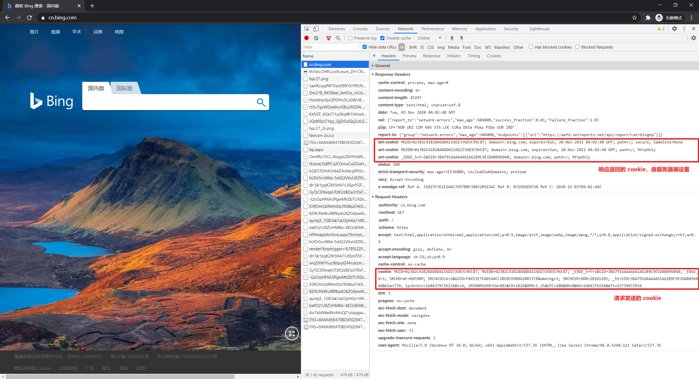
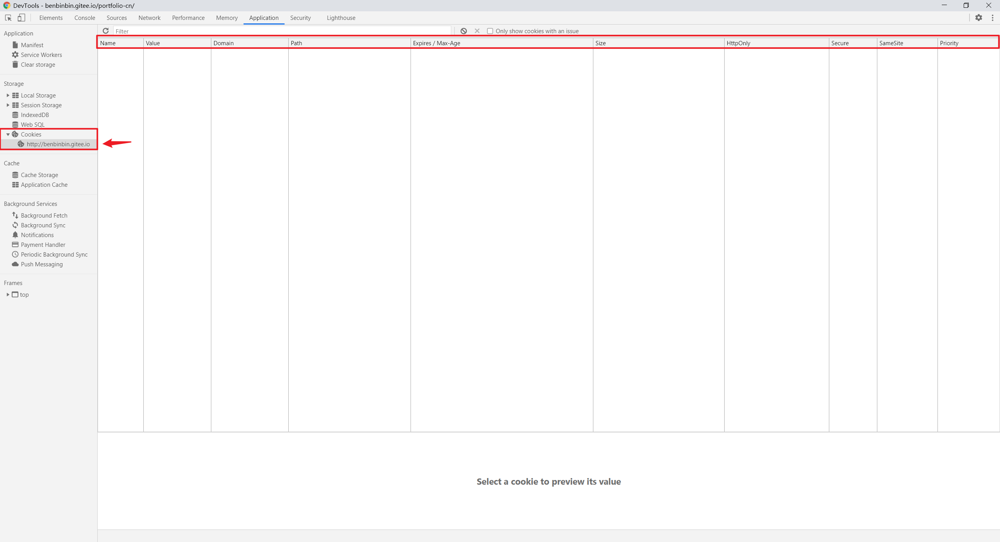

# Cookie
Cookie 是直接存储在浏览器中的一小段字符串数据，可以将它看作是一个浏览器上的小型数据库（4k 大小）。

Cookie 最常见的用处之一就是身份验证，先**由 Web 服务器在响应的 HTTP-header 设置 cookie**，然后浏览器将它们自动添加到（几乎）每个对相同域的请求的 HTTP-header 中：

* 登录后服务器在响应的 HTTP-header 设置具有唯一「会话标识符」session identifier 的 cookie。
* 下次如果请求是由相同域发起的，浏览器会在 HTTP-header 中设置该 cookie 并发送请求，所以服务器知道是谁发起了请求。

:warning: 为了安全起见，请求时发送的 cookie 只能是其 `Domain` 选项与**请求域**相同的 cookie。因此即使在 A 域名的页面中，如果有对 B 域名对应服务器发送请求（例如请求图库的图片），发送的 cookie 是浏览器之前存储的 B 域名对应服务器设置的 cookie（假如之前浏览过 B 域名下的页面，并产生了 cookie）。

其数据结构是以 key-value 方式组成，可以设置失效时间。





主要栏位解释：

* `Name` 键
* `Value` 值
* `Domain` 可以取得该 cookie 的域名。

    默认情况下，cookie 只有在设置的域下才能被访问到。所以，如果 cookie 设置在 `site.com` 下，我们在 `other.com` 下就无法获取它。**这是一项安全限制，为了允许我们可以将敏感信息保存在 cookie 中**。
    :warning: 但是棘手的是，在子域 `forum.site.com` 下也无法获取它。如果我们想要批准像 `forum.site.com` 这样的子域访问 cookie，应该将 `domain` 选项显式地设置为根域 `domain=site.com`

    ```js
    // 在 site.com 设置 cookie
    document.cookie = "user=John"
    // 在 forum.site.com 不可访问该 cookie
    alert(document.cookie); // 没有 user


    // 在 site.com 设置 cookie，并配置 domain 选项，可以被在任何子域 *.site.com 访问
    document.cookie = "user=John; domain=site.com"
    // 在 forum.site.com 可访问该 cookie
    alert(document.cookie); // 有 cookie user=John
    ```
    
    :bulb: 出于历史原因 `domain=.site.com`（`site.com` 前面有一个点符号）也以相同的方式工作，允许从子域访问 cookie。这是一个旧的表示法，如果我们需要支持非常旧的浏览器，则应该使用它。

* `Path` 设定存取该 cookie 的路径，该路径下的页面可以访问该 cookie

    通常应该将 `path` 设置为根目录：`path=/`，以使 cookie 对此网站域名下的所有页面可见。如果一个 cookie 带有 `path=/admin` 设置，那么该 cookie 在 `/admin` 和 `/admin/something` 下都是可见的，但是在 `/home` 或 `/adminpage` 下不可见。

    :warning: 必须是绝对路径。默认为当前路径。
* `Expires/Max-Age` 设定该 cookie 的失效时间，让它在指定的时间内消失

    默认情况下，如果一个 cookie 没有设置这两个参数中的任何一个，在关闭浏览器之后它就会消失，此类 cookie 被称为 session cookie。为了让 cookie 在浏览器关闭后仍然存在，我们可以设置 expires 或 max-age 选项中的一个。

    * `expires` 设定 cookie 的到期日期，那时浏览器会自动删除它。日期**必须完全采用 GMT 时区**的这种格式，可以使用 `date.toUTCString` 来获取它。
        ```js
        // 设置为当前 1 天后过期
        let date = new Date(Date.now() + 86400e3);   // 一天的毫秒数是 86400000
        date = date.toUTCString();
        document.cookie = "user=John; expires=" + date;
        ```

    * `max-age` 指明 cookie 的过期时间距离当前时间的**秒数**
        ```js
        // cookie 会在一小时后失效
        document.cookie = "user=John; max-age=3600";
    
        // 删除 cookie（让它立即过期）
        document.cookie = "user=John; max-age=0";
        ```

* `Size` 该 Cookie 的大小
* `HttpOnly` 只允许通过 HTTP 设置，这个选项禁止任何 JavaScript 访问 cookie，因此我们使用 `document.cookie` 看不到此类 cookie，也无法对此类 cookie 进行操作。
* `Secure` 设定该 Cookie 需要 https 网址才可以传输。默认情况下，如果在 `http://site.com` 上设置了 cookie，那么该 cookie 也会出现在 `https://site.com` 上（反之亦然），即 cookie 是基于域的，它们不区分协议。当配置了此选项后，通过 `https://site.com` 设置的 cookie，那么该 cookie 不会在相同域的 HTTP 环境下出现，如果一个 cookie 包含绝不应该通过未加密的 HTTP 协议发送的敏感内容，那么就应该设置这个选项。

* `samesite` 一个关于安全的特性。它旨在防止 [CSRF（跨网站请求伪造）攻击](https://zh.javascript.info/cookie#xsrf-gong-ji)。

:bulb: 还可以通过 JavaScript 操作部分 Cookie

## 读取
在浏览器（客户端）通过 `document.cookie` 读取存储于本网站的所有 Cookie，返回一个字符串，由 `name=value` 对组成，以 `;` 分隔，每一个都是独立的 cookie。

## 写入
在浏览器（客户端）通过 `document.cookie = "key=value";` 的形式写入 Cookie，可以设置有效期、路径等参数，以 `;` 分隔。

```js
// 设置了一个名称为 user 且值为 John 的 cookie
document.cookie = "user=John"; // 只会更新名称为 user 的 cookie

// 设置了一个名称为 username 且值为 bob 的 cookie，并加入有效期和路径
document.cookie="username=bob; expires=Mon, 04 Dec 2017 08:18:32 GMT; path=/";
// 可以通过 new Date().toGMTString() 方法获取当前 GMT 格式的时间

// 设置了一个名称为 username 且值为 bob 的 cookie，并加入路径和设定 10 秒后失效
document.cookie="username=bob; max-age=10; path=/";
```

:bulb: 但这不是一个数据属性，它是一个访问器（getter/setter），对其的赋值操作会被特殊处理，该操作不是重写整所有 cookie，**只会更新其中提到的 cookie，而不会涉及其他 cookie**。

## 第三方 cookie
如果 cookie 是由用户所访问的页面的域以外的域设置的，则称其为第三方 cookie。

如 `site.com` 网站的一个页面加载了另外一个网站的 banner：``，与 banner 一起，`ads.com` 的远程服务器可能会设置带有 `id=1234` 这样的 cookie 的 `Set-Cookie` header。此类 cookie 源自 `ads.com` 域，并且仅在 `ads.com` 中可见。下次访问 `ads.com` 网站时，远程服务器获取 cookie `id` 并识别用户。:bulb: 更为重要的是，当用户从 `site.com` 网站跳转至另一个也带有 banner 的网站 `other.com` 时，`ads.com` 会获得该 cookie，因为它属于 `ads.com`，从而识别用户并在他在网站之间切换时对其进行跟踪。

由于它的性质，第三方 cookie 通常用于跟踪和广告服务。它们被绑定在原始域上，因此 `ads.com` 可以在不同网站之间跟踪同一用户，如果这些网站都可以访问 `ads.com` 的话。当然，有些人不喜欢被跟踪，因此浏览器允许禁止此类 cookie。此外，一些现代浏览器对此类 cookie 采取特殊策略：

- Safari 浏览器完全不允许第三方 cookie。
- Firefox 浏览器附带了一个第三方域的黑名单，它阻止了来自名单内的域的第三方 cookie。

:bulb: 如果我们加载了一个来自第三方域的脚本，例如 `<script src="https://google-analytics.com/analytics.js">`，并且该脚本使用 `document.cookie` 设置了 cookie，那么此类 cookie 就不是第三方的。如果一个脚本设置了一个 cookie，那么无论脚本来自何处这个 cookie 都属于当前网页的域。

## 服务器端读取与写入
参考：[Cookie.md](../../../backend/Nodejs/Cookie.md)