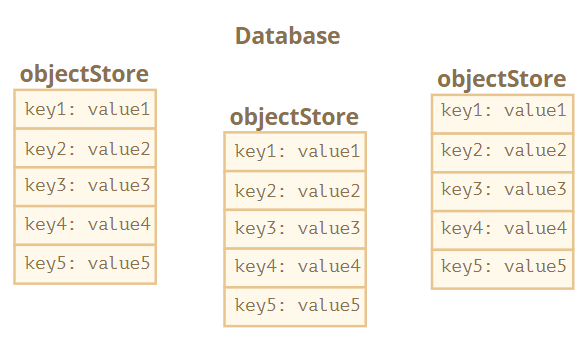

# IndexedDB

IndexedDB 是一个浏览器内置的数据库，它比 `localStorage` 强大得多，它的本机接口是**基于事件**的。

- 通过支持多种类型的键，来存储几乎可以是**任何类型**的值。
- 支撑事务的可靠性。
- 支持键范围查询、索引。
- 和 `localStorage` 相比，它可以存储更大的数据量。

该数据库是绑定到源（域/协议/端口）的，不同的网站不能相互访问对方的数据库。

:bulb: IndexedDB 适用于离线应用，可与 ServiceWorkers 和其他技术相结合使用。

## 数据库

要想使用 IndexedDB 首先需要使用方法 `open()`（连接）一个数据库，第一个参数 `name` 是数据库名称，数据库可以有许多不同的名称；第二个参数是一个正整数，表示数据库版本，默认为 `1`

```js
let openRequest = indexedDB.open(name, version); 
```

该方法返回 `openRequest` 对象，我们需要监听该对象上的事件

- `success`：数据库准备就绪，`openRequest.result` 中有了一个数据库对象“Database Object”，使用它进行进一步的调用。
- `error`：打开失败。
- `upgradeneeded`：数据库已准备就绪，但其版本已过时。如果本地数据库版本低于 `open` 中指定的版本，会触发一个特殊事件 `upgradeneeded`，我们可以根据需要比较版本，并升级数据结构。

:bulb: 如果数据库还不存在时（从技术上讲，该版本为 `0`），也会触发 `upgradeneeded` 事件，此时可以执行初始化。

```js
let openRequest = indexedDB.open("store", 1);

openRequest.onupgradeneeded = function() {
  // 如果客户端没有数据库则触发
  // ...执行初始化...
};

openRequest.onerror = function() {
  console.error("Error", openRequest.error);
};

openRequest.onsuccess = function() {
  let db = openRequest.result;
  // 继续使用已有的 db 对象处理数据库
};
```

之后不久，我们发布了第二个版本，可以打开版本 `2` 中的 IndexedDB 数据库，并像这样进行升级

```js
let openRequest = indexedDB.open("store", 2);

openRequest.onupgradeneeded = function(event) {
  // 现有的数据库版本小于 2（或不存在）
  let db = openRequest.result;
  switch(event.oldVersion) { // 现有的 db 版本
    case 0:
      // 版本 0 表示客户端没有数据库
      // 执行初始化
    case 1:
      // 客户端版本为 1
      // 更新
  }
};
```

:bulb: 只有升级操作顺利完成后，`onsuccess` 事件被触发，数据库才算是成功打开了。

:bulb: 进行数据库版本升级还有另一种方法：以 `db.objectStoreNames` 的形式**获取现有[对象库](#对象库)的列表**。该对象是一个 [DOMStringList](https://html.spec.whatwg.org/multipage/common-dom-interfaces.html#domstringlist) 提供 `contains(name)` 方法来检查 name 是否存在，再根据存在和不存在的内容进行更新。

```js
let openRequest = indexedDB.open("db", 2);

// 创建/升级 数据库而无需版本检查
openRequest.onupgradeneeded = function() {
  let db = openRequest.result;
  if (!db.objectStoreNames.contains('books')) { // 如果没有 “books” 数据
    db.createObjectStore('books', {keyPath: 'id'}); // 创造它
  }
};
```


:warning: 我们无法打开旧版本的数据库，如果当前用户的数据库版本比 `open` 调用的版本更高（比如当前的数据库版本为 `3`，我们却尝试运行 `open(..., 2)`，就会产生错误并触发 `openRequest.onerror`）。这可能会在用户加载了一个过时的 JavaScript 代码时发生（例如用户从一个代理缓存中加载 JS），代码是过时的，但数据库却是最新的。为了避免这样的错误产生，我们应当检查 `db.version` 并建议用户重新加载页面，或使用正确的 HTTP 缓存头（header）来避免之前缓存的旧代码被加载。

使用方法 `indexedDB.deleteDatabase(name)` 删除数据库

```js
let deleteRequest = indexedDB.deleteDatabase(name)
// deleteRequest.onsuccess/onerror 追踪（tracks）结果
```


## 对象库

在 `IndexedDB` 中每一条数据单位是**以键值对的形式**存在的，而多条数据构成一个**对象库 object store**（在其他数据库中，它对应称为「表」sheet 或「集合」collection），一个数据库可能有多个对象库。



创建一个对象库，该方法是同步执行的，第一个参数 `name` 是存储区的名称。（可行）第二个参数是一个对象，用于配置存储区：

* 属性 `keyPath` 设置路径，IndexedDB 以此路径作为每一条数据的键，例如 `id`

  ```js
  db.createObjectStore('books', {keyPath: 'id'});
  ```

* 属性 `autoIncrement` 用于设置是否自动生成键，如果属性值为 `true`，则自动生成键是一个递增的数字

```js
db.createObjectStore(name[, keyOptions]);
```

:bulb: 如果我们不提供 `keyOptions`，那么以后需要在存储对象时，**显式**地提供一个键。

**只有在创建数据库版本时（在 `upgradeneeded` 处理程序中），才能创建/删除/更改对象库**，这是技术上的限制。而在 upgradeneedHandler 之外，可以添加/删除/更新数据。

使用方法 `deleteObjectStore` 删除对象库（在 `upgradeneeded` 处理程序中）

```js
openRequest.onupgradeneeded = function() {
    let db = openRequest.result;
	db.deleteObjectStore('books')
}
```

IndexedDB 使用 [标准序列化算法](https://www.w3.org/TR/html53/infrastructure.html#section-structuredserializeforstorage) 来克隆和存储对象，类似于 `JSON.stringif`，不过可以存储几乎任何类型的值，包括存储原始类型、复杂的对象等，但是有一种对象**不能**被存储——循环引用的对象，此类对象不可序列化。

数据以键值对的形式构成，其中在一个对象库中的每一条数据的**键 key 必须是唯一的**，作为唯一标识符，这样才可以通过键来检索数据。它必须为数字、日期、字符串、二进制或数组；当我们存储对象时，IndexedDB 允许将一个对象属性设置为键，这就更加方便了。


## 事务

「事务」数据库中常用到的术语，事务是一组操作，要么全部成功，要么全部失败，这样保证了数据的完整性。**所有数据操作都必须在 IndexedDB 中的事务内进行。**

使用方法`transaction` 启动事务，第一个参数是事务要访问的库名称（如果我们要访问多个库，则是库名称的数组）；（可选）第二个参数是事务类型：

* ``readonly` 只读，默认值
* `readwrite` 只能读取和写入数据，而不能创建/删除/更改的对象库

```js
db.transaction(store[, type]);
```

:bulb: 需要两种事务类型，是因为许多 `readonly` 事务能够同时访问同一存储区，但 `readwrite` 事务不能。因为 `readwrite` 事务会「**锁定**」存储区进行写操作。下一个事务必须等待前一个事务完成，才能访问相同的存储区。

:bulb: `versionchange` 事务类型可以做任何事情，**但不能被手动创建**。它是在 IndexedDB 在打开数据库时，`updateneeded` 处理程序自动创建的。这就是它为什么可以更新数据库结构、创建/删除对象库的原因。

创建事务后，使用方法 `objectStore(name)` 获取相应的对象库，然后就可以对里面的数据项进行操作。对象库支持两种存储值的方法：

- 方法 `put(value, [key])` 将 `value` 添加到存储区。仅当对象库没有 `keyPath` 或 `autoIncrement` 时，才必须提供 `key`。**如果已经存在具有相同键的值，则将替换该值。**
- 方法 `add(value, [key])` 与方法 `put` 相同，**但是如果已经有一个值具有相同的键，则请求失败**，并生成一个名为 `"ConstraInterror"` 的错误。

```js
let transaction = db.transaction("books", "readwrite"); // (1)

// 获取对象库进行操作
let books = transaction.objectStore("books"); // (2)

// 数据项
let book = {
  id: 'js',
  price: 10,
  created: new Date()
};

let request = books.add(book); // (3)

request.onsuccess = function() { // (4)
  console.log("Book added to the store", request.result);
};

request.onerror = function() { // (5)
  console.log("Error", request.error);
};
```

一般步骤如下：

1. 在（1）创建一个事务，表明要访问的所有存储
2. 在（2）中使用 `transaction.objectStore(name)` 获取存储对象
3. 在（3）发起向对象库添加数据 `books.add(book)` 的请求，该方法返回的对象中，属性 `request.result` 是新数据项的键
4. 在（4）和（5）分别监听请求的成功/错误并执行相应的操作


## 搜索数据

对象库有两种主要的搜索类型：

* 通过一个键或一个键范围
* 另一个对象字段


## 删除数据

`delete(query)` 查询删除匹配的值。