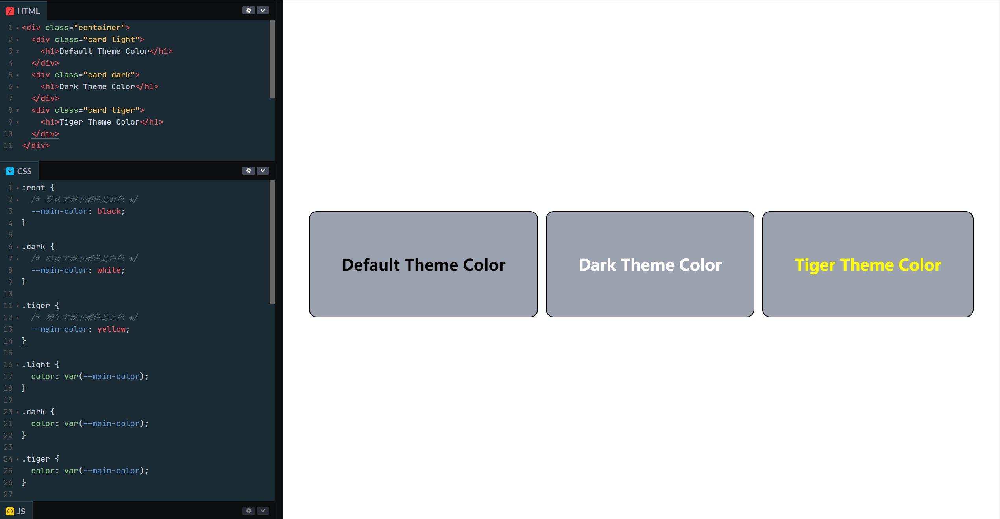
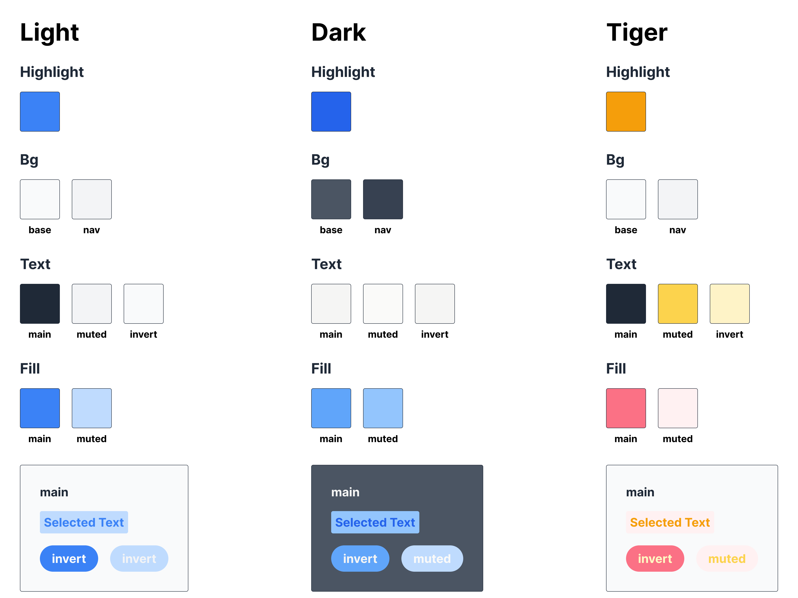
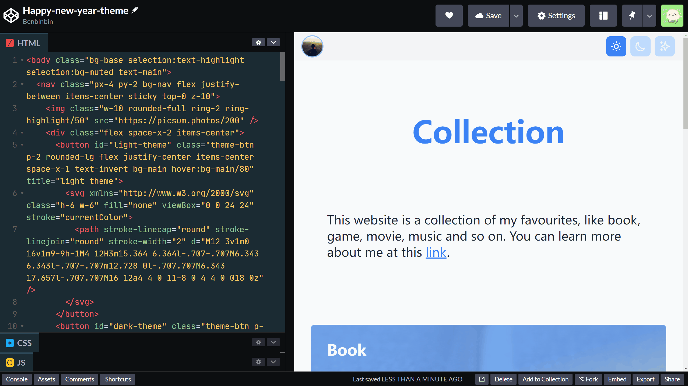

# 多主题切换

参考：

* [Tailwind 官方文档](https://tailwindcss.com/docs/)
* [Theming Tailwind with CSS Variables](https://www.youtube.com/watch?v=MAtaT8BZEAo)

:tada: 最终效果和代码可以在 [Codepen](https://codepen.io/benbinbin/pen/gOGqwLa) 查看

[CSS 自定义属性](https://developer.mozilla.org/zh-CN/docs/Web/CSS/Using_CSS_custom_properties)，也称为 CSS 变量，将某些样式值作为 CSS 变量的值，这样便于样式值的复用和样式表的维护。

定义的变量名需要使用两个减号 `--` 作为前缀，如 `--main-color: black`

然后在样式表的其他地方，通过函数 `var() ` 获取变量值，如 `var(--main-color)`

:bulb: 定义 CSS 变量的规则集所指向的选择器，限制了这些 CSS 变量的可见**作用域**。如果希望 CSS 变量全局可用，可以在根伪类 `:root` 选择器下定义 CSS 变量；如果希望在特定的作用域中才可以使用 CSS 变量，可以采用其他选择器。

```css
:root {
  /* 默认主题下颜色是黑色 */
  --main-color: black;
}

.dark {
  /* 暗夜主题下颜色是白色 */
  --main-color: white
}

.tiger {
  /* 新年主题下颜色是黄色 */
  --main-color: yellow
}
```

:bulb: 可以在 [Codepen](https://codepen.io/benbinbin/pen/poWqKoQ) 查看示例代码



为了便于演示本文实现 3 种主题，分别时 **Light 日间模式主题**、**Dark 暗夜模式主题**、**Tiger 新春模式主题**，色彩体系比较简单：

* `Highlight` 主题色，可以作为标题、字体高亮等颜色
* `Bg` 背景色
    * `base` 网页的整体背景色
    * `nav` 网页导航栏的颜色
* `Text` 字体颜色
    * `main` 字体的主要颜色，用于正文
    * `muted` 在「失效」按钮中字体的颜色
    * `invert` 在彩色按钮中字体的颜色
* `Fill` 按钮或卡片的填充色，也是主题色
    * `main` 主要填充色
    * `muted` 「失效」按钮填充色，也是选中字体时的背景色




:bulb: 可以在 [Figma](https://www.figma.com/community/file/1064102878997934684/Happy-New-Year) 查看具体的色彩值

:bulb: 其中 **Tiger 新春模式主题**主要使用了**黄色**和**红色**展现春节的氛围。

## 设置 CSS 变量
Tailwind 支持多种方式[添加自定义颜色](https://tailwindcss.com/docs/customizing-colors)，其中[使用 CSS 变量添加的颜色](https://tailwindcss.com/docs/customizing-colors#using-css-variables)，可以实现随主题（将特定的类名添加到元素上）切换元素的颜色。

先根据[设计图](https://www.figma.com/community/file/1064102878997934684/Happy-New-Year)在样式表中为各种颜色值创建 CSS 变量

```css
/* 默认主题色，即 Light 日间主题颜色 */
:root {
  --color-highlight: 59, 130, 246;
  --color-bg-base: 249, 250, 251;
  --color-bg-nav: 243, 244, 246;
  --color-text-main: 31, 41, 55;
  --color-text-muted: 243, 244, 246;
  --color-text-invert: 249, 250, 251;
  --color-fill-main: 59, 130, 246;
  --color-fill-muted: 191, 219, 254;
}

.dark-theme {
  --color-highlight: 37, 99, 235;
  --color-bg-base: 75, 85, 99;
  --color-bg-nav: 55, 65, 81;
  --color-text-main: 245, 245, 244;
  --color-text-muted: 250, 250, 249;
  --color-text-invert: 245, 245, 244;
  --color-fill-main: 37, 99, 235;
  --color-fill-muted: 147, 197, 253;
}

.tiger-theme {
  --color-highlight: 245, 158, 11;
  --color-bg: 249, 250, 251;
  --color-bg-nav: 243, 244, 246;
  --color-text-main: 31, 41, 55;
  --color-text-muted: 252, 211, 77;
  --color-text-invert: 254, 252, 232;
  --color-fill-main: 251, 113, 133;
  --color-fill-muted: 255, 241, 242;
}

```

## 添加自定义颜色
然后在脚本中进行 Tailwind 配置

```js
// 该方法是为了颜色基础类可以提供设置透明度的快捷方式，
function withOpacityValue(variable) {
  // 返回一个函数，透明度为可选参数，这样在 HTML 元素中使用颜色基础类时，既可以采用 text-blue-500 方式，也支持 text-blue-500/20 快捷同时设置透明度的形式
  return ({ opacityValue }) => {
    if (opacityValue === undefined) {
      return `rgb(var(${variable}))`;
    }
    return `rgba(var(${variable}), ${opacityValue})`;
  };
}

tailwind.config = {
  theme: {
    extend: {
      // 设置字体颜色基础类
      textColor: {
        highlight: withOpacityValue("--color-highlight"),
        main: withOpacityValue("--color-text-main"),
        muted: withOpacityValue("--color-text-muted"),
        invert: withOpacityValue("--color-text-invert")
      },
      // 设置背景颜色基础类
      // 其中 base 基础类是用于设置网页背景色，nav 基础类用于设置导航栏背景色
      // 其他的基础类是用于设置元素的填充背景色
      backgroundColor: {
        highlight: withOpacityValue("--color-highlight"),
        base: withOpacityValue("--color-bg-base"),
        nav: withOpacityValue("--color-bg-nav"),
        main: withOpacityValue("--color-fill-main"),
        muted: withOpacityValue("--color-fill-muted")
      },
      // 设置渐变颜色基础类
      gradientColorStops: {
        highlight: withOpacityValue("--color-highlight")
      },
      // 设置表单外框阴影颜色基础类
      ringColor: {
        highlight: withOpacityValue("--color-highlight")
      },
      // 设置卡片阴影颜色基础类
      boxShadowColor: {
        highlight: withOpacityValue("--color-highlight")
      },
      // 设置边框颜色基础类
      borderColor: {
        highlight: withOpacityValue("--color-highlight")
      },
      // 设置光标颜色基础类
      caretColor: {
        highlight: withOpacityValue("--color-highlight")
      },
      // 设置表单强调色基础类
      accentColor: {
        highlight: withOpacityValue("--color-highlight")
      }
    }
  }
};
```

## 切换主题
然后就可以在 HTML 文档中使用在 Tailwind 中自定义的颜色。替换 HTML 模板中颜色相关的基础类即可，例如标题 `<h1>` 元素使用`text-blue-500` 基础类，就可以替换为 `text-highlight` 基础类。

由于[原模板](https://codepen.io/benbinbin/pen/oNGJMaQ)中使用的是 Tailwind 默认颜色基础类实现 Light 日间主题，而替换后默认采用的颜色也是 Light 日间主题，所以**此时页面应该没有改变的**。

:bulb: 可以在 [Codepen](https://codepen.io/benbinbin/pen/gOGqwLa) 查看修改好的 HTML 代码

完成以上步骤，在 `<body>` 标签添加相应的类名，就可以让网页随主题切换颜色了，例如添加 `<body ... class="tiger-theme ...">` 得到 **Tiger 新春模式主题**效果

