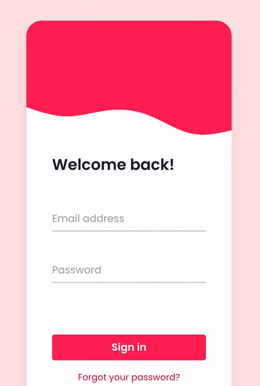

# 核心思想
Tailwind CSS 的设计遵循以下的一些规则，了解这些特点可以更快地上手该 UI 框架。

## 基础类
Tailwind 提供了多种[默认基础类](https://github.com/tailwindlabs/tailwindcss/blob/master/stubs/defaultConfig.stub.js)，如断点 `bg` 表示 `background`，这些基础类按照规则可以用横线 `-` 相连进行**组合**，构成特点的语义，例如 `bg-white` 表示背景色采用白色，经过编译后生成相应的样式表，这样就可以将样式应用在 HTML 元素上。

==使用 Tailwind 提供的这些基础类 class 不同组合，可以不写一行代码，（无需离开 HTML 文档）就实现复杂的页面样式设计。==

:bulb: 使用基础类，实际是从预设的[设计系统](https://tailwindcss.com/docs/theme)中挑选样式，这样可以保持设计的视觉统一；而这些底层 low level 的基础样式的自由组合，则满足定制化的需求，避免设计出来的网页千遍一律。这样**一致性**和**自由度**都可以兼得。

:bulb: 使用基础类来设置样式，其中一个问题是页面会出现很多重复的基础类组合，例如页面的所有按钮元素需要设置相同的样式，所以它们具有相同的基础类组合，而如果对它们进行样式更新时就变得很繁琐了，需要依次改它们的类名。Tailwind 支持将这些重复使用的基础类组合**提取**出来，并提供 `@apply` 指令来将它们应用到样式表中，再给它们其一个更抽象的类名，如 `btn`，这样就可以复用这些基础类组合了，而且便于后续的维护。

## 状态变量
通过在基础类前添加相应的**状态变量**，如类似于伪类选择器的字符串，悬停 `hover`、聚焦 `focus` 等，并用冒号 `:` 分隔，即可==设置相应状态下元素的样式==。

Tailwind 提供了多种常见的状态变量：
* [和伪类选择器相对应的状态变量](https://tailwindcss.com/docs/hover-focus-and-other-states#pseudo-classes)，如 `hover`、`focus`、`first-child`、`required`
* [和伪元素选择器相对应的状态变量](https://tailwindcss.com/docs/hover-focus-and-other-states#pseudo-elements)，如 `before`、`after`、`selection`、`placeholder`
* [媒体查询相关的状态变量](https://tailwindcss.com/docs/hover-focus-and-other-states#media-queries)，如 `sm`（尺寸）、`dark`（暗夜模式）、`prefers-reduced-motion`（动画模式）
* [特定元素的专属特性相关的状态变量](https://tailwindcss.com/docs/hover-focus-and-other-states#attribute-selectors)，如 `<details>` 或 `<dialog>` 元素在 open state 展开状态的样式设置可以使用状态变量 `open`、字体排列顺序 RTL 或 LTR 可以使用状态属性 `rtl` 和 `ltr` 表示

:bulb: Tailwind 默认提供的所有状态变量，可以查看的[官方文档](https://tailwindcss.com/docs/hover-focus-and-other-states#appendix)

:bulb: 这些的样式设置方式都是 inline-style 无法实现的。**而且这些状态属性可以「叠加」使用，来为元素设置在特定的几个状态同时触发时的样式**

```html
<!-- 鼠标在按钮上悬停时，颜色变深 -->
<!-- 在暗夜模式开启且鼠标在按钮上悬停时，颜色变浅 -->
<button class="bg-teal-500 hover:bg-teal-600 dark:hover:bg-teal-300">Sign Up</button>
```

根据它们的先后「叠加」次序，会生成嵌套的选择器，类似于嵌套函数。一般情况下「叠加」的状态变量的次序并无关紧要，==但是有一些[特殊例外](https://tailwindcss.com/docs/hover-focus-and-other-states#ordering-stacked-modifiers)?==

```
// These modifiers:
'dark:group-hover:focus:opacity-100'

// ...are applied like this:
dark(groupHover(focus('opacity-100')))
```

:bulb: 所有基础类，包括自定义的基础类，都支持和状态变量配合使用

```css
/* 📄 main.css */
@tailwind base;
@tailwind components;
@tailwind utilities;

@layer utilities {
  .content-auto {
    content-visibility: auto;
  }
}
```

```html
<div class="lg:content-auto">
  <!-- ... -->
</div>
```

### 伪类状态变量
* `hover`、`focus`、`active`、`visited`、`focus-within`、`focus-visible` 等状态变量，一般用于设定按钮、表单等元素的相应状态的样式

  ```html
  <!-- 当鼠标悬停在按钮时，背景色变浅 -->
  <!-- 当点击按钮时，背景色变深 -->
  <!-- 当按钮被聚焦时，没有默认的聚焦样式，换为自定义的样式 -->
  <button class="bg-violet-500 hover:bg-violet-400 active:bg-violet-600 focus:outline-none focus:ring focus:ring-violet-300 ...">
    Save changes
  </button>
  ```

* `first`、`last` 状态变量一般用于父元素，用以设置第一或最后一个子元素的样式；`odd`、`even` 状态变量一般用于表格元素，用以设置奇数行或偶数行的样式。

  ```html
  <table>
    <!-- ... -->
    <tbody>
      {#each people as person}
        <!-- Use a white background for odd rows, and gray-100 for even rows -->
        <tr class="odd:bg-white even:bg-gray-100">
          <td>{person.name}</td>
          <td>{person.title}</td>
          <td>{person.email}</td>
        </tr>
      {/each}
    </tbody>
  </table>
  ```

  :bulb: 此外还有其他的一些不常用的**表示 DOM 元素结构**的状态变量：
    * `only` 用以设置当该元素内只有一个子元素的状态下的样式

    ```html
    <ul>
      {#each people as person}
        <li class="py-4 only:py-0 ...">
          <!-- ... -->
        </li>
      {/each}
    </ul>
    ```

    * `first-of-type` 用以设置当该元素是同类型的标签中，作为其父元素的第一个子元素的状态下的样式。另一个先对的状态变量是 `last-of-type`；还有作为其父元素的同类型标签唯一一个子元素的状态变量 `only-of-type`。

    ```html
    <div>
      <p class>first paragraph</p>
      <p>second paragraph</p>
    </div>
    ```

    * `empty` 用以设置当元素中没有内容时的样式（不仅没有子元素，也没有文本内容）

    ```html
    <ul>
      {#each people as person}
        <li class="empty:hidden ...">{person.hobby}</li>
      {/each}
    </ul>
    ```

* `required`、`valid`、`invalid`、`disabled`、`checked` 等状态变量一般用于设置表单元素在特定情况下的样式。

  :bulb: 还包括一些不常用的状态变量：
    * `default` 用以设置下拉菜单的选项元素、复选框、单选按钮的默认值被加载时的表单元素的样式
    * `read-only` 用以设置只读表单元素的样式
    * `autofill` 用以设置具有自动填充属性的表单元素（它具有 `autocomplete` 特性）的样式
    * `placeholder-shown` 用以设置当占位符 placeholder 存在时表单元素的样式
    * `in-range` 和 `out-of-range` 用以分别设置输入值在范围内或在范围外时表单元素的样式
      ```html
      <input min="1" max="5" class="in-range:border-green-500 ..." />
      ```
    * `indeterminate` 用以设置单选按钮或复选框在不确定时的表单元素的样式
      ```html
      <input type="checkbox" class="appearance-none indeterminate:bg-gray-300 ..." />
      ```

除了基于元素自身的不同状态设置样式，还可以基于该元素的父元素的不同状态、或兄弟元素的不同状态设置样式

* `group-{modifier}` 状态变量用以设置子元素在父元素处于特定状态时样式，例如 `group-hover` 状态变量是设置当鼠标悬停在父元素（含有类名 `group`）时，该子元素的样式

  ```html
  <!-- 父元素具有类名 group -->
  <a href="#" class="group ...">
    <!-- 子元素/目标元素具有状态变量 group-hover -->
    <p class="group-hover:text-white text-sm ...">sub element</p>
  </a>
  ```

  :bulb: `group-{modifier}` 其中 `modifier` 是一种伪类状态变量，表示父元素所处的状态，例如 `group-focus`、`group-active`、`group-odd`

* `peer-{modifier}` 状态变量用以设置该元素在兄弟元素（含有类名 `peer`）处于特定状态时样式，

  ```html
  <form>
    <label class="block">
      <!-- 兄弟元素具有类名 peer -->
      <input type="email" class="peer ..."/>
      <!-- 目标元素具有状态变量 peer-invalid -->
      <!-- 当以上的表单输入非法值时，该提示信息才会显示 -->
      <p class="invisible peer-invalid:visible ...">
        Please provide a valid email address.
      </p>
    </label>
  </form>
  ```

  :clapper: 这个[视频教程](https://youtu.be/nJzKi6oIvBA)就是使用该状态变量实现 floating labels 浮动标签的效果。

  

### 伪元素状态变量
* `before` 和 `after` 状态变量用于设置伪元素 `:before` 和 `:after` 的样式
  :bulb: 其中采用 `content: ''` 空字符串作为伪元素内容的默认值，如果希望设置内容可以采用 `before:content-[*]` 的形式，这是在元素前添加 `*` 字符串作为伪元素。

  ```html
  <label class="block">
    <span class="after:content-['*'] after:ml-0.5 after:text-red-500 ...">
      Email
    </span>
    <input type="email" name="email" class="..." />
  </label>
  ```

* `placeholder` 状态变量为 `<input type="text"/>` 和 `<textarea></textarea>` 元素的占位符设置样式

  ```html
  <label class="relative block">
    <input class="placeholder:italic placeholder:text-gray-400 ... placeholder="Search for anything..." type="text" name="search"/>
  </label>
  ```

* `file` 状态变量为 `<input type="file">` 文件选择表单元素设置样式

  ```html
  <form class="flex items-center space-x-6">
    <label class="block">
      <span class="sr-only">Choose profile photo</span>
      <input type="file" class="...
        file:mr-4 file:py-2 file:px-4
        file:rounded-full file:border-0
        file:text-sm file:font-semibold
        file:bg-violet-50 file:text-violet-700
        hover:file:bg-violet-100
      "/>
    </label>
  </form>
  ```

  :bulb: 由于 Tailwind 的样式重置 base reset 并不会应用到 `<input type="file">` 元素的按钮的边框属性上，所以一般需要显式地来设置 `border` 相关的样式，以保持设计的统一性

  ```html
  <input type="file" class="file:border file:border-solid ..." />
  ```

* `marker` 状态变量用以设置列表的各项前的标识样式

  ```html
  <ul role="list" class="marker:text-sky-400 ...">
    <li>5 cups chopped mushrooms</li>
    <li>1/2 cup of olive oil</li>
    <li>3lb of celery</li>
  </ul>
  ```

  :bulb: 该状态变量可以用在 `<ul>` 或 `<ol>` 列表元素上来统一设置列表项的样式；也可以单独应用在 `<li>` 元素上，分别设置该列表项的样式

* `selection` 状态变量用以设置选中的文本的样式

  ```html
  <div class="selection:bg-fuchsia-300 selection:text-fuchsia-900">
    <p>
      So I started to walk into the water.
    </p>
  </div>
  ```

  :bulb: 一般将该状态变量设置的基础类用于 `<body>` 元素以设置全局的选中文本的样式

* `first-line` 和 `first-letter` 状态变量分别用于设置文本的首行或首个字母的样式
  ```html
  <p class="first-line:uppercase first-line:tracking-widest
  first-letter:text-7xl first-letter:font-bold first-letter:text-gray-900
  first-letter:mr-3 first-letter:float-left
  ">
    Well, let me tell you something, funny boy. Y'know that little stamp, the one
    that says "New York Public Library"? Well that may not mean anything to you,
    but that means a lot to me. One whole hell of a lot.
  </p>
  ```

### 媒体相关的状态变量
* Tailwind 提供了五个默认的断点 `sm`、`md`、`lg`、`xl`、`2xl` 这些状态变量用以设置在页面满足一定宽度时才应用的样式
* `dark` 用以设置当媒体特性 prefers-color-scheme 为 dark 时（即系统的主题色设置为暗色）元素的样式
* `motion-reduce` 用以设置当媒体特性 prefers-reduced-motion 为 reduce 时（即系统将动画效果最小化，以获得更好的性能）元素的样式，一般该状态变量用来**覆盖/取消 undo**那些「性能耗费高」的动效相关的样式；还有一个相对的状态变量 `motion-safe` 用于设置样式，一般是「性能耗费高」的动效相关的样式，它们在媒体特性 prefers-reduced-motion **不为** reduce 时才会被应用

  ```html
  <!-- Using `motion-reduce` can mean lots of "undoing" styles -->
  <button class="hover:-translate-y-0.5 transition motion-reduce:hover:translate-y-0 motion-reduce:transition-none ...">
    Save changes
  </button>

  <!-- Using `motion-safe` is less code in these situations -->
  <button class="motion-safe:hover:-translate-x-0.5 motion-safe:transition ...">
    Save changes
  </button>
  ```

* `portrait` 和 `landscape` 状态变量分别用于设置当屏幕方向为纵向或横向时元素的样式
* `print` 状态变量用于设置元素在打印时的样式，可以用 `print:hidden` 基础类来实现在打印时隐藏某些元素的功能

### 特性相关的状态变量
* `rtl` 和 `ltr` 状态变量分别用于设置当页面的文本显示模式为从右到左 RTL（默认情况）或从左到右 LTR 时元素的样式

  :bulb: 如果希望 `ltr` 状态变量所设置的样式生效，需要指定元素的属性 `dir` 为 `ltr`（可以在页面的根元素 `<html>` 中进行设置）
* `open` 状态变量用于设置 `<details>` 或 `<dialog>` 元素为展开状态时（具有 `open` 特定）的样式

  ```html
  <div class="max-w-lg mx-auto p-8">
    <details class="open:bg-white ... open">
      <summary class="...">
        Why do they call it Ovaltine?
      </summary>
      <div class="...">
        <p>The mug is round. The jar is round. They should call it Roundtine.</p>
      </div>
    </details>
  </div>
  ```

### 自定义状态变量
除了内置的状态变量，Tailwind 还支持自定义[状态变量 state variants](https://tailwindcss.com/docs/hover-focus-and-other-states#creating-custom-modifiers)。

使用 `plugins` 模块在 Tailwind 的配置文件 `tailwind.config.js` 中[定制](https://tailwindcss.com/docs/plugins#adding-variants) modifier


```js
// 📄 tailwind.config.js
// 导入插件模块
const plugin = require('tailwindcss/plugin');

module.exports = {
  // ...
  plugins: [
    // 创建一个名为 third 状态变量
    // 用以匹配第三个子元素设置其样式
    plugin(function ({ addVariant }) {
      // Add a `third` variant, ie. `third:pb-0`
      addVariant('third', '&:nth-child(3)')
    })
  ]
}
```

## 响应式设计
Tailwind 提供[五个默认的断点](https://tailwindcss.com/docs/responsive-design)：

* `sm` 640px
* `md` 768px
* `lg` 1024px
* `xl` 1280px
* `2xl` 1536px

只需要在类名前添加断点名称，并用冒号 `:` 分隔，即可将该样式设定特定页面宽度下才起作用

```html
<!-- Width of 16 by default, 32 on medium screens, and 48 on large screens -->

```

:bulb: Tailwind 的断点都是**基于 `min-width` 最小宽度的**，这是遵循移动优先 mobile first 的原则，**即默认样式就是移动端小屏的样式**，然后各断点是指当页面宽度**大于**特定值时，才将样式响应式地进行变化。

可以在 Tailwind 的配置文件 `tailwind.config.js` 定制断点

```js
// 📄 tailwind.config.js
module.exports = {
  theme: {
    // 直接在 theme 的 screens 属性中定制的断点会覆盖所有默认断点
    screens: {
      'tablet': '640px',
      // => @media (min-width: 640px) { ... }

      'laptop': '1024px',
      // => @media (min-width: 1024px) { ... }

      'desktop': '1280px',
      // => @media (min-width: 1280px) { ... }
    },
  }
}
```

## 暗夜模式
Tailwind 提供了 `dark` 状态变量，用以设置暗夜模式下元素的样式。

:bulb: 默认是基于媒体查询 `prefers-color-scheme` 的结果为 `dark` 时（即系统开启了暗夜模式时），来决定是否采用暗夜模式下的样式。

如果希望给用户主动权，可以在页面手动切换日间或暗夜模式，可以在 Tailwind CSS 的配置文件 `tailwind.config.js` 中将属性 `darkMode` 设置为使用 `class` 策略（而不是默认的基于媒体查询 prefers-color-scheme（即系统设置）的 `media` 模式）

```js
// 📄 tailwind.config.js
module.exports = {
  darkMode: 'class',
  // ...
}
```

页面还需要添加相应的 JS 脚本，一般是监听按钮切换 toggle 操作，以实现页面根元素 `<html>` 的类名 `dark` 的增删

```js
// 以下代码兼容了随系统切换和让用户主动切换日间、暗夜模式的功能
// On page load or when changing themes, best to add inline in `head` to avoid FOUC
if (localStorage.theme === 'dark' || (!('theme' in localStorage) && window.matchMedia('(prefers-color-scheme: dark)').matches)) {
  document.documentElement.classList.add('dark')
} else {
  document.documentElement.classList.remove('dark')
}

// Whenever the user explicitly chooses light mode
localStorage.theme = 'light'

// Whenever the user explicitly chooses dark mode
localStorage.theme = 'dark'

// Whenever the user explicitly chooses to respect the OS preference
localStorage.removeItem('theme')
```

然后会根据页面的根元素 `<html>` 中是否具有类名 `dark` 而决定是否将暗夜模式的样式应用于元素。

```html
<!-- Dark mode not enabled -->
<html>
<body>
  <!-- Will be white -->
  <div class="bg-white dark:bg-black">
    <!-- ... -->
  </div>
</body>
</html>
```

```html
<!-- Dark mode enabled -->
<html class="dark">
<body>
  <!-- Will be black -->
  <div class="bg-white dark:bg-black">
    <!-- ... -->
  </div>
</body>
</html>
```

## 复用样式
在 HTML 中会有大量相同的类组合，如页面的按钮都使用了很多相同基础类，为了避免代码冗余以及后续维护方便，Tailwind 还提供了一种抽取共用基础类的方法。

可以将这些相同的一系列基础类**提取**出来，在它们前面添加指令 `@apply`，然后写在样式表中，并为它们指定一个类名，即可将它们「汇总」在一个新的更抽象的类名下 high level abstract class。

然后我们就可以将新类名添加在 HTML 标签中，最后产生相同的样式效果。

```html
<!-- 原始的按钮元素 -->
<!-- 📄 index.html -->
<!-- Before extracting a custom class -->
<button class="py-2 px-4 bg-blue-500 text-white font-semibold rounded-lg shadow-md hover:bg-blue-700 focus:outline-none focus:ring-2 focus:ring-blue-400 focus:ring-opacity-75">
  Save changes
</button>
```

```css
/* 📄 styles.css */
@tailwind base;
@tailwind components;
@tailwind utilities;

/* 应该指定这些自定义类应用到哪一个容器中 */
/* 由于先后顺序对于 CSS 的优先级很重要 */
/* 应用到 components 容器中，这样在 HTML 页面同时使用 btn-primary 和其他基础类，如 bg-sky-400 最终背景色还是以基础类 bg-sky-400 为准，由于 utilities 容器在更后的次序才添加到样式表中，它们的优先级更高 */
@layer components {
  /* 将基础类组合抽取出来 */
  .btn-primary {
    @apply py-2 px-4 bg-blue-500 text-white font-semibold rounded-lg shadow-md hover:bg-blue-700 focus:outline-none focus:ring-2 focus:ring-blue-400 focus:ring-opacity-75;
  }
}
```

```html
<!-- After extracting a custom class -->
<button class="btn-primary">
  Save changes
</button>
```

:bulb: 此外，还可以结合编辑器的多光标编辑功能，同时选中多个相同的类名，也可以实现高效的编辑；如果使用前端框架进行开发，还可以将多个页面复用的代码抽取出来形成组件，这样也只需要维护一套代码。

## 自定义样式
Tailwind 支持多种简单的方式添加自定义样式，例如在配置文件 `tailwind.config.js` 中进行配置即可自定义基础类，还有通过 `top-[117px]` 的方式来临时使用任意样式。此外它也支持插件，而且提供了一些[官方插件](https://tailwindcss.com/docs/plugins#official-plugins)，可以实现更复杂的功能。

### 自定义基础类
可以在配置文件 `tailwind.config.js` 的主题属性 `theme`中定制颜色、间隔、字体、断点等基础类。而且可以通过**覆写**默认的预设值和**扩展**添加新值两种方式。

:bulb: 所有配置都是可选的，如果基础类在配置文件中没有设置，则会使用 Tailwind 的[预设值](https://github.com/tailwindlabs/tailwindcss/blob/master/stubs/defaultConfig.stub.js)。

```js
module.exports = {
  theme: {
    // 直接在 theme 属性中设置的基础类会完全覆盖原有的预设基础类
    screens: {
      sm: '480px',
      md: '768px',
      lg: '976px',
    },
    colors: {
      'blue': '#1fb6ff',
      'pink': '#ff49db',
      'orange': '#ff7849',
    },
    fontFamily: {
      sans: ['Graphik', 'sans-serif'],
      serif: ['Merriweather', 'serif'],
    },
    // 在 theme 属性的 extend 属性下添加的基础类会以扩展添加新值的方式来添加自定义基础类
    extend: {
      spacing: {
        '128': '32rem',
        '144': '36rem',
      },
      borderRadius: {
        '4xl': '2rem',
      }
    }
  }
}
```

### 使用任意值
Tailwind 支持以 `utility-[value]` 的形式来临时使用任意样式值，其中 `utility` 表示基础类，后面用 `-` 连字符相连的，在方括号 `[]` 中的 `value` 就是该样式的值。而且这种形式也支持使用状态变量，例如 `hover:utility-[value]` 设置在鼠标悬停时元素的样式

```html
<!-- 将字体大小设置为 22px -->
<div class="text-[22px] lg:top-[34px]">Hello World</div>
```

```html
<!-- 其中最常用的是用于设置伪元素的 content 内容 -->
<div class="before:content-['Ha']">
  <!-- ... -->
</div>
```

:bulb: 如果样式值需要使用空格，常见于设置简写属性的样式值时，此时**需要将空格替换为下划线 `_`**，Tailwind 在编译时才可以正确识别再自动转换为空格。

```html
<div class="grid grid-cols-[1fr_500px_2fr]">
  <!-- ... -->
</div>
```

而对于那些下划线是合法值，但空格是非法的属性，如 `url` 则 Tailwind 在编译时会自动进行判断，不会对下划线进行转换。

```html
<!-- 不会对下划线进行转换 -->
<div class="bg-[url('/what_a_rush.png')]">
  <!-- ... -->
</div>
```

只有在一些特殊的情况下（下划线和空格都是合法的样式值），需要用转义符 `\` 显式地告知编译器**不需要**对自定义的样式值中的下划线进行转换

```html
<div class="before:content-['hello\_world']">
  <!-- ... -->
</div>
```

:bulb: 有些基础类前缀可以用于设置不同类型的样式，例如 `text-` 前缀，它既有 `text-lg` 用以设置字体大小，也有 `text-black` 用以设置字体的颜色，一般 Tailwind 会自动**根据方括号 `[value]` 内的任意值 `value` 的形式自动判断开发者是在设置哪一个类型样式**

```html
<!-- Will generate a font-size utility -->
<div class="text-[22px]">...</div>

<!-- Will generate a color utility -->
<div class="text-[#bada55]">...</div>
```

但是如果开发者是通过 CSS 变量来传递任意值的时候，而且所要设置的基础类可以对应于多种类型的样式属性时，编译器就无法预判我们实际上是要设置哪一种样式属性了，这时我们需要在 CSS 变量前添加提示 hint（以冒号 `:` 分隔），给编译器足够的指引

```html
<!-- Will generate a font-size utility -->
<div class="text-[length:var(--my-var)]">...</div>

<!-- Will generate a color utility -->
<div class="text-[color:var(--my-var)]">...</div>
```

甚至可以用类似的形式设置任意的样式，当 Tailwind 没有相应的基础类，而且只是临时使用（不必在 Tailwind 配置文件中进行繁琐的设置），在方括号 `[]` 中设置属性及其属性值。该方式类似行内样式 inline style，但是它还有一个优势就是可以使用状态变量，以设置特定状态下元素的样式。

```html
<div class="[--scroll-offset:56px] lg:[--scroll-offset:44px]">
  <!-- ... -->
</div>
```

### 样式表添加 CSS
还有一种添加自定义样式的简单直接方式，就是在样式表中写样式了。

```css
/* 📄 main.css */
@tailwind base;
@tailwind components;
@tailwind utilities;

.my-custom-style {
  /* ... */
}
```

:warning: 其中有一点值得注意的是，由于样式表中 **CSS 代码的顺序**对于样式的优先级影响很大，因此 Tailwind 提供了==指令 `@layer` 用以将自定义的样式代码添加到其三个模块/容器 `base`、`components`、`utilities` 之一==，这三个模块一般是依次编译到样式表中的，应该恰当地选择容器否则就有可能出现[与预期不相符的样式覆盖现象](https://tailwindcss.com/docs/adding-custom-styles#using-css-and-layer)。

* `base` 模块包含一些[重置样式](https://tailwindcss.com/docs/preflight) [preflight](https://tailwindcss.com/docs/preflight)，以保证网页在不同浏览器中显示保持一致。如果希望为页面整体添加一些默认的样式，例如字体 font family、标题大小等，可以将这些自定义的样式代码添加到 `base` 容器中。

  ```css
  @tailwind base;
  @tailwind components;
  @tailwind utilities;

  @layer base {
    h1 {
      font-size: 1.5rem;
    }
    h2 {
      /* 可以在样式表中通过指令 @apply 使用基础类来设置样式 */
      @apply text-xl;
    }
    /* ... */
  }
  ```

  :bulb: 添加自定义重置样式的一个简单的替代方案，在页面的根元素 `<html>` 或 `<body>` 元素中添加所需的样式（或对应的基础类），而不需要在样式表中写代码。

  :bulb: 如果希望禁止重置样式 preflight，可以将 Tailwind 的配置文件的 `corePlugins` 选项的 `preflight` 属性设置为 `false`

  ```js
  // 📄 tailwind.config.js
  module.exports = {
    corePlugins: {
      preflight: false,
    }
  }
  ```

* `components` 模块十分简单，它包含的是一个类名为 `container` 类的样式。一般在该容器中添加复杂的样式，以应用于页面的一些视觉组件上，如按钮、表单、卡片等。

  :bulb: 如果希望在样式表中使用 Tailwind 的基础类（所对应的样式）可以使用 `@apply`，如果希望引用基础类预设的样式值可以使用 `theme()` 函数

  ```css
  /* 📄 main.css */
  @tailwind base;
  @tailwind components;
  @tailwind utilities;

  @layer components {
    .card {
       /* 通过 theme() 函数可以使用基础类的某个样式值 */
      background-color: theme('colors.white');
      border-radius: theme('borderRadius.lg');
      padding: theme('spacing.6');
      box-shadow: theme('boxShadow.xl');
    }
    .select-dropdown {
      /* 通过 @apply 可以使用基础类所对应的样式 */
      @apply rounded-b-lg shadow-md;
    }
    /* ... */
  }
  ```

* `utilities` 模块包含的是原子化的样式（每一个基础类都只实现一个基础的样式功能），应该最后加载的。这样在其中定义的样式就有最高的优先级，**即确保基础类应用到 HTML 页面时，可以覆盖其他样式。**

  ```html
  <!-- Will look like a card, but with square corners -->
  <div class="card rounded-none">
    <!-- ... -->
  </div>
  ```

  在该容器中定义的样式应该是 low level 单一功能的样式

  ```css
  @tailwind base;
  @tailwind components;
  @tailwind utilities;

  @layer utilities {
    .content-auto {
      content-visibility: auto;
    }
  }
  ```

:bulb: 所有使用 `@layer` 添加的样式，它们的类名在应用到 HTML 页面时，也像 Tailwind 内置的基础类一样，都支持使用**状态变量**（这是使用普通方式添加的样式所不具有的优势）

```css
@tailwind base;
@tailwind components;
@tailwind utilities;

@layer utilities {
  .content-auto {
    content-visibility: auto;
  }
}
```

```html
<div class="lg:dark:content-auto">
  <!-- ... -->
</div>
```

:bulb: 而且使用指令 `@layer` 添加自定义样式，也会在编译时自动进行简化 purge 处理，只有在 HTML 页面的元素中使用了类名，相应的自定义样式才会被编译到最终的样式表中。如果希望自定义的样式最后总是编译到样式表中，则可以不使用指令 `@layer` 直接写在主样式表中（也需要注意 CSS 代码添加的顺序，一般应该保证 `@tailwind utilities` 模块最后引入）

```css
@tailwind base;
@tailwind components;

/* This will always be included in your compiled CSS */
.card {
  /* ... */
}

@tailwind utilities;
```

:warning: 如果使用多个样式表，并希望在其中使用了指令 `@layer` 将某些自定义的样式插入到指定的容器中，则需要**先将这些样式表导入到主样式表**（带有指令 `@tailwind` 的样式表），然后再执行编译操作，否则会触发 `@layer` 无法配对 `@tailwind` 指令的错误。

可以使用 [`postcss-import` 插件](https://tailwindcss.com/docs/using-with-preprocessors#build-time-imports)来进行预处理。在终端输入以下命令安装 `postcss-import` 插件依赖包

```bash
npm install -D postcss-import
```

然后在 PostCSS 配置文件 `postcss.config.js` 声明插件

```js
// 📄 postcss.config.js
module.exports = {
  plugins: [
    require('postcss-import'),
    require('tailwindcss'),
    require('autoprefixer'),
  ]
}
```

然后就可以在不同的样式表的**顶部**导入所依赖的 CSS 模块

```css
/* components/buttons.css */
.btn {
  @apply px-4 py-2 rounded font-semibold bg-gray-200 text-black;
}
```

```css
/* components/card.css */
.card {
  @apply p-4 bg-white shadow rounded;
}
```

```css
/* components.css */
@import "./components/buttons.css";
@import "./components/card.css";
```

:bulb: 在主样式表中，如果希望导入的模块和 Tailwind 的模块有先后次序，也可以使用 `@import` 的方式导入 Tailwind 的三个模块（而不使用 `@tailwind` 指令来导入，因为 `@import` 指令必须在样式表的顶部）

```css
/* 📄 main.css */
@import "tailwindcss/base";
@import "./custom-base-styles.css";

@import "tailwindcss/components";
@import "./custom-components.css";

@import "tailwindcss/utilities";
@import "./custom-utilities.css";
```

:warning: 使用 Vue、React 等前端框架，在单文件组件文档中，支持使用 `<style>` 标签来为组件添加样式，在其中也可以使用 `@apply` 来提取其模板中的基础类组合，但是**不支持使用指令 `@layer`** 将自定义的样式添加到指定的容器，因为每一个单文件组件的 `<style>` 标签内的样式都是独立编译的，它们无法读取其他样式表的信息，也就无法指定到主样式表的容器中，这只会让我们失去控制自定义的样式（与 Tailwind 的默认样式）的优先级。

### 插件添加 CSS
还可以通过编写[插件](https://tailwindcss.com/docs/plugins)来添加自定义样式（而不是使用样式表）。在 Tailwind 的配置文件 `tailwind.config.js` 中引入 `tailwindcss/plugin` 模块的 `plugin` 方法创建插件。它提供了一些[钩子函数](https://tailwindcss.com/docs/plugins#:~:text=helper)，用以将自定的样式添加到 `base`、`components` 或 `utilities` 中

```js
// 📄 tailwind.config.js
const plugin = require('tailwindcss/plugin')

module.exports = {
  // ...
  plugins: [
    plugin(function ({ addBase, addComponents, addUtilities, theme }) {
      addBase({
        'h1': {
          fontSize: theme('fontSize.2xl'),
        },
        'h2': {
          fontSize: theme('fontSize.xl'),
        },
      })
      addComponents({
        '.card': {
          backgroundColor: theme('colors.white'),
          borderRadius: theme('borderRadius.lg'),
          padding: theme('spacing.6'),
          boxShadow: theme('boxShadow.xl'),
        }
      })
      addUtilities({
        '.content-auto': {
          contentVisibility: 'auto',
        }
      })
    })
  ]
}
```

## 函数与指令
Tailwind 提供了定制的指令 `@tailwind`、`@layer`、`@apply` 用于样式表中，实现特定的功能；此外提供了定制的函数 `theme()`、`screen()` 用于样式表中，以获取 Tailwind 的一些默认样式值。

### 指令
指令是在样式表中[以 `@` 开头，后面跟一个标识符的命令](https://developer.mozilla.org/zh-CN/docs/Web/CSS/At-rule)，以指定 CSS 执行特定的行为。例如 `@import` 可以让 CSS 引擎导入外部的模块；`@media` 可以让 CSS 引擎在特定的条件下应用一组样式。

Tailwind 提供了三个定制的指令：

* `@tailwind` 指令将 Tailwind 的模块 `base`、`components`、`utilities` 以及 `variants`（最后一个模块会默认最后导入）分别导入（因为 CSS 的顺序很重要）到样式表中

  ```css
  /**
  * This injects Tailwind's base styles and any base styles registered by
  * plugins.
  */
  @tailwind base;

  /**
  * This injects Tailwind's component classes and any component classes
  * registered by plugins.
  */
  @tailwind components;

  /**
  * This injects Tailwind's utility classes and any utility classes registered
  * by plugins.
  */
  @tailwind utilities;

  /**
  * Use this directive to control where Tailwind injects the hover, focus,
  * responsive, dark mode, and other variants of each class.
  *
  * If omitted, Tailwind will append these classes to the very end of
  * your stylesheet by default.
  */
  @tailwind variants;
  ```

* `@apply` 指令将 HTML 中共用的基础类组合提取出来，放到样式表中，「汇总」为一个新的类，然后在 HTML 元素就可以只写这个类名实现相同的效果

  ```css
  /* 📄 styles.css */
  .btn {
    @apply font-bold py-2 px-4 rounded;
  }

  /* 可以插入到已有样式设置的类中 */
  .btn:hover {
    @apply bg-blue-700;
    transform: translateY(-1px);
  }
  ```

  :bulb: 如果通过 `@apply` 指定的原样式中具有 `!important` 声明，编译后生成的相应样式会默认将其去掉，避免其优先级与基础类冲突。

  ```css
  /* Input */
  .foo {
    color: blue !important;
  }

  .bar {
    @apply foo;
  }
  ```

  ```css
  /* Output */
  .foo {
    color: blue !important;
  }

  .bar {
    color: blue;
  }
  ```

  :bulb: 如果希望保留 `!important` 声明，可以在 `@apply` 提取的基础类组合的最后添加 `!important` 声明

  ```css
  /* Input */
  .btn {
    @apply font-bold py-2 px-4 rounded !important;
  }
  ```

  ```css
  /* Output */
  .btn {
    font-weight: 700 !important;
    padding-top: .5rem !important;
    padding-bottom: .5rem !important;
    padding-right: 1rem !important;
    padding-left: 1rem !important;
    border-radius: .25rem !important;
  }
  ```

  :bulb: 使用 Vue、React 等前端框架，在单文件组件文档中，支持使用 `<style>` 标签来为组件添加样式，如果希望在其中使用 `@apply` 来应用**自定义的类名**会失败报错，这是由于每一个单文件组件的 `<style>` 标签内的样式都是独立编译的，它们无法读取其他样式表的信息，也就无法指定到主样式表的容器中的自定义样式。

  ```css
  /* 📄 main.css */
  @tailwind base;
  @tailwind components;
  @tailwind utilities;

  @layer components {
    .card {
      background-color: theme('colors.white');
      border-radius: theme('borderRadius.lg');
      padding: theme('spacing.6');
      box-shadow: theme('boxShadow.xl');
    }
  }
  ```

  ```vue
  <template>
    <div></div>
  </template>

  <style>
    div {
      // Won't work because this file and main.css are processed separately
      @apply card;
    }
  </style>
  ```

  可以通过**创建插件来添加自定样式**来解决这个问题，这样在编译时单文件组件通过访问 Tailwind 的配置文件可以获取到自定义的类名

  ```js
  // 📄 tailwind.config.js
  const plugin = require('tailwindcss/plugin')

  module.exports = {
    // ...
    plugins: [
      plugin(function ({ addComponents, theme }) {
        addComponents({
          '.card': {
            backgroundColor: theme('colors.white');
            borderRadius: theme('borderRadius.lg');
            padding: theme('spacing.6');
            boxShadow: theme('boxShadow.xl');
          }
        })
      })
    ]
  }
  ```

* `@layer` 指令告诉 Tailwind 自定义样式属于哪个 bucket 容器（由于 CSS 的顺序很重要），其中的自定义样式就会生成在相应的「容器」中，这里的容器一般指前面的三个 Tailwind 模块 `base`、`components`、`utilities` 它们依次编译生成到样式表中

  ```css
  /* 📄 styles.css */
  @tailwind base;
  @tailwind components;
  @tailwind utilities;

  /* 表示里面的自定义样式会在 base 模块后面生成 */
  @layer base {

    h1 {
      @apply text-2xl;
    }
    h2 {
      @apply text-xl;
    }
  }

  /* 表示里面的自定义样式会在 components 模块后面生成 */
  @layer components {
    .btn-blue {
      @apply bg-blue-500 text-white font-bold py-2 px-4 rounded;
    }
    .btn-blue:hover {
      @apply bg-blue-700;
    }
  }

  /* 表示里面的自定义样式会在 utilities 模块后面生成 */
  @layer utilities {
    @variants hover, focus {
      .filter-none {
        filter: none;
      }
      .filter-grayscale {
        filter: grayscale(100%);
      }
    }
  }
  ```

### 函数
Tailwind 提供一些定制的函数，用以在样式表中访问基础类的样式值

* `theme()` 函数可以获取基础类的样式值，就像 JS 读取对象的属性值一样，使用 `.` 点语法。包括在 Tailwind 配置文件中主题属性 `theme` 中自定义的基础类的样式值也可以访问到。该方法相当于指令 `@apply` 的替代版本

  ```css
  .content-area {
    height: calc(100vh - theme('spacing.12'));
  }
  ```

  :bulb: 如果需要获取的样式值所对应的类名带有 `.` 点符号，可以用方括号 `[]` 将类名括起来

  ```css
  .content-area {
    height: calc(100vh - theme('spacing[2.5]'));
  }
  ```

  :bulb: 其中 Tailwind 的颜色基础类，使用的是[嵌套对象](https://tailwindcss.com/docs/customizing-colors#color-object-syntax)的语法进行定义的，所以在访问颜色值时，应该采用相应的点语法

  ```css
  .btn-blue {
    background-color: theme('colors.blue.500');
  }
  ```

* `screen()` 函数可以使用 Tailwind 所定义的断点方便地创建媒体查询

  :bulb: 所创建的媒体查询是**大于**特定宽度时（所以查询的是 `min-width`），样式才会被应用

  ```css
  @media screen(sm) {
    /* ... */
  }
  ```

  ```css
  /* 编译的结果 */
  @media (min-width: 640px) {
    /* ... */
  }
  ```