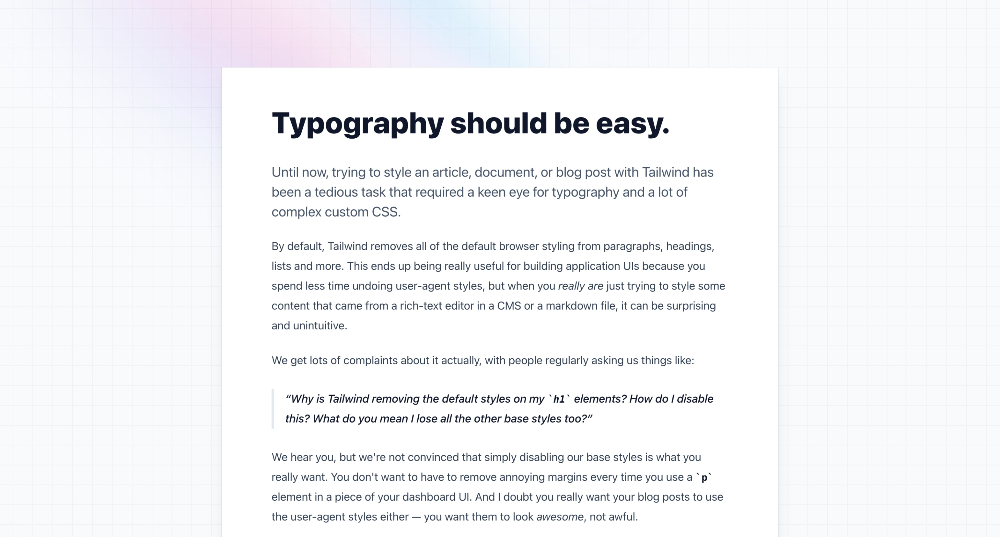

# 配置
Tailwind 是一个支持定制化的 UI 框架，可以将它进行配置「改造」，以适用于开发更具个性化的用户交互界面。一般在项目的根目录下的 `tailwind.config.js` 文档对 Tailwind 进行配置操作

```js
// 📄 tailwind.config.js
// 一个配置文件示例
module.exports = {
  content: ['./src/**/*.{html,js}'],
  theme: {
    colors: {
      'blue': '#1fb6ff',
      'purple': '#7e5bef',
      'pink': '#ff49db',
      'orange': '#ff7849',
      'green': '#13ce66',
      'yellow': '#ffc82c',
      'gray-dark': '#273444',
      'gray': '#8492a6',
      'gray-light': '#d3dce6',
    },
    fontFamily: {
      sans: ['Graphik', 'sans-serif'],
      serif: ['Merriweather', 'serif'],
    },
    extend: {
      spacing: {
        '8xl': '96rem',
        '9xl': '128rem',
      },
      borderRadius: {
        '4xl': '2rem',
      }
    }
  },
}
```

:bulb: 以上的每一个配置项都是**可选的**，如果某个选项为空，则该选项就会（回退 fallback）采用[默认配置](https://github.com/tailwindlabs/tailwindcss/blob/master/stubs/defaultConfig.stub.js)

## 生成配置文件
可以在终端输入命令来生成 Tailwind 的配置文档 `tailwind.config.js`，不同的命令生成不同的预设内容的配置文档：

```bash
npx tailwindcss init
```

然后就会在项目的根目录下生成一个 `tailwind.config.js` 文档，它十分简单，各选项都没有配置值（使用空对象或空数组）

```js
// 📄 tailwind.config.js
module.exports = {
  content: [],
  theme: {
    extend: {},
  },
  plugins: [],
}
```

:bulb: 如果希望生成一个[具有所有默认参数的 `tailwind.config.js` 文档](https://github.com/tailwindlabs/tailwindcss/blob/master/stubs/defaultConfig.stub.js)（相当于 eject 所有默认设置，便于基于默认值进行修改，这也是 Tailwind 在内部调用的默认配置。），可以在命令中添加 `--full` 参数

```bash
npx tailwindcss init --full
```

:bulb: 如果将 Tailwind 作为 PostCSS 的一个插件，需要在根目录生成 PostCSS 配置文档，则可以在初始化命令中添加 `-p` 参数

```bash
npx tailwindcss init -p
```

这会在根目录中同时生成 Tailwind 的配置文档 `tailwind.config.js` 和 PostCSS 的配置文档 `postcss.config.js`

而且在 PostCSS 配置文档中，已经预设将 `tailwindcss` 和 `autoprefixer` 作为 PostCSS 插件

```js
module.exports = {
  plugins: {
    tailwindcss: {},
    autoprefixer: {},
  },
}
```

:bulb: 如果希望使用其他文件名作为 Tailwind 的配置文件，可以在初始化命令中添加 `-c` 参数

```bash
# 生成名为 tailwindcss-config.js 的文档作为配置文档
npx tailwindcss init tailwindcss-config.js
```

如果使用 Tailwind CLI 编译，同样记得在需要使用参数 `-c` 显式地指明所使用配置文件

```bash
npx tailwindcss -c ./tailwindcss-config.js -i input.css -o output.css
```

如果将 Tailwind 作为 PostCSS 的一个插件，同样记得需要在配置文档 `postcss.config.js` 中进行相应的设置

```js
// 📄 postcss.config.js
module.exports = {
  plugins: {
    tailwindcss: { config: './tailwindcss-config.js' },
  },
}
```

## 配置选项

### content
`content` 选项的值是一个数组，用于指定编译器需要扫描/监听的 HTML 模板文件、JS 组件文件等使用了 Tailwind 基础类的文档。

:bulb: 其中支持使用正则表达式来匹配多个文件，例如 `*` 匹配任意值（除了转义符 `/` 以及隐藏文件），`**` 匹配任意多个目录（也包括零个目录），使用 `{jpg, png}` 形式来匹配多个值，如文件的类型/拓展名。在 Tailwind 内部使用 [fast-glob](https://github.com/mrmlnc/fast-glob) 库来匹配文件。

```js
// 📄 tailwind.config.js
module.exports = {
  content: [
    './pages/**/*.{html,js}',
    './components/**/*.{html,js}',
    './index.html',
  ],
  // ...
}
```

:bulb: 应该尽可能地提供详细的信息，避免由于使用大量通配符而导致 Tailwind 扫描 `node_modules` 里的文件。

有的框架会将项目的 HTML 入口文件放在 `public` 目录下，如果在该 HTML 文件中使用了 Tailwind 的基础类，记得将其也包含在 `content` 选项中。

```js
// 📄 tailwind.config.js
module.exports = {
  content: [
    './public/index.html',
    './src/**/*.{html,js}',
  ],
  // ...
}
```

如果在 JS 文档中对 HTML 元素操作添加了 Tailwind 的基础类，该文档也应该包含在 `content` 选项中。

```js
// ...
menuButton.addEventListener('click', function () {
  let classList = document.getElementById('nav').classList
  classList.toggle('hidden')
  classList.toggle('block')
})
// ...
```

```js
// 📄 tailwind.config.js
module.exports = {
  content: [
    // ...
    './src/**/*.js',
  ],
  // ...
}
```

:warning: Tailwind 扫描 `content` 特定所包含的文件，不仅仅会在 `class="..."` 字符串中进行搜索，而是进行全局文本的搜索我们使用了哪些基础类，因为我们可能会使用 JS 来操作 HTML 元素的类名。基于其扫描的工作流程，在使用基础类时有一点值得注意，即**不可通过拼接的方式构成基础类**，否则 Tailwind 无法在编译时识别抽取它们

```html
<!-- 无法在编译生成样式表中含有 text-red-600 和 text-green-600 基础类所对应的样式 -->
<div class="text-{{ error ? 'red' : 'green' }}-600"></div>
```

```html
<!-- 应该使用完整而非拼接的方式构成的基础类 -->
<div class="{{ error ? 'text-red-600' : 'text-green-600' }}"></div>
```

:bulb: 如果希望自定义 Tailwind 的扫描抽取所用基础类的规则，可以通过 `content.extract` 属性进行设置，`content` 选项是一个对象，其中 `files` 属性是一个数组，包含需要扫描的原文件；`extract` 属性是一个对象，其中指定了哪些类型的文件（其拓展名作为属性名）需要使用自定义的抽取规则，属性值为抽取的方法，其中入参是原文件的内容 `content`。

但是一般情况下 Tailwind 的默认抽取规则就足以应对大部分项目。

```js
module.exports = {
  content: {
    files: ['./src/**/*.{html,wtf}'],
    extract: {
      wtf: (content) => {
        return content.match(/[^<>"'`\s]*/)
      }
    }
  },
  // ...
}
```

:bulb: 如果 `content` 数组中所包含的元素并不是需要扫描/监听的文件（路径），而是原始内容（如一段 HTML 代码），则需要以对象的形式来指明

```js
// 📄 tailwind.config.js
module.exports = {
  content: [
    './pages/**/*.{html,js}'
    './components/**/*.{html,js}',
    { raw: '<div class="font-bold">', extension: 'html' },
  ],
  // ...
}
```

:bulb: 有时候我们需要扫描的原文件并非为 HTML 类型，如 Markdown 文档，可以先将它们转换为 HTML 格式，再让 Tailwind 扫描所使用的基础类更合适。

此时 `content` 选项是一个对象，其中 `files` 属性是一个数组，包含需要扫描的原文件；`transform` 属性是一个对象，其中指定了哪些类型的文件（其拓展名作为属性名）需要进行转换，属性值为转换的方法，其中入参是原文件的内容 `content`

```js
// 📄 tailwind.config.js
const remark = require('remark')

module.exports = {
  content: {
    files: ['./src/**/*.{html,md}'],
    transform: {
      md: (content) => {
        return remark().process(content)
      }
    }
  },
  // ...
}
```

### safelist
`safelist` 选项可以看作是 `content` 选项的替代，它设置了一系列「安全」的基础类，这样 Tailwind 在编译时不管项目中是否有使用这些基础类，它们所对应的样式都会被编译到样式表中。

```js
// 📄 tailwind.config.js
module.exports = {
  content: [
    './pages/**/*.{html,js}'
    './components/**/*.{html,js}',
  ],
  safelist: [
    'bg-red-500',
    'text-3xl',
    'lg:text-4xl',
  ]
  // ...
}
```

:warning: 一般不推荐使用该选项，仅在无法通过扫描文件获取所使用的基础类时，例如一个 UGC 网站，其大部分内容需要由使用者来生成，开发者预先无法得知用户会使用哪些基础类（所对应的样式）。因为该方法可能产生无用的样式代码，使得网页文件变大。而 `content` 选项则不同，Tailwind 会扫描这些文件，提取出其中所使用过的基础类，再按需编译出样式表，可以保持网页的样式表文件大小最小化。

:bulb: `safelist` 选项的元素支持使用正则表达式，以含有属性 `pattern` 的对象，来指定需要匹配的基础类的模式。如果希望匹配使用了特定状态变量，如 `hover:` 的任意基础类，则使用含有 `variant` 的对象来指定。

```js
// 📄 tailwind.config.js
module.exports = {
  content: [
    './pages/**/*.{html,js}',
    './components/**/*.{html,js}',
  ],
  safelist: [
    'text-2xl',
    'text-3xl',
    {
      pattern: /bg-(red|green|blue)-(100|200|300)/,
      variants: ['lg', 'hover', 'focus', 'lg:hover'],
    },
  ],
  // ...
}
```

### theme
`theme` 选项用以定义颜色 `colors`、字体 `fontFamily`、间隔尺度 `spacing`、边框圆角大小 `borderRadius`、断点 `screens` 等**与视觉相关的基础类**。

可以通过**覆盖**[原有值](https://github.com/tailwindlabs/tailwindcss/blob/master/stubs/defaultConfig.stub.js)和**扩展**添加新值的两种方式来自定义基础类

:bulb: 在 `theme` 选项中所有可选/可配置的属性可以查看官方的[参考列表](https://tailwindcss.com/docs/theme#configuration-reference)，它们即可以直接在 `theme` 选项下作为一级属性，覆盖原有的基础类；也可以在 `theme.extend` 下作为二级属性进行基础类的扩展

```js
// 📄 tailwind.config.js
module.exports = {
  // ...
  theme: {
    // 直接在 theme 属性中设置的基础类会完全覆盖原有的 colors 的预设基础类
    colors: {
      'blue': '#1fb6ff',
      'purple': '#7e5bef',
      'pink': '#ff49db',
      'orange': '#ff7849',
      'green': '#13ce66',
      'yellow': '#ffc82c',
      'gray-dark': '#273444',
      'gray': '#8492a6',
      'gray-light': '#d3dce6',
    },
    fontFamily: {
      sans: ['Graphik', 'sans-serif'],
      serif: ['Merriweather', 'serif'],
    },
    extend: {
      // 在 theme 属性的 extend 属性下添加的基础类会以扩展添加新值的方式来添加自定义基础类（仍保留默认的 spacing 和 borderRadius 基础类）
      spacing: {
        '8xl': '96rem',
        '9xl': '128rem',
      },
      borderRadius: {
        '4xl': '2rem',
      }
    }
  }
}
```

:bulb: 如果在定制 `theme` 选项中的某个属性时，希望访问当前 `theme` 选项的其他属性的基础类，可以使用函数的方式（最后返回表示基础类的对象）。

该函数的入参是一个对象，其中包含一个 `theme` 函数，可以调用它从而获取主题特性下的其他属性的值

```js
// 📄 tailwind.config.js
module.exports = {
  theme: {
    spacing: {
      // 可以获取这里定制的基础类
      // ...
    },
    // 以函数的方式定义 backgroundSize 核心插件的基础类
    // 函数的入参对象可以解构出一个 theme() 方法
    backgroundSize: ({ theme }) => ({
      // background-size 样式值有多种形式
      // 可以是长度尺寸、百分比、`cover`/`contain`/`auto` 之一
      auto: 'auto',
      cover: 'cover',
      contain: 'contain',
      ...theme('spacing') // 通过调用 theme('spacing') 方法可以获取其他主题选项的属性的属性值
    })
  }
}
```

但是该函数只能用于 `theme` 选项下的一级属性，而不能直接用于设置次级属性（一般通过核心插件定制的基础类），如果需要在次级属性中使用该函数，在一级属性就需要以函数的形式表示

```js
// 📄 tailwind.config.js
module.exports = {
  theme: {
    fill: ({ theme }) => ({
      gray: theme('colors.gray')
    })
  }
}
```

:bulb: 如果希望获取默认基础类的值，可以通过导入 `tailwindcss/defaultTheme` 来获取

```js
// 📄 tailwind.config.js
const defaultTheme = require('tailwindcss/defaultTheme')

module.exports = {
  theme: {
    extend: {
      fontFamily: {
        sans: [
          'Lato',
          ...defaultTheme.fontFamily.sans,
        ]
      }
    }
  }
}
```

#### screen
`screen` 属性用以定制断点，与响应式布局相关的基础类，Tailwind 默认预设五个断点。这些断点会作为**状态变量**用于其他基础类前，如 `md:text-center`，以设置当页面的宽度**大于**特定值时才起作用的样式。

```js
// 📄 tailwind.config.js
module.exports = {
  theme: {
    screens: {
      'sm': '640px',
      'md': '768px',
      'lg': '1024px',
      'xl': '1280px',
      '2xl': '1536px',
    }
  }
}
```

:bulb: 直接在 `theme` 特性下设置 `screens` 属性会覆盖默认值，而在 `theme.extend` 则可以保留原有的断点，扩展添加新的断点。:warning: 但是该方法**只能用于添加更大的断点**，因为断点列表需要从小到大排列，以便符合最小值 `min-width` 断点系统匹配原理。

```js
// 📄 tailwind.config.js
module.exports = {
  theme: {
    extend: {
      screens: {
        '3xl': '1600px',
      },
    },
  },
  variants: {},
  plugins: [],
}
```

如果希望添加更小断点，可以先导入 `tailwindcss/defaultTheme` 模块读取默认断点，再在它们前面添加更小的断点，构成新的断点基础类覆盖原有的值

```js
// 📄 tailwind.config.js
const defaultTheme = require('tailwindcss/defaultTheme')

module.exports = {
  theme: {
    screens: {
      'xs': '475px',
      ...defaultTheme.screens,
    },
  },
  variants: {},
  plugins: [],
}
```
:bulb: 默认情况下，基于[移动优先](https://tailwindcss.com/docs/responsive-design#mobile-first)的原则，断点设定的是 `min-width` 值，也可以通过对象的形式，来显式地指定断点设定的是 `min-width` 还是 `max-width`。如果采用 `max` 形式，请确保断点列表是降序排列（需要从大到小排列）

```js
// 📄 tailwind.config.js
module.exports = {
  theme: {
    screens: {
      // 将断点设定为 max-width（允许页面的最大值）
      // 即页面宽度小于特定值时，样式才起作用
      '2xl': {'max': '1535px'},
      // => @media (max-width: 1535px) { ... }

      'xl': {'max': '1279px'},
      // => @media (max-width: 1279px) { ... }

      'lg': {'max': '1023px'},
      // => @media (max-width: 1023px) { ... }

      'md': {'max': '767px'},
      // => @media (max-width: 767px) { ... }

      'sm': {'max': '639px'},
      // => @media (max-width: 639px) { ... }
    }
  }
}
```

:bulb: 也可以将断点设定为一个范围，即同时指定 `min-width` 和 `max-width` 的值，只有在页面的宽度正好落在该范围内，相应的样式才会起作用。

```js
// 📄 tailwind.config.js
module.exports = {
  theme: {
    screens: {
      'sm': {'min': '640px', 'max': '767px'},
      // => @media (min-width: 640px and max-width: 767px) { ... }

      'md': {'min': '768px', 'max': '1023px'},
      // => @media (min-width: 768px and max-width: 1023px) { ... }

      'lg': {'min': '1024px', 'max': '1279px'},
      // => @media (min-width: 1024px and max-width: 1279px) { ... }

      'xl': {'min': '1280px', 'max': '1535px'},
      // => @media (min-width: 1280px and max-width: 1535px) { ... }

      '2xl': {'min': '1536px'},
      // => @media (min-width: 1536px) { ... }
    },
  }
}
```

更进一步，可以将**一个断点状态变量**对应于**多个范围**

```js
// 📄 tailwind.config.js
module.exports = {
  theme: {
    screens: {
      'sm': '500px',
      // 该断点状态变量，对应两个宽度范围
      'md': [
        // Sidebar appears at 768px, so revert to `sm:` styles between 768px
        // and 868px, after which the main content area is wide enough again to
        // apply the `md:` styles.
        {'min': '668px', 'max': '767px'},
        {'min': '868px'}
      ],
      'lg': '1100px',
      'xl': '1400px',
    }
  }
}
```

:bulb: 如果希望断点基于其他样式属性，如高度 `min-height`，可以通过 `raw` key 来指定

```js
// 📄 tailwind.config.js
module.exports = {
  theme: {
    extend: {
      screens: {
        'tall': { 'raw': '(min-height: 800px)' },
        // => @media (min-height: 800px) { ... }
      }
    }
  }
}
```

#### colors
`colors` 属性用以定制与颜色相关的基础类。这些颜色基础类都会被颜色相关的[核心插件](https://tailwindcss.com/docs/configuration#:~:text=reference) ，如 `backgroundColor`、`borderColor`、`textColor` 等，所继承（以连字符 `-` 组合使用）

:bulb: 完整的色卡表可以查看[官方文档](https://tailwindcss.com/docs/customizing-colors)

```js
// 📄 tailwind.config.js
module.exports = {
  theme: {
    colors: {
      transparent: 'transparent',
      black: '#000',
      white: '#fff',
      gray: {
        100: '#f7fafc',
        // ...
        900: '#1a202c',
      },

      // ...
    }
  }
}
```

:bulb: 如果希望完全定制自己品牌的颜色基础类，可以在 `theme.colors` 属性下进行设置，这会覆盖默认的基础类。其中别忘了添加 `transparent` 和 `currentColor` 这两个基础类，便于设置颜色为透明值或从父元素处继承颜色。

```js
// 📄 tailwind.config.js
module.exports = {
  theme: {
    colors: {
      transparent: 'transparent',
      current: 'currentColor',
      'white': '#ffffff',
      'purple': '#3f3cbb',
      'midnight': '#121063',
      'metal': '#565584',
      'tahiti': '#3ab7bf',
      'silver': '#evebff',
      'bubble-gum': '#ff77e9',
      'bermuda': '#78dcca',
    },
  },
}
```

:bulb: 如果希望使用默认的颜色值，可以通过导入 `tailwindcss/colors` 模块来使用，例如从默认的颜色中挑出几个作为项目的品牌色；也可以为默认颜色设置**别名**，便于记忆和使用

```js
// 📄 tailwind.config.js
const colors = require('tailwindcss/colors')

module.exports = {
  theme: {
    colors: {
      transparent: 'transparent',
      current: 'currentColor',
      black: colors.black,
      white: colors.white,
      gray: colors.slate,
      green: colors.emerald,
      purple: colors.violet,
      yellow: colors.amber,
      pink: colors.fuchsia,
    },
  },
}
```

:bulb: 为了便于使用，可以将同一个色系，不同颜色深度的颜色基础类，以**嵌套对象**的形式进行设置。在调用某一种深度的颜色时，可以依次将颜色基础类名和深度值使用连字符 `-` 相连，如 `bg-tahiti-400`。推荐两个工具 [Palettte](https://palettte.app/) 和 [ColorBox](https://colorbox.io/) 用于辅助生成多种深度的颜色。

```js
// 📄 tailwind.config.js
module.exports = {
  theme: {
    colors: {
      transparent: 'transparent',
      current: 'currentColor',
      'white': '#ffffff',
      'tahiti': {
        100: '#cffafe',
        200: '#a5f3fc',
        300: '#67e8f9',
        400: '#22d3ee',
        500: '#06b6d4',
        600: '#0891b2',
        700: '#0e7490',
        800: '#155e75',
        900: '#164e63',
      },
      // ...
    },
  },
}
```

:bulb: 如果希望基于默认的颜色，扩展添加几个新的颜色，可以在 `theme.extend.colors` 属性中进行设置。也可以为已有的颜色类别，添加其他深度的梯度

```js
// 📄 tailwind.config.js
module.exports = {
  theme: {
    extend: {
      colors: {
        // 为蓝色添加新的深度梯度
        blue: {
          950: '#17275c',
        },
        // 添加新的颜色 brown 并设置一系列深度梯度
        brown: {
          50: '#fdf8f6',
          100: '#f2e8e5',
          200: '#eaddd7',
          300: '#e0cec7',
          400: '#d2bab0',
          500: '#bfa094',
          600: '#a18072',
          700: '#977669',
          800: '#846358',
          900: '#43302b',
        },
      }
    },
  },
}
```

:bulb: 如果希望在 HTML 页面使用一次自定义的任意颜色，可以通过 `[color]` 的方式来实现

```html
<button class="bg-[#1da1f2] text-white ...">
  <svg><!-- ... --></svg>
  Share on Twitter
</button>
```

:bulb: 还可以结合 CSS 变量和颜色基础类，实现**一键换肤**的功能，具体设置可以参考[官方文档](https://tailwindcss.com/docs/customizing-colors#using-css-variables)和这一个 :clapper: [视频教程](https://youtu.be/MAtaT8BZEAo)

#### spacing
`spacing` 属性用以定制间隔和尺寸相关的基础类。这些基础类都会被 `padding`、`margin`、`width`、`height`、`maxHeight`、`flex-basis`、`gap`、`inset`、`space`、`translate`、`scrollMargin`、`scrollPadding` 和 `textIndent` [核心插件](https://tailwindcss.com/docs/configuration#:~:text=reference) 继承（以连字符 `-` 组合使用）

```js
// 📄 tailwind.config.js
module.exports = {
  theme: {
    spacing: {
      px: '1px',
      0: '0',
      0.5: '0.125rem',
      1: '0.25rem',
      1.5: '0.375rem',
      2: '0.5rem',
      2.5: '0.625rem',
      3: '0.75rem',
      3.5: '0.875rem',
      4: '1rem',
      5: '1.25rem',
      // ...
      96: '24rem',
    },
  }
}
```

:bulb: 完整的默认间隔表可以查看[官方文档](https://tailwindcss.com/docs/customizing-spacing#default-spacing-scale)

:bulb: 如果希望完全定制间隔基础类（覆盖所有默认的基础类），可以在 `theme.spacing` 属性下进行设置

```js
// 📄 tailwind.config.js
module.exports = {
  theme: {
    spacing: {
      sm: '8px',
      md: '12px',
      lg: '16px',
      xl: '24px',
    }
  }
}
```

:bulb: 如果希望基于默认值，扩展添加几个新的间隔，可以在 `theme.extend.spacing` 属性下进行设置

```js
// 📄 tailwind.config.js
module.exports = {
  theme: {
    extend: {
      spacing: {
        '13': '3.25rem',
        '15': '3.75rem',
        '128': '32rem',
        '144': '36rem',
      }
    }
  }
}
```

#### core plugins
除了以上的 `screens`、`colors` 和 `spacing` 属性，其他的属性就是用于配置各个[核心插件](https://tailwindcss.com/docs/configuration#:~:text=reference)的基础类。

**其中子属性名是作为后缀 suffix 使用，而其属性值就是相应的样式**，一般有一个名为 `DEFAULT` 的属性，它是基础类**不带有后缀时**，其默认的样式。

例如 `borderRadius` 属性就是相对于核心插件 `borderRadius`，它用以配置圆角 border radius 基础类。

```js
// 📄 tailwind.config.js
module.exports = {
  theme: {
    borderRadius: {
      'none': '0',
      'sm': '.125rem',
      DEFAULT: '.25rem',
      'lg': '.5rem',
      'full': '9999px',
    },
  }
}
```

```css
/* 编译得到的相应样式 */
.rounded-none { border-radius: 0 }
.rounded-sm   { border-radius: .125rem }
.rounded      { border-radius: .25rem }
.rounded-lg   { border-radius: .5rem }
.rounded-full { border-radius: 9999px }
```

:bulb: 完整的核心插件[列表](https://tailwindcss.com/docs/configuration#:~:text=reference)

:bulb: 如果希望禁止对某些核心插件的基础类进行编译，可以在 `corePlugins` 选项中将其核心插件设置为 `false`（而不是在 `theme` 选项中为核心插件相应的属性赋予空对象，[由于有的核心插件并没有在 `theme` 选项中暴露相应的属性](https://tailwindcss.com/docs/theme#configuration-reference)，例如[核心插件 `float`](https://tailwindcss.com/docs/configuration#:~:text=reference)，在 `theme` 选项中**没有**相应的属性可进行配置，它们只能在 `corePlugins` 选项中进行设置）

```js
// 📄 tailwind.config.js
// 禁止编译生成 opacity 基础类相应的样式
module.exports = {
  // 不推荐的方式
  theme: {
    opacity: {},
  }
  // ...
  // 推荐的方式
  corePlugins: {
     opacity: false,
  }
}
```

### plugins
`plugins` 选项让我们可以通过创建插件的方式，[以 JS 而非 CSS 方式](https://tailwindcss.com/docs/plugins#css-in-js-syntax)来新增基础类、状态变量等。

需要先从 `tailwindcss/plugin` 模块导入 `plugin` 方法，用它来创建一个插件。

```js
// 📄 tailwind.config.js
const plugin = require('tailwindcss/plugin')

module.exports = {
  plugins: [
    plugin(function({ addUtilities, addComponents, e, prefix, config }) {
      // Add your custom styles here
    }),
  ]
}
```

`plugin` 方法接收一个匿名函数 plugin function 作为入参，而该函数的入参是一个对象，可以从该对象解构出一系列实用的钩子函数 helper function 实现不同的功能，常用如下：

* `addUtilities` 该方法将静态自定义样式注册到 utilities 容器中
* `matchUtilities` 该方法将动态自定义样式注册到 utilities 容器中
* `addComponents` 该方法将静态自定义样式注册到 components 容器中
* `matchComponents` 该方法将动态自定义样式注册到 components 容器中
* `addBase` 该方法将自定义样式注册到 base 容器中
* `addVariant` 该方法用于注册自定义状态变量
* `theme` 该方法可以获取当前 Tailwind 配置中 `theme` 选项的信息
  该函数接收两个参数：
  * 第一个参数用以指定需要获取哪个属性值，例如 `theme('fontSize.lg')` 获取值为 `['1.125rem', { lineHeight: '1.75rem' }]`
  * （可选）第二个参数用以提供默认值，当第一个参数指定要获取的属性值不存在时，返回该默认值
* `config` 该方法可以获取当前 Tailwind 的配置信息
* `corePlugins` 该方法可以检查特定的[核心插件](https://tailwindcss.com/docs/configuration#core-plugins)是否启用了
* `e` 该方法用于对字符串进行转义，让它可合法地作为类名用在 HTML 元素中（该方法一般是在一些可[允许使用者自定义基础类名](https://v2.tailwindcss.com/docs/plugins#escaping-class-names)的插件使用的，以确保像 `.rotate-1/4` 这样的类能按预期工作）

:bulb: 通过插件添加的基础类支持于状态变量，如 `hover`，配合使用

:bulb: 通过插件添加的基础类只有在 HTML 页面使用了，其相应的样式才会编译到最后的样式表中，保证了项目文件的大小最优化

:bulb: 可以为插件函数传递（可选）第二个参数，它是一个对象（相当于另一个 Tailwind 配置对象），用以设置插件的 `theme` 和 `variants` 选项的默认值

```js
// 📄 ./plugins/gradients.js 插件源码
const plugin = require('tailwindcss/plugin')

module.exports = plugin(function({ addUtilities, e, theme, variants }) {
  // ...
},
// 默认的 `theme` 和 `variants` 选项
{
  theme: {
    gradients: theme => ({
      'blue-green': [theme('colors.blue.500'), theme('colors.green.500')],
      'purple-blue': [theme('colors.purple.500'), theme('colors.blue.500')],
      // ...
    })
  },
  variants: {
    gradients: ['responsive', 'hover'],
  }
})
```

#### 新增样式到 utilities 容器
在插件中使用 `addUtilities` 或 `matchUtilities` helper function 添加基础类，并将样式添加到 utilities 容器。

* 使用 `addUtilities` 方法添加静态的样式构成的基础类

  ```js
  // 📄 tailwind.config.js
  const plugin = require('tailwindcss/plugin')

  module.exports = {
    plugins: [
      plugin(function({ addUtilities }) {
        addUtilities({
          '.content-auto': {
            'content-visibility': 'auto',
          },
          '.content-hidden': {
            'content-visibility': 'hidden',
          },
          '.content-visible': {
            'content-visibility': 'visible',
          },
        })
      })
    ]
  }
  ```

* 使用 `matchUtilities` 方法添加动态的样式（通过函数返回的样式值）构成的基础类。

  ```js
  // 📄 tailwind.config.js
  const plugin = require('tailwindcss/plugin')

  module.exports = {
    theme: {
      tabSize: {
        1: '1',
        2: '2',
        4: '4',
        8: '8',
      }
    },
    plugins: [
      plugin(function({ matchUtilities, theme }) {
        matchUtilities(
          {
            tab: (value) => ({
              tabSize: value
            }),
          },
          { values: theme('tabSize') }
        )
      })
    ]
  }
  ```

  通过这种方式构建的自定义基础类，在 HTML 元素上使用时支持使用**任意值** `utility-[value]`

  ```html
  <div class="tab-[13]">
    <!-- ... -->
  </div>
  ```

:bulb: 通过插件添加到 utilities 容器的样式，其基础类会考虑 Tailwind 配置中的 `prefix` 和 `important` 选项，并进行相应的调整

```js
// 📄 tailwind.config.js
module.exports = {
  prefix: 'tw-',
  important: true,
  // ...
}
```

```css
/* 编译结果 */
/* 其中 content- 前缀为原来的基础类 */
.tw-content-auto {
  content-visibility: auto !important;
}
.tw-content-hidden {
  content-visibility: hidden !important;
}
.tw-content-visible {
  content-visibility: visible !important;
}
```

#### 新增样式到 components 容器
在插件中使用 `addComponents ` helper function 添加基础类，并将样式添加到 components 容器。

:bulb: 在 components 容器中添加的基础类，它们的样式都更复杂，一般用于设置一些具体的视觉元素的，如按钮、表单等

```js
// 📄 tailwind.config.js
const plugin = require('tailwindcss/plugin')

module.exports = {
  plugins: [
    plugin(function({ addComponents }) {
      addComponents({
        '.btn': {
          padding: '.5rem 1rem',
          borderRadius: '.25rem',
          fontWeight: '600',
        },
        '.btn-blue': {
          backgroundColor: '#3490dc',
          color: '#fff',
          '&:hover': {
            backgroundColor: '#2779bd'
          },
        },
        '.btn-red': {
          backgroundColor: '#e3342f',
          color: '#fff',
          '&:hover': {
            backgroundColor: '#cc1f1a'
          },
        },
      })
    })
  ]
}
```

:bulb: 通过插件添加到 components 容器的样式，其基础类会考虑 Tailwind 配置中的 `prefix` 选项（但不会考虑 `important` 选项，避免这些样式具有最高优先级，这样才可以在 HTML 元素使用 utilities 容器中基础类时，所对应的样式覆盖修改在 components 容器中基础类所对应的样式），并进行相应的调整

#### 新增样式到 base 容器
在插件中使用 `addBase` helper function 添加基础类，并将（重置）样式添加到 base 容器。

```js
// 📄 tailwind.config.js
const plugin = require('tailwindcss/plugin')

module.exports = {
  plugins: [
    plugin(function({ addBase, theme }) {
      addBase({
        'h1': { fontSize: theme('fontSize.2xl') },
        'h2': { fontSize: theme('fontSize.xl') },
        'h3': { fontSize: theme('fontSize.lg') },
      })
    })
  ]
}
```

:bulb: 由于重置样式 reset 一般匹配的是一类元素，例如 `div`、`h1` 等，为它们设置预设样式，以便在不同的浏览器中具有相同的初始样式，所以在该容器的基础类并不会考虑 Tailwind 配置中的 `prefix` 选项

#### 添加状态变量
在插件中使用 `addVariant` helper function 添加状态变量，它的第一个参数是状态变量的名称，第二个参数是对 CSS 类选择器进行处理/转换的方式，如状态变量 `hover`，它的处理/转换方式是 `&:hover`

```js
// 📄 tailwind.config.js
const plugin = require('tailwindcss/plugin')

module.exports = {
  // ...
  plugins: [
    plugin(function({ addVariant }) {
      addVariant('optional', '&:optional')
      addVariant('hocus', ['&:hover', '&:focus'])
      addVariant('supports-grid', '@supports (display: grid)')
    })
  ]
}
```

```html
<form class="flex supports-grid:grid ...">
  <input class="optional:border-gray-300 ..." />
  <button class="bg-blue-500 hocus:bg-blue-600">...</button>
</form>
```

#### 暴露选项
插件可以通过暴露选项，让后使用者在调用插件同时，通过传递相应的参数来配置这些选项，可对插件进行一定程度的自定义，例如设置自定义插件所添加的基础类名。

此时使用 `plugin.withOptions` 方法，它和原来的 `plugin` 方法类似，只是它的入参是一个带有 `options` 用户配置的函数，而该函数返回一个函数，这个函数正是作为原来的 `plugin` 方法的入参（相当于用了一个带有 `options` 参数的函数对其进行封装），即可以解构出一些列的 helper function，这样可以同时接收到用户的配置，同时调用 helper function 来添加自定义样式

```js
// 📄 ./plugins/markdown.js
const plugin = require('tailwindcss/plugin')

module.exports = plugin.withOptions(function (options) {
  return function({ addComponents }) {
    const className = options.className ?? 'markdown'

    addComponents({
      // 允许用于自定义基础类名
      [`.${className}`]: {
        // ...
      }
    })
  }
},
// 设置插件的 theme 和 variants 选项的默认值
// 也是要用带有 `options` 参数的函数对其进行封装
function (options) {
  // 返回的对象用以设置插件的 theme 和 variants 选项的默认值
  return {
    theme: {
      markdown: {
        // ...
      }
    },
  }
})
```

然后用户在使用插件时，可以传递参数对插件进行配置

```js
// 📄 tailwind.config.js
module.exports = {
  theme: {
    // ...
  },
  plugins: [
    require('./plugins/markdown.js')({
      className: 'wysiwyg'
    })
  ],
}
```

#### 官方插件
官方提供了一些[插件](https://tailwindcss.com/docs/plugins#official-plugins)实现更强大的功能

可以通过 npm 进行安装，然后在 Tailwind 的配置文件的 `plugins` 选项中进行注册

```js
// 📄 tailwind.config.js
module.exports = {
  // ...
  plugins: [
    require('@tailwindcss/typography'),
    require('@tailwindcss/forms'),
    require('@tailwindcss/line-clamp'),
    require('@tailwindcss/aspect-ratio'),
  ]
}
```

* [`@tailwindcss/typography` 插件](https://tailwindcss.com/docs/typography-plugin)注册了一系列以 `prose` 为前缀的基础类，可以为页面特定区域的内容添加好看的样式，这些内容一般不在原网页上，而是从远端服务器获取的，如 CMS 或 Markdown 文件转换而成的。

  ```html
  <!-- 「容器」 article 元素需要添加 prose 类名 -->
  <article class="prose lg:prose-xl">
    {{ markdown }}
  </article>
  ```

  将这些基础类添加到将要加载显式文本内容的「容器」元素上，然后从服务器获取的文本就可以在网页上渲染出好看的样式。

  

  而且该插件还提供了一系列[针对不同元素的状态变量](https://tailwindcss.com/docs/typography-plugin#element-modifiers)，可以用于对「容器」内特定的元素设置样式。如果需要和其他状态变量「叠加」使用，其他状态变量应该在前面，而 `prose-` 为前缀的状态变量在最后。

  ```html
  <article class="prose prose-img:rounded-xl prose-headings:underline prose-a:text-blue-600 hover:prose-a:text-blue-500">
    {{ markdown }}
  </article>
  ```

  :bulb: 针对每一种[字体大小](https://tailwindcss.com/docs/typography-plugin#applying-a-type-scale)（有五种默认的字体大小），该插件同时为容器元素设置了相应的宽度最大值 `max-width`，以保证[内容的可读性](https://tailwindcss.com/docs/typography-plugin#:~:text=readable)，如果希望取消该约束，可以为容器添加 `max-w-none` 类名

  ```html
  <article class="prose max-w-none">
    {{ markdown }}
  </article>
  ```

  :bulb: 如果加载的内容（某些元素）自带了样式，不希望应用该插件预设的样式，可以为这些元素添加 `not-prose` 类名

  ```html
  <article class="prose">
    <h1>My Heading</h1>
    <p>...</p>

    <div class="not-prose">
      <!-- Some example or demo that needs to be prose-free -->
    </div>

    <p>...</p>
    <!-- ... -->
  </article>
  ```

  :bulb: 该插件也支持定制化，如[自定义主题色](https://tailwindcss.com/docs/typography-plugin#adding-custom-color-themes)、[自定义类名前缀](https://tailwindcss.com/docs/typography-plugin#changing-the-default-class-name)、[覆写原有的样式值](https://tailwindcss.com/docs/typography-plugin#customizing-the-css)

* [`@tailwindcss/forms` 插件](https://github.com/tailwindlabs/tailwindcss-forms) 提供了多种表单初始化样式，让表单元素[更易于使用 Tailwind 进行样式定制](https://tailwindcss.com/docs/plugins#forms)。

* [`@tailwindcss/line-clamp` 插件](https://github.com/tailwindlabs/tailwindcss-line-clamp) 注册了 `line-clamp-{lines}` 基础类，以增强段落截短的功能，[按照行数 `lines` 来对段落文本进行截短](https://tailwindcss.com/docs/plugins#line-clamp)，具体效果可以查看该 :clapper: [视频教程](https://youtu.be/klh-jMTm5PU)

* [`@tailwindcss/aspect-ratio` 插件](https://github.com/tailwindlabs/tailwindcss-aspect-ratio) 用以控制元素的[宽高比例](https://tailwindcss.com/docs/plugins#aspect-ratio)。:bulb: 在 Tailwind v3 版本中，已经提供了[控制元素宽高比例的基础类](https://tailwindcss.com/docs/aspect-ratio)，可以**不依赖**于插件直接使用。

### presets
`presets` 选项用以指定自定义的预设配置 preflight，可以包含 `theme`、`prefix`、`plugins` 等选项，它会与 Tailwind [默认配置](https://github.com/tailwindlabs/tailwindcss/blob/master/stubs/defaultConfig.stub.js)进行[合并](https://tailwindcss.com/docs/presets#merging-logic-in-depth)，并覆盖有冲突的配置，这对于协同开发不同项目时，统一初始样式很有作用。

```js
// 📄 my-preset.js
// Example preset
module.exports = {
  theme: {
    colors: {
      blue: {
        light: '#85d7ff',
        DEFAULT: '#1fb6ff',
        dark: '#009eeb',
      },
      pink: {
        light: '#ff7ce5',
        DEFAULT: '#ff49db',
        dark: '#ff16d1',
      },
      gray: {
        darkest: '#1f2d3d',
        dark: '#3c4858',
        DEFAULT: '#c0ccda',
        light: '#e0e6ed',
        lightest: '#f9fafc',
      }
    },
    fontFamily: {
      sans: ['Graphik', 'sans-serif'],
    },
    extend: {
      flexGrow: {
        2: '2',
        3: '3',
      },
      zIndex: {
        60: '60',
        70: '70',
        80: '80',
        90: '90',
        100: '100',
      },
    }
  },
  plugins: [
    require('@tailwindcss/typography'),
    require('@tailwindcss/aspect-ratio'),
  ],
}
```

```js
// 📄 tailwind.config.js
module.exports = {
  // the preset to re-use
  presets: [
    require('./my-preset.js')
  ],
  // Customizations specific to this project would go here
  theme: {
    extend: {
      minHeight: {
        48: '12rem',
      }
    }
  },
  variants: {
    extend: {
      backgroundColor: ['active']
    },
  },
}
```

:bulb: `preset` 选项是一个数组，可以同时为项目添加多个自定义的预设配置，此时它们的添加次序很重要，因为后添加的预设配置会覆盖掉前面添加的冲突的预设配置。

:bulb: 如果希望 `preset` **完全覆盖 Tailwind 的默认配置**（而不是将自定义预设与默认配置进行合并），可以将其自身的 `preset` 选项设置为空数组 `[]`

```js
// 📄 my-preset.js
module.exports = {
  presets: [],
  theme: {
    // ...
  },
  plugins: [
    // ...
  ],
  // ...
}
```

```js
// 📄 tailwind.config.js
module.exports = {
  presets: [
    require('./example-preset.js')
  ],
  // ...
}
```

而如果只是想完全禁止使用 Tailwind 的默认配置，则类似地将 `preset` 设置为空数组 `[]` 即可，此时项目就没有预设的开箱即用的颜色、字体、间距等基础类供选择了。

```js
// 📄 tailwind.config.js
module.exports = {
  presets: [],
  // ...
}
```

### prefix
`prefix` 选项指定一个字符串作为前缀，然后在 HTML 元素中使用基础类时可以添加上这个前缀，**避免与项目的其他类名发生冲突**。然后编译器扫描文档时会识别带有这些前缀的类名，生成相应的样式

```js
// 📄 tailwind.config.js
module.exports = {
  // ...
  prefix: 'tw-',
}
```

:bulb: 这些前缀**不要**添加到状态变量上

```html
<div class="tw-text-lg md:tw-text-xl tw-bg-red-500 hover:tw-bg-blue-500">
  <!-- -->
</div>
```

然后编译的样式表中，所有 Tailwind 生成的类名都包含前缀 `tw-`

```css
.tw-text-left {
  text-align: left;
}
.tw-text-center {
  text-align: center;
}
.tw-text-right {
  text-align: right;
}
/* etc. */
```

:bulb: 自定义的基础类编译时不会加上该前缀

```css
/* 📄 main.css */
@tailwind base;
@tailwind components;
@tailwind utilities;

@layer utilities {
  .bg-brand-gradient { /* ... */ }
}
```

```css
/* 编译结果 */
.bg-brand-gradient { /* ... */ }
.hover\:bg-brand-gradient:hover { /* ... */ }
```

如果希望自定义基础类编译后也带有相应的前缀，以便自定义的基础类在 HTML 元素上使用体验一样，可以在定义这些自定义基础类时就带有前缀

```css
/* 📄 main.css */
@tailwind base;
@tailwind components;
@tailwind utilities;

@layer utilities {
  .tw-bg-brand-gradient { /* ... */ }
}
```

### important
`important` 选项可以控制是否给由 Tailwind 基础类所编译生成的样式添加 `!important` 声明，以获得最高的优先级

```js
// 📄 tailwind.config.js
module.exports = {
  // ...
  important: true,
}
```

```css
/* 编译结果 */
.leading-none {
  line-height: 1 !important;
}
.leading-tight {
  line-height: 1.25 !important;
}
.leading-snug {
  line-height: 1.375 !important;
}
/* etc. */
```

:bulb: 但是自定义基础类并不会受此选项的影响，如果希望自定义的基础类也有 `!important` 声明，应该在声明时就添加该声明

```css
/* 📄 main.css */
@tailwind base;
@tailwind components;
@tailwind utilities;

@layer utilities {
  .bg-brand-gradient {
    background-image: linear-gradient(#3490dc, #6574cd) !important;
  }
}
```

:warning: `important` 选项直接设置为 `true` 则 Tailwind 基础类所编译得到的样式会具有最高优先级，这会覆盖 HTML 元素的行内样式（很多第三方 JS 库会使用行内样式给页面添加特定的样式）。为了避免这种冲突，该选项的值可以使用表示 CSS ID 选择器的字符串，然后在网页的根元素或 `<body>` 元素上添加该 ID 名，这样 Tailwind 的基础类所编译得到的样式具有较高的优先级（可以覆盖其他使用类名指定的样式），但是**同时保留了行内样式更高的优先级**。

```js
// 📄 tailwind.config.js
module.exports = {
  // ...
  important: '#app',
}
```

```html
<html>
<!-- ... -->
<style>
  .high-specificity .nested .selector {
    color: blue;
  }
</style>
<!-- 需要在根节点添加 id 为 app -->
<body id="app">
  <div class="high-specificity">
    <div class="nested">
      <!-- 样式为 red-500 而不是 selector 类所指定的样式-->
      <div class="selector text-red-500"><!-- ... --></div>
    </div>
  </div>

  <!-- 样式是 #bada55 行内样式优先级更高-->
  <div class="text-red-500" style="color: #bada55;"><!-- ... --></div>
</body>
</html>
```

### separator
`separator` 选项用以定制**状态变量**与**基础类**组合时所使用的连接符，默认使用冒号 `:`

因为如果你在项目中使用一些模板语法，例如 [pug](https://pugjs.org/)（而不是 HTML），有些字符是不支持作为类名的，则需要对连接符进行定制

```js
// 📄 tailwind.config.js
module.exports = {
  separator: '_',
}
```

### corePlugins
`corePlugins` 选项用以控制 Tailwind 可以对哪些基础类进行编译。

:bulb: 可以在官方文档中查看有哪些[核心插件](https://tailwindcss.com/docs/configuration#:~:text=reference)。

* 如果希望**禁止**对某些基础类进行编译为相应的样式，可以将其核心插件设置为 `false`

  ```js
  // 📄 tailwind.config.js
  module.exports = {
    // ...
    corePlugins: {
      float: false,
      objectFit: false,
      objectPosition: false,
    }
  }
  ```

* 相对地，可以用数组的方式列出 **「安全」** 的基础类，Tailwind 会对这些基础类进行编译

  ```js
  // 📄 tailwind.config.js
  module.exports = {
    // ...
    corePlugins: [
      'margin',
      'padding',
      'backgroundColor',
      // ...
    ]
  }
  ```

* 如果想**禁止所有**基础类的编译（而仅使用自定义的插件），可以将该选项值设置为空数组

    ```js
  // 📄 tailwind.config.js
  module.exports = {
    // ...
    corePlugins: []
  }
  ```

## 访问配置文件
可以使用 `resolveConfig()` 方法访问到 Tailwind 的配置文档，以获取 Tailwind 的相关的信息，例如可以获取到配置文档中 `theme` 属性下的一些预设值

```js
import resolveConfig from 'tailwindcss/resolveConfig'
import tailwindConfig from './tailwind.config.js'

// 通过方法 resolveConfig() 返回一个包含 Tailwind 配置信息的对象
const fullConfig = resolveConfig(tailwindConfig)

// 读取其中属性 theme 的一些预设值
fullConfig.theme.width[4]
// => '1rem'

fullConfig.theme.screens.md
// => '768px'

fullConfig.theme.boxShadow['2xl']
// => '0 25px 50px -12px rgba(0, 0, 0, 0.25)'
```
