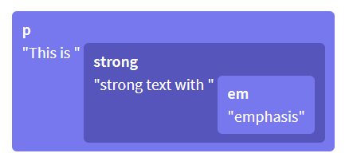
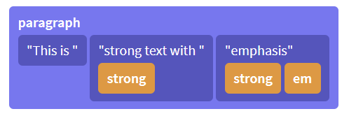
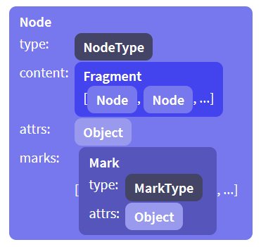

# prosemirror-model 模块
该模块主要用于定义文档内容的数据结构，即编辑器可以容纳哪些类型的内容。

## 文档结构
ProseMirror 文档的数据结构和 DOM 的**树形数据结构**类似，也是由一系列不同层级的节点构成。但也有所不同，例如在页面的 editable DOM 节点是 `<p>This is <strong>strong text with <em>emphasis</em></strong></p>`

DOM 树型数据结构如下：



对于一些「装饰性」的 inline HTML 行内标签，如 `<strong>` 等，ProseMirror 会将它们解析为样式标记 `mark` 作为节点的属性，简化了树形结构。

ProseMirror 树型数据结构如下：



每一个节点 `node` 都有指定类型，其包含的文本内容或子节点构成段落 `fragment`，以下是一个 `node` 实例对象的属性示意图：



### Node 类
该类的实例化对象在 ProseMirror 不同模块中都需要使用，由于它是编辑器的文档内容的基础。有多种实例化 Node 类的方法：

* 可以调用 Node 类的静态方法 `Node.fromJSON(schema, json)` 来解析 JSON 对象获取一个 `node` 对象。该方法的各参数的说明如下：

  * 第一个参数 `schema` 是编辑器的数据约束规则
  * 第二个参数 `json` 是 JSON 对象，它包含了节点的内容

  根据给定的 schema 规则对 JSON 对象进行反序列化，返回一个相应的 `node` 实例对象

* 可以调用 `schema.node(type | NodeType, attrs, content | Node | [Node], marks)` 方法来创建一个 `node` 实例对象。

* 可以调用 `schema.nodeFromJSON(json)` 方法来解析 JSON 对象获取一个 `node` 对象。

  :package: 以上两个方法中 `schema` 是数据约束 `Schema` 类的实例对象，该方法的各参数的具体说明可参考文章的关于 `schema` 对象的部分。

* 可以调用 `nodeType.create(attrs, content | Node | [Node], marks)` 或 `nodeType.createChecked(attrs, content | Node | [Node], marks)` 或 `nodeType.createAndFill(attrs, content | Node | [Node], marks)` 方法来创建一个 `node` 实例对象。:package: 以上三个方法中 `nodeType` 是 `NodeType` 类的实例对象，该方法的各参数的具体说明可参考文章的关于 `nodeType` 对象的部分。

* 可以调用 `domParser.parse(dom, options)` 方法来解析 DOM 节点获取一个 `node` 对象。:package: 方法中 `domParser` 是 `DomParser` 类的实例对象，该方法的各参数的具体说明可参考文章的关于 `domParser` 对象的部分。

:bulb: 在 ProseMirror 的[官方文档](https://prosemirror.net/docs/ref/)中，数据类型 `node` 是指 ProseMirror 节点，而 `dom.Node` 是指 DOM 节点

:warning: `node` 实例对象属于持久化的数据，不应该直接修改它。所以在（应用事务 apply transaction）更新文档时，更改的部分是基于给定的内容来创建新的 `node` 实例对象，而旧的 `node` 实例依然保留指向旧文档的相应部分。

#### 节点对象
节点对象 `node` 包含多个字段/属性：

* `type` 属性：表示该节点的类型。该属性值是一个 `nodeType` 对象

  :package: 编辑器在实例化数据约束对象 `new Schema()` 时，根据[配置参数的 `nodes` 属性](https://prosemirror.net/docs/guide/#schema.node_types)（该属性值是一个对象，每一个属性的属性名称是节点名称，相应的属性值是该节点的配置对象），创建相应的 `nodeType` 实例对象 :question:，然后这些 `nodeType` 对象就可以用于标记/表示相应的节点 `node` 的类型。

  `nodeType` 对象包含多个字段/属性，以描述节点类型：

  * `name` 属性：节点类型的名称。该属性值是一个字符串。

  * `schema` 属性：该节点类型所属的数据约束对象（相应的节点是在哪个 `schema` 对象中进行定义的）。该属性值是一个 `schema` 对象

  * `spec` 属性：该节点类型所对应的节点配置参数。该属性值是一个对象，它需要符合一种数据约束/接口 `NodeSpec`

    :electric_plug: `NodeSpec` 接口需要满足以下数据结构的约束：

    * `content`（可选）属性：该节点允许包含哪些内容（即子节点）。

      该属性值是 [content expression 内容表达式](https://prosemirror.net/docs/guide/#schema.content_expressions)，是一个包含一些特殊符号的字符串，类似于正则表达式，以描述该节点可以容纳哪些内容或子节点。

      例如以下是一个 `schema` 实例对象（其中 `nodes` 属性就是用于为该编辑器的不同节点进行配置的）

      ```js
      const groupSchema = new Schema({
        nodes: {
          doc: {
            content: "paragraph+" // 允许 doc 节点的内容中包含 paragraph 节点（作为子节点）
          },
          paragraph: {
            content: "text*" // 允许 paragraph 节点的内容中仅包含文本节点
          },
          text: {} // 不允许其他子节点作为该节点的内容
        }
      })
      ```

      以上示例中，各节点的配置参数中 `content` 属性就是用于设置该节点可以容纳的内容和子节点。其中 `paragraph+` 的 `paragraph` 表示内容中包含「段落节点」作为子节点， `+` 符号是正则表达式中用于表示数量的特殊符号，表示节点的数量是一个或多个；其中 `text*` 的 `text` 表示内容中包含「文本节点」作为子节点，`*` 符号是正则表达式另一个表示数量的特殊符号，表示节点的数量是零个或多个。

      除了前面说到的 `+` 和 `*`，表示数量的特殊符号还有 `?` 表示零个或一个；还可以指定具体的数量，例如 `paragraph{2}` 表示内容正好包含两个「段落节点」；也可以指定一个范围，例如 `paragraph{1, 5}` 表示内容可以包含一到五个「段落节点」，或者 `paragraph{2,}` 表示内容可以包含两个或更多的「段落节点」。

      除了可以使用特殊符号来指定节点的数量，还可以使用特殊符号来指定节点类型的组合。content expression 内容表达式是一个字符串，其中可以包含一系列的不同类型节点，例如 `heading paragraph+` 表示该节点的内容是**先有**一个标题节点作为子节点，**然后有**一个或多个段落节点作为子节点，这两种类型的子节点有明显的先后要求。还可以使用 `|` 符号，例如 `(paragraph | blockquote)+` 表示子节点的类型在「段落节点」和「引文节点」之间二选一，而数量是一个或多个。

      :warning: 如果 ProseMirror 节点所对应的 DOM 节点是**块级节点**，则在实例化数据约束对象 `schema` 配置该节点的 `content` 属性时，应该允许**至少有一个子节点**，这样在页面渲染出来的 DOM 节点才不会因为内容为空而「坍缩」导致不易于编辑输入。

    * `marks`（可选）属性：该节点内允许使用哪些样式标记。

      该属性值是一个字符串，由在 `schema` 中注册的样式标记（在实例化 `schema` 对象时配置对象的 `marks` 属性）的名称构成，各样式标记之间**以空格间隔**，用以描述哪些样式标记可以应用于节点内。其中 `"_"` 符号表示允许使用**所有**的样式标记，而 `""` 空字符串表示**不允许**使用任何样式标记。

      ```js
      const markSchema = new Schema({
        nodes: {
          doc: {
            content: "block+"
          },
          paragraph: {
            group: "block",
            content: "text*",
            marks: "_" // 该节点内允许使用所有样式标记，即可以对「文本节点」使用 strong 和 em 标记
          },
          heading: {
            group: "block",
            content: "text*",
            marks: "" // 该节点内不允许使用任何样式标记
          },
          text: {
            inline: true
          }
        },
        // 在 schema 中注册两种样式标记
        marks: {
          strong: {},
          em: {}
        }
      })
      ```

      :bulb: 如果节点可以包含行内类型的子节点，则默认允许使用所有样式标记，以为子节点添加样式；而其他类型的节点，则默认不允许任何样式标记。

    * `group`（可选）属性：该节点所属的组别。

      该属性值是一个字符串，用于指定该节点属于哪些组别，可以指定多个组别，组别名称之间用空格分隔。

      由于编辑器的文档是树形结构，节点之间存在**嵌套**关系，ProseMirror 需要精准控制各个节点内允许包含哪些内容，即哪些类型的节点作为当前节点的子节点，在 `schema` 对象中各节点的 `content` 属性进行设置，该属性值是一个字符串，如果该节点内允许多种类型的节点，则需要将这些节点的名称用空格间隔拼接为一个冗长的字符串。

      为了方便，可以先给「基础」节点（一般这些节点内只包含「文本节点」）指定组别，然后在更上一级节点的 `content` 属性中，**使用组别名称来表示这一类的节点**。

      ```js
      const markSchema = new Schema({
        nodes: {
          doc: {
            content: "block+" // 相当于 (paragraph | blockquote)+
          },
          paragraph: {
            group: "block", // 将「段落节点」指定到 block 组
            content: "text*"
          },
          heading: {
            group: "block", // 将「标题节点」指定到 block 组
            content: "text*"
          },
          blockquote: {
            group: "block", // 将「引文节点」指定到 block 组
            content: "block+" // 这里类似「循环引用」，虽然自身指定为 block 组，其内容也可以有 block 组的节点，即编辑器内引文中可以嵌套引文
          },
          text: {
            inline: true
          }
        }
      })
      ```

    * `inline`（可选）属性：表示该节点是否为行内类型。

      该属性值是一个布尔值。对于 `text` 「文本节点」该属性会默认设置为 `true`

    * `atom`（可选）属性：表示该节点是否需要以一个整体/原子对待

      该属性值是一个布尔值。

      :bulb: 节点作为一个整体对待，就是不能编辑该节点里面的内容，在编辑器的视图中只能整体加入或整体移除。这样的节点在 ProseMirror 的位置计数系统中只算 `1` 个单位。

    * `attrs`（可选）属性：该节点所拥有的 attributes

      可以为节点或样式标记设置 attributes 以添加额外的信息，在 `schema` 实例对象各节点的 `attrs` 属性中进行设置，其属性值需要是一个「纯对象」 plain object（可以进行 JSON 反序列化的对象）

      ```js
      const markSchema = new Schema({
        nodes: {
          doc: {
            content: "block+"
          },
          paragraph: {
            group: "block",
            content: "text*",
            marks: "_"
          },
          heading: {
            content: "text*",
            attrs: { // 为「标题节点」设置 attribute 以添加额外的信息
              level: { // 为「标题节点」添加 level 属性，默认值是 1，也可以在创建「标题节点」时指定其他值
                default: 1
              }
            }
          }
          text: {inline: true}
        }
      })
      ```

    * `selectable`（可选）属性：该节点是否允许选中，以创建一个 `nodeSelection` 节点选区。

      该属性值是一个布尔值。对于非「文本节点」默认值是 `true`，即可以选中

    * `draggable`（可选）属性：该节点是否允许拖拽移动（在非选中的情况下）。

      该属性值是一个布尔值，默认为 `false`

    * `code`（可选）属性：该节点内是否包含代码文字。

      该属性值是一个布尔值，由于代码文字的处理方式不同（格式化的方式不同，例如需要保留空格和缩进），所以对于包含代码的节点需要设置该属性。

    * `whitespace`（可选）属性：表示如何解析空格符号。

      该属性值可以是 `"pre"` 或 `"normal"` 之一。如果属性值是 `"normal"`（默认值）则 `domParser` 对象在解析节点内的空格，会用空格替代换行符等类似的符号，而多个连续的空格会「压缩」为一个空格。如果属性值是 `"pre"` 则保留空格等格式符号（对于设置了 `code` 属性为 `true` 的节点，`whitespace` 属性默认会设置为 `"pre"` 值）

    * `defining`（可选）属性：该节点的**父节点**是否为一个重要的节点（有特殊的定义/含义，需要在复制粘贴时保留下拉）。

      该属性值是一个布尔值，默认为 `false` 即该节点的父节点并不具有特殊的含义，因此当该节点内容被删除后，该节点也会被移除；而如果该属性值为 `true` 则表示该节点的父节点有特殊的含义，则该节点的内容被移除，或在复制粘贴时整体被替换，会保留该节点，用以包裹插入的新的内容。

      例如对于只包含文本的「段落节点」，将其中的文本内容删除后，该段落节点也会被移除；但是对于 list item 「列表项节点」，它的父节点是列表节点具有特殊意义，所以当列表项的内容被删除后，「列表项节点」依然保留，用以包裹再输入的内容。而如果复制该「列表项节点」的内容时，则在粘贴时应该要保留该节点，而不是将其转换为普通的「段落节点」

    * `isolating`（可选）属性：该节点是否为独立隔离的节点。

      该属性值是一个布尔值，如果为 `true`（默认值为 `false`）表示节点是独立隔离的，即在节点内部的边缘使用删除键或「提升」组合键（按 `Shift + Tab` 将缩进的文本进行提升）无法实现预期的效果，因为该节点是这些编辑操作的边界，**操作无法「穿透」该节点**。常见的一个独立隔离节点是 table cell 「单元格节点」，当单元格的内容清空后，再使用删除键也无法跳转到上一个单元格。

    * `toDom`（可选）属性：将该节点转换为 DOM 元素。

      该属性值是一个函数 `fn(node)` 入参是该节点对象 `node`，（ProseMirror 通过 `DOMSerializer.fromSchema（schema)` 方法所创建的）DOM 生成器/序列化器会调用该函数，以将文档中的相应节点转换为页面的一个 DOM 元素。

      返回值可以是一个 DOM 元素，或一个用于描述 DOM 元素的数组，该数组需要符合一种数据约束/接口 `DOMOutputSpec`

      :electric_plug: `DOMOutputSpec` 接口需要满足以下数据结构的约束以描述一个 DOM 元素，可以有多种形式：

      * 可以是一个字符串，以表示页面的内容是由「文本节点」生成的

      * 可以是一个 DOM 元素，就是表示其自身

      * 可以是一个对象，具有属性 `dom`，该属性值是一个 DOM 元素，和（可选）属性 `contentDOM`，该属性值也是一个 DOM 元素，以指定文档节点的内容渲染的位置

      * 可以是一个数组：
        * 第一个元素是 DOM 元素的名称（可以带有命名空间 URL 的前缀或者空格）
        * 第二个元素可以是一个「纯对象」 plain object 以表示添加到 DOM 元素上的 attribute；也可以不是一个「纯对象」，则它表示该 DOM 元素的子元素，那么它需要满足 `DOMOutputSpec` 接口（相当于一个嵌套关系，用于描述子元素）的约束；也可以是数字 `0` 称为 hole 一个占位符，以表示子节点插入到 DOM 元素内
        * 第三个元素，只有在第二个元素不为 `0` 时才有效，表示子元素，它需要满足 `DOMOutputSpec` 接口的约束

        :no_entry_sign: 对于叶子节点，不需要第二个元素，因为它们不能包含内容

        ```js
        const schema = new Schema({
          nodes: {
            doc: {
              content: "paragraph+"
            },
            paragraph: {
              content: "text*",
              toDOM(node) {
                return ["p", 0] // 表示「段落节点」转换为 <p> 元素，而节点的内容直接插入到 <p> 元素内
              }
            },
            article: {
              content: "paragraph+",
              toDom(node) {
                return ["article", {class: "target"}, 0] // 表示「文章节点」转换为 <article> 元素，并添加 target 类名，而节点的内容直接插入到 <article> 元素内
              }
            },
            div: {
              content: "paragraph+",
              toDOm(node) {
                return ['div', {style:'color:red'}, ['p', 0]] // 表示「div 节点」转换为 <div> 元素，并添加样式，其中还有一个子元素 <p>，而节点的内容是在这个 <p> 元素内
                // 🚫 如果返回的数组是 ['div', {style:'color:red'}, ['p'], 0] 则这是错误的写法
                // 因为 0 是表示放置节点内容（子元素）的位置，这和 <p> 作为子元素的设定冲突了
              }
            }
            text: {}
          }
        })
        ```

      :bulb: 对于 `text` 「文本节点」**不**应该配置该属性，因为 ProseMirror 会将「文本节点」自动生成为页面的文本内容。

### Mark 类
该类的实例化对象是用于为节点对象添加样式或额外信息的。

#### 标记对象

## 数据约束

### Schema 类

#### schema 对象