# Two Dishes One Fish


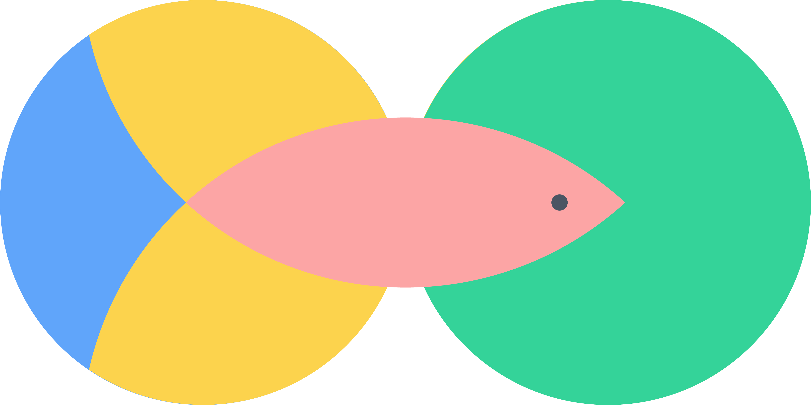

build a static website as blog and knowledge management system

:link: [中文版](two-dishes-one-fish.md)

VuePress is so easy to use by the out-of-the-box default theme just [setting some configurations](https://v2.vuepress.vuejs.org/reference/default-theme/config.html). My major work is to optimise the experience of browser the website and post:

* the Markdown files can classify into tow types, it can be a blog post and a note at the same time, or just as a note.
  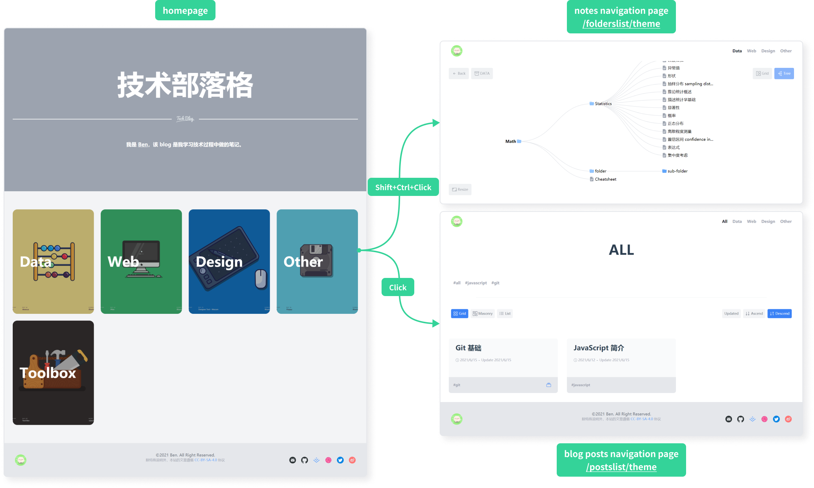
* add a blog posts navigation page, the blog post show as cards, user can browser the posts in three mode: cards grid mode, cards masonry mode, and posts list mode.
  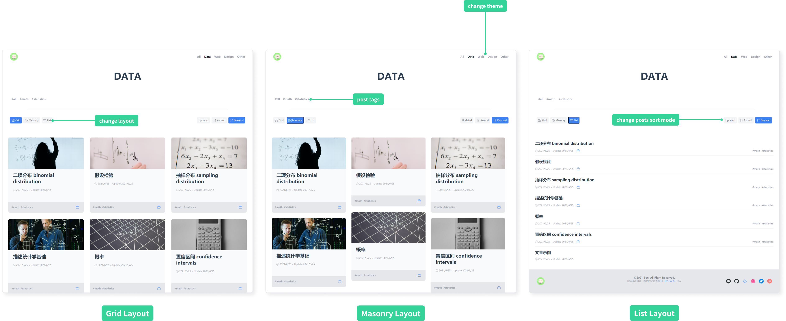
* add a notes navigation page, all Markdown files will be notes, the notes show in a grid layout as the same structure as they save in the files system, powering by [D3.js](https://d3js.org/), you can also browser the notes in a tree chart.
  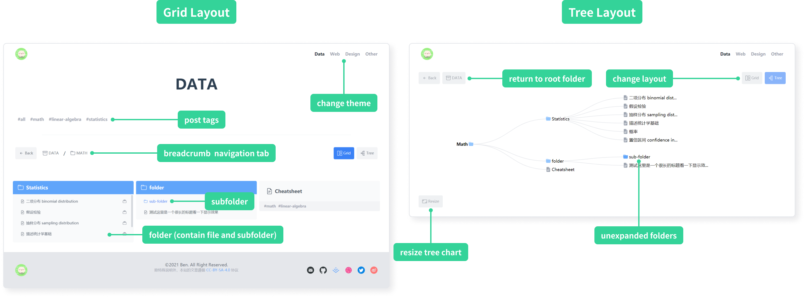
* support to add tags to Markdown file and filter the posts or notes in navigation page.
* follow the RWD, responsive web design, principle, you can browser the website in different screen size.


## Set Up Working Environment

1. install writing software and development software

    - [Git](https://git-scm.com/downloads): version control software

    - [node.js](https://nodejs.org/zh-cn/download/): development dependencies

      :bulb: recommend to use [nvm](https://github.com/nvm-sh/nvm#installing-and-updating) to install and manage node.js, which is the node.js version manager. On macOS and Linux systems [install using the command line](https://github.com/nvm-sh/nvm#install--update-script); for Windows systems you can install [nvm-windows](https://github.com/coreybutler/nvm-windows#installation--upgrades).

    - [Typora](https://typora.io/): an open source Markdown editor for writing

    - [VS Code](https://code.visualstudio.com/Download): A code editor from Microsoft for development

2. download the VuePress template two-dishes-one-fish, there are two ways:
  - method 1: download from the terminal by typing the following command and pressing `Enter`
    ```
    git clone https://github.com/Benbinbin/two-dishes-one-fish.git
    ```
  - method 2: download ZIP package from the [Github repository](https://github.com/Benbinbin/two-dishes-one-fish) 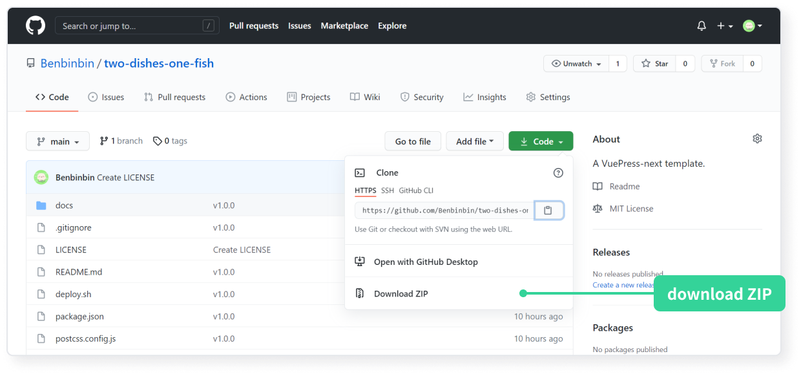

3. install VuePress dependencies
- open the project folder :file_folder: ​`two-dishes-one-fish` using VS Code Editor
- click (menu bar) `View(V)` -> `Terminal` to open the terminal (or use the shortcut <code>Ctrl+`</code> to open the terminal)
- enter the following command in the terminal and press `Enter` to install the project dependent packages

  ```
  npm install
  ```


## Project Structure

Once finish the [above steps](#Set Up Working Environment) you can see a project structure as follow:

* :file_folder: `two-dishes-one-fish`: the project root folder (you can rename it), containing configuration files, and a folder :file_folder: `docs`
* :file_folder: `docs`: the Markdown files in this folder (with the file extension `.md`) are automatically compiled into HTML files, as shown the folders :file_folder: `folder1` and :file_folder: `folder2` marked in the picture, which hold sample articles
* :file_folder: `.vuepress`: this folder is in :file_folder: `docs`, but instead of holding writing articles, it holds VuePress related configuration files
* :file_folder: `public`: This folder is in :file_folder: `.vuepress` and is used to store some static resources
  * the `avatar.png` image is used in the navbar and footer
  * `favicon.ico` is used in the browser tab bar
  * background images for each card on the home page are stored in a subfolder :file_folder: `images/home`
  * the images for some of the article cards on the blog posts navigation page are stored in the subfolder :file_folder: `images/covers`.
  * icons which are used in the website (e.g. some social media icons at page footer) are stored in the subfolder :file_folder: `images/icons

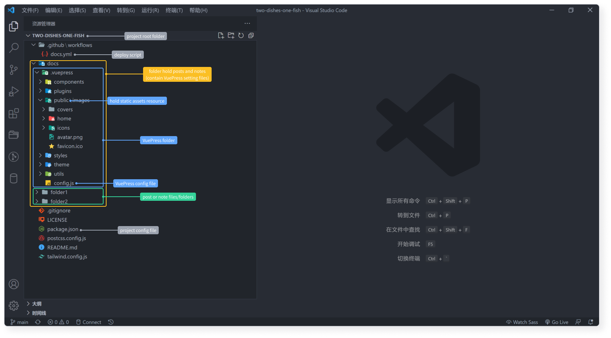

generally you just need to modify the document :page_facing_up: `config.js` once, and then writing article by creating Markdown files daily in the folder :file_folder: `docs`:

* :page_facing_up: `config.js`: a document in the folder :file_folder: `.vuepress`, which is used to configure most of the site's parameters
* :file_folder: `folder1` and :file_folder: `folder2`: under the folder :file_folder: `docs` hold example articles, you can created other folders, and also allows to create nesting folder structures, the Markdown files in these folders are blog articles or notes, they will be compiled to HTML files.

:bulb: if you want to add background images for the theme cards in homepage, as well as some images for posts in the blog posts navigation page, or add social media icons at the page footer, remember to place these images or icons file  in the appropriate subfolders of the :file_folder: `public`.


## Parameter Setting

open the document :page_facing_up: `config.js` in the folder :file_folder: `.vuepress` with the VS Code editor to configure the page parameters (according to the `// comment`)

```js
const { path } = require('@vuepress/utils')

module.exports = {
  open: true,
  lang: 'zh-CN',
  // the value of the attribute base is "/repo/", which is the name of the Github repository that you want to deploy your blog
  // For example, if I deploy my website to the repository https://github.com/Benbinbin/Collection, the url means my Github username is Benbinbin, and the repository name is Collection, so the value of the attribute base should be "/Collection/"
  // if deploy to the special Github repository: https://github.com/username/username.github.io (where username is your Github username), the value of the attribute base should be "/" (or ignore this attribute, as the default value is "/")
  base: "/repo/",
  // the attribute title is the title of the site and shows at the browser tab
  title: "Blog",
  // The attribute description is used to be recognized by search engines
  description: 'A blog shows some of the notes I took while learning skills.',
  head: [
    // The following setting is used to set the site icon, which shows to the left of the browser tab
    // The "repo" in the value of attribute href, should be set to the name of the repository hold this blog, for example if I deploy the blog to the repository https://github.com/Benbinbin/Collection, the value of the attribute href should be '/Collection/images/favicon.ico'
   	// If deploy the site to the special Github repository https://github.com/username/username.github.io, the value of the attribute href should be '/images/favicon.ico'
    // The template already has a built-in icon file, if you need to change it please place the new icon file favicon.ico in the static resources folder public, to overwrite the original icon file
    ['link', { rel: 'icon', href: '/repo/images/favicon.ico' }],
    ['link', { rel: 'stylesheet', href: 'https://cdn.jsdelivr.net/npm/katex@0.13.5/dist/katex.min.css' }],
  ],
  bundler: '@vuepress/vite',
  bundlerConfig: {
    viteOptions: {
      css: {
        postcss: {
            plugins: [
              require('tailwindcss'),
              require('autoprefixer')
            ]
        }
      },
    }
  },
  plugins: [
    require('./plugins/addTime.js'),
    [require('./plugins/createHomePage.js'),
    {
      // the attribute cards is used to set the home page theme card
      // the value is an array, each element corresponds to a theme, which are the next level of subfolders contained in the folder docs
      // each element has two attributes, name and image, which indicate the name of the card theme (which is the same as the folder name) and the card background image file respectively
      // for example, in the template there are folders folder1 and folder2, and the card background images are folder1-cover.svg and folder2-cover.svg respectively
      // remember to place the card background image files in images/home, a subfolder of the static resource folder public
      cards: [
        {
          name: "Folder1",
          image: "folder1-cover.svg"
        },
        {
          name: "Folder2",
          image: "folder2-cover.svg"
        },
      ]
    }],
    [require('./plugins/generateListPages.js'),
    {
      // the attribute postClassification refers to the theme of the blog posts, used in the blog posts navigation page
      // the value is an array, where each element corresponds to a theme, which are the next level of subfolders contained in the folder docs
      // for example, in the template there are two folders, folder1 and folder2, which contain many markdown files created by the user
      postClassifications: ['folder1', 'folder2']
    }],
    [require('./plugins/generateFolderPages.js'),
    {
      // the attribute postFolders refers to the theme of the notes, it is similar to the attribute postClassification, generally the two attributes have the same value, because they share the same markdown files system (two dishes one fish)
      // its value is an array, where each element corresponds to a theme, which are the next level of subfolders contained in the folder docs
      // for example, the template contains two folders, folder1 and folder2, which are the folders containing the markdown files
      postFolders: ['folder1', 'folder2']
    }],
  ],
  theme: path.resolve(__dirname, './theme/index.js'),
  themeConfig: {
    navbar: false,
    sidebar: false,
    contributors: false,
    lastUpdatedText: '更新时间',
    themePlugins: {
      backToTop: false,
      nprogress: false,
    }
  },
  markdown: {
    links: {
      externalIcon: false
    }
  },
  extendsMarkdown: (md) => {
    md.use(require('@neilsustc/markdown-it-katex'), {output: 'html'})
  },
  // there are a number of attributes in define, which are related to the previous settings, these are global variables set for development purposes, please change them accordingly
  define: {
    // The attribute __BASE__ is the same as the previous attribute base, set to "/" if deploying to the special Github repository https://github.com/username/username.github.io (it can't be omitted)
    __BASE__: "/repo/",
    // the value of the attribute __HOME_PAGE_TITLE__ refers to the title of the home page
    __HOME_PAGE_TITLE__: "Blog",
    // the value of the attribute __HOME_PAGE_ICON__ refers to the header of the home page and the icon file in the split line below it, remember to place the icon file in images/home, a subfolder of the static resource folder public
    __HOME_PAGE_ICON__: "home_icon.svg",
    // the value of the attribute __HOME_DESCRIPTION__ refers to the description below the title of the home page, which supports both plain text and HTML
    __HOME_DESCRIPTION__: "我是 Ben，这是我的部落格和知识管理系统。",
    // the value of the attribute __HOME_PAGE_COLOR__ refers to the colour of the home page
    __HOME_PAGE_COLOR__: '#9CA3AF',
    // the value of the attribute __AVATAR__ is the name of the image file for the header image displayed in the navbar and the page footer, please remember to place this image file in the static resource folder public
    __AVATAR__: 'avatar.png',
    // the attribute __CLASSIFICATIONS__ is used to generate the navbar items of the blog posts navigation page
    // the value is an array, similar to the previous attribute postClassifications, but with the addition of an element 'All', so that a navigation page can be added to show all blog posts
    __CLASSIFICATIONS__: ['All', 'Folder1', 'Folder2'],
    // the property __FOLDERS__ is used to generate the navbar items of the notes navigation page
    // the value is an array, similar to the previous attribute postFolders
    __FOLDERS__: ['Folder1', 'Folder2'],
    // the value of the attribute __FOOTER_AVATAR_LINK__ is the link to be opened when the page footer image be clicked, you can set as your portfolio page url
    __FOOTER_AVATAR_LINK__: 'https://www.google.com/',
    // the value of the attribute __AUTHOR__ refers to the owner of the license rights to the website articles, it will show on the page footer
    __AUTHOR__: 'Benbinbin',
    // the value of the attribute __FOOTER_LICENSE__ refers to the license of the website articles, it will show on the page footer, by default CC-BY-SA-4.0
    __FOOTER_LICENSE__: 'CC-BY-SA-4.0',
    // the value of the attribute __FOOTER_LICENSE_LINK__ refers to the link of the license
    __FOOTER_LICENSE_LINK__: 'https://creativecommons.org/licenses/by-sa/4.0/deed.en',
    // the attribute __SOCIAL_MEDIA__ is used to generate the social media icon at the end of the page
    // the value is an array, each of which contains some information about a social media account, you can add or remove some of them
    // each element contains 3 attributes
    // the attribute name is the name of the social media, which should be unique string in the array
    // the attribute logo is the image file of the icon displayed at the page footer, please remember to place this icon file in the subfolder images/icons of the static resources folder public, there are 6 social media icons by default
    // the url attribute is the link to the social media to be accessed by clicking on the icon
    // if the social media is an email account, the url is prefixed with mailto: and followed by the email address
    __SOCIAL_MEDIA__: [
      {
        name: 'email',
        logo: 'email.svg',
        url: 'mailto:[example]@gmail.com'
      },
      {
        name: 'github',
        logo: 'github.svg',
        url: 'https://github.com/[username]'
      },
      {
        name: 'juejin',
        logo: 'juejin.svg',
        url: 'https://juejin.cn/user/[userid]/posts'
      },
      {
        name: 'dribbble',
        logo: 'dribbble.svg',
        url: 'https://dribbble.com/[username]'
      },
      {
        name: 'twitter',
        logo: 'twitter.svg',
        url: 'https://twitter.com/[username]'
      },
      {
        name: 'weibo',
        logo: 'weibo.svg',
        url: 'https://weibo.com/[username]'
      },
    ],
  },
}
```


## Writing and Creating

create folders under the folder :file_folder: `docs`, each direct subfolder represents a theme (nested folder structures are allowed to manage a bunch of Markdown files), create Markdown files in these folders or subfolder and use Typora software to start writing.

each document with the `.md` suffix is an article, which is [compiled](#Develop And Preview (optional)) by the VuePress engine to produce a web page.

### Markdown Syntax

the following picture is a sample article with a Markdown document listing common syntax on the left and the corresponding post compiled on the right. For more information on markdown syntax refer to this article [Mastering Markdown](https://guides.github.com/features/mastering-markdown/).

:bulb: it also support [katex mathematical formulas](https://katex.org/docs/supported.html)

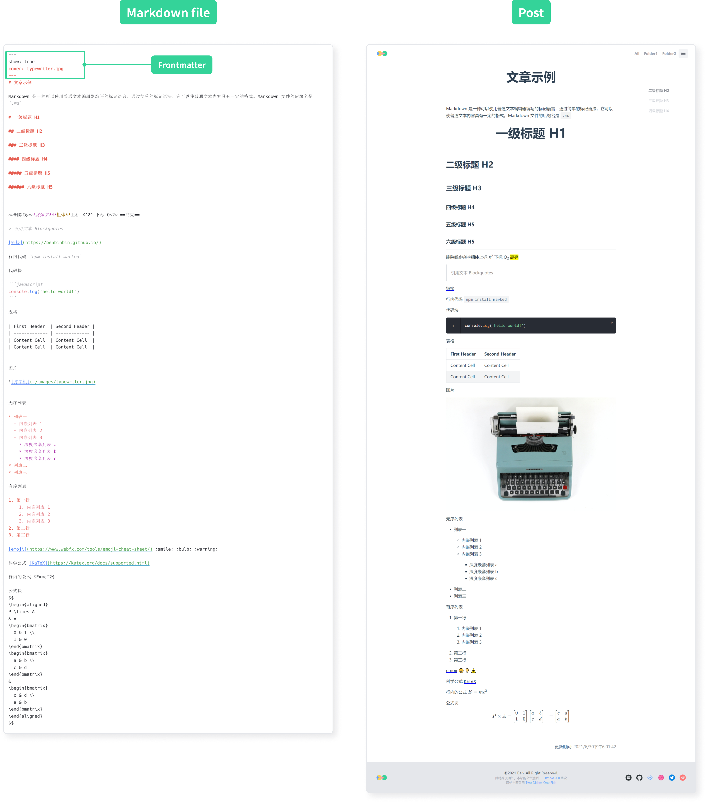

:bulb: If add a local images to your article, it is recommended that you create a folder :file_folder: `images` in the same level as the current Markdown file to hold the image files, and then you can insert the image in that Markdown file by insert the relative path. For example, to insert an image `img1.png` into a Markdown file by typing the following script

```markdown

```

:bulb: you can use `<iframe>` tag to insert a video, and adjust the inline style parameter `width` and `aspect-ratio` to change the size of video.

the following code insert a Youtube [video](https://www.youtube.com/watch?v=Y50_RSWpWkA)

```html
<iframe
  style="width: 100%; aspect-ratio: 16/9;"
  src="https://www.youtube.com/embed/Y50_RSWpWkA?start=3403&end=3441&modestbranding=1&rel=0"
  allowfullscreen>
</iframe>
```

you can refer to the [documentation](https://developers.google.com/youtube/player_parameters) about YouTube embedded payers and pPlayer parameters

* `start` parameter set the seconds when the player should start playing the video
* `end` parameter set the seconds when the player should stop playing the video
* `modestbranding` set parameter value to 1 to prevent the YouTube logo from displaying in the control bar
* `rel` set parameter value to 0, when stop playing the video the it will show the related videos from the same channel
* `allowfullscreen` parameter allow full screen mode to play the video

### Frontmatter

in addition to add content in the body of the Markdown file, some additional information can be added to the top of the file, called [YAML Frontmatter](https://yaml.org/), which is passed as a parameter to the VuePress control engine and control the compilor to compile the corresponding page.

some fields that can be set in Frontmatter (case sensitive, using Camel-Case):

* `show`: whether or not the current Markdown file will be a blog post. If its value is `true` it will be displayed in the **blog posts navigation page** and **notes navigation page**; if its value is `false` the article will not be displayed in the blog posts navigation page.
* `cover`: set the post cover image to be displayed on the corresponding post card on the blog posts navigation page (so the file Frontmatter field `show` needs to be set to `true`), remember to place the image file in a subfolder :file_folder: `images/covers` of the static resource folder :file_folder: `public`
* `collection`: set the series to which the post belongs
* `collectionOrder`: sets the sorting of the current article in the series it belongs to (so you need to set the article Frontmatter field `collection` first)
* `tags`: sets the tags of the file, its value is an array, each element starts with `-`
* `summary`: set the summary of the article, it will be displayed on the corresponding post card on the blog posts navigation page (so the article's Frontmatter field `show` needs to be set to `true`)

Frontmatter writing at the top of the Markdown file, wrapped in a pair of **three dashes**, is shown in the following example:

* the Markdown file is a blog post
* the post cover image is `img1.png` (the file places in :file_folder: `public/images/covers`)
* the post belongs to the series `linear algebra` and is sorted as `5` in the series
* post tagged with `math` and `linear algebra`

```markdown
---
show: true
cover: img1.png
collection: linear algebra
collection: 5
summary: A summary of this article will show on navigator page
tags:
  - math
  - linear algebra
---

# heading 1
some markdown content
```

:bulb: in addition to set the fields mentioned above, the VuePress default theme also supports setting other Frontmatter fields, as described in the [official documentation](https://vuepress2.netlify.app/zh/reference/frontmatter.html#lang).

:warning: due to the higher priority of the fields set by Frontmatter, when the fields in Frontmatter (for the current post) match the fields in the VuePress configuration file :page_facing_up: `config.js` (for the whole page), the Frontmatter fields values will override the corresponding field values in `config.js` for the current article.


## Develop And Preview (optional)

after [setting up the parameters](#Parameter Setting), or finish  writing some Markdown files, **it is recommended to preview the generated website** by starting the local server, before
 [pushing the code to the remote Github repository](#Synchronisation With Remote Repositories). the successful local compilation can improve the success rate of the deployment.

after the compilation is complete, the browser will automatically open to load the generated web pages, allowing real-time development debugging.

entering the following command in the terminal to start the local server:

```shell
npm run docs:dev
```

:bulb: if the page does not open automatically, you can hold down the `Ctrl` key and click on any of the URLs in the terminal output to preview the page using the system's default browser; you can also copy one of the links and type it into your browser's address bar to access it

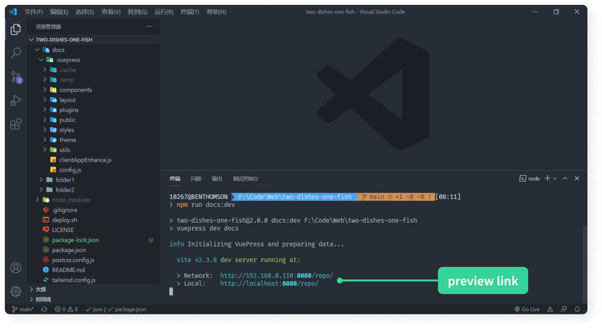

if you need to stop the local server, click on the terminal panel to activate it in order to response your input, then press the shortcut key `Ctrl+C` and the terminal will bring up the "Terminate Batch Operation" prompt, press `y` and then press `Enter` to confirm

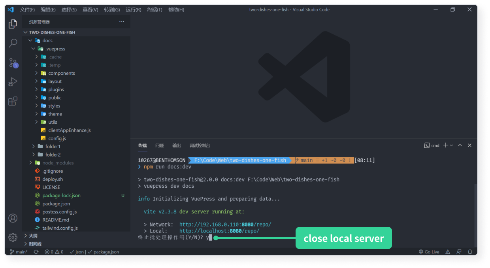

:bulb: if the terminal doesn't show any error, but the browser preview does not work, try stopping the local server and then **restart** the server.


## Version Control

once you have finished writing and saved your Markdown file (it is recommended that you [start your local server and preview the complied pages](#Develop And Preview (optional)) to see how they looks), you will need to version control the project through Git. While saving a Markdown file is a way to save the current article, version control is a way to save the current state of the entire project, so that you can sync any additions or deletions of the local project to the remote repository.

open the local project folder :file_folder: `two-dishes-one-fish` (you maybe change the folder name, just open the root folder of the project) using the VS Code Editor, click the `Source Code Manager` button on the left hand side of the editor and follow the instructions below to save the current state of the project.

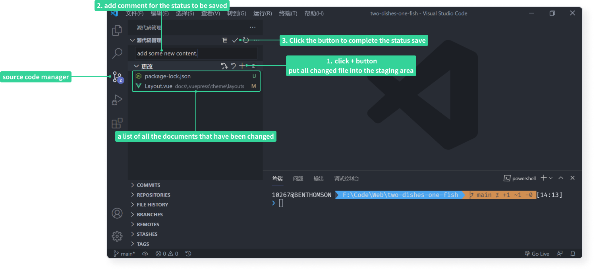

:bulb: if the project files was obtained by downloading the ZIP file from the [Github repository](https://github.com/Benbinbin/two-dishes-one-fish), then the project may not have been initialised for version control, and this can be done by following the instructions in the picture. just clicking the `Initialise repository` button to initialise the project, and then you can track changes of the project status.

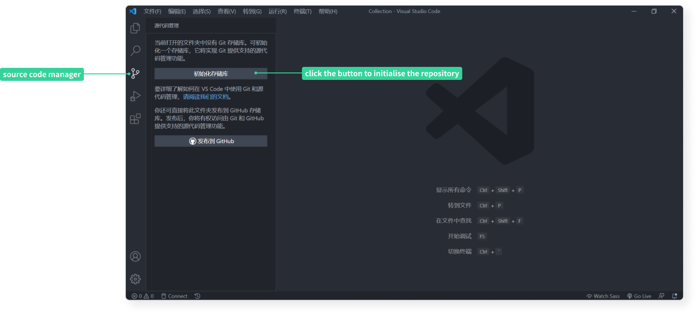


## Sync With Remote Repositories

in order to host projects using Github and to display the generated pages using the Github Page, it is necessary to synchronise the local project with the remote Github repository.

1. follow the instructions below to create a repository on Github

  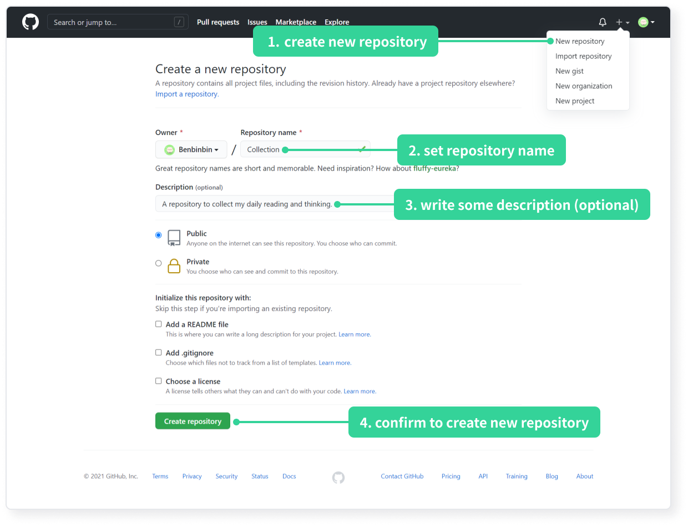

2. add a remote repository to a local project. When you create a repository on Github, the page will jump to the repository's home page, where the code under `...or push an existing repository from the command line` is the command to connect your local repository to that Github repository.

  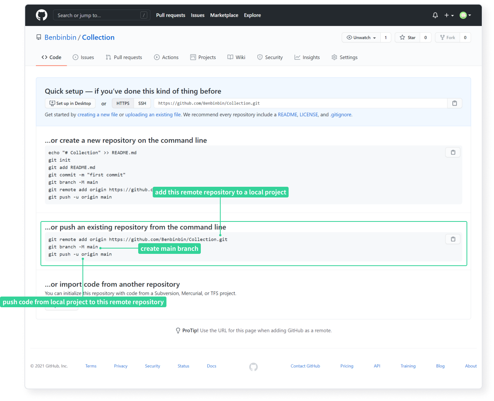

  * open your local project folder using the VS Code editor :file_folder: `two-dishes-one-fish`
  * click (menu bar) `View(V)` -> `Terminal` to open the terminal (or use the shortcut <code>Ctrl+`</code>)
  * add a remote repository to your local project by entering the following command in the terminal (where [username] is your Github user name and [repo] is the name of the new repository)
    ```shell
    git remote add origin https://github.com/[username]/[repo].git
    ```
    :warning: since the local project was created based on the [template `two-dishes-on-fish`](https://github.com/Benbinbin/two-dishes-one-fish) downloaded from Github, the local project was already connected to this template's Github remote repository. If you enter the above command directly, it will not work, and will output an error message `fatal: remote origin already exists.` indicating that a remote repository named `origin` already exists, so you need to **remove the existing remote repository first by entering the following command in the terminal** `git remote remove origin`, and then enter the above command to execute it successfully.

    :bulb: You can see which remote repositories are connected to your project by typing `git remote -v` in the terminal.

  * create a branch called `main` for the local project by entering the following command in the terminal
    ```shell
    git branch -M main
    ```

3. synchronise with the remote repository. Synchronise the local project code to the remote repository by entering the following command in the terminal
  ```shell
  git push -u origin main
  ```

:bulb: the first two steps only need to be configured once, **whereas this step is a synchronization of the local project with the remote repository, and should be performed once every [version control](#Version Control) finished, it means every time the state of the project is saved should excute the step 3**. And since you have already set up the branch to be synced this time, you can use the more concise command `git push` for the next sync.


## Deploy Site

the project already has a built-in [deployment script `.github/workflows/docs.yml`](https://vuepress2.netlify.app/zh/guide/deployment.html#github-pages), which will automatically execute whenever local project code is synced to a remote repository.

Whenever local project code is synced to a remote repository, Github listens for changes to the repository and automatically executes the deploy script, compiling the Markdown files into a static web pages and deploying the pages to the repository's branch `gh-pages`.

Simply go to the Github Pages settings page of your repository and specify the data source for the site as branch `gh-pages`.


:bulb: after specifying the site data source for the first time, you may have to wait a short time for the `This is the Github Page` box (in the above picture) to turn green before the page is successfully viewed.

:bulb: each time you [sync your local project code to a Github remote repository](#Sync With Remote Repositories), you will have to wait for Github Action to execute the deployment script before you can view the new pages, which can be viewed in the `Actions` tab of the repository home page. If the deployment is successful but the pages don't change, you can press `Shift + Ctrl + R` or `Shift + F5` to clear the site cache and force to refresh.

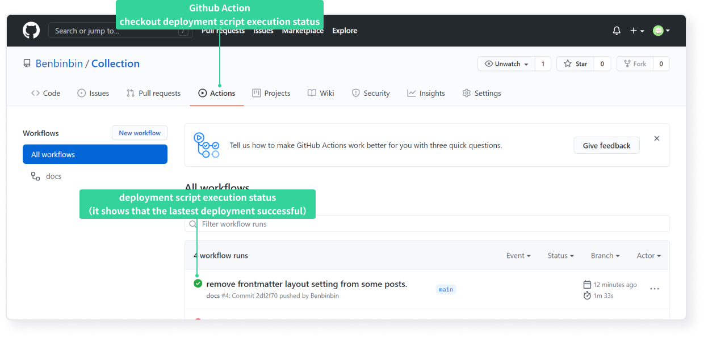

:bulb: VuePress provides more deployment options, please refer to the [official documentation](https://vuepress2.netlify.app/zh/guide/deployment.html).
